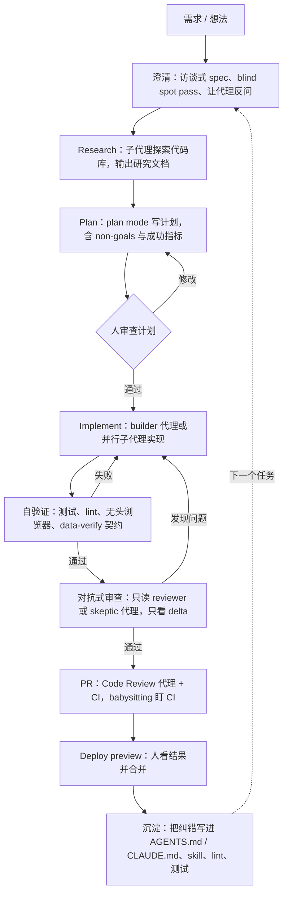

# 00 · 总结：15 个实战视频里的共性模式与最佳实践

**一句话看懂**：15 个视频、三家工具、十几位讲者，最后都指向同一套做法：先让代理能自己验证；做事的和检查的分开；上下文做减法；动手前先把需求问清楚；每次纠错都沉淀成规则；人只负责定目标和看结果。

::: tip 小白先懂这几个词
[Agent](/glossary#agent)、[子代理](/glossary#subagent)、[上下文窗口](/glossary#context-window)、[Harness](/glossary#harness)、[CLAUDE.md](/glossary#claude-md) / [AGENTS.md](/glossary#agents-md)、[Plan Mode](/glossary#plan-mode)。不认识的词随时查[术语表](/glossary)。
:::

> 覆盖：Claude 6 篇（01–06）、Codex 5 篇（07–11）、Grok 4 篇（12–15）。本文只总结各篇分析里有来源支撑的内容，细节和原话见对应文章。

## 1. 共性模式（多数视频独立得出的结论）

### 模式 A：验证排第一，先让代理能自己“跑起来”

**为什么**：代理写得再快，没人检查就只是快速制造返工。能自己跑测试、开浏览器看结果的代理，交给你的半成品少得多。

- Boris Cherny（01）把验证定义为代理能否把东西真正跑起来；Arno（03）让组件输出 `data-verify-*`，供代理和 CI 核验。
- Dominik Kundel（10）的飞轮是 context → validation → verification；Ryan Lopopolo（07）把“测试 + lint + reviewer agents”当作 harness 的核心。
- Grok 这边，Bijan Bowen（13）看到代理用无头浏览器自测；ForrestKnight（12）则证明**测试全绿 ≠ 代码正确**，人工审查仍然必要。

::: tip 实践
先给代理一个能跑的命令（测试、浏览器、预览环境），再给任务。
:::

### 模式 B：做与查分开（maker / checker），最好是对抗式的

**为什么**：让写代码的代理自己检查自己，它倾向于认为自己做对了。换一个只读的、专门找茬的代理，才能抓住问题。

- Builder + Validator 成对子代理（05）、只读审查 persona 与 stop hook（08）、只读 Auto Review 子代理（09）。
- 扇出找 bug 后再做对抗式复核（02）、`/goal` 完成后由 skeptic 代理复查（15）、CI 中按 persona 设置 reviewer（07）。

::: tip 实践
审查代理只给只读权限；让它“尽量证伪”，而不是“确认完成”；复查只看 delta。#15 画面上的那句提示词可以直接借用：“You are NOT the agent that produced the work… Your job is to refute that the objective has been met.”（下面的工作不是你做的……你的任务是证伪“目标已经达成”。）
:::

<figure class="shot"><figcaption>📷 #15 视频截图 · <a href="https://www.youtube.com/watch?v=1NwO2dPzwRM&t=575s" target="_blank" rel="noopener">9:35</a> · Grok Build 自动派出的“goal achievement skeptic”验证代理，提示词要求它证伪目标已达成。</figcaption></figure>

### 模式 C：上下文是稀缺资源，要做减法和压缩

**为什么**：上下文窗口装得越满，模型越容易遗漏和混淆；消除互相矛盾的指令，比堆更多内容更重要（10）。

- RPI 与“频繁有意压缩”（04）、Claude Code 删掉 80% system prompt（06）。
- skills 渐进加载、deferred tools、服务端 compaction（09）、子代理隔离上下文（05 / 08 / 15）。

::: tip 实践
用 research → plan 的产物（Markdown 文件）在会话之间交接，不要让单个会话无限变长。
:::

<figure class="shot"><figcaption>📷 #04 视频截图 · <a href="https://www.youtube.com/watch?v=rmvDxxNubIg&t=871s" target="_blank" rel="noopener">14:31</a> · Dex Horthy 的示意图：子代理在各自的上下文里调研，最后写出一份 research.md，此时上下文约用了 40%。</figcaption></figure>

### 模式 D：先澄清需求，再动手

**为什么**：代理走偏，多半是因为碰到了你脑子里有、但没写下来的东西。先挖出来，比事后返工便宜。

- 让 Claude 采访你写 spec（03）、blind spot pass 和让模型反过来考你（06）、Steinberger 常问“Do you have any questions?”（11）。
- Grok Build plan mode 的可交互计划含 non-goals 和成功指标（13）、计划式 prompt + skills（14）。

::: tip 实践
复杂任务先进 plan mode，或者明确要求代理反问；计划里写明 non-goals。
:::

### 模式 E：把每一次纠错沉淀进 harness

**为什么**：在对话里纠正一次，下次还会再错；写成规则、测试或 skill，同类问题就不会再出现第二次。

- 犯错就写进 CLAUDE.md / Skill（01）；把团队标准写成带修复指引的 lint 和文件行数测试（07）。
- 每周 Garbage Collection Day（07）、复用设计 skills（14）、PR 看护 skill（10）。

::: tip 实践
同一类问题第二次出现时，就把它变成规则、测试或 skill，而不是再口头提醒一次。
:::

### 模式 F：人从“写代码”转为“定目标 + 审结果”，代理并行 / 后台运行

- 给目标而不是任务、经由 Slack 的 Claude Tag（02）；Routines、`/loop`、Auto mode（01）。
- 10 个 checkout 并行（11）；手机上完成修复 → 预览 → 合并（10）；57 个并行子代理（15）。

::: warning 注意
并行的前提是 A–E 都已经到位。没有验证兜底的并行，只会放大返工。
:::

## 2. 工具 / 方法对比

| 维度 | Claude Code（01–06） | Codex（07–11） | Grok Build / Grok 4.x（12–15） |
|---|---|---|---|
| 规则文件 | CLAUDE.md、Skills | AGENTS.md、Skills（上下文占比有上限，09） | 兼容 AGENTS.md / CLAUDE.md 与 skills（14、官方文档） |
| 规划 | plan mode、访谈式 spec（03）、RPI 命令（04） | plan / `/goal`（09、10） | plan mode 生成可交互计划（13、15） |
| 子代理 | Task 系统 + 依赖（05）、扇出 workflows（02） | subagents + 按角色的 TOML 配置（08） | 大规模并行子代理（15） |
| 自动审查 | Hooks 自检（05）、对抗式复核（02） | Auto Review 只读子代理（09）、GitHub Code Review（10）、CI reviewer（07） | `/goal` 结束后的验证代理（15） |
| 长时 / 后台 | Routines、`/loop`、Remote Control（01）、Claude Tag（02） | `/goal` continuation、PR babysitting、Deploy preview（10） | `/goal`（15） |
| 视频证据来源 | 官方团队一手分享 + 独立开发者 | 官方工程师一手分享（harness 开源） | 只有第三方实测，缺官方长篇工程内容 |
| 视频中暴露的风险 | 上下文膨胀（04、06） | 需要大量前期投入 harness（07） | 越界修改（13）、“测试过了但实现有坏味道”（12） |

## 3. 端到端工作流（综合全部视频）

把六个模式按顺序串起来，就是下面这条流程。每个节点后面括号里的做法，都能在对应文章里找到原始出处。

## 4. 推荐观看顺序（入门 → 进阶）

::: info 只有 30 分钟？
先看 **11**（访谈，轻松）→ 再看 **14**（10 分钟的工具上手）→ 最后读本页第 1 节的六个模式。
:::

1. **11 Steinberger × Codex**：轻松的访谈，先建立“代理主导开发”的直观印象。
2. **01 Claude Code 一周年**：从工具作者口中了解验证、CLAUDE.md、Routines 等基本观念。
3. **14 OrcDev Grok Build** → **13 Bijan Bowen Grok Build**：从短到长，看一个新代理工具的完整上手流程。
4. **03 How we Claude Code**：可以照着复现的 workshop（有配套仓库）。
5. **04 No Vibes Allowed**：在复杂代码库中做上下文管理的方法论。
6. **06 Field Guide to Fable**：需求盲区与上下文减法。
7. **12 ForrestKnight Grok 4.5**：学会怎么审查 AI 产出，警惕“测试全绿”。
8. **08 Codex Masterclass**：子代理、hooks、plugins 的实操。
9. **05 IndyDevDan Task System**：builder / validator 团队的编排。
10. **15 Arcade Grok Build**：大规模并行与对抗式验证（建议配合 Grok Build 官方文档）。
11. **02 Claude Code 团队工作流**：团队级协作与动态 workflows。
12. **10 How OpenAI Uses Codex**：PR 审查、CI 看护、Deploy preview 全链路。
13. **09 How Codex Works**：harness 内部机制，理解前面所有现象的“为什么”。
14. **07 Harness Engineering**：最激进的“人不写代码”团队实践，适合最后看。

## 5. 你可以这样开始（一周计划）

- [ ] **第 1 天**：给项目写一个“怎么把我跑起来”的 Skill 或 AGENTS.md 小节（模式 A）。
- [ ] **第 2 天**：下一个任务开工前，让代理先采访你或做一次 blind spot pass（模式 D）。
- [ ] **第 3 天**：加一个只读的 reviewer 子代理，提示词强调“尽量证伪”（模式 B）。
- [ ] **第 4 天**：上下文接近 40% 时，练习一次“写进 Markdown → 开新会话”的交接（模式 C）。
- [ ] **第 5 天**：把这周出现两次以上的同类问题，写成一条 lint、测试或规则（模式 E）。

## 6. 缺口与局限（如实说明）

- **Grok**：没有找到 xAI 官方或大会级的长篇工程实战内容，官方频道只有 1–2 分钟的宣传片。4 个 Grok 视频都是第三方实测，以 demo 或新项目为主，缺少大型存量代码库和长期团队实践的证据。其中 #15 的自动字幕质量差，结合简介、官方文档和画面文字分析。对 Grok 的结论请视为初步观察。
- **Codex**：#09 与 #10 为同一讲者（Dominik Kundel），但主题不重叠（harness 内部 vs. 团队流程）。
- **范围**：按要求排除了以漏洞挖掘 / 攻防安全为主题的视频。
- **时效**：#04 为 2025-12 发布，其余均为 2026 年。工具更新很快，具体命令和 UI 以官方最新文档为准。
