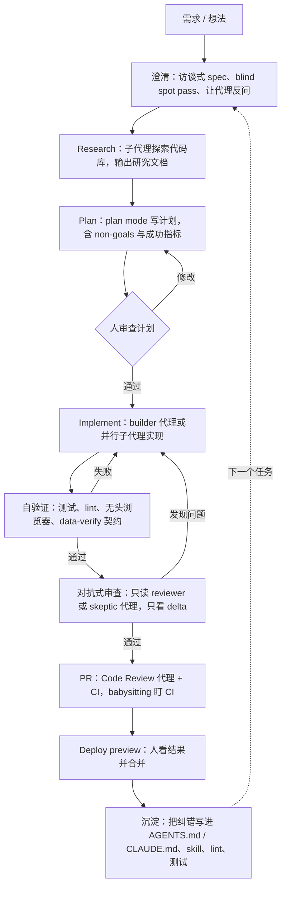

# 00 · 总结：27 份实战资料里的共性模式与最佳实践

**一句话看懂**：27 份资料（19 个视频，加上工程博客、官方文档和指南）、多家工具、来自 Anthropic、OpenAI、Cursor 和独立开发者的作者，最后都指向同一套做法：先让代理能自己验证；做事的和检查的分开；上下文做减法；动手前先把需求问清楚；每次纠错都沉淀成规则；人只负责定目标和看结果。

::: tip 小白先懂这几个词
[Agent](/glossary#agent)、[子代理](/glossary#subagent)、[上下文窗口](/glossary#context-window)、[Harness](/glossary#harness)、[CLAUDE.md](/glossary#claude-md) / [AGENTS.md](/glossary#agents-md)、[Plan Mode](/glossary#plan-mode)。不认识的词随时查[术语表](/glossary)。
:::

> 覆盖：27 份，按内容分 6 个主题：真实项目实战与人工把关（11、14、13、12、27）；需求澄清、规划与上下文管理（03、06、04、20、21）；多代理协作与对抗式验证（05、08、15、17、18）；后台代理、自动化与 CI/CD（01、02、10、22、23）；Harness 工程与内部机制（09、07、16、24）；评测、测试与验证（19、25、26）。类型：视频 19、文章 6、官方文档 1、指南 1。工具：Claude Code 12、Codex 6、Grok 4、Cursor 1、通用 4。本文只总结各篇分析里有来源支撑的内容，细节和原话见对应文章；按主题的详细对照见各[主题指南](/guide/practice)。

## 1. 共性模式（多数资料独立得出的结论）

### 模式 A：验证排第一，先让代理能自己“跑起来”

**为什么**：代理写得再快，没人检查就只是快速制造返工。能自己跑测试、开浏览器看结果的代理，交给你的半成品少得多。

- Boris Cherny（01）把验证定义为代理能否把东西真正跑起来；Arno（03）让组件输出 `data-verify-*`，供代理和 CI 核验。
- Dominik Kundel（10）的飞轮是 context → validation → verification；Ryan Lopopolo（07）把“测试 + lint + reviewer agents”当作 harness 的核心。
- Grok 这边，Bijan Bowen（13）看到代理用无头浏览器自测；ForrestKnight（12）则证明**测试全绿 ≠ 代码正确**，人工审查仍然必要。
- 2026-10-09 新增的资料把这一条推得更远：Factory（26）认为限制代理的是代码库的自动化验证，并给出 8 根验证支柱；Simon Willison（25）用 “Use red/green TDD”“First run the tests” 两句话把测试纪律交给代理；Carlini（17）说任务验证器必须近乎完美，否则代理会去解决一个错误的问题。详见 [✅ 评测、测试与验证](/guide/verification)。

::: tip 实践
先给代理一个能跑的命令（测试、浏览器、预览环境），再给任务。
:::

### 模式 B：做与查分开（maker / checker），最好是对抗式的

**为什么**：让写代码的代理自己检查自己，它倾向于认为自己做对了。换一个只读的、专门找茬的代理，才能抓住问题。

- Builder + Validator 成对子代理（05）、只读审查 persona 与 stop hook（08）、只读 Auto Review 子代理（09）。
- 扇出找 bug 后再做对抗式复核（02）、`/goal` 完成后由 skeptic 代理复查（15）、CI 中按 persona 设置 reviewer（07）。
- 新增：Anthropic 的 Planner / Generator / Evaluator（16）把验收交给单独调教的 Evaluator，并坦言开箱即用的 Claude 是很差的 QA 代理；Cole Medin（23）在 `/clear` 后的新会话里审查，再加一轮跨模型审查；Agent Evals 文章（19）主张能用确定性评分就别用模型评分。

::: tip 实践
审查代理只给只读权限；让它“尽量证伪”，而不是“确认完成”；复查只看 delta。#15 画面上的那句提示词可以直接借用：<Trans zh="下面的工作不是你做的……你的任务是证伪“目标已经达成”。">“You are NOT the agent that produced the work… Your job is to refute that the objective has been met.”</Trans>
:::

<figure class="shot"><figcaption>📷 #15 视频截图 · <a href="https://www.youtube.com/watch?v=1NwO2dPzwRM&t=575s" target="_blank" rel="noopener">9:35</a> · Grok Build 自动派出的“goal achievement skeptic”验证代理，提示词要求它证伪目标已达成。</figcaption></figure>

### 模式 C：上下文是稀缺资源，要做减法和压缩

**为什么**：上下文窗口装得越满，模型越容易遗漏和混淆；消除互相矛盾的指令，比堆更多内容更重要（10）。

- RPI 与“频繁有意压缩”（04）、Claude Code 删掉 80% system prompt（06）。
- skills 渐进加载、deferred tools、服务端 compaction（09）、子代理隔离上下文（05 / 08 / 15）。
- 新增：HumanLayer（20）指出指令是有“预算”的，规则文件少即是多；Skills 的创建者（21）讲三层渐进加载；Huntley（24）把上下文窗口比作数组，主张每轮全新上下文。注意来源在“压缩还是重开”上有分歧，见[长时自主任务专题](/guide/long-running)。

::: tip 实践
用 research → plan 的产物（Markdown 文件）在会话之间交接，不要让单个会话无限变长。
:::

<figure class="shot"><figcaption>📷 #04 视频截图 · <a href="https://www.youtube.com/watch?v=rmvDxxNubIg&t=871s" target="_blank" rel="noopener">14:31</a> · Dex Horthy 的示意图：子代理在各自的上下文里调研，最后写出一份 research.md，此时上下文约用了 40%。</figcaption></figure>

### 模式 D：先澄清需求，再动手

**为什么**：代理走偏，多半是因为碰到了你脑子里有、但没写下来的东西。先挖出来，比事后返工便宜。

- 让 Claude 采访你写 spec（03）、blind spot pass 和让模型反过来考你（06）、Steinberger 常问“Do you have any questions?”（11）。
- Grok Build plan mode 的可交互计划含 non-goals 和成功指标（13）、计划式 prompt + skills（14）。
- 新增：Sprint Contract，让写代码的代理和验收的代理在开工前约定完成标准（16）；把每个 GitHub issue 当作规格输入（23）。

::: tip 实践
复杂任务先进 plan mode，或者明确要求代理反问；计划里写明 non-goals。
:::

### 模式 E：把每一次纠错沉淀进 harness

**为什么**：在对话里纠正一次，下次还会再错；写成规则、测试或 skill，同类问题就不会再出现第二次。

- 犯错就写进 CLAUDE.md / Skill（01）；把团队标准写成带修复指引的 lint 和文件行数测试（07）。
- 每周 Garbage Collection Day（07）、复用设计 skills（14）、PR 看护 skill（10）。
- 新增：Mitchell Hashimoto（27）把这一步叫“改造 harness”，每个错误都对应 AGENTS.md 的一行或一个脚本；Cole Medin（23）的“自愈层”修 bug 时同时修规则、技能和流程；HumanLayer（20）提醒新增内容要普遍适用。反方向也成立：模型升级后，要逐个拆掉过时的脚手架（16）。

::: tip 实践
同一类问题第二次出现时，就把它变成规则、测试或 skill，而不是再口头提醒一次。
:::

### 模式 F：人从“写代码”转为“定目标 + 审结果”，代理并行 / 后台运行

- 给目标而不是任务、经由 Slack 的 Claude Tag（02）；Routines、`/loop`、Auto mode（01）。
- 10 个 checkout 并行（11）；手机上完成修复 → 预览 → 合并（10）；57 个并行子代理（15）。
- 新增：issue → worktree → PR 的并行流程（23）；CI 失败后由 `codex exec` 生成补丁（22）；下班前 30 分钟启动代理（27）。

::: warning 注意
并行的前提是 A–E 都已经到位。没有验证兜底的并行，只会放大返工。Factory（26）的说法更直接：没有能自动判断 PR 是否基本可用的验证，就不可能同时并行多个代理。
:::

### 模式 G：长时自主任务——进度落在文件里，验证决定上限

**为什么**：让代理连续跑几小时到几周，单个会话撑不住，人也没法一直盯着。

- Ralph 循环每轮全新上下文、一轮一个目标（24）；16 个代理靠 git + 锁文件协作写 C 编译器（17）；Cursor 数百代理改为 Planner / Worker / Judge 分层（18）；Anthropic 用 Evaluator 守住长任务质量（16）；Codex 的 `/goal`（09、10）。
- 来源在“压缩还是重开”“扁平还是分层”上有分歧，对照表见[长时自主任务专题](/guide/long-running)。

::: tip 实践
先在短任务上把验证做扎实，再拉长时间；进度写进 README、进度文件或计划文件，让下一个会话能接着干。
:::

## 2. 工具 / 方法对比

本站按内容主题分类；这张表换个角度，把同一类做法在三家工具里的对应功能并排放在一起。表格以 01–15 为主；新增的 Cursor（18）和通用资料（19、25、26、27）不针对特定工具，不列入此表。

| 维度 | Claude Code（01–06） | Codex（07–11） | Grok Build / Grok 4.x（12–15） |
|---|---|---|---|
| 规则文件 | CLAUDE.md、Skills | AGENTS.md、Skills（上下文占比有上限，09） | 兼容 AGENTS.md / CLAUDE.md 与 skills（14、官方文档） |
| 规划 | plan mode、访谈式 spec（03）、RPI 命令（04） | plan / `/goal`（09、10） | plan mode 生成可交互计划（13、15） |
| 子代理 | Task 系统 + 依赖（05）、扇出 workflows（02） | subagents + 按角色的 TOML 配置（08） | 大规模并行子代理（15） |
| 自动审查 | Hooks 自检（05）、对抗式复核（02） | Auto Review 只读子代理（09）、GitHub Code Review（10）、CI reviewer（07） | `/goal` 结束后的验证代理（15） |
| 长时 / 后台 | Routines、`/loop`、Remote Control（01）、Claude Tag（02） | `/goal` continuation、PR babysitting、Deploy preview（10） | `/goal`（15） |
| 视频证据来源 | 官方团队一手分享 + 独立开发者 | 官方工程师一手分享（harness 开源） | 只有第三方实测，缺官方长篇工程内容 |
| 视频中暴露的风险 | 上下文膨胀（04、06） | 需要大量前期投入 harness（07） | 越界修改（13）、“测试过了但实现有坏味道”（12） |

## 3. 端到端工作流（综合全部资料）

把六个模式按顺序串起来，就是下面这条流程。每个节点后面括号里的做法，都能在对应文章里找到原始出处。

## 4. 推荐阅读顺序

::: info 只有 30 分钟？
先看 **27**（Mitchell 的六步路线）→ 再读 **20**（规则文件怎么写）→ 最后读本页第 1 节的七个模式。按阶段系统阅读，请走[学习路径](/paths)（新手 / 进阶 / 专家三条）。
:::

六个主题从“看别人怎么做”到“理解底层为什么”排列，和左侧边栏的顺序一致。每个主题先读主题指南，再按下面的顺序读资料。小标签是资料类型和所用工具。

**1. 🛠️ 真实项目实战与人工把关**（[主题指南](/guide/practice)）

- [11 · Peter Steinberger：用 Codex 建 OpenClaw](/11-peter-steinberger-openclaw) 视频 Codex：轻松的访谈，先建立“代理主导开发”的直观印象。
- [14 · OrcDev：Skills 约束设计的 UI 开发](/14-orcdev-grok-build-skills) 视频 Grok Build：10 分钟看一个新代理工具怎么上手，Skills 如何约束风格。
- [13 · Bijan Bowen：Grok Build 完整实测](/13-bijan-bowen-grok-build) 视频 Grok Build：更长的全流程实测：plan mode、截图反馈、无头浏览器自测。
- [12 · ForrestKnight：Grok 4.5 实战与代码审查](/12-forrestknight-grok-4-5) 视频 Cursor + Grok 4.5：学会怎么审查 AI 产出，警惕“测试全绿”。
- [27 · Mitchell Hashimoto：六步 AI 采用路线](/27-mitchellh-ai-adoption-journey) 文章 通用（不限工具）：从怀疑到熟练的六步路线，最适合刚起步。

**2. 🧭 需求澄清、规划与上下文管理**（[主题指南](/guide/planning)）

- [03 · How we Claude Code：访谈式需求与可验证组件](/03-how-we-claude-code) 视频 Claude Code：可以照着复现的 workshop（有配套仓库）。
- [06 · Field Guide to Fable：找出未知、上下文减法](/06-field-guide-to-fable) 视频 Claude Code：需求盲区与上下文减法。
- [04 · No Vibes Allowed：RPI 与有意压缩](/04-no-vibes-allowed-rpi) 视频 Claude Code：在复杂代码库中做上下文管理的方法论。
- [20 · HumanLayer：CLAUDE.md 少即是多](/20-humanlayer-writing-good-claude-md) 文章 Claude Code：规则文件怎么写，最短最实用。
- [21 · Anthropic：别造代理，写 Skills](/21-anthropic-agent-skills-talk) 视频 Claude Code：Skills 为什么是文件夹、怎么渐进加载。

**3. 🤝 多代理协作与对抗式验证**（[主题指南](/guide/multi-agent)）

- [05 · IndyDevDan：Builder / Validator 代理团队](/05-indydevdan-task-system) 视频 Claude Code：builder / validator 团队的编排。
- [08 · Codex Masterclass：子代理、Hooks 与插件](/08-codex-masterclass) 视频 Codex：子代理、hooks、plugins 的实操。
- [15 · Arcade：57 个子代理与 /goal 对抗验证](/15-arcade-grok-build-57-agents) 视频 Grok Build：大规模并行与对抗式验证（建议配合 Grok Build 官方文档）。
- [17 · Anthropic：16 个代理并行写 C 编译器](/17-anthropic-c-compiler-agent-teams) 文章 Claude Code：十几个代理、无编排者，靠 git + 锁文件协作。
- [18 · Cursor：数百代理的 Planner / Worker 实验](/18-cursor-scaling-long-running-agents) 文章 Cursor：数百代理时扁平协作为什么失败、分层后怎么跑。

**4. ⚙️ 后台代理、自动化与 CI/CD**（[主题指南](/guide/automation)）

- [01 · Claude Code 一周年：验证、Routines、Auto mode](/01-claude-code-one-year) 视频 Claude Code：从工具作者口中了解验证、CLAUDE.md、Routines 等基本观念。
- [02 · Claude Code 团队：Claude Tag 与扇出 Workflows](/02-claude-code-team-workflows) 视频 Claude Code：团队级协作与动态 workflows。
- [10 · How OpenAI Uses Codex：验证飞轮与 PR 看护](/10-how-openai-uses-codex) 视频 Codex：PR 审查、CI 看护、Deploy preview 全链路。
- [22 · OpenAI：codex exec + GitHub Action 自动修 CI](/22-openai-codex-ci-autofix) 官方文档 Codex：能抄进仓库的 CI 配置和安全布局。
- [23 · Cole Medin：5 个并行代理 + worktree](/23-cole-medin-parallel-worktrees) 视频 Claude Code：完整的并行开发演示，配套脚本可参考。

**5. 🧠 Harness 工程与内部机制**（[主题指南](/guide/harness)）

- [09 · How Codex Works：Harness 内部机制](/09-how-codex-works) 视频 Codex：harness 内部机制，理解前面所有现象的“为什么”。
- [07 · Harness Engineering：人掌舵、代理执行](/07-harness-engineering) 视频 Codex：最激进的“人不写代码”团队实践，适合最后看。
- [16 · Anthropic：Planner / Generator / Evaluator 长时任务 harness](/16-anthropic-harness-design-long-running-apps) 文章 Claude Code：做与查分离，以及模型升级后逐个拆脚手架。
- [24 · Huntley & Horthy：Ralph 循环 vs 官方插件](/24-huntley-horthy-ralph-loop) 视频 Claude Code：“上下文窗口就是数组”的心智模型。

**6. ✅ 评测、测试与验证**（[主题指南](/guide/verification)）

- [19 · Anthropic：Agent Evals 入门路线图](/19-anthropic-demystifying-agent-evals) 文章 通用（不限工具）：系统评测代理时再读。
- [25 · Simon Willison：测试与验收模式](/25-simonw-agentic-engineering-testing-patterns) 指南 通用（不限工具）：三句马上能用的测试提示词。
- [26 · Factory：让代码库为代理做好准备](/26-factory-agent-ready-codebases) 视频 通用（不限工具）：给自己的代码库的可验证性打分。

## 5. 你可以这样开始（一周计划）

- [ ] **第 1 天**：给项目写一个“怎么把我跑起来”的 Skill 或 AGENTS.md 小节（模式 A）。
- [ ] **第 2 天**：下一个任务开工前，让代理先采访你或做一次 blind spot pass（模式 D）。
- [ ] **第 3 天**：加一个只读的 reviewer 子代理，提示词强调“尽量证伪”（模式 B）。
- [ ] **第 4 天**：上下文接近 40% 时，练习一次“写进 Markdown → 开新会话”的交接（模式 C）。
- [ ] **第 5 天**：把这周出现两次以上的同类问题，写成一条 lint、测试或规则（模式 E）。
- [ ] **第 6 天**：新会话第一句话写 “First run the tests”，新功能加一句 “Use red/green TDD”（模式 A，见 #25）。
- [ ] **第 7 天**：对照 #20 把 CLAUDE.md / AGENTS.md 删到只剩每次都用得上的内容（模式 C）。

## 6. 缺口与局限（如实说明）

- **Grok**：没有找到 xAI 官方或大会级的长篇工程实战内容，官方频道只有 1–2 分钟的宣传片。4 个 Grok 视频都是第三方实测，以 demo 或新项目为主，缺少大型存量代码库和长期团队实践的证据。其中 #15 的自动字幕质量差，结合简介、官方文档和画面文字分析。对 Grok 的结论请视为初步观察。
- **Codex**：#09 与 #10 为同一讲者（Dominik Kundel），但主题不重叠（harness 内部 vs. 团队流程）。
- **Cursor**：只有 1 篇（#18，公司研究博客）。
- **配置模板**：本批来源里没有可整段引用的 hooks 配置，[配置模板库](/templates#gaps)里如实标注为缺口。
- **长时任务的数字**：#18 没有给出成本；#24 的直播结束时循环仍在跑，没有最终结果。
- **范围**：按要求排除了以漏洞挖掘 / 攻防安全为主题的资料。
- **时效**：#04、#20、#21、#26 为 2025 年 11–12 月发布；#22（官方文档）和 #25（连载指南）会持续更新，以 2026-10-09 抓取的版本为准；其余均为 2026 年。工具更新很快，具体命令和 UI 以官方最新文档为准。
