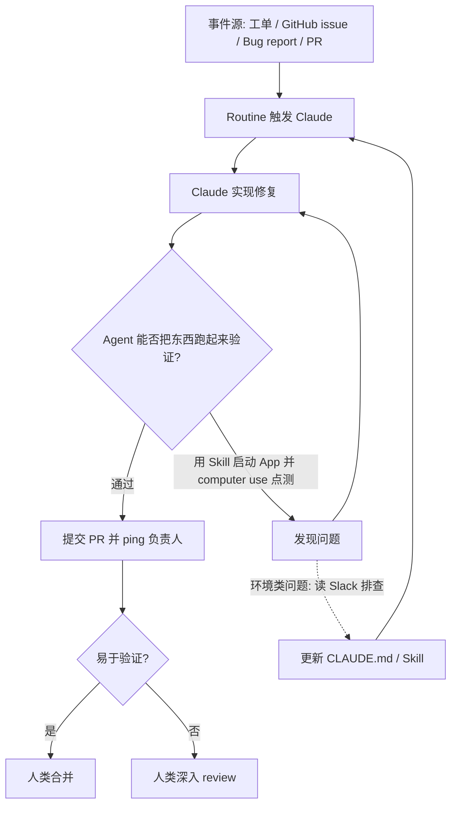

# Reflecting on a year of Claude Code：验证、Routines、Auto mode 与“上下文极简主义”

Claude Code

**一句话看懂**：Claude Code 的负责人 Boris Cherny 回顾一年：他已经不再“盯着一个 Agent 干活”，而是让 Agent 自己验证、自己被事件触发、自己把教训写进规则文件。

::: info 为什么值得看
这是 Claude Code 团队负责人亲口讲的内部用法，没有营销味。视频只有 18 分钟，却回答了企业用户最常问的三个问题：怎么让 Agent 可靠地验证自己的工作？怎么把 Agent 接进 CI 和代码审查？上下文到底该给多少？
:::

::: tip 小白先懂这几个词
- [CLAUDE.md](/glossary#claude-md)：Claude Code 每次启动都会读的“项目须知”。
- [Skills](/glossary#skills)：教 Agent 做某件事的说明书，需要时才加载。
- [Routines](/glossary#routines)：让 Agent 按时间或事件自动开工。
- [Auto mode](/glossary#auto-mode)：由另一个模型替你判断权限请求安不安全。
- [Worktree](/glossary#worktree)：同一个仓库同时开多个工作目录，方便并行。
:::

## 1. 基本信息

<YouTube id="Hth_tLaC2j8" title="Reflecting on a year of Claude Code" />

| 项目 | 内容 |
|---|---|
| 讲者 / 频道 | Boris Cherny（Head of Claude Code）、Cat Wu（Head of Product, Claude Code）／ 官方频道 **Claude** |
| 发布日期 | 2026-06-08 |
| 时长 | 18:07 |
| 使用工具 | Claude Code（CLI、Desktop app、Agent view、Remote Control、Routines、Auto mode、`/loop`） |
| 形式 | 对谈 + 经验总结（无现场编码，但给出了大量内部真实用法） |
| 分析依据 | YouTube 字幕全文（通过网页抓取获得）+ 视频简介与官方章节。文中英文引号内容均为字幕原话。 |

官方章节：0:00 起源 → 1:10 如何让 Claude 擅长验证 → 4:48 用 Routines 做 CI、Code review → 6:43 Auto mode → 8:10 Auto mode 的红队与评测 → 10:24 Loop → 14:20 管理上百个 Agent → 16:05 从上下文工程到上下文极简主义。

<figure class="shot"><figcaption>📷 视频截图 · <a href="https://www.youtube.com/watch?v=Hth_tLaC2j8&t=45s" target="_blank" rel="noopener">0:45</a> · 开场对谈：讲到“一年前刚发布时”和现在“一棵由上千个 Agent 组成的树”的对比。</figcaption></figure>

## 2. 做了什么

Claude Code 正式发布（GA）一年后，Anthropic 内部的用法已经变了：以前是一个人盯一个 Agent，现在是一个人管一棵 Agent 树。

这期对谈要回答企业用户最常问的三个问题：

- 怎样让 Agent 可靠地**验证**自己的工作？
- 怎样把 Agent 放进 **CI、Code review、工单**流程？
- 大型企业里，**上下文**该怎么管？

目标是把团队一年来的工作方式沉淀成可复用的原则。涉及的场景有并行 / 后台代理、与 CI 集成、上下文工程和自我验证。

## 3. 怎么做的

### 3.1 每次犯错，都写进 CLAUDE.md 或 Skill

**为什么重要**：如果只在对话里纠正 Agent，这次会话结束，教训就没了。下一次、下一个 Agent 还会犯同样的错。

Boris 的做法是让纠错“落盘”：

::: tr 每次 Claude 犯错，我都不是告诉它“换个做法”，而是让它把这条写进 CLAUDE.md，或者做成一个 skill 之类的东西，让它以后换个做法。只要能做到这一点，Claude 就可以一直跑下去。
> "every single time Claude makes a mistake. I don't tell Claude to do it differently, I tell it to write it to the CLAUDE.md, or to like make a skill or or something to do it differently. And if you can do this, then Claude can just like run forever."
:::

做法要点：纠错不停留在当前会话，而是沉淀到持久化的上下文（CLAUDE.md 或 Skill），让下一次、下一个 Agent 自动受益。

### 3.2 验证的意思是“Agent 能不能把东西跑起来”

**为什么重要**：很多人以为“验证”就是单元测试和 lint。Boris 认为对 Agent 来说，更关键的是它能否亲手启动产品、亲眼看到结果。

::: tr 一说到验证，大家想到的是单元测试、lint 或类型检查……但对 Agent 来说，验证有点不一样，它指的是：Agent 能不能把这个东西真正跑起来？
> "whenever we talk about verification, people are thinking like unit tests or they're thinking like lint or like type check… But actually when we talk about verification for agents, it's something slightly different. It's like can the agent run the thing?"
:::

字幕里讲到的内部真实例子：

- 团队有人写了一个 **desktop development skill**，教 Claude 如何启动本地桌面 App。Claude 用 [computer use](/glossary#computer-use) 去点击新界面、测试边界条件，发现问题就修，然后重新检查。
- 遇到 staging 环境异常时，让 Claude **去读 Slack**，确认 staging 是不是挂了、别人是否也遇到；排查完后，**让它更新这个 desktop development skill**。
- 现在已有 iOS 模拟器、Android 模拟器、桌面电脑等多种“自测 loop”。

::: tip 关键做法
给 Agent 写一个“如何把我的应用跑起来”的 Skill，是让它自测的前提。没有这个入口，Agent 只能“写完就交”。
:::

### 3.3 Routines：把 Agent 挂到事件流上

**为什么重要**：人不可能 24 小时盯着工单和 PR。Routine 让 Agent 被事件自动唤醒，人只在最后审结果。

字幕中的两个真实 routine：

1. 负责 voice mode 的工程师设置了一个 routine，**监听所有关于 voice mode 的工单、GitHub issue、bug report**，Claude 主动提交修复 PR 并 ping 他。
2. 另一个 routine **寻找 5 小时内无人响应的 bug report 并提交修复**，<Trans zh="他只合并那些容易验证的">“he merges the ones that are easy to verify”</Trans>。

::: tr 它把代码审查全包了，每个 PR 都由它看护……以前你得自己修 CI、自己 rebase……我已经很久没干过这些了。
> "it just does like all the code review, it babysits like every PR… you used to have to like fix CI. You used to have to rebase… I haven't done that in a long time."
:::

### 3.4 从 Plan mode 换到 Auto mode

- Boris 说自己**不再用 Plan mode**，而是用 Auto mode：<Trans zh="新模型其实已经不需要单独的规划步骤了">“the newer models they don't actually need like a planning step anymore”</Trans>。他认为 Opus 4 到 4.5 时代规划步骤很重要，4.6 / 4.7 起不再需要；他也承认有人仍喜欢计划这个产物。
- Auto mode 的原理：把权限请求**路由给另一个模型做安全分类**，可疑命令直接拒绝，事后可以再手动放行。
- 安全性论证：人对 99% 都点“是”的权限弹窗会麻木；Auto mode 让人只关注最重要的少数情况。
- 上线前的做法：收集**数千份完整的 Agent 轨迹和权限请求**让分类器判断；请红队尝试 prompt injection、攻击代码库，并据此**构建 evals**；内部团队再攻击一轮后继续改进。

<figure class="shot"><figcaption>📷 视频截图 · <a href="https://www.youtube.com/watch?v=Hth_tLaC2j8&t=407s" target="_blank" rel="noopener">6:47</a> · 6:47 处，话题转到 Auto mode：Boris 说“Instead of plan mode”，新模型已不需要单独的规划步骤。</figcaption></figure>

### 3.5 Loop：从“和 Agent 对话”到“和 Loop 对话”

::: tr 我已经不直接跟 Agent 说话了。我跟 loop 或 routine 说话，再由它们替我去给 Claude 下指令。
> "I don't talk to an agent anymore. I talk to loop or I talk to a routine and it prompts Claude for me."
:::

### 3.6 管理上百个 Agent 的界面演进

- 以前：**6 个终端 tab + 6 个同一仓库的 git checkout**，来回切换。
- 现在：一个 tab 里用新的 **agent view**；Desktop app 自动创建 worktree；约一半工程工作在手机上通过 **Remote Control** 完成，配合 voice mode 随时开新 Agent。

### 3.7 上下文极简主义

**为什么重要**：上下文给得越多，模型越像被“微操”。新模型自己找信息的能力已经很强。

::: tr 对今天的模型，这些都不用做了。给它尽可能少的系统提示词、尽可能少的工具，然后让模型自己想办法。你只需要给模型某种自己拉取上下文的途径。
> "with the models of today, you don't do any of this. You give it the minimal possible system prompt, the minimal possible tools, and then you let the model figure it out. Like you just have to give the model some way to pull in the context."
:::

另一位讲者补充：<Trans zh="我是上下文极简主义者……只告诉模型它必须知道的，剩下的让它自己搞清楚">“I'm a context minimalist… tell the model only what it needs to know and let it figure out the rest of it”</Trans>。并认为上下文给多了<Trans zh="有点像在微操它">“kind of like you're micromanaging it”</Trans>。团队也在让 harness 更精简，给用户自己的 prompt 留出空间。

<figure class="shot"><figcaption>📷 视频截图 · <a href="https://www.youtube.com/watch?v=Hth_tLaC2j8&t=951s" target="_blank" rel="noopener">15:51</a> · 15:51 前后，对谈讲到用手机远程控制 Agent、“在沙发上提交 PR”；紧接着进入“上下文极简主义”话题。</figcaption></figure>

下图把 3.1–3.3 串成一个闭环：事件触发 → 修复 → Agent 自己跑起来验证 → 人只审“易于验证”的结果，环境类问题再沉淀回规则文件。

## 4. 结果如何

- **定性结果**（视频陈述，无量化指标）：Boris 称自己已在运行由 Agent 层层派发的<Trans zh="一棵由上千个 Agent 组成的树">“tree of like thousands of agents”</Trans>；代码审查、盯 PR、修 CI、rebase 基本交给 routine；设计师、PM、财务、数据科学都在用 Claude Code。
- **未给出**：合并率、缺陷率、成本等数据。视频没有任何数字型效果指标，“thousands”只是口头描述。

::: warning 局限与注意
- “不再需要 Plan mode”是基于他们使用的最新模型（Opus 4.6/4.7）的个人判断。老模型或复杂需求仍可能需要规划。
- Auto mode 的安全性依赖 Anthropic 自己的分类器与红队评测。团队自建流程时，需要设计自己的权限边界。
- 内容是官方团队对谈，偏经验与理念，缺少可以直接复制的配置文件。
:::

## 5. 可借鉴之处

1. **建立“纠错即沉淀”规则**：在团队约定里写明，Agent 的同类错误第二次出现时，必须把修正写进 `CLAUDE.md` 或一个 Skill，而不是只在对话里纠正。
2. **为你的应用写一个“如何把我跑起来”的 Skill**：包含启动命令、测试账号、如何截图 / 点测、常见环境故障排查方式（例如去哪个 Slack 频道确认 staging 状态）。这是 Agent 自测的前提。
3. **从一个低风险 routine 开始**：例如“每天扫描超过 N 小时无人响应的 bug，能高置信修复的才提 PR”，人只合并“易于验证”的那部分。
4. **权限策略分级**：如果暂时没有 Auto mode 这类分类器，至少用 allowlist 放行只读和测试命令，避免弹窗疲劳导致“无脑点是”。
5. **上下文做减法**：定期审视 CLAUDE.md，删掉模型已经能自己发现的内容，只保留“它不可能自己知道的东西”（团队约定、外部系统入口、坑）。

### 你可以这样试

- [ ] 下次 Agent 犯错时，别直接纠正，改说：“把这条教训写进 CLAUDE.md，写清楚以后该怎么做。”
- [ ] 新建 `.claude/skills/run-app/SKILL.md`，写上启动命令、端口、测试账号、怎么截图。
- [ ] 让 Agent 改完一个 UI 后，按这个 Skill 自己启动应用并截图给你看。
- [ ] 打开 CLAUDE.md，删掉三条模型本来就能从代码里看出来的内容。

::: details 读完自测（点开看答案）
1. **Boris 说的“验证”和单元测试有什么不同？** 他强调的是 Agent 能否把东西真正跑起来（启动 App、点测界面），单元测试只是其中一部分。
2. **为什么要把纠错写进 CLAUDE.md 而不是在对话里说？** 对话结束教训就丢了；写进文件后，下一次、下一个 Agent 都会自动读到。
3. **Auto mode 怎么判断命令是否安全？** 把权限请求交给另一个模型做安全分类，可疑的直接拒绝。
:::
