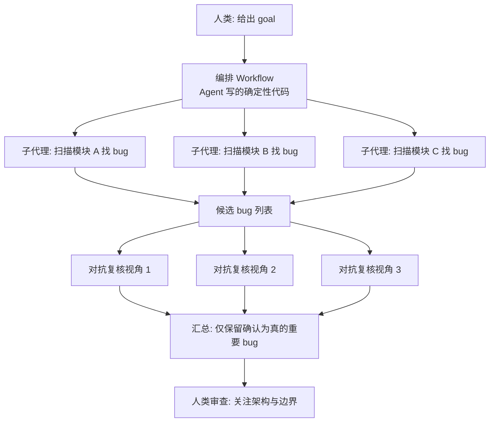

# 02｜How the Claude Code team uses Claude Code：Claude Tag、Routines 与“扇出式”代码审查 Workflow

<a class="domain-tag" href="/guide/automation">阶段：5 自动化 · 后台代理与 CI/CD</a>类型：视频工具：Claude Code

**一句话看懂**：Claude Code 团队三位工程师聊自己怎么用 Claude Code：大部分工作在 Slack 里 @Claude 完成；代码审查交给“先扇出找 bug、再对抗式复核”的自动化流程；人只看架构和边界。

::: info 为什么值得看
它讲清了一个转变：当 Agent 写代码的速度远超人能审的速度，人的工作从“盯每一次工具调用”变成“给目标、看证据”。视频里的扇出 + 对抗复核审查模式，可以直接照搬到自己的项目。
:::

::: tip 小白先懂这几个词
- [Claude Tag](/glossary#claude-tag)：Slack 里的 Claude 代理，@它就能干活。
- [扇出（Fan-out）](/glossary#fan-out)：把大任务拆给很多子代理同时做，再汇总。
- [对抗式复核](/glossary#adversarial-review)：专门派代理去“证明这个 bug 不是真的”。
- [Artifact](/glossary#artifact)：代理生成的独立成品，比如一个 HTML 页面。
- [Harness](/glossary#harness)：包在模型外面、负责工具和上下文的那层程序。
:::

> 信息来源：YouTube 字幕全文（网页抓取）+ 视频简介与章节。字幕未标注说话人，除简介明确的信息外，引用不归属到具体个人。中文翻译为本站所加（鼠标悬停或点按带虚线的英文即可查看）。

## 1. 基本信息

<YouTube id="S-sYlFiGFv8" title="How the Claude Code team uses Claude Code" />

| 项目 | 内容 |
|---|---|
| 链接 | https://www.youtube.com/watch?v=S-sYlFiGFv8 |
| 讲者 / 频道 | Thariq Shihipar、Sid Bidasaria、Robert Boyce（Claude Code 团队）／ 官方频道 **Claude** |
| 发布日期 | 2026-09-02 |
| 时长 | 22:23 |
| 使用工具 | Claude Code（TUI、Desktop、Claude Code on the web）、Claude Tag（Slack 原生 Agent）、AskUserQuestion、Artifacts、Routines、Workflows、Auto mode |

章节：0:35 通过 Claude Tag 工作：从 tool call 到 goal → 4:48 AskUserQuestion、artifacts → 6:41 远程运行 loops 与 routines → 8:52 代码审查如何催生 dynamic workflows → 14:04 用 Claude Tag 开发 Claude Tag：Slack 中的验证与反馈循环。

## 2. 做了什么

一年前用 Claude Code，意味着写 prompt、给反馈、点权限确认。如今代码产出量暴增，人不可能逐行审查、逐个 tool call 盯着看。

这期视频展示团队怎样把工作的抽象层级往上提：给 Agent **目标（goal）而不是任务（task）**，用 routine 和 workflow 处理审查、监控与反馈。

涉及的场景：多代理自动审查（扇出 + 对抗式复核）、后台 / 远程代理、Slack 驱动的开发闭环。

## 3. 怎么做的

### 3.1 工作入口搬到 Slack 里的 Claude Tag

**为什么重要**：Slack 里本来就有产品讨论和团队决策。Agent 在那里工作，能自己找到这些上下文，做出的决定更靠谱。

- 字幕原话：<Trans zh="我现在 70% 到 80% 的工作都在 Claude Tag 上完成，剩下 20% 可能会打开 TUI 或桌面 App 去精修一些东西。">“70 to 80% of my work happens on Claude Tag now, and for 20% of the work, I will maybe open up the TUI or the desktop app to like, refine something.”</Trans>

- 交互方式也变了：Claude Tag 通过“发送消息”工具和人沟通，内部推理默认看不见（可以点链接看完整 transcript）。讲者坦言起初觉得<Trans zh="有点吓人">“a little scary”</Trans>，但被迫<Trans zh="放手让 Claude 干">“let Claude cook”</Trans>之后，发现结果足够好。

### 3.2 敢于删掉 harness 里的功能

**为什么重要**：很多功能是给旧模型打的补丁。模型变强后，这些补丁反而成了束缚。

- To-do list 是 Sonnet 3.5 时代加的，用来解决“5 件事做了 3 件就放弃”的问题。一年后，<Trans zh="已经不太需要 to-do list 了">“you don't really need the to do list anymore”</Trans>。
- 原则：模型变强后，把补丁**删掉**，同时为更大的任务补充新工具。

### 3.3 从 AskUserQuestion 到 HTML Artifact 提问

- 最初把提问放在规划之后，后来改成模型可以随时调用的 AskUserQuestion 工具。讲者说设计这个工具<Trans zh="花了我很长时间">“took me so long”</Trans>。
- 现在更常见的做法是让 Claude **生成一个 HTML artifact 来反问自己**，里面带图表和 mockup。

### 3.4 从本地到云端：Loops 与 Routines

**为什么重要**：Agent 在你的笔记本上跑，你合上电脑它就停了。搬到云端后，它能一直干。

字幕描述的演进路径：笔记本本地运行 → 远程开发机（需要 ssh）→ **Claude Code on the web**（托管容器，后台持续运行；给它配置开发环境的访问权限有成本，但讲者称“10x my productivity”，让效率翻了 10 倍）→ **routines**。

routine 示例原话：

::: tr 每天去看我们收到的所有反馈，按重要程度分桶，然后把它有高把握修好的那些修掉。
> "every day go and look at all the feedback that we're getting and look at, you know, bucket them into buckets of importance and fix the ones that it actually has high confidence in fixing."
:::

<figure class="shot"><figcaption>📷 视频截图 · <a href="https://www.youtube.com/watch?v=S-sYlFiGFv8&t=391s" target="_blank" rel="noopener">6:31</a> · 6:31 前后：讲者说现在常让 Claude 直接生成一个会“反问你”的 HTML artifact，随后话题转到 loops 与远程运行。</figcaption></figure>

### 3.5 代码审查：扇出 + 对抗式复核，演化成 Workflows

**为什么重要**：Agent 找 bug 很容易“报一堆假问题”。对抗式复核用额外的算力换置信度，只把确认为真的 bug 交给人。

人审查的重心也变了：琐碎问题让 Claude 自动发现并修复；人关注“为什么 API 这样设计、服务边界为什么划在这里”这类大问题。

审查 bot 的做法（字幕原述）：

::: tr 你让 Claude 扇出去找 bug。然后对每个 bug 做一次对抗式复核：让它从三个不同的观点或视角去看这个 bug，判断它是不是真的。
> "you tell Claude to go out and fan out and find bugs. And then for each bug, you might do an adversarial review where you ask it to look at the bug from three different, you know, opinions or perspectives and see if the bug is actually real."
:::

- 讲者把它称作 MapReduce 式的问题，用 test-time compute（推理时多花算力）换置信度。同样的模式也能用在性能问题和深度调研上。
- **Workflows 的关键**：由 Agent **写代码**来编排子代理。for 循环这类确定性代码保证每一项都被处理，判断交给 LLM。字幕原话：<Trans zh="Claude 其实很擅长给自己搭 harness">“Claude is actually really good at making its own harnesses”</Trans>，它可以自己决定扇出的拓扑。

<figure class="shot"><figcaption>📷 视频截图 · <a href="https://www.youtube.com/watch?v=S-sYlFiGFv8&t=727s" target="_blank" rel="noopener">12:07</a> · 12:07 前后：讲者用“规划去 Tahoe 的旅行”举例，说明扇出（同时发十个搜索）再由其他 Agent 排序筛选的模式。</figcaption></figure>

下图是这种审查 workflow 的结构：

::: details 深入一点：为什么编排要用代码写？
讲者在 13:28 前后解释：让 Claude 写一个 for 循环来遍历所有待审项，<Trans zh="它不会漏掉任何一项">“it's not going to skip one of the items”</Trans>。确定性代码负责“一个都不能少”，LLM 负责“这个 bug 是不是真的”，两者分工后，人对结果更有信心。
:::

### 3.6 用 Claude Tag 开发 Claude Tag：验证闭环

- 重点是让开发环境与 dev loop 对 Claude 足够友好，能<Trans zh="做到我作为人类为了构建软件、端到端测试它能用所需要做的一切">“do everything that I, as a human need to do to build the software and test that it's working end to end”</Trans>。
- Claude 给 Claude Code 提 PR 时会**自测并发送截图**；有人让它<Trans zh="录下自己使用 TUI 的过程">“record itself using the TUI”</Trans>来证明。
- 新工具的内测流程：Claude Tag 帮忙找相关干系人 → 做 mockup → 实现并埋点 → 内部部署 → **监控事件与反馈**，有人反馈时 tag 作者 → 让 Claude 自己提出漏斗优化方案。

<figure class="shot"><figcaption>📷 视频截图 · <a href="https://www.youtube.com/watch?v=S-sYlFiGFv8&t=839s" target="_blank" rel="noopener">13:59</a> · 13:59 前后：话题转到 Claude Tag，讲者说团队正在“用 Claude Tag 开发 Claude Tag”。</figcaption></figure>

## 4. 结果如何

- 定性：Claude Tag 承担讲者 70–80% 的工作；云端容器被评价为“10x my productivity”（主观描述，非测量值）。
- 视频**没有提供**审查准确率、误报率、成本等量化数据。

::: warning 局限与注意
- Claude Tag、Workflows 是 Anthropic 内部或新产品形态，外部团队能用到的形式可能不同。
- 远程容器需要为 Agent 配置开发环境的访问权限，讲者承认<Trans zh="有点麻烦">“a bit of a pain”</Trans>。
- 不再逐条看 transcript，依赖对模型能力的信任，需要用验证截图 / 录屏来补足信心。
:::

## 5. 可借鉴之处

1. **实现一个“扇出 + 对抗复核”审查脚本**：用 Claude Agent SDK 或 [headless 模式](/glossary#headless)（`claude -p`）对每个模块并行找 bug，再对每个候选 bug 用 3 个不同视角（如“安全”“正确性”“是否可复现”）复核，只把多数确认的结果贴到 PR。
2. **编排逻辑用代码写，判断交给模型**：for 循环、重试、聚合这类“一个都不能漏”的部分写成确定性代码。
3. **把 Agent 接入团队沟通渠道**：在 Slack / 飞书里让 Agent 能读取决策记录与反馈，再由它发消息给人。
4. **验证产物化**：要求 Agent 的 PR 附带截图或录屏，人先看证据，再决定是否深入 review。
5. **定期做 harness 减法**：每次模型升级后，复查自定义命令、提示词模板、强制 to-do 等，删掉不再必要的部分。

### 你可以这样试

- [ ] 挑一个模块，让 Agent 用 3 个子代理分别找 bug，再开 3 个只读子代理分别从“安全 / 正确性 / 能否复现”角度复核。
- [ ] 比较复核前后的 bug 数量，看过滤掉了多少误报。
- [ ] 在 PR 模板里加一栏“Agent 自测证据（截图 / 录屏链接）”。
- [ ] 列出你给 Agent 加过的所有“补丁式”规则，挑一条删掉试试效果。

::: details 读完自测（点开看答案）
1. **对抗式复核解决什么问题？** Agent 找 bug 会有很多误报，复核从多个视角判断 bug 是否真实，只保留确认的。
2. **为什么扇出的编排写成代码？** 确定性的 for 循环保证每一项都被处理，不会漏。
3. **团队删掉 to-do list 的理由是什么？** 它是为旧模型“做一半就放弃”打的补丁，新模型不再需要。
:::
