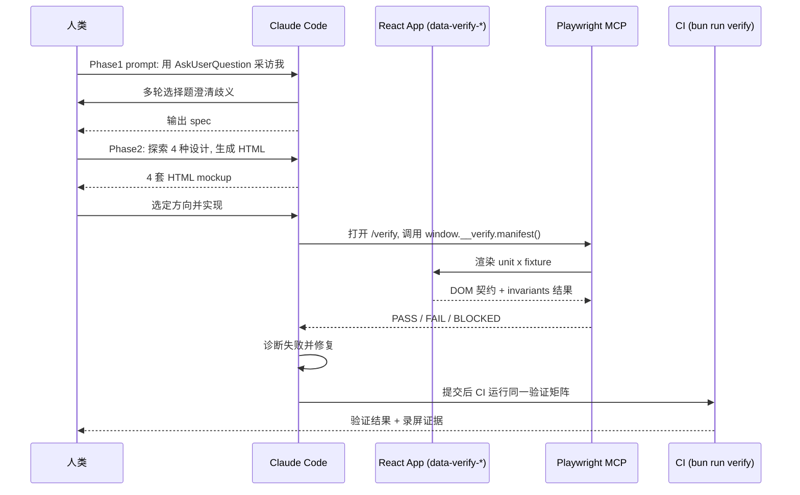

# 03｜How we Claude Code：访谈式需求 → HTML 设计探索 → “Agent 原生”的可验证组件

<div class="meta-tags"><a class="domain-tag" href="/#domain-planning">🧭 主题：需求澄清、规划与上下文管理</a><span class="tool-tag tool-claude">工具：Claude Code</span></div>

<div class="hook">

**一句话看懂**：Anthropic 架构师现场演示三步法：先让 Claude 采访你、把需求问清楚；再让它用 HTML 一次出 4 套设计给你挑；最后把“可验证”直接做进 React 组件里，让 Agent、人和 CI 用同一套标准检查结果。

</div>

::: info 为什么值得看
这是少有的、带完整配套仓库的官方 workshop，两条关键 prompt 可以原样复制。第三部分的“可验证组件”架构，解决了“Agent 说做完了，但我怎么知道真的对”这个老问题。
:::

::: tip 小白先懂这几个词
- [AskUserQuestion](/glossary#ask-user-question)：Claude Code 弹选择题问你的工具。
- [Spec](/glossary#spec)：写清“要做什么、做到什么算完成”的需求文档。
- [MCP](/glossary#mcp)：给 Agent 接外部工具的标准插头，这里接的是 Playwright 浏览器。
- [Fixture / Invariant / Probe](/glossary#fixture)：测试输入 / 必须成立的规则 / 刁钻边界用例。
- [Happy Path](/glossary#happy-path)：一切正常、不出错的那条路径。
:::

> 信息来源：YouTube 字幕全文（网页抓取）+ 视频简介 + 配套 GitHub 仓库 `anthropics/cwc-workshops/how-we-claude-code`（README 与 PROMPT.MD 原文）。中文翻译为本站所加（鼠标悬停或点按带虚线的英文即可查看）。

## 1. 基本信息

<YouTube id="IlqJqcl8ONE" title="How we Claude Code" />

| 项目 | 内容 |
|---|---|
| 链接 | https://www.youtube.com/watch?v=IlqJqcl8ONE |
| 讲者 / 频道 | Arno（字幕自我介绍：Anthropic Applied AI 团队架构师）／ 官方频道 **Claude**（Code w/ Claude 2026 工作坊） |
| 发布日期 | 2026-05-22 |
| 时长 | 31:43 |
| 使用工具 | Claude Code（Opus 4.7、Auto mode、Fast mode、`/effort`、AskUserQuestion）、Playwright MCP、Bun、Vite + React、Zod、Vitest |
| 配套仓库 | https://github.com/anthropics/cwc-workshops/tree/main/how-we-claude-code |

<figure class="shot"><figcaption>📷 视频截图 · <a href="https://www.youtube.com/watch?v=IlqJqcl8ONE&t=237s" target="_blank" rel="noopener">3:57</a> · 讲者的总纲幻灯片“Three tools for working with long-running agents”：消除歧义（让 Agent 先采访你）、理解与规划（用 HTML 而非 Markdown 写计划）、内建验证（从一开始就做验证，而不是最后补）。</figcaption></figure>

## 2. 做了什么

模型越强、Agent 跑得越久，**方向一旦错了，浪费的 token 就越多**。而现实是：

- 人很难一次把需求写全；
- 几百行的 Markdown spec 也没人愿意读；
- Agent 做完后，缺少一个“它能自己核对”的验证面。

所以讲者演示了 Anthropic 内部的三段式工作法：**让 Claude 采访你**提取需求；用 **HTML** 做高信息密度的设计和计划；把**验证嵌入产物本身**。

涉及的场景：上下文工程、“规划 → 执行 → 验证”循环、与 CI 打通的自动验证。

## 3. 怎么做的

### Phase 1：让 Claude 用 AskUserQuestion 采访你

**为什么重要**：讲者的观点是，<Trans zh="比起你自己把需求说清楚，Claude 很可能更擅长从你身上把需求挖出来。">“Claude is likely better at extracting what you want and what you need from you than you are in specifying it to Claude.”</Trans>

坏 prompt 是<Trans zh="做得更好就行……别出错">“Just make it better… make no mistakes”</Trans>；好 prompt 只给出**你关心的领域**，不预设答案。

仓库中的原始 prompt（`phase-1-exploration/PROMPT.MD`）：

::: tr 我想做一个分账 App。你能先和我一起头脑风暴一下目标用户是谁，然后用 AskUserQuestion 工具深入采访我要做什么吗？重点是把所有歧义都挖出来，最后写成一份 spec。
> I want to build a bill-splitting app, can you help me brainstorm with me on who the audience is, and then interview me in-depth using the AskUserQuestion tool about what to build, focusing on  pulling out any ambiguities to create a spec.
:::

关键是**在 prompt 里点名 AskUserQuestion 工具**。这会触发多轮选择题式的访谈，最后生成 spec。

### Phase 2：用 HTML 而不是 Markdown 做设计探索

**为什么重要**：Markdown 超过大约 200 行，<Trans zh="你多半不会读完">“unlikely you're going to read it”</Trans>。HTML 能放图、能点、能对比，人更愿意看。

- 背景：Thariq 的博文《The Unreasonable Effectiveness of HTML files》。
- 仓库 prompt（`phase-2-planning/PROMPT.MD`）：

::: tr 读取 ../phase-1-planning 里的 spec 文件，然后帮我确定这个 App 的整体设计。探索 4 种不同的设计方向，为每种方向把重要页面做成一组 HTML 文件。
> Read ../phase-1-planning for its spec file, then help me figure out the overall design of this app. Explore 4 different designs, and create a set of HTML files with important screens for each.
:::

- 现场生成了 brutalist、Tokyo fintech 等 4 种方向。人点击对比后再反馈（配合截图）。
- 关于 token 成本的问答：HTML spec 单次更贵，但<Trans zh="长期看迭代次数更少">“in the long term you iterate less”</Trans>。


<figure class="shot"><figcaption>📷 视频截图 · <a href="https://www.youtube.com/watch?v=IlqJqcl8ONE&t=396s" target="_blank" rel="noopener">6:36</a> · 6:36 前后，演示用的分账 App（A bill-splitting app）界面：讲者随后让 Claude 就这个 App 采访自己。</figcaption></figure>

### Phase 3：可验证的 React 组件架构（核心）

**为什么重要**：Agent 说“做完了”不算数。如果每个组件都能被机器读取状态、自动核对，Agent、人和 CI 就能用同一套标准判断对错。

仓库 README 原话：<Trans zh="App 的每一部分都应该能在运行时被 AI Agent 轻松验证">“every piece of the app should be trivially verifiable by an AI agent at runtime”</Trans>。六个设计点：

1. **DOM 是机器可读的接口**：组件输出 `data-verify-*` 属性，例如
   ```html
   <section data-verify-unit="TodoApp" data-verify-total="3"
            data-verify-done="1" data-verify-active="2" data-verify-filter="all">
   ```
   这段 HTML 的意思是：TodoApp 单元当前共 3 项、已完成 1 项、未完成 2 项、筛选条件为“全部”。
2. **每个单元声明 fixtures + invariants**：用 Zod schema 校验 props；fixture 是可复现的渲染配置；`probe: true` 的 fixture 是对抗性边界用例。README 原话：<Trans zh="一个没有任何 probe 的单元，只是把理想路径重放了一遍。">“A unit with zero probe fixtures has only replayed the happy path.”</Trans>
3. **隔离渲染路由** `/verify/:unit/:fixture`，加 `?chrome=0` 可以得到干净的截图。
4. **可插拔 verifier**：`schema`、`invariants`、`dom-contract`、`a11y`（无障碍）。
5. **Agent 句柄** `window.__verify`：`manifest()`、`current()`、`runAll()`。
6. **同一套判定，三个消费者**：人看 `/verify` 仪表盘、Agent 调 `window.__verify.runAll()`、CI 跑 `bun run verify`。判定分 `PASS | FAIL | BLOCKED | SKIP`，并且刻意区分 BLOCKED（没法观察）和 FAIL（观察到错误）。


<figure class="shot"><figcaption>📷 视频截图 · <a href="https://www.youtube.com/watch?v=IlqJqcl8ONE&t=872s" target="_blank" rel="noopener">14:32</a> · “Three principles”幻灯片：1）从一开始就为验证而构建；2）按可验证性划分模块；3）跨层验证（单元、集成、视觉、行为）。</figcaption></figure>

现场演示：

- 故意埋了一个必然失败的 probe（`TodoStats/inconsistent-counts`，字幕里讲者的说法是“3 + 4 does not equal 10”），证明框架能<Trans zh="抓住谎言">“catch lies”</Trans>。
- 删除 `data-verify-total` 后，一批检查失败。讲者原话：<Trans zh="不是因为我们弄坏了 App，而是因为我们破坏了契约">“Not because we broke the app but because we broke the contract”</Trans>。
- 让 Opus 4.7 通过已连接的 **Playwright MCP** 自己跑验证、诊断失败原因。
- 验证过程可以录制成视频片段，存到 S3 或分享给同事。讲者说 Claude Code 团队的前端改动基本都这样录制证据。


<figure class="shot"><figcaption>📷 视频截图 · <a href="https://www.youtube.com/watch?v=IlqJqcl8ONE&t=1665s" target="_blank" rel="noopener">27:45</a> · 27:45 前后的 Replay 页面（localhost:5199/verify/replay）：21 个检查里 20 个 PASS，唯一的 FAIL 正是故意埋下的 TodoStats / inconsistent-counts；左上角可以“Record clips”录制证据。</figcaption></figure>

讲者的其他建议：用 Auto mode（“You need to be using auto mode.”，你必须用 auto mode）、effort 推荐 xhigh、迭代 spec 时用 Fast mode。

下图是整个流程中人、Claude、应用、浏览器和 CI 之间的交互：



## 4. 结果如何

- 现场成功演示：访谈生成 spec、4 套 HTML 设计、验证矩阵在仪表盘 / Agent / 命令行三处给出一致结论；Agent 能通过 Playwright MCP 定位故意埋入的失败。
- **没有量化指标**（没给出缺陷减少率、token 节省比例等）。

::: warning 局限与注意
- 演示应用是小型 todo app。大型应用为每个组件写 fixtures / invariants 有维护成本（讲者说很多会“generated by Claude for Claude”，由 Claude 生成、给 Claude 用）。
- 讲者明确推荐 Opus 4.7（视觉能力更强）：<Trans zh="如果用 Sonnet，我不推荐">“If you use Sonnet, I wouldn't recommend that”</Trans>。
- 仓库标注<Trans zh="工作坊示例，不维护">“Workshop sample. Not maintained”</Trans>。
:::

## 5. 可借鉴之处

1. **直接复用两条 prompt**：任何新功能先跑“用 AskUserQuestion 采访我”，再让 Agent“探索 N 种设计并输出 HTML”。
2. **给前端组件加 `data-verify-*` 契约**：从核心组件开始暴露关键状态（计数、筛选、错误态），Agent 和 E2E 测试读契约，而不是读 React 内部状态。
3. **每个单元至少一个 probe**：在 CI 里强制（仓库的 `matrix.test.ts` 正是这样做的），避免只验证 happy path。
4. **区分 BLOCKED 与 FAIL**：Agent 报告“没法观察”时，不要当作通过。
5. **在 CLAUDE.md 写明验证入口**：例如“改完前端后打开 `/verify` 并运行 `window.__verify.runAll()`，全部 PASS 才能提交”。

### 你可以这样试

- [ ] 复制 Phase 1 的 prompt，把“bill-splitting app”换成你下一个功能，看 Claude 会问你哪些你没想到的问题。
- [ ] 让 Claude 为同一个页面出 4 套 HTML 设计，你只负责挑和提意见。
- [ ] 给一个核心组件加上 2–3 个 `data-verify-*` 属性，再让 Agent 用 Playwright 读取它们来验证。
- [ ] 故意埋一个错误，看你的验证流程能不能抓到。

::: details 读完自测（点开看答案）
1. **为什么要在 prompt 里点名 AskUserQuestion？** 这样会触发多轮选择题访谈，把需求歧义挖出来，而不是让 Claude 自己猜。
2. **BLOCKED 和 FAIL 的区别？** BLOCKED 是“没法观察”，FAIL 是“观察到了错误”；两者都不能当作通过。
3. **“同一套判定，三个消费者”指谁？** 人（/verify 仪表盘）、Agent（window.__verify.runAll()）、CI（bun run verify）。
:::
