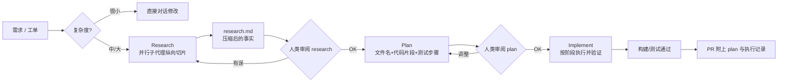

# 04｜No Vibes Allowed：在复杂代码库里用 Research → Plan → Implement 做“频繁有意压缩”

<a class="domain-tag" href="/#domain-planning">🧭 主题：需求澄清、规划与上下文管理</a>工具：Claude Code

**一句话看懂**：AI 在新项目里很好用，一进老代码库就开始返工。Dex Horthy 的解法是“先调研、再计划、后实现”，每一步都把结果压缩成一份文档，让上下文始终保持小而干净。

::: info 为什么值得看
标题里的 “No Vibes” 指的是反对 [Vibe Coding](/glossary#vibe-coding)：不看代码、凭感觉跟 AI 来回聊。这是 AI Engineer 大会上被引用最多的上下文工程演讲之一，配套的三条命令在 HumanLayer 仓库里开源，可以直接拿来用。
:::

::: tip 小白先懂这几个词
- [上下文窗口](/glossary#context-window)：模型一次能“看见”的内容上限。
- [Dumb Zone / Smart Zone](/glossary#dumb-zone)：上下文用到约 40% 后，模型效果开始变差。
- [子代理](/glossary#subagent)：在独立上下文里干活、只交回结论的“分身”。
- [Compaction（压缩）](/glossary#compaction)：把长对话浓缩成一份摘要再继续。
- [Brownfield](/glossary#brownfield)：有大量历史代码的存量项目。
- [Slash Command](/glossary#slash-command)：以 / 开头的自定义命令。
:::

> 信息来源：带时间戳的字幕全文（withtranscript.ai 镜像的 YouTube 字幕）+ 视频简介与章节 + HumanLayer 开源仓库 `humanlayer/humanlayer` 的 `.claude/commands/`（research / plan / implement 命令原文）。中文翻译为本站所加（鼠标悬停或点按带虚线的英文即可查看）。

## 1. 基本信息

<YouTube id="rmvDxxNubIg" title="No Vibes Allowed" />

| 项目 | 内容 |
|---|---|
| 链接 | https://www.youtube.com/watch?v=rmvDxxNubIg |
| 讲者 / 频道 | Dex Horthy（HumanLayer 创始人，“12 Factor Agents”作者）／ **AI Engineer**（AI Engineer Code Summit 演讲） |
| 发布日期 | 2025-12-02 |
| 时长 | 20:31 |
| 使用工具 | Claude Code（子代理、slash command）；方法论与工具无关，讲者提到也适用于 Codex、Cursor |
| 配套资料 | https://github.com/humanlayer/humanlayer/tree/main/.claude/commands |

## 2. 做了什么

讲者引用了 AI Engineer 6 月的一项调研（Igor 的演讲，约 10 万名开发者）：AI 在 greenfield 小项目上表现好，但在**棕地（brownfield）复杂代码库**里会产生大量返工。原话是<Trans zh="很多工作其实是在返工上周交付的 slop">“a lot of it is just reworking the slop that you shipped last week”</Trans>。

目标：让今天的模型在复杂棕地代码库里解决难题，做到“no slop”，同时保持团队的 **mental alignment**（心智对齐）。

涉及的场景：上下文工程、“规划 → 执行 → 验证”、用子代理控制上下文、大型项目（30 万行 Rust 代码库）。

## 3. 怎么做的

### 3.1 上下文是唯一的杠杆

**为什么重要**：模型的权重你改不了，你唯一能控制的就是喂给它什么。

::: tr 想让 LLM 表现更好，唯一的办法就是输入更好的 token，这样才能得到更好的 token 输出。
> "the only way to get better performance out of an LLM is to put better tokens in and then you get better tokens out."
:::

优化顺序：先避免**错误信息**，再避免**缺失信息**，最后避免**噪音**。还要注意**轨迹**：反复“骂”模型，会让它预测“我应该再犯错”。

### 3.2 Dumb zone：上下文用到约 40% 后效果递减

- 以 Claude Code 约 168k token 的窗口为例，<Trans zh="大约在 40% 这条线，你会开始看到收益递减">“Around the 40% line is where you're going to start to see some diminishing returns”</Trans>。这是经验线，因任务而异。
- MCP 装太多，会让你<Trans zh="一直在 dumb zone 里干活">“doing all your work in the dumb zone”</Trans>。

### 3.3 子代理用来控制上下文，而不是扮演角色

::: tr 子代理不是用来拟人化扮演角色的，而是用来控制上下文的。
> "Sub agents are not for anthropomorphizing roles. They are for controlling context."
:::

做法：让子代理在独立上下文里搜索、读文件，**只回传精简结论**（例如“你要的文件在这里”）。父代理读那一个文件就能开工。

### 3.4 Frequent Intentional Compaction：RPI 三阶段

**为什么重要**：与其等上下文满了被动压缩，不如在每个阶段结束时主动把成果写成文档，下一阶段从一个干净的会话开始。

<figure class="shot"><figcaption>📷 视频截图 · <a href="https://www.youtube.com/watch?v=rmvDxxNubIg&t=461s" target="_blank" rel="noopener">7:41</a> · 7:41 幻灯片<Trans zh="频繁有意压缩：围绕上下文管理来构建你的整个工作流">“Frequent Intentional Compaction — Building Your ENTIRE WORKFLOW around context management”</Trans>。</figcaption></figure>

| 阶段 | 做什么 | 产物 |
|---|---|---|
| Research | 理解系统如何工作、找到正确的文件、保持客观；启动子代理<Trans zh="沿代码库纵向切片">“take these vertical slices through the code base”</Trans> | research 文档：<Trans zh="我们在压缩事实">“We are compressing truth”</Trans> |
| Plan | 列出精确步骤，包含文件名、代码片段，写清每次改动后如何测试 | plan 文件：<Trans zh="意图的压缩">“compression of intent”</Trans> |
| Implement | 按 plan 执行，保持上下文低占用 | 代码 + 验证结果 |

<figure class="shot"><figcaption>📷 视频截图 · <a href="https://www.youtube.com/watch?v=rmvDxxNubIg&t=871s" target="_blank" rel="noopener">14:31</a> · 14:31 前后的 Research 阶段示意图：上下文里依次是系统指令、CLAUDE.md、内置工具、MCP 工具、用户的 /research_codebase 命令，以及 locator / analyzer / pattern-finder 等子代理，最后 Write() 出一份 300–1000 行的 research.md，此时上下文约用了 40%。</figcaption></figure>

配套仓库中的命令原文（节选）：

- `research_codebase.md`：

  ::: tr 你的任务是在整个代码库中开展全面调研：派出并行的子代理，综合它们的发现，来回答用户的问题。
  > "You are tasked with conducting comprehensive research across the codebase to answer user questions by spawning parallel sub-agents and synthesizing their findings."
  :::

  并强调：

  ::: tr 你唯一的工作是记录和解释代码库现在的样子。／不要提出改进建议……
  > "YOUR ONLY JOB IS TO DOCUMENT AND EXPLAIN THE CODEBASE AS IT EXISTS TODAY" / "DO NOT suggest improvements…"
  :::

- `create_plan.md`：

  ::: tr 你应该保持怀疑、做到周全，并与用户协作，产出高质量的技术规格说明。
  > "You should be skeptical, thorough, and work collaboratively with the user to produce high-quality technical specifications."
  :::

- `implement_plan.md`：

  ::: tr 执行 thoughts/shared/plans/ 目录中一份已批准的技术计划……这些计划按阶段划分，每个阶段都有具体改动和成功标准。
  > "implementing an approved technical plan from `thoughts/shared/plans/`… These plans contain phases with specific changes and success criteria."
  :::

### 3.5 Onboarding：按需压缩，而不是维护会过期的文档

- 在每个仓库放 onboarding 文档，会越写越长；分层放置（progressive disclosure，可以用 CLAUDE.md 或 hooks）能缓解，但**会过时**。
- 讲者展示的图：从代码 → 函数名 → 注释 → 文档，“谎言”越来越多。
- 他更推荐 **on-demand compressed context**（按需生成的压缩上下文）：给一点方向（“我们要改 SCM provider / Jira / Linear 相关部分”），由 research 命令现场生成一份“基于代码本身的真实快照”。

<figure class="shot"><figcaption>📷 视频截图 · <a href="https://www.youtube.com/watch?v=rmvDxxNubIg&t=666s" target="_blank" rel="noopener">11:06</a> · 11:06 前后，讲者谈“语义扩散”：幻灯片列出 An agent is a person / a microservice / a chatbot / a workflow / tools in a loop，同一个词每个人理解都不一样，“spec”也是如此。</figcaption></figure>

### 3.6 人读计划，而不是读每一行代码

**为什么重要**：代码审查的真正目的是让团队对系统演进保持一致的理解。读一份好计划，比读几千行代码更高效。

- 技术负责人读 plan 就能跟上系统演进；计划里放实际代码片段，能提高可预期性。
- 讲者原话：

::: tr 一行坏代码就是一行坏代码。计划里一处错误可能变成 100 行坏代码；而调研里一行错误……整件事都会完蛋。
> "a bad line of code is a bad line of code. And a bad part of a plan could be 100 bad lines of code and a bad line of research… your whole thing's going to be hosed."
:::

::: tr 别把思考外包出去……如果你不读计划，这套方法就不会奏效。
> "Don't outsource the thinking… It will not work if you do not read the plan."
:::

### 3.7 按难度选择流程强度

改按钮颜色 → 直接对话；小功能 → 简单 plan；跨多个仓库的中型功能 → 一次 research + plan；越难的问题，越需要更多压缩。讲者建议<Trans zh="选一个工具，多练几遍">“Pick one tool and get some reps”</Trans>，别在多个工具之间反复比较。

下图是按复杂度分流的 RPI 流程：

## 4. 结果如何

视频中给出的结果（均为讲者陈述）：

- 团队（3 人、花了 8 周改造流程）获得<Trans zh="2 到 3 倍的产出">“2 to 3x more throughput”</Trans>。
- 对 BoundaryML 的 **30 万行 Rust 代码库**一夜完成一个修复，对方 CTO 看过 PR 表示会进入下个版本。
- 与对方 CEO 一起用约 7 小时提交了 **35,000 行代码**（讲者承认部分是 codegen / golden files 更新），对方估计相当于 1–2 周的工作量；其中一个 PR 约一周后被合并。
- **失败案例**：尝试从 Parquet Java 移除 Hadoop 依赖<Trans zh="不顺利">“did not go well”</Trans>，最终推倒重来，回到白板设计。

<figure class="shot"><figcaption>📷 视频截图 · <a href="https://www.youtube.com/watch?v=rmvDxxNubIg&t=1179s" target="_blank" rel="noopener">19:39</a> · 19:39 前后的幻灯片：纵轴从 Hate AI 到 Love AI，两条曲线分别标注 Mid-Level 和 Senior+。讲者此时在谈团队和研发流程如何适应“99% 代码由 AI 交付”的文化转变。</figcaption></figure>

::: warning 局限与注意
- 调研和计划需要人认真读，否则无效。讲者原话：<Trans zh="没有完美的 prompt，也没有银弹。">“There is no perfect prompt. There is no silver bullet.”</Trans>
- 讲者自己也认为 RPI 这三个步骤名不重要，重要的是上下文工程和“留在 smart zone”。
- 成果数据都是讲者口述，没有独立测量。
:::

## 5. 可借鉴之处

1. **直接 fork HumanLayer 的命令**：把 `research_codebase.md`、`create_plan.md`、`implement_plan.md` 放进自己仓库的 `.claude/commands/`，按团队目录结构改写（例如 plans 的存放路径）。
2. **设置上下文警戒线**：上下文占用接近 40% 时，主动让 Agent 把进展压缩成 Markdown，再开新会话继续。
3. **子代理只回传“文件:行号 + 结论”**：在子代理的提示词里规定输出格式，禁止回传大段代码。
4. **评审重心前移**：Code review 规则加一条，较大改动的 PR 必须附 research / plan 链接，评审先看 plan。
5. **CLAUDE.md 少放会过期的系统描述**，多放“去哪里找真相”的指引，把系统理解交给每次任务的 research 阶段。

### 你可以这样试

- [ ] 复制 HumanLayer 的 `research_codebase.md` 到 `.claude/commands/`，对一个你不熟的模块运行 `/research_codebase`。
- [ ] 读完生成的 research.md，标出一处它说错的地方，体会“错误调研会污染后续所有步骤”。
- [ ] 开一个新会话，只喂这份 research.md，让 Agent 写 plan；你逐段审 plan 后再让它实现。
- [ ] 观察上下文占用，接近 40% 时停下来做一次压缩交接。

::: details 读完自测（点开看答案）
1. **讲者认为子代理的真正用途是什么？** 控制上下文：在独立窗口里搜索，只回传精简结论。
2. **为什么说“一行坏调研”比“一行坏代码”更危险？** 调研错了，计划和实现都会建立在错误事实上，整件事都会失败。
3. **讲者推荐用什么替代长期维护的 onboarding 文档？** 按需生成的压缩上下文：每次任务由 research 命令根据代码现场生成快照。
:::
