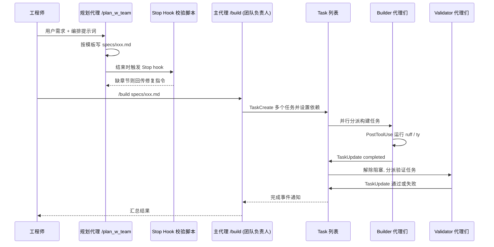

# 05｜Claude Code Task System：用模板元提示词 + Builder/Validator 代理团队自动构建与自检

<div class="hook">

**一句话看懂**：IndyDevDan 用 Claude Code 的 Task 系统搭了一个“一人写、一人查”的代理小队：规划命令按模板写出计划，主代理把任务分给 builder，每个 builder 做完后由只读的 validator 检查，全程靠 hooks 自动把关。

</div>

::: info 为什么值得看
这是少见的、把“多代理团队”拆到配置文件级别的实操视频，所有代理定义和 hooks 都在讲者的公开仓库里。看完你能直接复制 builder.md / validator.md 两个文件开始用。
:::

::: tip 小白先懂这几个词
- [Task 系统](/glossary#task-system)：主代理创建任务、设依赖、分派给子代理的机制。
- [Builder / Validator](/glossary#builder-validator)：一个代理写，另一个只读代理查。
- [Hooks](/glossary#hooks)：在固定时刻自动运行的检查脚本。
- [Front Matter](/glossary#front-matter)：Markdown 开头那段 YAML 配置。
- [Spec](/glossary#spec)：计划 / 需求文档。
- [Lint](/glossary#lint)：只读代码就能发现问题的检查工具。
:::

> 信息来源：YouTube 字幕（早期网页抓取的内容；整理本站时 YouTube 限制了字幕下载，没能重新获取全文，只有部分段落经搜索引擎收录的字幕片段再次核对）+ 视频简介 + 讲者公开仓库 `disler/claude-code-hooks-mastery`（`.claude/commands/plan_w_team.md`、`.claude/agents/team/builder.md`、`validator.md` 原文）+ 本次新增的视频画面截图。标注“转述”的内容不是逐字原话。中文翻译为本站所加。

## 1. 基本信息

| 项目 | 内容 |
|---|---|
| 链接 | https://www.youtube.com/watch?v=4_2j5wgt_ds |
| 讲者 / 频道 | IndyDevDan（独立工程师，长期做 Claude Code 实战演示）／ **IndyDevDan** |
| 发布日期 | 2026-02-02 |
| 时长 | 28:26 |
| 使用工具 | Claude Code（Opus、Task 系统：TaskCreate / TaskGet / TaskList / TaskUpdate）、Hooks（Stop、PostToolUse、SubagentStop）、自定义子代理、ruff / ty、uv |
| 配套仓库 | https://github.com/disler/claude-code-hooks-mastery |

## 2. 做了什么

讲者指出：普通的子代理调用之间没有共同的任务列表、没有任务依赖，也没法互相告知是否完成。Agent 越多，不等于结果越好。

**目标**：用 Claude Code 新的 Task 系统，把“规划 → 组队 → 并行构建 → 独立验证”封装成一个**可以反复运行的元提示词**。

**演示任务**：更新讲者 5–6 个月没维护的 `claude-code-hooks-mastery` 仓库，为新的 hook 类型（SessionEnd、PermissionRequest、PostToolUseFailure、Setup 等）补实现和文档。

涉及的场景：多代理团队自动构建、测试、审查自己的代码；用 Hooks 做自我验证。

## 3. 怎么做的

### 3.1 两段式：`/plan_w_team` 生成计划 → `/build` 执行

**为什么重要**：把“想清楚”和“动手做”拆成两条命令，计划文件就成了可以审阅、可以复用的中间产物。

调用时传入两个 prompt：**用户需求** + **编排提示词**。视频中使用的编排提示词（原文见仓库 README 的 Workflow Example）：

> "Create groups of agents for each hook, one builder and one validator"

<div class="tr">为每个 hook 建一组代理：一个 builder，一个 validator。</div>

### 3.2 元提示词的三个组成部分

视频简介原文把这个元提示词概括为：“three powerful components: self-validation (agents checking their own work), agent orchestration (conducting teams of subagents), and templating (teaching agents to build as you would)”。

<div class="tr">三个强大的组成部分：自我验证（代理检查自己的工作）、代理编排（指挥一队子代理）、模板化（教代理按你的方式来构建）。</div>

**① 自我验证：Stop hook 写在 front matter 里**

**为什么重要**：在提示词里写“记得包含验收标准”，模型可能忘；用脚本检查，没写就打回，100% 可靠。

仓库原文：

```yaml
disallowed-tools: Task, EnterPlanMode
hooks:
  Stop:
    - hooks:
        - type: command
          command: >-
            uv run $CLAUDE_PROJECT_DIR/.claude/hooks/validators/validate_new_file.py
            --directory specs
            --extension .md
        - type: command
          command: >-
            uv run $CLAUDE_PROJECT_DIR/.claude/hooks/validators/validate_file_contains.py
            --directory specs
            --extension .md
            --contains '## Task Description'
            --contains '## Objective'
            --contains '## Relevant Files'
            --contains '## Step by Step Tasks'
            --contains '## Acceptance Criteria'
            --contains '## Team Orchestration'
            --contains '### Team Members'
```

<div class="tr">配置大意：禁止这个规划代理使用 Task 和 EnterPlanMode 工具；它准备结束（Stop）时，依次运行两个检查脚本：第一个确认 specs/ 目录下新建了 .md 文件；第二个确认文件里包含“任务描述、目标、相关文件、分步任务、验收标准、团队编排、团队成员”这些章节标题。</div>

规划代理结束时，脚本检查 `specs/` 下是否新建了 `.md` 且包含所有必需章节；不满足，就把指令回传给规划代理继续修。

**② 代理编排**

提示词里的 Team Orchestration 段落规定团队负责人：

> "You NEVER write code directly - you orchestrate team members using these tools"

<div class="tr">你绝不直接写代码，你用这些工具来编排团队成员。</div>

它通过 TaskCreate / TaskUpdate / TaskList / TaskGet 分派任务、设置依赖和阻塞关系。

**③ 模板化**

计划格式里嵌入了占位提示，生成的 spec 结构固定（任务描述、目标、相关文件、分步任务、验收标准、团队成员）。讲者称之为“template metaprompt”，意思是一个按固定格式生成另一个 prompt 的 prompt（转述）。

### 3.3 最小可用团队：Builder + Validator

**为什么重要**：让写代码的代理自己检查自己，很容易“顺手改掉问题然后说没问题”。把检查交给一个**物理上不能写文件**的代理，审查才可信。

仓库里的两个代理定义（节选原文）：

- `builder.md`：

  > "You are a focused engineering agent responsible for executing ONE task at a time… Do NOT spawn other agents or coordinate work. You are a worker, not a manager."

  <div class="tr">你是一个专注的工程代理，一次只负责执行一个任务……不要派生其他代理，也不要协调工作。你是干活的，不是管事的。</div>

  它还挂了 **PostToolUse hook**：每次 `Write|Edit` 之后运行 `ruff_validator.py` 和 `ty_validator.py`（微观自检）。

- `validator.md`：

  > "Read-only validation agent… You CANNOT modify files"

  <div class="tr">只读的验证代理……你不能修改文件。</div>

  front matter 设置 `disallowedTools: Write, Edit, NotebookEdit`。

讲者原话：

> "An agent that does the work and an agent that checks the work. I'm 2xing the compute for every single task."

<div class="tr">一个代理干活，一个代理检查。我给每个任务都投入了双倍的算力。</div>


<figure class="shot"><figcaption>📷 视频截图 · <a href="https://www.youtube.com/watch?v=4_2j5wgt_ds&t=213s" target="_blank" rel="noopener">3:33</a> · 3:33 前后，主代理创建任务并设置依赖后，一次并行启动 6 个 builder 执行 Phase 1；任务列表里 “Validate … Hook” 都标着“blocked by #1/#2…”，要等对应的 builder 完成才解锁。</figcaption></figure>

### 3.4 Task 系统比旧的 to-do 工具强在哪（字幕要点）

- 任务可以有**顺序、阻塞、依赖**；
- 子代理完成后**主动回报**给主代理，主代理不需要再写 bash / sleep 循环去轮询（转述）；
- 主代理和子代理通过 TaskUpdate 交换状态，能支撑更长的工作线程；
- 每个代理只有聚焦的上下文窗口；
- SubagentStop hook 里接入了 TTS（语音合成），每个子代理完成时语音播报摘要。

下图是一次完整运行中各角色之间的交互：




<figure class="shot"><figcaption>📷 视频截图 · <a href="https://www.youtube.com/watch?v=4_2j5wgt_ds&t=1634s" target="_blank" rel="noopener">27:14</a> · 27:14 前后，讲者的总结图“Multi-Agent Task System”：工程师 → 两个 Agent → 中间的任务列表 → 右侧的 Agent Team。</figcaption></figure>

## 4. 结果如何

- 讲者称并行设置下大约 2 分钟完成全部构建（转述）。画面上的终端显示“Worked for 2m 6s”，汇总写着 hooks 总数 13 个（原为 8 个）、status line 9 个（原为 4 个），README 文档和 settings.json 已更新（见下图）。
- `git diff` 显示新增 SessionEnd、PermissionRequest、SubagentStart、Setup 等 hook，以及日志文件、status line、README 文档与 settings 的更新。
- 讲者认为这对 Opus 来说是相对简单的任务（转述）。


<figure class="shot"><figcaption>📷 视频截图 · <a href="https://www.youtube.com/watch?v=4_2j5wgt_ds&t=781s" target="_blank" rel="noopener">13:01</a> · 13:01 前后的完成汇总：语音播报“Dan, I&#x27;ve completed the hooks codebase update…”，下方列出 13 total hooks (was 8)、9 total status lines (was 4)，底部显示 Worked for 2m 6s。</figcaption></figure>

::: warning 讲者自曝的不足
- Validator 只做了 Python 编译检查。讲者承认这里错过了一个机会（转述）：本可以让每个 validator 用 `claude -p` 实际触发 hook，再检查 `logs/` 下的日志，形成更紧的闭环。
- 没有成本 / token 数据。
- 画面里能看到当时开着 “bypass permissions on”，即跳过权限确认，自己尝试时最好在隔离分支里跑。
:::

## 5. 可借鉴之处

1. **复制 builder / validator 两个代理文件**到自己项目的 `.claude/agents/`，把 PostToolUse 里的 ruff / ty 换成你的 lint / typecheck（如 `eslint`、`tsc --noEmit`）。
2. **Validator 必须只读**：用 `disallowedTools` 从机制上禁止写入，避免“自己审自己、顺手改掉”。
3. **给“产出计划”的命令加 Stop hook**：校验计划文件存在且包含必需章节（验收标准、测试方式），比在提示词里反复强调更可靠。
4. **编排提示词和需求分开传**：同一个元提示词，换不同的编排提示词（“每个模块一个 builder + 一个 validator”／“先 research 再 build”），就能复用到不同任务。
5. **验证要接近真实运行**：吸取讲者自述的教训，Validator 应该实际运行功能（如用 `claude -p` 触发、跑集成测试），而不只是编译通过。

### 你可以这样试

- [ ] 从 `disler/claude-code-hooks-mastery` 复制 `builder.md`、`validator.md` 到 `.claude/agents/team/`。
- [ ] 把 validator 的 front matter 确认为 `disallowedTools: Write, Edit, NotebookEdit`。
- [ ] 让主代理用“每个任务一个 builder + 一个 validator”的编排提示词做一个小功能，观察 validator 是否真的被阻塞到 builder 完成之后。
- [ ] 给 validator 加一条要求：必须实际运行一次功能（测试或命令），并贴出输出。

::: details 读完自测（点开看答案）
1. **为什么 validator 要用 disallowedTools 禁止写入？** 防止它“发现问题顺手改掉再说没问题”，保证审查独立。
2. **Stop hook 在这里检查什么？** 规划代理结束时，检查 specs/ 下是否新建了计划文件，且包含所有必需章节。
3. **讲者自认哪里做得不够？** validator 只做了编译检查，没有实际运行 hook 验证。
:::
