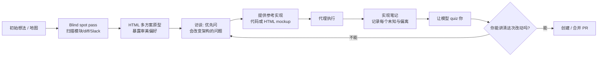

# 06｜Field Guide to Fable：解除模型束缚、找出你的“未知”、保持人在回路

<a class="domain-tag" href="/guide/planning">阶段：2 做规划 · 需求澄清与任务拆解</a>类型：视频工具：Claude Code

**一句话看懂**：模型越强，越会走到你没交代过的地方。Thariq 给出两件事：给 harness 做减法，别用旧规矩捆住新模型；动手前用五种手法挖出需求盲区，做完后让模型反过来考你。

::: info 为什么值得看
讲者来自 Claude Code 团队，透露了“Claude Code 删掉 80% system prompt”这样的一手信息。更实用的是“找未知”的五种手法，每一种都有可以照抄的 prompt，幻灯片上还给出了原文。
:::

::: tip 小白先懂这几个词
- [System Prompt](/glossary#system-prompt)：工具在每次对话前塞给模型的“岗位说明书”。
- [Unhobbling](/glossary#unhobbling)：模型能力够了，只是被工具或提示词限制住。
- [Unknown Unknowns](/glossary#unknown-unknowns)：你没意识到自己不知道的事。
- [Blind Spot Pass](/glossary#blind-spot-pass)：动手前让代理扫一遍，告诉你没想到的问题。
- [人在回路](/glossary#human-in-the-loop)：关键节点必须由人理解、确认。
- [模型名称](/glossary#model-names)：Fable、Opus 等都是 Claude 系列的模型名。
:::

> 信息来源：AI Engineer 官方讲稿页（ai.engineer/talks/9fubhllmsBU，含完整时间戳文字稿）+ YouTube 视频简介与章节 + 本次新增的幻灯片截图。英文引号内容均为文字稿或幻灯片原话，中文翻译为本站所加（鼠标悬停或点按带虚线的英文即可查看）。

## 1. 基本信息

<YouTube id="9fubhllmsBU" title="Field Guide to Fable" />

| 项目 | 内容 |
|---|---|
| 链接 | https://www.youtube.com/watch?v=9fubhllmsBU |
| 讲者 / 频道 | Thariq Shihipar（Anthropic，Claude Code 团队）／ **AI Engineer** |
| 发布日期 | 2026-07-06 |
| 时长 | 19:28 |
| 使用工具 | Claude Code（Fable 模型、AskUserQuestion、Bash、HTML 报告产物）、Claude Tag |
| 形式 | 大会主题演讲（经验方法论，无现场编码） |

章节：0:00 引子 → 2:32 Unhobbling Claude → 9:08 找出未知：地图与疆域 → 14:29 编程方式变化带来的情绪 → 16:30 Being unreasonable。

## 2. 做了什么

新一代模型（演讲中的 Fable）能独立穿越更大的问题空间。这也意味着它会碰到更多**你没在 prompt 或 spec 里说明的决策点**。同时，为旧模型设计的 harness 和 prompt，反而可能束缚新模型。

讲者给出一套和“更强、更自主”的编码代理协作的方法：

- 怎样给 harness 做减法；
- 怎样在动手前挖出需求盲区；
- 怎样在执行中和执行后，保持人对产物的理解。

对应“规划 → 执行 → 验证”循环里的**规划前置**和**事后核对**。

## 3. 怎么做的

### 3.1 Unhobbling：harness 决定了模型能力能用出来多少

讲者用 Pokémon 的例子说明 capability overhang（能力过剩）：聊天模型答不出“哪些 Pokémon 名字以 A-W 结尾”，Claude Code 却会去抓取全部名字，再写脚本过滤。

::: tr 如果你给它代码执行工具，它就能找出那两个名字以 A-W 结尾的 Pokémon，对吧？
> "if you give it the code execution tool, it can find the two Pokémon that end with A-W, right?"
:::

编码也一样：靠的不是把整个代码库塞进超长上下文，而是给模型 Bash 等工具，让它<Trans zh="自己构建、搜索上下文">“build and search its own context”</Trans>。

<figure class="shot"><figcaption>📷 视频截图 · <a href="https://www.youtube.com/watch?v=9fubhllmsBU&t=340s" target="_blank" rel="noopener">5:40</a> · 5:40 前后的幻灯片“The evolution of agents”：Chat（必须喂给它上下文）→ Claude Code（有了执行的手臂）→ Claude Tag（主动行动）。</figcaption></figure>

### 3.2 给 system prompt 做减法

**为什么重要**：示例和禁令是给旧模型的拐杖。新模型的想象力比你给的示例更大，示例反而把它框住了。

::: tr 我们最近把 Claude Code 的系统提示词删掉了 80%。
> "we recently removed 80% of the system prompt for Claude Code"
:::

::: tr 示例往往会限制它，因为它其实比我们给的示例更有想象力。
> "The examples tend to constrain it, 'cause it's actually more imaginative than the examples we give it."
:::

做法：给**上下文**而不是**约束**。讲者原话：“We really try and avoid being like, "Do not do this,"”（我们真的尽量避免写“不要做这个”这种话）。

AskUserQuestion 工具的演进也被拿来说明这一点：从 Opus 4 时代<Trans zh="勉强能调用">“could barely call it”</Trans>，到 Opus 4.5 可以<Trans zh="就这份 spec 问我 40 个问题">“ask me 40 questions about this spec”</Trans>，再到 Opus 4.8 / Fable 可以生成内嵌问题的 HTML 报告。

<figure class="shot"><figcaption>📷 视频截图 · <a href="https://www.youtube.com/watch?v=9fubhllmsBU&t=438s" target="_blank" rel="noopener">7:18</a> · 7:18 前后的幻灯片“AskUserQuestion”：Could call it（能调用）→ Could interview you（能采访你）→ Could build the interview（能把访谈本身做成页面）。</figcaption></figure>

### 3.3 地图不是疆域：用四象限找“未知”

**为什么重要**：代理走偏，往往是因为碰到了你脑子里有、但没写下来的东西。先把这些挖出来，比事后返工便宜得多。

- **地图**：你脑中的 plan / prompt / spec；**疆域**：真实的代码库和约束。
- 代理在疆域里遇到地图上没写的决策点，就是 unknown。讲者把问题分成四类：known knowns（写进 prompt 的）、known unknowns（知道自己不知道的）、unknown knowns（“so obvious that I just wouldn't write it down”，显然到我根本不会写下来的）、unknown unknowns（不知道自己不知道的）。

用代理自己来挖未知，讲者给出五种手法：

| 手法 | 针对的未知 | 讲者原话 / 做法 |
|---|---|---|
| Blind spot pass | unknown unknowns | <Trans zh="你能做一次盲区扫描，帮我找出相关的“未知的未知”，帮我把 prompt 写得更好吗？">“can you do a blind spot pass to help me figure out my relevant unknown unknowns and help me prompt better?”</Trans>（可以让它查 auth 模块、Git diff、Slack） |
| 头脑风暴 + 原型 | unknown knowns | <Trans zh="给我做一个 HTML 页面，放 4 个截然不同的设计决策，让我看了再反应。">“make me an HTML page with four wildly different design decisions so I can react to them”</Trans> |
| 访谈 | 未说明的决策 | 让 Claude 采访你，并提示<Trans zh="优先问那些会改变架构的问题。">“prioritize questions that would change the architecture”</Trans> |
| 参考实现 | 需求表达不清 | <Trans zh="给 Claude 一张地图的最好办法之一，是给它另一张地图。">“One of the best ways to give Claude a map is to give it another map”</Trans>，给现有代码或 HTML mockup |
| 实现笔记 | 执行中的偏离 | 遇到未知时<Trans zh="让它记录下来。">“ask it to log it”</Trans> |

幻灯片上还给出了两条更完整的 prompt：

::: tr 我想为这份数据做一个仪表盘，但我没什么审美，也不知道有哪些可能。给我做一个 HTML 页面，放 4 个截然不同的设计方向，让我看了再反应。
> “I want a dashboard for this data but I have no visual taste and don't know what's possible. Make me an HTML page with 4 wildly different design directions so I can react to them.”
:::

::: tr 维护一个 implementation-notes.md 文件。如果遇到边界情况、不得不偏离计划，就选保守的方案，把它记在“Deviations（偏离）”一节下，然后继续干。
> “Keep an implementation-notes.md file. If you hit an edge case that forces you to deviate from the plan, pick the conservative option, log it under 'Deviations', and keep going.”
:::

<figure class="shot"><figcaption>📷 视频截图 · <a href="https://www.youtube.com/watch?v=9fubhllmsBU&t=730s" target="_blank" rel="noopener">12:10</a> · 12:10 前后的幻灯片“Brainstorms and prototypes”：用 4 个差异很大的 HTML 设计方向来暴露你自己说不清的审美偏好。</figcaption></figure><figure class="shot"><figcaption>📷 视频截图 · <a href="https://www.youtube.com/watch?v=9fubhllmsBU&t=827s" target="_blank" rel="noopener">13:47</a> · 13:47 前后的幻灯片“Implementation notes”：遇到计划外的边界情况，选保守方案、记到 Deviations 下、继续执行。</figcaption></figure>

最后一步，让模型**反过来考你**：

::: tr 让 Fable 就发生了什么来考考我……确保我理解自己在做什么，在创建或合并 PR 时能为这份工作负责、讲得清楚。
> "Fable to quiz me about what happened … just to make sure I understand what I'm doing and I can represent this work, you know, when I'm creating a PR or merging it."
:::

下图把这五种手法和“被考”串成一条流程：

### 3.4 Being unreasonable

讲者认为强模型改变了取舍：<Trans zh="好、快、便宜，以前三选二，现在三个都要">“good, fast, cheap. Now it's pick three”</Trans>。但他也提醒：<Trans zh="构建变容易了，但创造价值依然很难">“building is easier, but generating value is still hard”</Trans>。

## 4. 结果如何

- **可核实的陈述**：Claude Code 删掉了 80% 的 system prompt；讲者称本次演讲的幻灯片<Trans zh="用 Fable 大约四小时">“in about four hours with Fable”</Trans>完成；回到旧创业项目时，<Trans zh="以前要几周的事，现在几小时就能做完">“the things that would have taken me weeks I could do in hours”</Trans>。
- **没有给出**：任何基准数据、缺陷率、团队级效率指标。上面的数字都是讲者个人陈述。

::: warning 局限与注意
- 讲的是 Fable 这一代模型的体验。换用较弱的模型，“少约束、少示例”未必成立。讲者自己也说这更像<Trans zh="更像生物学而不是物理学">“biology than a physics”</Trans>，需要靠实验。
- 没有现场演示，具体 prompt 只有片段级原话和幻灯片文字，需要自己落地成模板。
:::

## 5. 可借鉴之处

1. **开工前固定跑一次 blind spot pass**：把“你在这块代码里最可能踩的坑是什么？我应该补充哪些信息？”写成一个 slash command 或 skill，作为大任务的第一步。
2. **把 UI 需求变成“四个差异很大的 HTML 方案”**：用来对齐审美和交互，比写长文 spec 更快暴露分歧。
3. **访谈 prompt 加上优先级**：明确要求“先问会改变架构的问题”，避免代理问一堆无关紧要的细节。
4. **执行中强制写 implementation notes**：直接用幻灯片上的那条 prompt，或在 CLAUDE.md / AGENTS.md 里约定“遇到 spec 没覆盖的决策时，记到 `implementation-notes.md` 的 Deviations 下：决策点、选项、你的选择、理由”。
5. **PR 前加一个 quiz 环节**：让代理出 3–5 道关于本次改动的题，自己答不上来就不合并。这是“人在回路”的低成本实现。
6. **定期给 CLAUDE.md / system prompt 做减法**：模型升级后，删掉“禁止 X”式的旧约束和过拟合的示例，观察行为是否变好。

### 你可以这样试

- [ ] 下一个任务开工前，先发：“can you do a blind spot pass to help me figure out my relevant unknown unknowns?”
- [ ] 把 implementation-notes 那条 prompt 原样加进 CLAUDE.md。
- [ ] 任务结束后发：<Trans zh="就你刚才的改动出 5 道题考我。">“Quiz me with 5 questions about what you just changed.”</Trans>
- [ ] 在 CLAUDE.md 里找出所有“不要 / 禁止”开头的句子，改写成“背景 + 原因”的形式。

::: details 读完自测（点开看答案）
1. **“地图”和“疆域”分别指什么？** 地图是你脑中的计划和 prompt，疆域是真实的代码库和约束。
2. **为什么 Claude Code 删掉了 80% 的 system prompt？** 示例和禁令会限制新模型，它比示例更有想象力。
3. **implementation notes 要记录什么？** 偏离计划的边界情况：选了保守方案，并记在 Deviations 下。
:::
