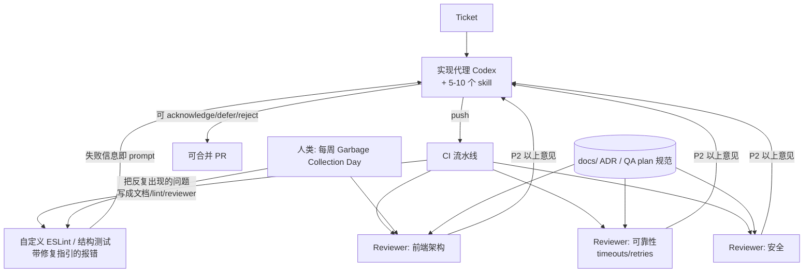

# 07｜Harness Engineering：人类掌舵、代理执行（Ryan Lopopolo, OpenAI）

<a class="domain-tag" href="/guide/foundation">阶段：打地基 · 上下文与规范</a>类型：视频工具：Codex

**一句话看懂**：OpenAI 的 Ryan Lopopolo 禁止团队成员碰编辑器，所有代码都由 Codex 写。他们把精力花在 harness 上：把团队标准变成 lint、结构测试和 CI 里的 reviewer agent，让代理在正确的时机看到正确的规矩。

::: info 为什么值得看
这是目前最激进的“人不写代码”团队实践之一，而且讲得很具体：750 个包的仓库怎么组织、lint 报错怎么写、reviewer agent 的提示词怎么写、每周五怎么“收垃圾”。适合已经用过代理、想把它规模化的团队。
:::

::: tip 小白先懂这几个词
- [Harness](/glossary#harness)：包在模型外面、管工具和上下文的那层程序。
- [AGENTS.md](/glossary#agents-md)：Codex 读取的项目说明文件。
- [Compaction](/glossary#compaction)：上下文快满时把旧内容压缩成摘要。
- [Lint](/glossary#lint)：只读代码就能发现问题的静态检查。
- [Persona](/glossary#persona)：给某类 reviewer 代理预设的角色配置。
- [Monorepo](/glossary#monorepo)：很多包放在同一个仓库里。
- [Slop](/glossary#slop)：看似能跑、实则质量差的 AI 产出。
:::

> 信息来源：AI Engineer 官方讲稿页（ai.engineer/talks/am_oeAoUhew，含完整时间戳文字稿，包括演讲后 Q&A）+ YouTube 视频简介（指向 OpenAI 博客 *Harness engineering*）。英文引号内容均为文字稿原话，中文翻译为本站所加（鼠标悬停或点按带虚线的英文即可查看）。

## 1. 基本信息

<YouTube id="am_oeAoUhew" title="Harness Engineering" />

| 项目 | 内容 |
|---|---|
| 链接 | https://www.youtube.com/watch?v=am_oeAoUhew |
| 讲者 / 频道 | Ryan Lopopolo（OpenAI Member of Technical Staff），Q&A 主持 Vibhu Sapra ／ **AI Engineer**（AI Engineer Europe 2026，伦敦） |
| 发布日期 | 2026-04-16 |
| 时长 | 46:20（主题演讲约 18 分钟 + Q&A） |
| 使用工具 | Codex（GPT-5.4、auto compaction、skills、reviewer agents）、pnpm workspace、自定义 ESLint、Chrome DevTools、本地可观测性栈 |
| 延伸 | 同一讲者在 Latent Space 播客的长访谈：https://www.youtube.com/watch?v=CeOXx-XTYek（含 Symphony 编排器，本文未单独分析） |

## 2. 做了什么

讲者<Trans zh="禁止团队成员碰编辑器">“banning my team from even touching their editors”</Trans>，所有代码都必须通过代理完成。

这带来两个问题：当写代码不再稀缺，瓶颈变成了什么？怎样让代理产出“能被合并”的代码，而不是 slop？

**目标**：把团队的工程标准变成代理看得见、CI 能强制执行的 harness，让人从同步写代码、审代码里抽身。

涉及的场景：大型仓库（750 个 pnpm 包）、多代理审查、上下文工程、与 CI 集成、长时任务。

## 3. 怎么做的

### 3.1 先认清稀缺资源

::: tr 在我们今天看到的这个世界里，稀缺资源有三样：人的时间、人和模型的注意力、模型的上下文窗口。
> "The scarce resources in this world that we see today are three things: human time, human and model attention, and model context window."
:::

推论：P3 级的小需求也可以<Trans zh="立刻开工，也许同时开 4 份，我们挑一个解决了问题的">“kicked off immediately, maybe 4X in parallel. We pick one that solves the problem”</Trans>。

<figure class="shot"><figcaption>📷 视频截图 · <a href="https://www.youtube.com/watch?v=am_oeAoUhew&t=347s" target="_blank" rel="noopener">5:47</a> · 5:47 前后的幻灯片：三张卡片分别写着 Human time、Human and model attention、Model context window，即讲者说的三种稀缺资源。</figcaption></figure>

### 3.2 把非功能性需求写下来，并让它“自动回到上下文里”

**为什么重要**：一个 patch 背后有<Trans zh="500 个小决定">“500 little decisions”</Trans>，代理默认不知道你团队的选择。而 auto compaction 会把早期指令挤出上下文，所以**只靠 AGENTS.md 不够**，要持续<Trans zh="刷新上下文">“refresh context”</Trans>。

| 机制 | 例子（讲稿原述） |
|---|---|
| CI 中的 reviewer agents | <Trans zh="代码库里的安全与可靠性审查代理，作为 CI 的一部分在每次 push 时持续运行">“security and reliability review agents in our code base that are continually running as part of every push in CI”</Trans>，检查网络代码有没有 timeouts 和 retries |
| 仓库专属 lint | 对每次 `fetch` 调用检查是否包了 retry 和 timeout |
| 针对源码的结构测试 | <Trans zh="一个限制文件不超过 350 行的测试">“a test that limits the fact that files are no longer than 350 lines”</Trans> |
| 带修复指引的错误信息 | lint 失败时直接告诉模型<Trans zh="我们在边界处做解析，而不是做校验">“we parse, don't validate at the edge”</Trans> |
| QA plan 规范 | 一位产品型工程师写好“如何写 QA plan”，review agent 据此要求 PR 附上相应证据 |

::: tr 我今天讲的一切都是 prompt。你完全不用碰模型权重就能做到。
> "Everything I've talked about here today is a prompt. You can do this without touching the model weights at all."
:::

<figure class="shot"><figcaption>📷 视频截图 · <a href="https://www.youtube.com/watch?v=am_oeAoUhew&t=1042s" target="_blank" rel="noopener">17:22</a> · 17:22 前后的幻灯片<Trans zh="你直接写 prompt 就行">“You can just prompt things.”</Trans>，对应上面这句总结。</figcaption></figure>

### 3.3 Just-in-time 上下文：先让代理探索，再在 lint / test 阶段施加约束

**为什么重要**：一开始就把所有规矩塞进 prompt，会占满上下文、限制探索。等代码写出来，再在 lint 和测试时把规矩“递”过去，时机刚好。

::: tr harness 该做的，就是在正确的时机把指令呈现给模型。
> "All the harness should do is surface instructions to the model at the right time."
:::

React 的例子：先让代理自由做 UI 原型，到 lint / test 时再要求<Trans zh="把它拆开，让组件尽可能小、尽可能无状态">“break this apart so that your components are small and as stateless as possible”</Trans>。

### 3.4 Codex 是入口：用 5–10 个 skill 包住本地开发设施

- 工作从 ticket 开始，交给代理 + 少量 skill：启动 App、拉起本地可观测性栈、挂载 Chrome DevTools。
- 讲者原话：<Trans zh="我们把杠杆集中在 5 到 10 个 skill 上">“we kinda centralize our leverage around 5 to 10 skills”</Trans>。底层工具换了（从直接用 CDP 换成 daemon），代理照常工作，讲者三周后才发现。

### 3.5 仓库结构就是 prompt

- 从单包 Electron 应用演进到<Trans zh="pnpm workspace 里有 750 个包，按业务领域或技术栈层次隔离">“750 packages in the pnpm workspace, isolated by business logic domain or layer of the stack”</Trans>。
- 一致性原则：<Trans zh="有界并发的 helper 应该只有一种写法……ORM 也应该只有一个">“you should have one way to, like, do a bounded concurrency helper … You should have one ORM”</Trans>。

### 3.6 审查流程：Garbage Collection Day + Persona reviewer

**为什么重要**：每个工程师每天 3–5 个 PR，合并冲突和等人工 review 成了瓶颈。必须让大部分审查自动化，并让同类问题不再出现第二次。

- 每周五是 “Garbage Collection Day”：把一周里阻碍合并的 slop 归类，变成文档、测试或 reviewer agent。
- 按 persona（前端架构、可靠性、可扩展性）各建一个 review agent，每次 push 触发：

::: tr 根据这些描述“什么是好代码”的文档，找出任何会阻止这个 PR 合并的 P2 及以上级别的问题。
> "Surface any P2s or above that would block this PR from merging based on these documentation that says what good looks like."
:::

- 但别让 reviewer <Trans zh="欺负">“bully”</Trans>实现代理：实现代理可以<Trans zh="接受、推迟或拒绝任何反馈">“acknowledge, defer, or reject any feedback”</Trans>。

下图是这套 harness 的结构：ticket 进来，实现代理写代码，CI 里的 lint 和多个 persona reviewer 把关，人每周把反复出现的问题沉淀回规则。

<figure class="shot"><figcaption>📷 视频截图 · <a href="https://www.youtube.com/watch?v=am_oeAoUhew&t=2200s" target="_blank" rel="noopener">36:40</a> · 36:40 Q&amp;A 环节，屏幕字幕条为<Trans zh="代码审查会变成什么样">“What happens to Code Review”</Trans>。</figcaption></figure><figure class="shot"><figcaption>📷 视频截图 · <a href="https://www.youtube.com/watch?v=am_oeAoUhew&t=2432s" target="_blank" rel="noopener">40:32</a> · 40:32 Q&amp;A 环节“1B tokens breakdown”：讲者解释每天十亿级 token 的用量分布。</figcaption></figure>

### 3.7 关于计划和起步

- 讲者几乎不用 plan mode（用过 ExecPlans）。如果要用计划，就<Trans zh="把计划单独作为一个只含计划的 PR 推上去，让人逐行审">“push those up as single PRs with just the plan, where you actually have human review every line of it”</Trans>。
- 起步建议：先让代理给现有行为补测试；再看自己的时间花在哪（写代码、等 CI、等 review、flaky test），逐个自动化。

## 4. 结果如何

- **讲者自述数据**：团队每个工程师每天 3–5 个 PR；仓库 750 个包；token 用量<Trans zh="各占三分之一">“a third, a third, a third”</Trans>，分布在规划 / 工单 / 文档、实现、CI 三部分。主持人介绍他每天消耗超过十亿输出 token（主持人口述，不是讲者给出的度量）。
- **定性结果**：通过 Garbage Collection Day 持续沉淀，<Trans zh="我们看到 slop 一点点减少">“we started to see slop reduced, reduced, reduced”</Trans>。

::: warning 局限与讲者承认的短板
- 构建产物的 QA 冒烟测试最初很弱，<Trans zh="没有文档，也没有工具">“There were no docs. There were no tools”</Trans>。每进入一个新的生命周期环节，都要重新补工具和验收标准。
- 前期要接受短期降速（“short-term velocity hits”）来搭 guardrail。
- 讲者有充足的 token 和算力，团队规模小（提到“a team of three”，三人团队）。普通团队需要按预算缩放。
:::

## 5. 可借鉴之处

1. **把一条评审意见当成一个“待修复的 harness bug”**：同类意见出现第二次，就转成 lint、结构测试或 reviewer 规则，而不是再评论一次。
2. **lint 报错写成给代理看的修复指引**：报错里写清“应该怎么写、为什么”，等于在正确时机注入 prompt。
3. **按 persona 建 reviewer agent，挂到每次 push**：只报 P2 及以上，并允许实现代理拒绝意见，避免无休止返工。
4. **给仓库加“针对源码的测试”**：文件行数上限、包依赖方向、禁止重复的 Zod schema、统一 helper。这些对代理比对人更重要。
5. **少而精的 skill**：围绕“启动 App / 可观测性 / 浏览器调试”做 5–10 个高质量 skill，把易变的工具细节藏在 skill 里面。
6. **计划要么认真审，要么别要**：重要计划单独提 PR 逐行审；否则给足信息的 ticket 直接执行。
7. **起步顺序**：补测试 → 自动化最耗人时间的环节 → 再扩展到 QA、事故分诊、运行手册。

### 你可以这样试

- [ ] 翻一翻最近 10 条 code review 意见，找出出现两次以上的同类问题，写成一条 lint 规则或测试。
- [ ] 把一条现有 lint 的报错文案改成“应该怎么写 + 为什么”，观察代理修复的成功率。
- [ ] 加一个“单文件不超过 N 行”的测试，让代理自己去拆分大文件。
- [ ] 写一个只读的 reliability reviewer 提示词（参考上面那句 “Surface any P2s or above…”），在 CI 里对每个 PR 跑一次。

::: details 读完自测（点开看答案）
1. **为什么只靠 AGENTS.md 不够？** auto compaction 会把早期指令挤出上下文，需要通过 lint、测试、reviewer 在合适时机重新注入。
2. **Garbage Collection Day 做什么？** 每周五把阻碍合并的问题归类，沉淀成文档、测试或 reviewer agent。
3. **为什么允许实现代理拒绝 reviewer 的意见？** 避免 reviewer “欺负”实现代理，造成无休止的返工。
:::
