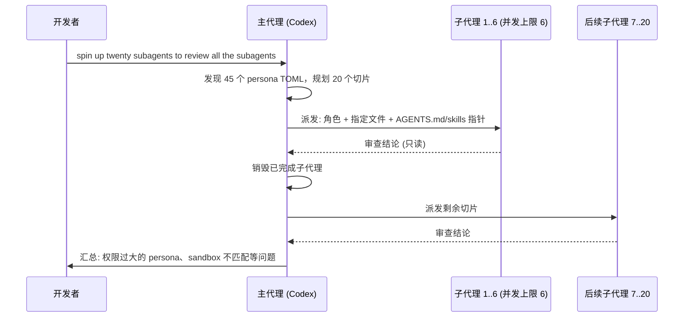

# 08｜OpenAI Codex Masterclass：插件、自动化、Code Review 与自定义 Subagents

<div class="meta-tags"><a class="domain-tag" href="/#domain-multi-agent">🤝 主题：多代理协作与对抗式验证</a><span class="tool-tag tool-codex">工具：Codex</span></div>

<div class="hook">

**一句话看懂**：两位 OpenAI 开发者体验工程师用一小时现场演示 Codex 怎样从“一个编码助手”变成“一套软件工程系统”：并行 worktree、定时自动化、PR 第一道审查，以及一口气派 20 个只读子代理去审查 45 个配置文件。

</div>

::: info 为什么值得看
这是工作坊形式，几乎每个功能都有现场操作，失败的部分也没剪掉。最值得看的是 32:39 起的子代理段落：怎么切片、怎么限制并发、为什么审查代理一律只读，幻灯片上还直接给出了自定义子代理的 TOML 配置。
:::

::: tip 小白先懂这几个词
- [Worktree](/glossary#worktree)：一个仓库同时开多个工作目录，互不干扰。
- [Routines / Automations](/glossary#routines)：按时间表自动运行的代理任务。
- [Plugins](/glossary#plugins)：把 Skills、Apps、MCP 打包在一起的扩展。
- [子代理](/glossary#subagent)：主代理派出去干小活的“分身”。
- [Persona](/glossary#persona)：给子代理配的角色、模型、权限和工具。
- [Sandbox](/glossary#sandbox)：限制代理读写范围的隔离环境。
- [P1 / P2](/glossary#severity)：审查意见的严重度等级。
:::

> 信息来源：AI Engineer 官方讲稿页（ai.engineer/talks/MhHEGMFCEB0，含完整时间戳文字稿与配图说明）+ YouTube 视频简介与章节 + 本次新增的视频画面截图。英文引号内容为文字稿或幻灯片原话，中文翻译为本站所加（鼠标悬停或点按带虚线的英文即可查看）。

## 1. 基本信息

<YouTube id="MhHEGMFCEB0" title="OpenAI Codex Masterclass" />

| 项目 | 内容 |
|---|---|
| 链接 | https://www.youtube.com/watch?v=MhHEGMFCEB0 |
| 讲者 / 频道 | Vaibhav Srivastav（VB）、Katia Gil Guzman（OpenAI Developer Experience，伦敦）／ **AI Engineer** |
| 发布日期 | 2026-04-29 |
| 时长 | 1:01:58（工作坊，含 Q&A） |
| 使用工具 | Codex app / CLI（GPT-5.4、GPT-5.3-Codex-Spark、mini/nano）、worktrees、Plugins（Skills + Apps + MCP）、Automations、Code Review（GitHub 与 `/review`）、Subagents、Guardian approvals、Hooks、Claude Code 中的 Codex 插件 |

章节（节选）：7:04 App、项目与 worktrees → 8:37 Automations → 12:28 Plugins → 27:14 Code Review 与 GitHub → 32:39 Subagents 并行与 persona → 36:18 用 subagents 审查 persona 文件 → 44:52 创建自定义 subagent → 49:29 Guardian approvals、hooks。

## 2. 做了什么

当多个代理同时产出代码，<Trans zh="几个代理产出改动的速度，比一个人逐行检查的速度更快">“several agents can produce changes faster than one person can inspect every line”</Trans>（讲稿页概述）。所以审查、拆分、权限控制也得交给代理体系。

**目标**：现场演示 Codex 从“单个编码助手”变成“软件工程系统”：并行 worktree、计划任务、第一道代码审查、带不同模型 / 权限 / 工具的自定义子代理。

涉及的场景：多代理 / 子代理团队自动审查；并行与后台代理；与 GitHub / CI 集成；Hooks。

## 3. 怎么做的

### 3.1 并行的基础：worktrees + 自动化

- App 内按项目组织线程。原生 worktree 支持让功能开发、修 bug、排查可以<Trans zh="同时进行，彼此不干扰">“all at the same time, uh, without really interfering with individual tasks”</Trans>。
- Automations 类似 cron：Katia 演示了每天 9 点的邮件 / Slack 分诊。用对话方式创建自动化时，现场没能可靠地弹出配置框，最后改走手动界面（指令 + 插件 + 所属项目）。

### 3.2 Plugins = Skills + Apps + MCP

- Game Studio 插件组合了 Playwright Interactive（打开应用、点击、截图分析）和 ImageGen（生成精灵素材）。
- Google Drive 插件：让 Codex 读取仓库里 YAML 格式的 meetup 记录，写入表格。讲稿页记录为<Trans zh="写入了 57 行活动记录">“wrote 57 event rows”</Trans>。

::: tip 启示
去目标系统里核对产物，而不只看代理的“完成”消息。下面的截图里，代理的汇总写了 57 行，你应该打开表格亲自确认。
:::

<div class="shots"><figure class="shot"><figcaption>📷 视频截图 · <a href="https://www.youtube.com/watch?v=MhHEGMFCEB0&t=1394s" target="_blank" rel="noopener">23:14</a> · 23:14 前后，Codex 更新 meetup 表格后的汇总：“Wrote 57 event rows plus the existing headers”，按日期和城市排序，耗时 Worked for 2m 57s。</figcaption></figure></div>

### 3.3 Code Review 作为第一道关卡

**为什么重要**：代码量涨上来之后，人审不过来。先让代理把明显问题筛掉，人再看剩下的。

::: tr OpenAI 所有仓库里、所有员工提交的 PR，百分之百默认都由 Codex code review 审查。
> "one hundred percent of pull requests across all OpenAI repos, um, made by all employees … are reviewed by Codex code review by default."
:::

- 入口：GitHub 自动 PR 审查（行内意见带 P1 / P2 等严重度）、CLI / App 里的 `/review`、Claude Code 里的 Codex 插件。
- 演示：审查未提交的改动，独立线程 + 专用的 review system prompt，约一分钟返回 P1 本地化问题、P2 翻译问题；随后可以让 Codex 修复，或者开后续 PR。


<figure class="shot"><figcaption>📷 视频截图 · <a href="https://www.youtube.com/watch?v=MhHEGMFCEB0&t=1704s" target="_blank" rel="noopener">28:24</a> · 28:24 幻灯片“Code Review”：在 GitHub 上开启自动审查或对特定 PR 请求审查；在 CLI 或 Claude Code 插件里用 /review；由一个独立的 Codex 实例审查改动并提出改进建议。</figcaption></figure>

### 3.4 Subagents：把大任务切成独立的“审查切片”

**为什么重要**：一个代理审 45 个文件，上下文会被塞满，后面的审得越来越差。切成小块分给子代理，每个都在干净的上下文里工作。

演示任务：仓库里有 40–50 个子代理 persona 文件，规范变更后需要逐个复审。

::: tr 启动 20 个子代理，去审查所有的子代理（配置）。
> "spin up twenty subagents to review all the subagents."
:::

- 主代理先发现 45 个 persona TOML，规划 20 个审查切片，显示一份五步清单，然后再派发。
- 本机配置的并发上限是 6：<Trans zh="我设了上限：最多 6 个并发代理线程">“I have a cap on six num- like, six concurrent agent threads”</Trans>，所以先启动 6 个。
- 每个子代理拿到：角色、要审查的确切文件、指向仓库规范（AGENTS.md 和 skills）的指针。完成后被销毁，结果回到主线程汇总。


<figure class="shot"><figcaption>📷 视频截图 · <a href="https://www.youtube.com/watch?v=MhHEGMFCEB0&t=2200s" target="_blank" rel="noopener">36:40</a> · 36:40 Codex App 里的线程标题“spin up 20 sub agents to review all the sub agents personas in the repo”，下方是代理对任务的理解。</figcaption></figure>

下图是这次子代理审查的交互过程：



### 3.5 自定义 persona：模型、权限、工具按角色配置

- 内置三种 persona（执行、探索等）；自定义 persona 可以配 model、reasoning effort、sandbox、instructions。
- 权限原则：<Trans zh="审查代理几乎百分之百应该用只读模式">“for a review agent, you would almost always 100% want to use the review agent in read-only mode”</Trans>。写文档、写 bug report 的角色才给写权限。
- 工具按角色给：例如给某个子代理 Sentry MCP 看报错，给另一个 Linear 权限看 backlog。
- VB 的 PR Explorer：用 GPT-5.3-Codex-Spark、只读 sandbox、只追踪代码路径、不提修复。幻灯片上展示的配置原文（45:00 截图）：

::: tr 配置大意：名字叫 pr_explorer，是“在提出改动前收集证据的只读代码库探查员”；用 gpt-5.3-codex-spark 模型、中等推理强度、只读沙箱。给它的指令是：保持探索模式；追踪真实的执行路径，引用具体的文件和符号；除非父代理要求，不要提出修复方案；优先用快速搜索和有针对性的文件读取，而不是大范围扫描。
```toml
name = "pr_explorer"
description = "Read-only codebase explorer for gathering evidence before changes are proposed."
model = "gpt-5.3-codex-spark"
model_reasoning_effort = "medium"
sandbox_mode = "read-only"
developer_instructions = """
Stay in exploration mode.
Trace the real execution path, cite files and symbols, and avoid proposing fixes unless the parent agent asks for them.
Prefer fast search and targeted file reads over broad scans.
"""
```
:::


<figure class="shot"><figcaption>📷 视频截图 · <a href="https://www.youtube.com/watch?v=MhHEGMFCEB0&t=2700s" target="_blank" rel="noopener">45:00</a> · 45:00 幻灯片“Custom Subagents”：为前端、后端、测试、审查、调研等具体工作创建代理；控制上下文和代理间的交接；并行能提高吞吐量，但每个代理都会额外消耗 token。右侧即上面的 pr_explorer 配置。</figcaption></figure>

- 讲者最推荐的做法：<Trans zh="直接让 Codex 翻看我过去的会话，给我推荐该建哪些自动化、哪些子代理">“just ask Codex to look through my past sessions and recommend me certain automations, certain subagents”</Trans>。

### 3.6 Guardian approvals 与 Hooks

- Guardian approvals（实验功能，`/experimental` 开启）：需要特权操作（删目录、起服务、暴露文件）时，另起一个子代理判断是否需要人介入。现场因为全权限模式切换的问题，没能展示完整的判定结果。
- Hooks：会话开始时拉取最新代码、记录工具调用、**用 stop hook 让长任务继续**：

::: tr 继续，再过一遍，跑一条靠谱的验证命令，再收紧一处，然后停下来给出结果。
> "keep going, do one more pass, run one, one solid validating command, tighten one more thing, and then stop and give the result."
:::

## 4. 结果如何

- **现场可见结果**：表格写入 57 行；`/review` 约一分钟返回 3 条本地化相关意见；20 个子代理请求在 6 并发上限下完成，并汇总出权限配置问题（如“over-privileged performance investigator”，权限过大的性能调查员）；平台游戏 demo 展示了生成的多套角色精灵。
- **讲者口述指标**：WebSockets 约 1.75 倍 token 速度、fast mode 再快约 2 倍（讲稿页注明没有给出测量基线）；Codex 周活 300 万（讲者在现场的口述快照）。

::: warning 局限与注意
- 云端任务当时不支持 subagents，也不支持本地安装的 skills（Q&A 中确认）。
- 自动化的对话式创建、guardian approvals 的现场演示都不完整。
- 子代理 persona 仓库当时没有公开，无法直接复用原文件；上面的 pr_explorer 配置来自幻灯片截图。
:::

## 5. 可借鉴之处

1. **先切片再派发**：让主代理先输出“切片计划”（谁负责哪些文件），确认没有依赖后再并行，避免子代理互相等待或改同一个文件。
2. **审查类子代理一律只读**：把“只读 + 只报告不修复”写进 persona，修复交给另一个有写权限的执行代理。
3. **为高频重复工作建 persona**：PR explorer（快模型、只读）、文档研究员（挂文档 MCP）、测试运行员（长构建时后台跑测试）。
4. **代码审查作为合并前必过的第一关**：本地 `/review` + GitHub 自动审查，按严重度分级，团队约定 P1 必须处理。
5. **用 stop hook 实现“再验证一轮”**：长任务结束前，强制跑一次验证命令再汇报，成本低、收益高。
6. **让代理分析你的历史会话**，推荐该自动化的流程和该建的子代理，而不是凭空设计。
7. **注意并发上限和成本**：并发线程数是可配置的上限，按预算设定；短任务和子代理用 mini / Spark 等快模型。

### 你可以这样试

- [ ] 照着上面的 pr_explorer 写一个只读子代理配置，让它回答“这个 PR 涉及哪些执行路径”。
- [ ] 找一组同类文件（如所有 API handler），让 Codex 先输出切片计划，再派子代理并行审查。
- [ ] 在本地对未提交的改动跑一次 `/review`，看它给出的 P1 / P2 是否靠谱。
- [ ] 加一个 stop hook，内容就用“keep going, do one more pass…”那句。

::: details 读完自测（点开看答案）
1. **为什么先启动 6 个子代理而不是 20 个？** 本机配置了 6 个并发线程的上限。
2. **审查类子代理该用什么权限？** 只读，只报告不修复。
3. **57 行这个例子给了什么启示？** 要去目标系统（表格）核对产物，而不只看代理的完成消息。
:::
