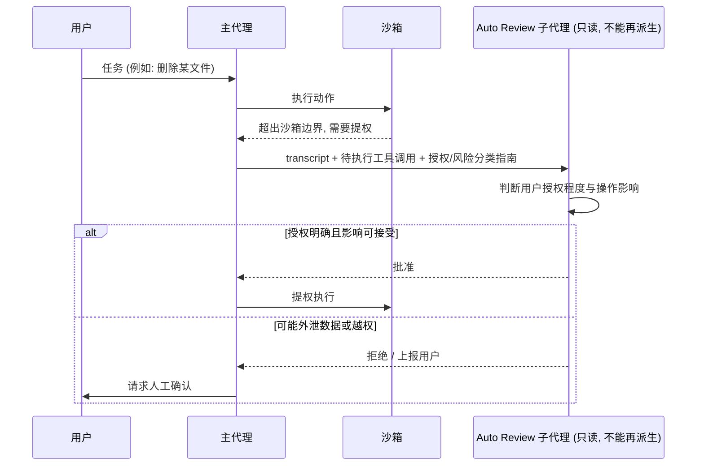
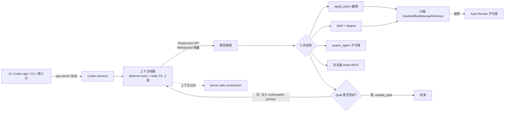

# 09｜How Codex Works：沿着一条消息看 Codex harness 内部（Dominik Kundel, OpenAI）

<a class="domain-tag" href="/guide/harness">🧠 主题：Harness 工程与内部机制</a>类型：视频工具：Codex

**一句话看懂**：同一个模型，为什么放进 Codex 就能长时间、安全地改代码？Dominik 用一个自制的 “nano Codex” 可视化演示 harness 做的六件事：拼上下文、执行动作、沙箱审批、加速传输、目标循环和上下文压缩。

::: info 为什么值得看
前面几篇讲“怎么用”，这篇讲“为什么”。理解了 harness 内部怎么管上下文、怎么审批危险操作，你就能看懂 skills 为什么要渐进加载、`/goal` 为什么要写可验证目标。Codex harness 是开源的，讲到的每一点都能在源码里找到。
:::

::: tip 小白先懂这几个词
- [Harness](/glossary#harness)：包在模型外面的运行框架，Codex CLI 就是一个 harness。
- [Responses API / app-server](/glossary#responses-api)：模型调用接口 / 界面与 harness 的协议。
- [Deferred Tools](/glossary#deferred-tools)：不预先加载、需要时再搜索的工具。
- [Sandbox](/glossary#sandbox)：限制代理读写和联网范围的隔离环境。
- [Auto Review](/glossary#auto-review)：遇到越权操作时，由只读子代理判断是否放行。
- [/goal](/glossary#goal)：给代理一个可验证的目标，直到达成才停。
- [Compaction](/glossary#compaction)：上下文过长时压缩成摘要。
:::

> 信息来源：AI Engineer 官方讲稿页（ai.engineer/talks/shRR1e2HXMk，含完整时间戳文字稿）+ YouTube 视频简介 + 本次新增的幻灯片截图。英文引号内容均为文字稿原话，中文翻译为本站所加（鼠标悬停或点按带虚线的英文即可查看）。讲稿页中的 Playwright 示例代码为讲稿页作者的示意，本文没有引用。

## 1. 基本信息

<YouTube id="shRR1e2HXMk" title="How Codex Works" />

| 项目 | 内容 |
|---|---|
| 链接 | https://www.youtube.com/watch?v=shRR1e2HXMk |
| 讲者 / 频道 | Dominik Kundel（OpenAI Developer Experience）／ **AI Engineer**（AI Engineer World's Fair 2026） |
| 发布日期 | 2026-08-10 |
| 时长 | 20:54 |
| 使用工具 | Codex harness（开源，Rust，Apache-2.0）、app-server 协议、Responses API（tool search、`apply_patch`、WebSocket mode、server-side compaction）、Auto Review、`/goal` |
| 代码 | https://github.com/openai/codex |

## 2. 做了什么

问题很简单：同样的模型，为什么放进 Codex 就能长时间、安全地改代码？harness 到底做了哪些事？

讲者把公开仓库的代码改写成 TypeScript，做了一个 “nano Codex”，用它可视化演示：上下文构建、动作执行、沙箱审批、传输速度、目标循环、压缩。

适用场景：理解编码代理的架构，自建或定制代理；后台与长时任务；子代理。

## 3. 怎么做的

### 3.1 两个协议

- **app-server**：连接界面和 harness。Codex app 自己就用它；社区项目（T3 Code、RemoteX）也基于它；讲者还用它<Trans zh="把 Codex 放进了 Claude Code">“put Codex into Claude Code”</Trans>。
- **Responses API**：连接 harness 和模型推理。OpenAI 还在推动 Open Responses 规范，让兼容的模型提供方能接入 Codex harness。

<figure class="shot"><figcaption>📷 视频截图 · <a href="https://www.youtube.com/watch?v=shRR1e2HXMk&t=156s" target="_blank" rel="noopener">2:36</a> · 2:36 幻灯片“App server”：左边是官方产品（Codex Desktop App、Codex TUI/CLI 等），右边是第三方集成（JetBrains IDEs、VS Code 等），中间的 Codex harness 通过 app server 用 JSON-RPC 和两边通信。</figcaption></figure>

### 3.2 上下文构建：控制体积、灵活性、可缓存性

**为什么重要**：上下文不是越多越好。内容一多，互相矛盾的信息也跟着变多。

::: tr 你的上下文里内容越多……出现相互矛盾信息的可能性就越高，而这会让模型困惑。
> "the more context you have in your … context … the higher it is that you have contradicting information and … it causes confusion for the model."
:::

- **Deferred tools**：部分工具<Trans zh="不直接放进上下文窗口，而是之后通过工具搜索来获取">“are not added directly to the context window, but instead are available through tool search later on”</Trans>。GPT-5.4 起 Responses API 支持。
- **Skills 列表上限**：<Trans zh="我们把可用 skills 列表的上限设为最大上下文窗口的 2%">“we actually cap the available skills list at two percent of your context … maximum context window”</Trans>，超出时逐步缩短描述。

### 3.3 动作：子代理、后台终端、浏览器、文件系统

- 子代理：`spawn_agent` 创建实例，`send_input` 追加输入，可以等待或关闭。后台终端同理（stdin 交互、定时等待）。
- 浏览器：在持久化的 Node REPL 里写 Playwright 风格的 JS，跨轮次复用变量和标签页。看懂一页的结构后，可以写脚本批量处理后面的页面。
- 文件：GPT-5 起的模型训练过用 `apply_patch` 以 diff 方式编辑文件。搜索导航走 shell，模型习惯用 ripgrep，所以<Trans zh="我们其实在 Codex harness 里直接内置了 ripgrep">“we're actually in the Codex harness shipping ripgrep”</Trans>。
- 沙箱：macOS 用 Seatbelt，Linux 用 Bubblewrap，Windows 用自研的开源沙箱。

<figure class="shot"><figcaption>📷 视频截图 · <a href="https://www.youtube.com/watch?v=shRR1e2HXMk&t=679s" target="_blank" rel="noopener">11:19</a> · 11:19 幻灯片“Sandbox first”：macOS 用内置的 Seatbelt，Linux 安装 Bubblewrap，Windows 用自研开源沙箱。</figcaption></figure>

### 3.4 Auto Review：用一个只读子代理替你审批越权操作

**为什么重要**：审批弹窗太多，大家就干脆开 full access。可高自主性的代理真会闯祸：讲者举例，代理发现附件发不出去，可能<Trans zh="把它上传到文件共享">“uploads it to a file share”</Trans>；或者转义写错，删多了数据。

::: tr 它会启动一个 Auto Review 子代理，这个子代理完全独立运行，不能再派生其他子代理……它只有读权限。
> "it spins up an Auto Review sub-agent, and this sub-agent runs entirely separate. It can't spin up other sub-agents. … It has read permissions only."
:::

审查子代理拿到三样东西：关于用户授权和风险分类的指导、对话 transcript、待执行的工具调用。它分别判断**授权程度**（用户是否明确要求）和**影响**。例如用户明确要求删除 `.git` 可以，没要求就不该碰。

<figure class="shot"><figcaption>📷 视频截图 · <a href="https://www.youtube.com/watch?v=shRR1e2HXMk&t=783s" target="_blank" rel="noopener">13:03</a> · 13:03 幻灯片<Trans zh="可能会出什么问题？">“What could go wrong?”</Trans>，引出 Auto Review 要解决的风险。</figcaption></figure>

下图是一次越权操作的审批过程：

### 3.5 速度：推理快了，网络成了瓶颈

GPT-5.3-Codex-Spark 在 Cerebras 上达到<Trans zh="每秒一千个 token">“a thousand tokens per second”</Trans>后，瓶颈变成了网络。WebSocket mode 用持久连接 + 有状态的上下文：

::: tr 我们只回传工具调用的结果，而不是把所有条目都重新发回去。
> "we only send back the result of the tool call rather than sending all of the items back"
:::

演示服务器当场崩溃，改用备份演示：1 项对比 9 项。

### 3.6 `/goal`：靠可验证目标驱动长时循环

**为什么重要**：代理最常见的问题是“没做完就说做完了”。`/goal` 让 harness 在目标没达成时自动推它继续。

::: tr 在它完成之前，harness 会自动注入这条“继续”提示。
> "until it's done with that, um, it will actually automatically, the harness will inject this continuation prompt."
:::

模型调用 `update_goal` 才会结束循环。所以讲者建议：

::: tr 写非常具体、可验证的 prompt，这样才容易判断事情是否已经完成。
> "have very concrete and verifiable, um, prompts so that, uh, it's easy to detect when things are done."
:::

### 3.7 Compaction

自去年底起，Codex 会自动在服务端触发压缩：生成一个包含必要信息的 compaction item，替换掉之前的上下文窗口。可以手动触发，也可以自动触发。

下图把以上所有部分串起来：

## 4. 结果如何

- **演示结果**：nano Codex 可视化了上下文的各个部分；Auto Review 对“明确要求删除文件”判为高授权；`/goal` 的猜数字 demo 达到 Complete 状态；WebSocket demo 因服务器崩溃改用备份。
- **数据**：1000 tokens/s 是生成吞吐，讲者没有给出端到端提速的测量值；skills 2% 上限是实现参数。

<figure class="shot"><figcaption>📷 视频截图 · <a href="https://www.youtube.com/watch?v=shRR1e2HXMk&t=1201s" target="_blank" rel="noopener">20:01</a> · 20:01 结论幻灯片“Conclusion”：01 把开源的 Codex app server 当作现成的代理 harness 或蓝本；02 Codex 的大部分代理能力可以通过 Responses API 获得（tool search、apply patch、shell、websockets 等）；03 模型在进化，你的代理也应该跟着进化。</figcaption></figure>

::: warning 局限与注意
- 讲者开头就声明<Trans zh="这是当前的状况">“this is a current state of affairs”</Trans>。模型和 API 一变，harness 的行为就会变。
- 讲者自称 Auto Review 的讲解是<Trans zh="严重简化">“a gross oversimplification”</Trans>。它是降低风险的手段，不是确定性的安全保证。
:::

## 5. 可借鉴之处

1. **自建代理时直接复用 Responses API 的能力**：tool search / deferred loading、`apply_patch`、WebSocket、server-side compaction。讲者原话是<Trans zh="不管你用的是哪个 harness">“regardless of what harness you're using”</Trans>。
2. **MCP 装多了要做“延迟加载”**：工具 schema 不进初始上下文，靠搜索发现；skills 描述设总量上限。这条对 Claude Code 和其他代理同样适用。
3. **审批交给只读审查子代理**：给它 transcript 和授权准则，区分“用户明确授权”和“代理自作主张”，比全开权限或频繁弹窗都好。
4. **长任务用可验证目标**：`/goal` 写“把构建时间降 50%”“所有测试通过”，别写长篇大论。
5. **把工具做成模型训练时熟悉的形状**：例如 diff 式编辑、ripgrep。自建工具时尽量贴近模型的“肌肉记忆”。
6. **想深挖就读源码**：harness 是开源的，可以直接让 Codex 回答“当前实现是怎样的”。

### 你可以这样试

- [ ] clone `openai/codex`，让代理回答：“skills 列表的 2% 上限在哪段代码里实现？”
- [ ] 数一数你接了多少个 MCP、它们的工具说明一共占多少 token，删掉不常用的。
- [ ] 给一个长任务写 `/goal`，要求可以用一条命令验证（例如“`npm test` 全部通过且构建时间低于 60 秒”）。
- [ ] 写一段给“审批代理”的准则：哪些操作必须用户明确授权才能做（删除、外发数据、改权限）。

::: details 读完自测（点开看答案）
1. **为什么上下文不是越多越好？** 内容越多，矛盾信息越可能出现，模型会困惑。
2. **Auto Review 子代理有哪些限制？** 完全独立运行、不能再派生子代理、只有读权限。
3. **`/goal` 怎样判断任务结束？** 模型调用 update_goal 才结束；没完成时 harness 会自动注入继续提示。
:::
