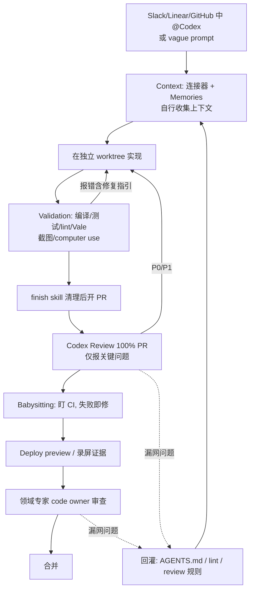

# 10｜How OpenAI Uses Codex to Change How We Build：上下文 → 验证 → 核实 的飞轮

<div class="meta-tags"><a class="domain-tag" href="/#domain-automation">⚙️ 主题：后台代理、自动化与 CI/CD</a><span class="tool-tag tool-codex">工具：Codex</span></div>

<div class="hook">

**一句话看懂**：OpenAI 内部 80% 的员工每周都在用 Codex。Dominik 讲他们怎么保证质量：让代理自己去拿上下文；用编译器、测试、lint 让它自己验证；100% 的 PR 先过 Codex review，再由代理盯着 CI 改到通过；每次漏网的问题都回灌进规则。

</div>

::: info 为什么值得看
这是一份完整的“从 Slack 发现问题到手机上合并 PR”的流程说明，每个环节都有 OpenAI 内部的具体做法。幻灯片上还给出了一条可以直接抄进 AGENTS.md 的审查标准。
:::

::: tip 小白先懂这几个词
- [AGENTS.md](/glossary#agents-md)：Codex 读取的项目说明文件。
- [Lint](/glossary#lint)：只读代码就能发现问题的检查工具。
- [Worktree](/glossary#worktree)：一个仓库开多个工作目录，给并行代理用。
- [Code Review](/glossary#code-review)：合并前的代码审查。
- [PR Babysitting](/glossary#babysitting)：让代理盯着 CI，失败就修到通过。
- [Deploy Preview](/glossary#deploy-preview)：每个 PR 自动部署的临时预览网址。
- [/goal](/glossary#goal)：给代理一个可验证目标的长任务模式。
:::

> 信息来源：YouTube 自动字幕全文（yt-dlp 获取）+ 视频简介 + 本次新增的幻灯片截图。英文引号内容为字幕原话；自动字幕把 “Codex” 多处误识别为 “codecs / codeex / CEX”，引用时已按原意写作 Codex；另将明显的识别错误（“llinter”→linter、“poll requests”→pull requests）更正，其余未改动。中文翻译为本站所加（鼠标悬停或点按带虚线的英文即可查看）。

## 1. 基本信息

<YouTube id="NjaX4qt-O1Y" title="How OpenAI Uses Codex to Change How We Build" />

| 项目 | 内容 |
|---|---|
| 链接 | https://www.youtube.com/watch?v=NjaX4qt-O1Y |
| 讲者 / 频道 | Dominik Kundel（OpenAI Developer Experience Lead）／ **Temporal**（Replay 2026 大会） |
| 发布日期 | 2026-05-28 |
| 时长 | 47:03（演讲约 32 分钟 + Q&A） |
| 使用工具 | Codex app / Cloud / GitHub Code Review、Slack/Linear/GitHub 中 @Codex、Memories、Chronicle、in-app browser、computer use、Chrome 扩展、`/goal`、babysitting skills、deploy previews |

## 2. 做了什么

讲者开场就说：<Trans zh="代码已经不是瓶颈了">“code is no longer the bottleneck”</Trans>。代码生成不再稀缺，怎样保证交付的是高质量的软件？

他分享 OpenAI 内部（讲者称“80% of all employees use Codex weekly”，80% 的员工每周使用 Codex）使用 Codex 的三条主线：**context（上下文）、validation（验证）、verification（核实）**，以及怎样把每次失误回灌成一个飞轮。

涉及的场景：上下文工程、规划 → 执行 → 验证、并行代理、与 CI/CD 集成（PR 审查、CI 看护、deploy preview）。

## 3. 怎么做的

### 3.1 Context：让代理自己去拿，而不是手工拼大 prompt

**为什么重要**：手工把信息粘贴进 prompt 又累又容易漏。代理能像新同事一样自己找到信息，你的指令就可以很短。

- 讲者明确说，上下文不是指<Trans zh="费尽心思写一个巨大的 prompt">“meticulously generating a giant prompt”</Trans>，而是让代理像新同事一样能找到信息。
- 他的 Codex 接了 Linear、Sentry、CI，以及 Figma、Gmail、日历、Slack、Notion。演示一个<Trans zh="模糊的 prompt">“vague prompt”</Trans>，只说：

::: tr 把明天那场活动我需要知道的事情都给我梳理一遍。
> "give me a rundown of everything I need to know about tomorrow's event"
:::

Codex 从邮件、日历、Slack 里推断出是哪个活动、票在哪。

- 在 Slack / Linear / GitHub 里直接 @Codex，上下文就在线程里。
- Memories（实验功能）记住<Trans zh="去哪里找、怎么调试">“where to look or how to debug”</Trans>；Chronicle 可以选择性地观察屏幕，学习你用的工具。

<figure class="shot"><figcaption>📷 视频截图 · <a href="https://www.youtube.com/watch?v=NjaX4qt-O1Y&t=352s" target="_blank" rel="noopener">5:52</a> · 5:52 幻灯片<Trans zh="Codex 很擅长收集上下文">“Codex is great at context gathering”</Trans>。</figcaption></figure>

### 3.2 Validation：让代理用你已有的工具验证自己

**为什么重要**：代理自己能跑的检查越多，交给人的半成品就越少。

- 基线：编译器、formatter、测试、linter。讲者原话：<Trans zh="linter 可以是任何能帮代理以确定性方式验证工作是否正确的东西">“a linter can really be anything that helps the agent in a deterministic way to verify whether the work is done correctly”</Trans>，例如文档用 Vale 检查风格指南。
- **工具速度变得更重要**：代理会在循环里反复跑，所以他们把 Prettier 换成了 oxfmt，还在尝试 Go 写的 TypeScript 7。
- 并行代理需要**并行环境**：每个代理能在自己的 worktree / checkout 里起 dev server 和 worker，互不干扰。
- UI 验证：截图、无障碍树、computer use、in-app browser、Chrome 扩展。
- 报错要有用：<Trans zh="确保报错真的能给代理提供有用的信息。">“make sure that they're actually providing helpful information back to that agent.”</Trans>


<figure class="shot"><figcaption>📷 视频截图 · <a href="https://www.youtube.com/watch?v=NjaX4qt-O1Y&t=823s" target="_blank" rel="noopener">13:43</a> · 13:43 幻灯片<Trans zh="并行代理需要并行的环境">“Parallel agents need parallel environments”</Trans>。</figcaption></figure>

### 3.3 Verification：PR 越来越多时怎么守住质量

- <Trans zh="我们 100% 的 PR 都直接在 GitHub 上过一遍 Codex 的审查">“we're running 100% of our pull requests through Codex's review feature directly on GitHub”</Trans>。原则是 review 检查没过，就不找同事审。
- Codex review 有意做得<Trans zh="不吵">“not noisy”</Trans>，只报关键问题；可以自定义标准。例如文档仓库把拼写和语法错误定为 P0 / P1，幻灯片上的 AGENTS.md 写法是：

::: tr 代码审查准则：在任何 .mdx 文件里，拼写错误或语法问题都应标记为 P0 和 P1。
```markdown
## Code review guidelines

In any .mdx file spelling mistakes or grammar issues should be flagged as P0 and P1.
```
:::

讲者解释：对代码库来说，typo 通常不算大问题，只要能编译、测试通过就行；但文档仓库在乎这个，所以要自己设定审查门槛。


<figure class="shot"><figcaption>📷 视频截图 · <a href="https://www.youtube.com/watch?v=NjaX4qt-O1Y&t=1058s" target="_blank" rel="noopener">17:38</a> · 17:38 幻灯片<Trans zh="在 AGENTS.md 里设定你自己的审查标准">“Set your own review bar in AGENTS.md”</Trans>，右侧即上面的配置。</figcaption></figure>

- **Babysitting skills**：PR 推上去后，让 Codex 盯 CI，失败就修，直到通过；也可以继续处理 review 意见。
- **Deploy previews**：讲者称已经是<Trans zh="没得商量的标配">“non-negotiable”</Trans>。可以全程在手机上完成：Slack 发现问题 → @Codex 修 → 看 PR → 打开预览 → 请同事 review → 合并。
- 没有预览环境（例如 Codex app 本身）时：UI 改动必须附视频或截图，通常由 Codex 用 skill 启动应用、点测并录屏；最后仍由领域专家通过 code owner 关卡审代码。

### 3.4 维持质量：克制 + finish skill + 飞轮

- 敢删功能、敢大重构（App 上线 3 个月内做了多次状态管理重构，不需要代码冻结）。
- “finish” skill 在开 PR 前按最佳实践清理代码；文档有 docs editor skill。
- 把每次审查漏网的问题回灌到上下文或验证工具里。讲者在 17:50 前后说：如果某类问题反复漏过 Codex review，就要把它编码成反馈回路，写回 review 规则甚至验证工具里。

下图是整个飞轮：



### 3.5 长任务：`/goal`

Q&A 里的演示：给 Codex 的目标是让开发者文档的 Vercel 构建<Trans zh="至少快 50%">“at least 50% faster”</Trans>，它自己部署验证，<Trans zh="只用了两个小时">“only needed two hours”</Trans>。讲者强调：

::: tr 你的目标写得越具体，它就会在上面持续工作越久。
> "the more specific you are with that goal the longer it will work on it"
:::

关于语言迁移：先生成和语言无关的验收测试（例如针对 HTTP 端点），用它作为两种实现的共同标准。


<figure class="shot"><figcaption>📷 视频截图 · <a href="https://www.youtube.com/watch?v=NjaX4qt-O1Y&t=1529s" target="_blank" rel="noopener">25:29</a> · 25:29 幻灯片“Where are we going?”：Proactivity（主动性）、Independence（独立性）、Parallelization（并行化），讲者对 Codex 下一步方向的概括。</figcaption></figure>

## 4. 结果如何

- **讲者陈述的数据**：OpenAI 80% 员工每周使用 Codex；100% PR 经过 Codex review；一次 Slack 驱动的修复显示<Trans zh="工作了 23 分钟">“worked for 23 minutes”</Trans>，其中至少六七分钟在等 CI；`/goal` 优化构建耗时用了两小时；常同时跑<Trans zh="五六七个代理">“five, six, seven agents”</Trans>。

::: warning 局限与注意
- 讲者坦言<Trans zh="我的 token 不限量">“I have unlimited tokens”</Trans>，常用 extra high 推理异步工作，普通团队要权衡成本。
- 上下文的主要风险是**冲突**而不是数量：<Trans zh="更大的问题不是上下文的多少，而是上下文之间的冲突">“the bigger issue is actually not the amount of context it is conflicting context”</Trans>。所以他们的 AGENTS.md <Trans zh="并不长">“is not that long”</Trans>，并且在具体的项目目录、而不是整个 monorepo 里打开 Codex。
- 部分能力（Memories、goals、Chronicle）当时是实验功能。
:::

## 5. 可借鉴之处

1. **用“新同事测试”审视上下文**：新人只看仓库能不能写出合规代码？不能，就补文档、补连接器，而不是每次在 prompt 里粘贴。
2. **把团队规范变成确定性检查器**：风格（Vale）、架构规则、文案规范都可以是 lint，代理能自己跑。
3. **给验证工具提速**：代理会跑几十上百次，换更快的 formatter / type checker，收益会被放大。
4. **为并行代理准备隔离环境**：每个 worktree 能独立起服务、独立端口、独立数据。
5. **建一个 PR babysitting skill**：push 后监控 CI 和 review 意见，自动修复直到通过，人只在最后看结果。
6. **能上 deploy preview 就上**；上不了，就要求 UI 类 PR 附代理录制的视频或截图。
7. **AGENTS.md 宁短勿乱**：消除互相矛盾的指令，比堆更多内容更重要；并且从具体子项目目录启动代理。
8. **把代码当可丢弃的产物，把约束当资产**：测试、CI、spec 才是长期积累的东西。

### 你可以这样试

- [ ] 在 AGENTS.md 加一节 `## Code review guidelines`，写一条你们团队最在意、但默认审查不会报的问题，并标上 P0/P1。
- [ ] 让 Codex 在 PR 推上去后执行“盯 CI、失败就修、直到通过”，记录它花了多久。
- [ ] 给项目接上 deploy preview（Vercel / Netlify 都自带），在手机上走一遍“看预览 → 合并”。
- [ ] 检查 AGENTS.md 里有没有互相矛盾的两条规则，删掉一条。

::: details 读完自测（点开看答案）
1. **讲者认为上下文最大的风险是什么？** 冲突的上下文，而不是上下文太少或太多。
2. **为什么工具速度在代理时代更重要？** 代理会在循环里反复运行这些工具，慢一点会被放大很多倍。
3. **文档仓库怎样让 Codex review 报拼写错误？** 在 AGENTS.md 的 Code review guidelines 里写明 .mdx 的拼写和语法问题标为 P0/P1。
:::
