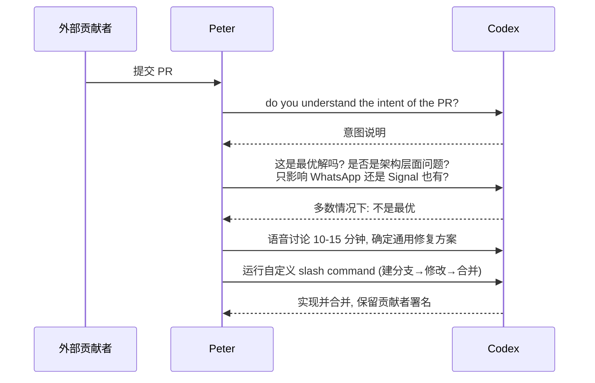

# Builders Unscripted Ep.1：Peter Steinberger 如何用 Codex 构建 OpenClaw

Codex

**一句话看懂**：一个人一年维护 120 多个项目、做出爆红的开源个人代理 OpenClaw。Peter 的秘诀很朴素：设置保持简单，开 10 个 checkout 并行；每个任务先问一句 “Do you have any questions?”；审外部 PR 时先让代理讲清意图，再决定怎么改。

::: info 为什么值得看
这是一期轻松的访谈，适合作为入门第一篇。没有复杂的编排，讲的都是个人开发者马上能用的习惯，也坦白了公开部署 bot 时踩到的安全坑。
:::

::: tip 小白先懂这几个词
- [Codex](/glossary#codex)：OpenAI 的编码代理。
- [Playwright](/glossary#playwright)：能用代码操作浏览器的工具，接成 MCP 后代理能自己点测。
- [Worktree](/glossary#worktree)：一个仓库同时开多个工作目录；Peter 用的是更朴素的多份 checkout。
- [PR](/glossary#pr)：合并请求，Peter 戏称为 “Prompt Request”。
- [Slash Command](/glossary#slash-command)：以 / 开头的自定义命令。
- [Prompt Injection](/glossary#prompt-injection)：恶意指令藏在外部内容里，代理读到后可能照做。
:::

## 1. 基本信息

<YouTube id="9jgcT0Fqt7U" title="Builders Unscripted Ep.1" />

| 项目 | 内容 |
|---|---|
| 讲者 / 频道 | Peter Steinberger（PSPDFKit 创始人、OpenClaw 作者；录制于加入 OpenAI 之前），主持 Romain Huet（OpenAI Head of Developer Experience）／ 官方频道 **OpenAI** |
| 发布日期 | 2026-02-24 |
| 时长 | 31:28 |
| 使用工具 | Codex（GPT-5.2）、早期使用 Claude Code、Playwright MCP、语音输入、自定义 slash command |
| 形式 | 访谈（无现场编码），但讲了大量个人真实工作流 |
| 分析依据 | YouTube 字幕全文（yt-dlp 获取的英文字幕）+ 视频简介与官方章节。英文引号内容均为字幕原话。 |

官方章节：0:00 OpenClaw 现象 → 4:24 第一次 AI 突破 → 7:58 构建代理 → 10:45 自主解决问题 → 12:58 Discord bot 与安全 → 18:09 新的编码方式 → 21:45 不读代码就发布 → 24:03 管理开源 → 29:14 给开发者的建议。

<figure class="shot"><figcaption>📷 视频截图 · <a href="https://www.youtube.com/watch?v=9jgcT0Fqt7U&t=78s" target="_blank" rel="noopener">1:18</a> · 1:18 前后，访谈从 ClawCon 聊起：这个几周前还不存在的项目，社区活动来了上千人。</figcaption></figure>

## 2. 做了什么

一个人怎样在一年内维护 120 多个项目，做出爆红的开源个人代理 OpenClaw？面对 2000 个开放的 PR，又怎么审查？

Peter 分享了自己的 agentic engineering 工作方式：极简的工具设置、用对话的方式提需求、先让代理提问、按意图而不是按代码审 PR。

涉及的场景：用 AI 代理开发复杂应用（个人主导的大型开源项目）、并行代理、AI 时代的代码审查。

## 3. 怎么做的

### 3.1 第一次“开窍”：spec → build → 接上验证工具

讲者描述的早期流程：把半成品项目打包成一个约 1.5MB 的 Markdown 文件，让 Gemini 写出约 400 行 spec，再交给 Claude Code，只说一句“build”。代理自称<Trans zh="百分之百可以上生产">“100% production ready”</Trans>，可一运行就崩。直到他接上 Playwright：

::: tr 我觉得这是我真正会用的少数几个 MCP 之一。我让它去做登录相关的功能，并且一边做一边检查自己的工作。
> "I think one of the few MCP that I would actually use and told it to, like, build the login stuff. And check the work along the way."
:::

::: tip 关键做法
代理的第一次成功，来自“让它能自己检查”。先给代理一个能自测的工具，再给任务。
:::

### 3.2 刻意保持简单的设置

**为什么重要**：工具链越复杂，花在维护工具上的时间就越多。Peter 把这叫作陷阱。

::: tr 我也曾把自己的设置搞得过于复杂。我管这叫“代理陷阱”。
> "I also over complicated my setup. I call it, “the agentic trap”."
:::

- 不用 worktree：<Trans zh="我连 worktree 都不用，基本上就是 checkout 1 到 10。">“I don't even use the worktrees. I just have, Check out 1 to 10, basically.”</Trans>多个独立的 checkout 并行处理互不冲突的问题。
- 把和代理协作当成对话，用语音输入：<Trans zh="用语音给 token 比打字容易。">“Easier to give tokens over voice than typing.”</Trans>

### 3.3 关键提示：先让模型提问

::: tr “你有什么问题吗？”是一个非常重要的问题。
> "“Do you have any questions?” is like a very important question."
:::

理由：模型默认会直接做假设，而且<Trans zh="每个新会话都像是“我对这个代码库一无所知”">“every new session is like, I know nothing about this codebase”</Trans>。他认为 Codex <Trans zh="更擅长先做大范围的了解">“is just much better at taking a broad look first”</Trans>。

### 3.4 “不读代码就发布”的边界

::: tr 大多数代码都很无聊，大多数代码只是把一种形状的数据转换成另一种形状。
> "Most code is boring. Like most code just transforms one shape of data into another shape of data"
:::

他看代理的输出流，确认和脑中的心智模型大致一致就行；性能出问题再集中处理。他还主张<Trans zh="你应该优化代码库，让代理能发挥最好">“you should optimize a code base so agents can do the best work”</Trans>。

### 3.5 PR = Prompt Request：先审意图，再决定方案

**为什么重要**：外部贡献者往往不了解系统全貌，提交的修复通常只解决局部问题。先搞清楚“他想解决什么”，才能判断该怎么修。

讲者原话：

::: tr 我问模型的第一个问题是：你理解这个 PR 的意图吗？因为我其实不太在乎代码本身。
> "my first question to the model is do you understand the intent of the PR? Because I don't really care about the code."
:::

<figure class="shot"><figcaption>📷 视频截图 · <a href="https://www.youtube.com/watch?v=9jgcT0Fqt7U&t=1494s" target="_blank" rel="noopener">24:54</a> · 24:54 前后，讲到审外部 PR：先问模型是否理解 PR 的意图、这是不是最优解；多数时候答案是“不是”，于是再讨论更通用的修法。</figcaption></figure>

下图是他处理一个外部 PR 的完整过程：

### 3.6 对代理“资源性”的观察与安全

- 语音消息的故事：代理发现文件没有后缀，读文件头判断出是 Opus 音频，用 FFmpeg 转码，找到环境里的 OpenAI key，用 cURL 调转写接口。
- 他把 bot 放进 Discord 公开测试，后来才补上沙箱和容器；他承认<Trans zh="提示词注入还没有解决">“prompt injection is unsolved”</Trans>。Web 服务器本意只在可信网络里用，被人暴露到公网后被评为高危，促使他请来安全专家。

<figure class="shot"><figcaption>📷 视频截图 · <a href="https://www.youtube.com/watch?v=9jgcT0Fqt7U&t=865s" target="_blank" rel="noopener">14:25</a> · 14:25 前后，讲到把 bot 不加任何安全措施地放进 Discord 公开调试，以及“prompt injection is unsolved”。</figcaption></figure>

## 4. 结果如何

- **讲者 / 主持人陈述的数据**：主持人提到他过去一年<Trans zh="在 120 多个项目上有 9 万次贡献">“90,000 contributions on more than 120 projects”</Trans>，OpenClaw 当时<Trans zh="2000 个开放 PR">“2000 PRs open”</Trans>。讲者把活跃度跳升归因于<Trans zh="我换成了 Codex">“I switched to Codex”</Trans>。
- **定性结论**：他对 Codex 的信任度最高，<Trans zh="直接就能用的东西非常多">“the number of things that just work is really high”</Trans>。

::: warning 局限与注意
- 访谈形式，没有可复制的配置文件或现场演示。
- “不读代码”适用于他自己熟悉系统全貌的场景；审外部 PR 时他反而更慢、更谨慎。
- 安全问题（公网暴露、prompt injection）是真实的教训，不能照搬“全权限”的做法。
:::

## 5. 可借鉴之处

1. **每个任务开头加一句 “Do you have any questions?”**，或者把它写进 AGENTS.md 作为默认行为，减少代理的错误假设。
2. **从最简单的并行开始**：几个独立的 checkout 各跑一个代理，处理互不相关的问题。先别折腾复杂编排，避开“agentic trap”。
3. **审外部 PR 时先问意图**：让代理总结“这个 PR 想解决什么问题、是不是一个更大的架构问题的症状”，再决定是采纳、重写，还是推广成通用修复。
4. **把“落地 PR”流程写成一个 slash command**：建分支、修改、跑检查、合并、保留贡献者署名，一键执行。
5. **一定要给代理一个能自测的工具**（如 Playwright）：讲者的第一次成功，正是从“让它边做边检查”开始的。
6. **默认安全**：个人代理放进群聊或公网之前，先上沙箱，限制网络和密钥的范围。

### 你可以这样试

- [ ] 下一个任务的 prompt 末尾加上 “Do you have any questions?”，看代理会问出什么。
- [ ] 把仓库 clone 成 2–3 份，各开一个代理处理不相关的小问题。
- [ ] 找一个别人提的 PR，先问代理：“do you understand the intent of the PR? Is this the best fix?”
- [ ] 检查你的代理能访问哪些密钥和网络，去掉它用不到的。

::: details 读完自测（点开看答案）
1. **Peter 的第一次成功靠的是什么？** 接上 Playwright，让代理边做边检查自己的工作。
2. **“agentic trap” 指什么？** 把代理工具链搞得过于复杂，反而拖慢自己。
3. **他审外部 PR 的第一个问题是什么？** “你理解这个 PR 的意图吗？”
:::
