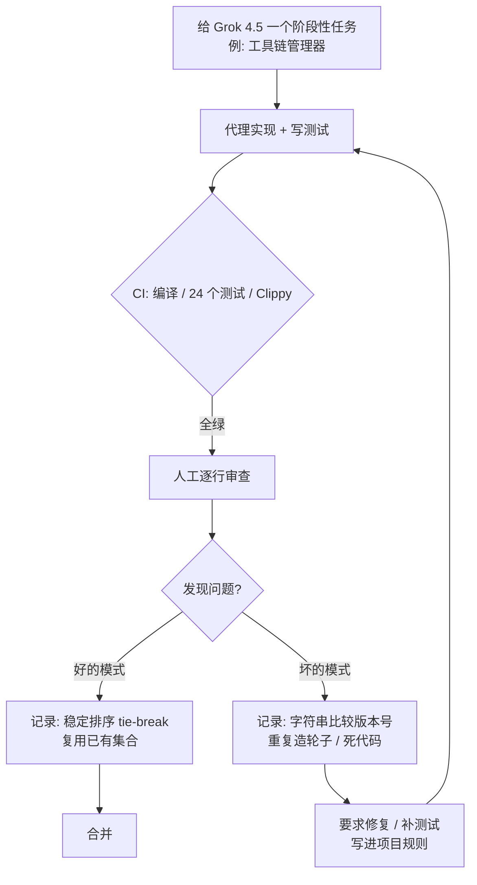

# 12｜Coding with Grok 4.5 is surprisingly good…：在真实 Rust / TypeScript 代码库里逐行审 Grok 的产出

<a class="domain-tag" href="/#domain-practice">🛠️ 主题：真实项目实战与人工把关</a>工具：Cursor + Grok 4.5

**一句话看懂**：ForrestKnight 在三个真实项目里用 Grok 4.5 写代码，然后一行行读。结论是：它很快，能修好别的模型修不好的 bug；但 24 个测试全绿的代码里，照样藏着“按字符串比较版本号”这种低级错误。

::: info 为什么值得看
大部分模型评测只看“能不能跑”。这期视频示范了怎么审 AI 写的代码：哪些写法值得夸、哪些是 AI 的高频坏习惯。它还给出了“快模型做执行、长循环模型做编排”的分工思路。
:::

::: tip 小白先懂这几个词
- [Cursor](/glossary#cursor)：集成 AI 代理的代码编辑器。
- [Benchmark](/glossary#benchmark)：用固定题目给模型打分排名，可能失真。
- [Lint（Clippy）](/glossary#lint)：Rust 的静态检查工具叫 Clippy。
- [Vibe Coding](/glossary#vibe-coding)：只看能不能跑、不读代码的写法。
- [子代理](/glossary#subagent)：被派出去干具体小活的代理“分身”。
- [模型名称](/glossary#model-names)：Fable、Opus、GPT-5.x、Grok 4.x 分属不同厂商。
:::

> 信息来源：YouTube 自动字幕全文（yt-dlp 获取）+ 视频简介 + 本次新增的视频画面截图。英文引号内容均为字幕原话，中文翻译为本站所加（鼠标悬停或点按带虚线的英文即可查看）。视频含 PostHog 赞助段落（约 1:07–2:43），本文不涉及。

## 1. 基本信息

<YouTube id="5J6HCDEkg64" title="Coding with Grok 4.5 is surprisingly good…" />

| 项目 | 内容 |
|---|---|
| 链接 | https://www.youtube.com/watch?v=5J6HCDEkg64 |
| 讲者 / 频道 | ForrestKnight（软件工程师、开发者 YouTuber，约 70 万订阅）／ **ForrestKnight** |
| 发布日期 | 2026-07-10 |
| 时长 | 27:02 |
| 使用工具 | Cursor + Grok 4.5（对照 Fable 5、Opus 4.8、GPT-5.5） |
| 形式 | 独立开发者实测：真实项目 diff 讲解 + 人工代码审查 |

## 2. 做了什么

Grok 4.5（SpaceX AI 与 Cursor 联合发布）号称编码能力追上了第一梯队。它在生产级代码里实际表现如何？基准测试可信吗？

讲者在三个真实代码库里使用 Grok 4.5，并**逐行阅读**它生成的代码，指出好与坏：

- Rust + Electron 写的录屏工具的 Linux 移植；
- Rust 写的 Java 工具链管理器；
- TypeScript 写的短链平台。

涉及的场景：用 AI 代理开发复杂应用；人工审查 AI 代码；模型选型与多模型分工。

## 3. 怎么做的

### 3.1 对基准保持怀疑

讲者指出 Cursor 自己的说明：Grok 4.5 在 CursorBench 上有优势，是因为<Trans zh="训练数据里意外包含了 Cursor 代码库的一个早期快照">“an earlier snapshot of the Cursor code base was accidentally included in training”</Trans>，因此这个基准被排除。他更关注 Artificial Analysis 上从 4.3 到 4.5 的跃升，并以自己的实际使用做判断。

### 3.2 案例一：Fable 5 连续失败的 Linux 移植 bug

- 问题：录屏工具在 Linux 上预览显示彩虹花屏。讲者说 Fable 5 尝试了<Trans zh="连续六七次">“six or seven times in a row”</Trans>都失败。
- Grok 4.5 的改法（字幕原述）：把软件预览指向 `live.jpg`，以 15 FPS 轮询；Linux 上跳过 preview live start，以免 FFmpeg 覆盖合成帧；懒加载 electron updater，避免启动崩溃；Rust 侧让 live JPEG 和 MJPEG 保持同步。
- 讲者评价：<Trans zh="是完美的修复吗？不是。但它确实让预览显示出来了">“is it a perfect fix? No. But it was able to actually get a preview shown”</Trans>。

### 3.3 案例二：Rust 写的 “UV for Java”，测试全绿也要读代码

**为什么重要**：测试是代理自己写的，它只会测自己想到的情况。人读代码，才能发现测试没覆盖到的错误。

- 任务：工具链管理器阶段（从 API 找 JDK、下载、校验 checksum、安装、按项目 pin 版本、在 shell 里激活）。
- 结果：

::: tr 它写了 24 个测试，24 个全部通过。第一次就编译成功，Clippy 也完全没有警告。
> "it had 24 tests, and all 24 tests passed. It compiles first time, Clippy is completely clean"
:::

<figure class="shot"><figcaption>📷 视频截图 · <a href="https://www.youtube.com/watch?v=5J6HCDEkg64&t=900s" target="_blank" rel="noopener">15:00</a> · 15:00 Cursor 里 Grok 4.5 完成工具链管理器阶段后的汇总，底部模型选择显示“Cursor Grok 4.5 High Fast”。</figcaption></figure>

但讲者说<Trans zh="我读了代码">“I read the code”</Trans>，发现：

- **好**：对 API 返回结果，按 package ID 加了稳定排序的 tie-break。因为这个 API 不保证返回顺序，不这样做，同一条命令可能装出不同的包。选择策略用 tuple 编码，而不是层层嵌套的 if。
- **坏**：比较已安装的 JDK 版本时按字符串比较，`.9` 会被判断为大于 `.11`。而且项目里已经引入了专门比较版本的 crate，模型却自己重写了一份。

<figure class="shot"><figcaption>📷 视频截图 · <a href="https://www.youtube.com/watch?v=5J6HCDEkg64&t=1070s" target="_blank" rel="noopener">17:50</a> · 17:50 讲者在输入框里打出“2.09.9 | 2.09.11”，演示按字符串比较时 .9 会被误判为比 .11 大；上方汇总写着 24 个 toolchain 测试。</figcaption></figure>

::: warning AI 代码的两个高频坏习惯
1. **用字符串比较本该按数字比较的东西**（版本号、日期）。
2. **无视项目里已有的依赖或工具函数，自己再写一份**。讲者在 19:53 前后说，他经常看到 AI 这么做。
:::

### 3.4 案例三：TypeScript 短链平台

- **好**：API 路径不做 302 重定向，因为<Trans zh="302 会让大多数客户端把 POST 请求重放成 GET">“a 302 makes most clients replay a post as a get”</Trans>，会破坏 Stripe、Clerk 的 webhook。它还复用了已有的 reserved slugs 集合，没有另建一份。
- **坏**：声明了 `short domain` 字段却没有使用。设计中途变了，死代码没清理（讲者说其他模型也常这样）。

<figure class="shot"><figcaption>📷 视频截图 · <a href="https://www.youtube.com/watch?v=5J6HCDEkg64&t=1170s" target="_blank" rel="noopener">19:30</a> · 19:30 短链平台的改动：“fix: redirect app UI routes off short/custom domains to APP_URL”，讲者正在解释为什么 API 路径不能用 302 重定向。</figcaption></figure>

下图是讲者这套“测试全绿之后还要人审”的流程：

### 3.5 对工作流的判断：快模型 vs 长时循环模型

讲者把 Fable 5 描述为<Trans zh="那种循环型的模型">“that looping type of model”</Trans>：给足信息后，它在后台长时间运行并派发子代理。Grok 4.5 的特点是快：

::: tr 你不用切去做别的事，因为一分钟后它就会把这个任务做完。
> "you don't go and work on something else, because a minute later it's going to be complete with that task."
:::

他设想的分工：让 Fable 5 这类模型做高层编排，<Trans zh="把所有批量执行的工作分给其他模型">“route all of that bulk execution work to other models”</Trans>。Grok 4.5 适合做被委派的执行者，或者和其他模型结对。

另一个细节：一次性生成“Rust 编译到 WebAssembly 的割草游戏”时，Fable 5 自行引入了 JavaScript / CSS，没有遵守约束；Grok 4.5 严格保持纯 Rust。

## 4. 结果如何

- **可见结果**：录屏预览问题被修到可用（不完美）；Java 工具链阶段 24/24 测试通过、Clippy 无警告，但人工审查发现了版本比较 bug 和重复实现；TypeScript 改动<Trans zh="新增 93 行、删除 3 行">“plus 93 minus three”</Trans>，大体可用，但有死代码。
- **讲者给出的价格信息**：Grok 4.5 输入 $2 / 输出 $6 每百万 token（对比 Opus 4.8 $5/$25、GPT-5.5 $5/$30，视频发布时）。

::: warning 局限与注意
- 只是约 24 小时的个人使用体验，讲者自己说<Trans zh="这只是一个人的体验">“this is just one man's experience”</Trans>。
- 没有测量缺陷率、成本或耗时的系统数据；Fable 5 的失败次数是讲者口述。
- 视频关注模型本身，Cursor 里的代理配置（规则文件、子代理等）没有展开。
:::

## 5. 可借鉴之处

1. **“测试全绿”不是终点**：至少抽查核心逻辑。讲者发现的两类问题（字符串比较版本号、无视已有依赖重写轮子）是 AI 代码的高频缺陷，可以写进 review checklist。
2. **把发现的坏模式变成规则**：例如在 AGENTS.md / Cursor rules 里写“版本比较必须使用 X crate”“新增工具函数前先搜索现有实现”，并配一个 lint 或测试。
3. **对外部 API 的不确定行为，要求代理写明原因**：Grok 在代码注释里解释了为什么要稳定排序，这类注释应该成为规范要求。
4. **按模型特性分工**：快而便宜的模型做交互式小步迭代和被委派的批量执行；长时循环型模型做规划与编排。
5. **用约束测试模型的指令遵循**：像“只能用 Rust + Wasm”这样的硬约束，是比较模型会不会擅自改架构的好用例。
6. **对基准分数打折**：用你自己的仓库和任务做小规模对比，比看榜单更可靠。

### 你可以这样试

- [ ] 挑一个代理最近写的、测试全绿的 PR，专门找两类问题：字符串比较数字、重复实现已有工具。
- [ ] 在规则文件里加一条：“新增工具函数前，先搜索仓库里是否已有同类实现。”
- [ ] 给两个模型同一个带硬约束的小任务（如“只用标准库”），对比谁更守规矩。
- [ ] 记录你用的模型价格和完成时间，做一张自己项目上的小对比表。

::: details 读完自测（点开看答案）
1. **24 个测试全通过，为什么还有 bug？** 测试是代理自己写的，没覆盖到版本号按字符串比较的情况。
2. **为什么 API 路径不能用 302 重定向？** 302 会让多数客户端把 POST 重放成 GET，破坏 Stripe、Clerk 的 webhook。
3. **讲者设想的多模型分工是什么？** 长时循环型模型做编排，快模型做被委派的批量执行。
:::
