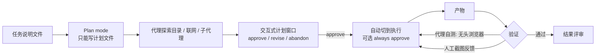

# Grok Build + Grok 4.3 FULL Test：Plan mode、截图反馈与无头浏览器自测

Grok Build

**一句话看懂**：独立开发者 Bijan Bowen 花 44 分钟把 xAI 的终端编码代理 Grok Build 跑了一遍：计划模式会生成带“不做什么”和成功指标的交互式计划；丢一张截图就能让它大幅改进画面；它还会自己开无头浏览器检查错误。问题也不少，包括越界移动文件。

::: info 为什么值得看
这是对 Grok Build 最完整的第三方上手测试之一，好的坏的都录下来了。即使你不用 Grok，它自动生成的计划结构（目标规模、取舍矩阵、non-goals、成功指标）也值得拿来当模板。
:::

::: tip 小白先懂这几个词
- [Grok Build](/glossary#grok-build)：xAI 的终端编码代理。
- [Plan Mode](/glossary#plan-mode)：只读、先出计划给你批准的模式。
- [Always Approve](/glossary#always-approve)：代理做任何操作都不再问你。
- [Non-goals](/glossary#non-goals)：计划里写明“这次不做的事”。
- [无头浏览器](/glossary#headless-browser)：没有窗口、由程序控制的浏览器。
- [子代理](/glossary#subagent)：被派出去干具体小活的代理“分身”。
:::

## 1. 基本信息

<YouTube id="X6SubdG4NuU" title="Grok Build + Grok 4.3 FULL Test" />

| 项目 | 内容 |
|---|---|
| 讲者 / 频道 | Bijan Bowen（独立开发者 / AI 集成顾问，约 7.8 万订阅）／ **Bijan Bowen** |
| 发布日期 | 2026-05-15 |
| 时长 | 44:07 |
| 使用工具 | Grok Build（xAI 终端编码代理，early beta）+ Grok 4.3；plan mode、always approve 模式、subagents、`/imagine` 图像生成、多模态截图输入 |
| 形式 | 独立开发者长时间实测（多个从零构建的任务 + 一个基于现有仓库的任务） |
| 分析依据 | YouTube 自动字幕全文（yt-dlp 获取）+ 视频简介与章节 + 视频画面截图。英文引号内容均为字幕原话。 |

章节：0:46 First Look → 2:16 Technical Look → 5:48 Browser OS Test → 8:19 Result Improvement Test → 18:55 Plan Mode Feedback Test → 21:30 C++ Skate Game Test → 23:36 X Algo Replication Test → 31:04 Multimodal Coding Test → 35:58 Drum Kit Simulation → 40:05 Results Overview。

## 2. 做了什么

xAI 推出的 Grok Build 定位为 Claude Code / Codex 的竞品。它的代理工作流（计划、审批、子代理、自测）在实际任务里表现如何？

讲者用一组固定的测试 prompt 来观察工具和模型：浏览器 OS + 3D 游戏、C++ 滑板游戏、在开源的 X 推荐算法仓库上做演示网页、按图片复刻 UI、鼓机模拟。

涉及的场景：用 AI 代理开发应用（多为 demo 级）、规划 → 执行 → 验证循环、多模态反馈。

## 3. 怎么做的

### 3.1 工具能力速览（讲者读文档 + 实际查看）

- 支持 skills、plugins、marketplace；<Trans zh="它能派生子代理">“it can spawn sub agents”</Trans>。
- 三种模式：plan mode（“write tools will be blocked except for the session plan file”，除了会话计划文件，写入类工具都会被禁用）、默认模式、always approve（讲者类比 Claude Code 的 dangerously skip permissions）。按 `Shift+Tab` 循环切换。
- `/dream` 触发离线记忆整合；`/imagine` 在终端里生成图片 / 视频；支持自定义模型。
- 界面显示上下文用量，本次会话为 512k 上下文。

### 3.2 Plan mode → 审批 → 自动切换执行

**为什么重要**：先看计划再放行，能在代理动手之前发现方向错误，成本最低。

C++ 滑板游戏任务里，代理进入 plan mode 后，自己探索目录、读说明文件、联网查资料，然后弹出可交互的计划窗口，可以<Trans zh="批准、修改或放弃这份计划">“approve, revise, or abandon this specific plan”</Trans>。计划里包括目标代码量、架构取舍矩阵、显式的 non-goals 和成功指标：

::: tr 成功指标是：玩家能滑上 3 到 5 分钟，并成功做出几个让人满意的花式动作。
> "Success metric is the player can skate around for 3 to 5 minutes, land several satisfying tricks"
:::

批准后，它自动退出 plan mode 开始实现。讲者也注意到：他只说了<Trans zh="开启计划模式">“enable plan mode”</Trans>，代理却自己开始读目录和规划，<Trans zh="这些我都没让它做">“I didn't tell it to do any of that”</Trans>。

### 3.3 截图作为反馈信号

**为什么重要**：UI 和游戏的问题，用文字很难描述清楚。一张截图包含的信息远多于一段话。

第一版游戏配色单调。讲者截图丢给代理，说<Trans zh="看看这张图里的结果">“Check the image for the result”</Trans>，修复后评价<Trans zh="仅凭一张截图就有了显著改进">“Significant improvement based off of just the screenshot”</Trans>。不过跳跃、坡道碰撞等逻辑仍有问题。

### 3.4 代理自测：无头浏览器

浏览器 OS 修复任务里，代理先尝试联网找 three.js 的 CDN（失败），随后<Trans zh="在无头浏览器里试加载，检查有没有错误">“test load it in a headless browser to check for errors”</Trans>，改进后再测一次。

<figure class="shot"><figcaption>📷 视频截图 · <a href="https://www.youtube.com/watch?v=X6SubdG4NuU&t=920s" target="_blank" rel="noopener">15:20</a> · 15:20 Grok Build 请求执行一条命令：<Trans zh="在无头 Chrome 里加载 Three.js 地铁场景，检查错误">“Test load the Three.js subway scene in headless Chrome to check for errors”</Trans>，等待讲者选择“Yes, proceed”。</figcaption></figure>

讲者总结时仍希望它更主动地用无头浏览器测试，因为很多网页结果<Trans zh="第一次生成时还是带着错误">“still kind of initially compiled with errors”</Trans>。

### 3.5 在现有仓库上工作：X 推荐算法演示

- 先在 always approve 模式下 clone 仓库，再切回 plan mode 规划；讲者观察到有子代理在运行。
- 计划里，代理主动指出仓库不包含模型权重、embedding 表和真实用户数据，因此要做<Trans zh="一个忠实于原仓库的教学模拟器">“a faithful educational simulator”</Trans>，而不是假装能跑真实推理。实现大约 6 分钟完成，界面引用了对应的源文件。

<figure class="shot"><figcaption>📷 视频截图 · <a href="https://www.youtube.com/watch?v=X6SubdG4NuU&t=1540s" target="_blank" rel="noopener">25:40</a> · 25:40 X 算法任务的计划窗口：顶部是“Approve, revise or abandon the plan”，计划里列出仓库不包含训练好的模型权重、完整生产参数和真实 embedding 表，因此做一个“faithful educational simulator”。</figcaption></figure><figure class="shot"><figcaption>📷 视频截图 · <a href="https://www.youtube.com/watch?v=X6SubdG4NuU&t=1654s" target="_blank" rel="noopener">27:34</a> · 27:34 实现完成后的说明：“What it does (faithful to the repo)”，列出可调权重、完整流水线可视化、实时加权评分等功能，并注明对应源文件。</figcaption></figure>

下图是 Grok Build 的“计划 → 执行 → 验证”循环：

## 4. 结果如何

- **讲者总结**：速度<Trans zh="快得惊人">“incredibly incredibly quick”</Trans>；多模态能力强（截图反馈、按 `/imagine` 生成的参考图做飞行游戏、按 mockup 复刻网页）；X 算法演示的前端被评价为<Trans zh="一个相当复杂、做得很称职的前端">“a really complex and competent front-end”</Trans>。

<figure class="shot"><figcaption>📷 视频截图 · <a href="https://www.youtube.com/watch?v=X6SubdG4NuU&t=2316s" target="_blank" rel="noopener">38:36</a> · 38:36 鼓机模拟任务（Drum Kit Simulation）生成的 3D 鼓组画面。</figcaption></figure>

::: warning 问题与局限
- 一开始没能正确进入 plan mode，代理在“计划”阶段请求写文件。
- 网页类结果第一次常带错误；敌人追踪、滑板跳跃等交互逻辑多次没修好。
- 有越界行为：把可执行文件移出了目标文件夹；在空目录里做鼓机计划时，去读了其他项目的文件。
- 复刻 UI 的页面因为内存暴涨卡死了浏览器。
- 测试以游戏 / demo 为主，属于“模型 + 工具”的综合体验评测，不是大型生产仓库实战；当时需要 $300/月的订阅档才能使用。
:::

## 5. 可借鉴之处

1. **计划里写 non-goals 和可验证的成功指标**：Grok Build 生成的计划结构（目标规模、架构取舍、non-goals、成功指标）值得作为任何代理的计划模板。
2. **截图是低成本、高信号的反馈**：UI / 游戏类任务卡住时，直接给代理截图并指出问题，比文字描述更高效。
3. **要求代理先自测再交付**：在规则文件里写明“前端改动必须用无头浏览器加载并检查 console 错误”，减少“第一次打开就报错”。
4. **always approve 只在隔离目录或容器里用**：本视频出现了移动文件、读取无关目录的行为，说明全自动模式需要沙箱边界。
5. **在现有仓库上，先让代理评估“能做什么、不能做什么”**：像本例中代理指出缺少权重和数据，这种“可行性说明”应该成为计划的必备部分。

### 你可以这样试

- [ ] 在你的计划模板里加两节：`## Non-goals`（这次不做什么）和 `## Success metrics`（怎样算成功，要可验证）。
- [ ] 下次 UI 不满意时，别写长描述，直接截图给代理并圈出问题。
- [ ] 在规则文件里加：“前端改动完成后，用 headless Chrome 加载页面并报告 console 错误。”
- [ ] 想试 always approve，先在一个新建的空目录或容器里跑。

::: details 读完自测（点开看答案）
1. **Grok Build 的 plan mode 限制了什么？** 除了会话计划文件，所有写入类工具都被禁用。
2. **代理在 X 算法仓库上为什么做“教学模拟器”？** 仓库里没有模型权重、embedding 表和真实用户数据，跑不了真实推理。
3. **视频里出现了哪些越界行为？** 把可执行文件移出目标文件夹；去读了其他项目的文件。
:::
