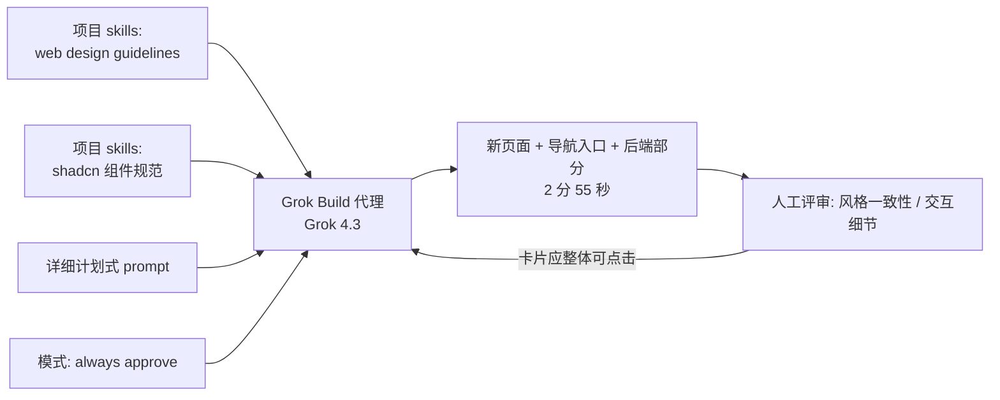

# 14｜I Put Grok Build to the Test：用项目 Skills 约束设计，一次 prompt 生成完整页面

<a class="domain-tag" href="/#domain-practice">🛠️ 主题：真实项目实战与人工把关</a>工具：Grok Build

**一句话看懂**：OrcDev 把自己项目里现成的设计 skills 复制给 Grok Build，再写一份像计划书一样详细的 prompt，2 分 55 秒后得到一个风格和整站一致的新页面。他的结论是：模型是谁不重要，工作流才重要。

::: info 为什么值得看
视频只有 10 分钟，适合快速了解一个新代理工具的上手过程。核心启发是：把设计规范写成 skills 放进仓库，换任何代理工具都能直接复用。
:::

::: tip 小白先懂这几个词
- [Grok Build](/glossary#grok-build)：xAI 的终端编码代理。
- [Skills](/glossary#skills)：教代理做某件事的说明书，可以放在仓库里复用。
- [AGENTS.md](/glossary#agents-md)：多家代理通用的项目说明文件。
- [Always Approve](/glossary#always-approve)：代理不再询问、直接执行。
- [Plan Mode](/glossary#plan-mode)：先出计划再动手的模式。
:::

> 信息来源：YouTube 自动字幕全文（yt-dlp 获取）+ 视频简介与章节 + xAI 官方 Grok Build 文档 / 发布文（docs.x.ai/build/overview、x.ai/news/grok-build-cli，用于核对功能名称）+ 本次新增的视频画面截图。英文引号内容均为字幕或官方页面原话，中文翻译为本站所加（鼠标悬停或点按带虚线的英文即可查看）。

## 1. 基本信息

<YouTube id="W8wECVc3z6E" title="I Put Grok Build to the Test" />

| 项目 | 内容 |
|---|---|
| 链接 | https://www.youtube.com/watch?v=W8wECVc3z6E |
| 讲者 / 频道 | OrcDev（独立开发者，公开构建自己的产品，约 3.2 万订阅）／ **OrcDev** |
| 发布日期 | 2026-05-19 |
| 时长 | 10:20 |
| 使用工具 | Grok Build（early beta）+ Grok 4.3；项目级 skills（web design guidelines、shadcn 相关 skill）、plan / always approve 模式、`/model`、多代理并行 |

章节：0:00 介绍 → 0:26 价格与安装 → 1:18 功能与命令 → 2:57 构建 UI 项目 → 6:14 结果评审 → 7:56 展望。

<figure class="shot"><figcaption>📷 视频截图 · <a href="https://www.youtube.com/watch?v=W8wECVc3z6E&t=25s" target="_blank" rel="noopener">0:25</a> · 0:25 xAI 的 Grok Build 页面：<Trans zh="Grok Build 目前面向 SuperGrok Heavy 订阅用户提供早期测试">“Grok Build is in early beta for SuperGrok Heavy subscribers”</Trans>，下方是一行安装命令。</figcaption></figure>

## 2. 做了什么

一个新的终端编码代理，能不能直接沿用你已有的项目规范（skills），在设计要求很高的真实项目里产出风格一致的页面？

讲者在自己的 Shipper Club 项目里，用一份事先写好的详细 prompt，让 Grok Build 新建一个公开页面“What members are building”，包含卡片、分类筛选、hover 状态、占位数据和后端部分。

涉及的场景：上下文工程（复用 skills）、全栈功能开发、并行代理（简要提及）。

## 3. 怎么做的

### 3.1 复用已有 skills 作为设计上下文

**为什么重要**：设计规范如果只存在于你脑子里，每换一个工具都要重新教一遍。写成 skills 放进仓库，任何代理都能读。

讲者把项目已有的 UI skills 复制到 Grok Build 读取的目录：

::: tr 这里能看到 Grok 目录，里面放着我的 web design guidelines（网页设计规范）和 shadcn skill。
> "here we can see the Grok directory, and here I have web design guidelines and Shed C and skill."
:::

（字幕里的 “Shed C” 应为 shadcn 的语音识别误差。）xAI 官方发布文写道：

::: tr 你的 AGENTS.md、插件、hooks、skills 和 MCP server 都能开箱即用。
> "Your AGENTS.md, plugins, hooks, skills, and MCP servers all work out of the box."
:::

<figure class="shot"><figcaption>📷 视频截图 · <a href="https://www.youtube.com/watch?v=W8wECVc3z6E&t=240s" target="_blank" rel="noopener">4:00</a> · 4:00 项目的文件树里同时有 .agents、.claude、.cursor、.grok 等目录，讲者把现成的 skills 复制到了 .grok 下。</figcaption></figure>

### 3.2 先写一份计划式的长 prompt

::: tr 做这么大的东西时，我总是先把计划写好。
> "I'm always planning things up when I'm creating something this big."
:::

prompt 里包含：页面目标、每张卡片的字段（项目名、成员名、简介、分类徽章等）、筛选、细微的 hover 效果、链接先用 `#` 占位、交互细节。

<figure class="shot"><figcaption>📷 视频截图 · <a href="https://www.youtube.com/watch?v=W8wECVc3z6E&t=340s" target="_blank" rel="noopener">5:40</a> · 5:40 讲者把整段 prompt 粘进 Grok Build，开头是“Create a new public &quot;What Members Are Building&quot; page for Shipper Club”，代理开始思考。</figcaption></figure>

### 3.3 选好模式，一次执行

- `Shift+Tab` 在默认、plan、always approve 之间切换。讲者选了 always approve（“I'm going like yoloing this”，我就放手赌一把）。
- 结果：<Trans zh="2 分 55 秒后完成">“it's done after 2 minutes and 55 seconds”</Trans>。

### 3.4 评审产物

- 好的地方：自动在导航栏加了入口（prompt 没要求）；文案<Trans zh="一点都不像 AI 写的">“not AI-ish at all”</Trans>；遵循了项目的设计风格，复用了落地页上的细节；额外加了“本月精选”区块。
- 需要改的地方：整张卡片应该都可以点击，而不只是里面的一个 ghost 按钮。

<figure class="shot"><figcaption>📷 视频截图 · <a href="https://www.youtube.com/watch?v=W8wECVc3z6E&t=542s" target="_blank" rel="noopener">9:02</a> · 9:02 生成的“What Members Are Building”页面：顶部是分类筛选（All、SaaS、AI Tools、Design 等），下面是“Highlighted this month”精选区块，再往下是成员项目卡片。</figcaption></figure>

下图是这次构建的输入和输出：

### 3.5 讲者的工作流观点

::: tr 用哪个模型并不重要，重要的是你的工作流。
> "it doesn't matter which model we are using. It matters like your workflow is something that matters"
:::

他还提到 `/model` 可以切换到其他提供商的模型；他试过<Trans zh="三四个代理同时做不同的任务">“three or four different agents working on different tasks”</Trans>，主观感受是协作良好（没有展示细节）。

## 4. 结果如何

- **可见结果**：一次 prompt，2 分 55 秒生成完整页面，风格和项目一致，讲者表示<Trans zh="印象深刻">“impressed”</Trans>。

::: warning 局限与注意
- 视频较短，只有一个构建任务；多代理并行只是口头描述，没有演示。
- 讲者在视频里引用了自己的推文：<Trans zh="Grok Build 很棒，但模型离它该有的水平还差得远">“Grok build is awesome, but the model is still far from where it where it needs to be”</Trans>。
- 当时是 early beta，订阅价格较高（讲者提到 $300/月，另有限时优惠）。
- 没有展示测试、类型检查等验证环节，效果只靠视觉评审。
:::

## 5. 可借鉴之处

1. **把设计规范做成 skills 放进仓库**：换代理工具时直接复用，这也是“模型无关工作流”的核心资产。
2. **大功能先写“计划式 prompt”**：字段、交互、占位策略、风格要求一次写清，代理一次成型的概率更高。
3. **评审清单里加一项“代理自作主张的部分”**：本例中额外的导航入口、精选区块都是 prompt 没要求的，要逐项决定保留还是删除。
4. **always approve 用于低风险的 UI 任务**，并配合 git 分支随时回滚。
5. **补上验证环节**：让代理在完成后跑类型检查、构建和截图对比，而不是只靠人眼评审。

### 你可以这样试

- [ ] 把团队的设计规范（颜色、间距、组件用法）写成一个 `SKILL.md`，放到 `.claude/skills/` 或你所用代理读取的目录。
- [ ] 下一个页面需求，先按“目标 / 字段 / 交互 / 占位 / 风格”五段写好 prompt 再交给代理。
- [ ] 生成后列出所有 prompt 没要求、代理自己加的东西，逐项决定去留。
- [ ] 在 prompt 末尾加一句：“完成后运行类型检查和构建，并截图给我。”

::: details 读完自测（点开看答案）
1. **讲者为什么能在新工具里得到风格一致的页面？** 他把项目里现成的设计 skills 复制给了 Grok Build。
2. **评审时发现了什么需要改的地方？** 整张卡片应可点击，而不只是一个 ghost 按钮。
3. **这期视频缺少什么环节？** 测试、类型检查等验证，只做了视觉评审。
:::
