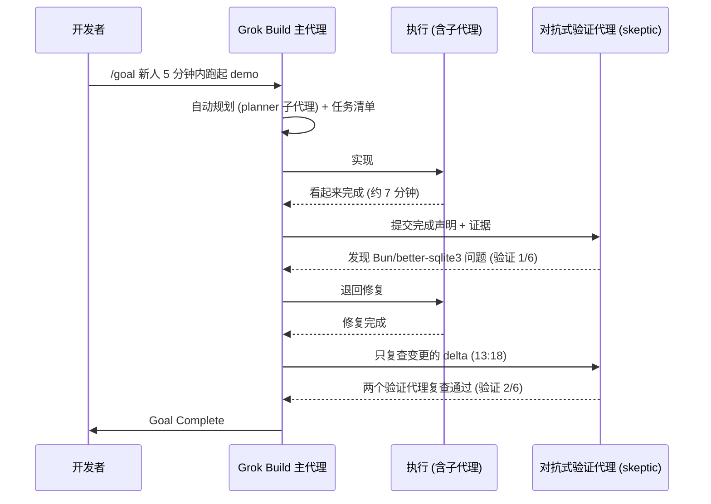

# Grok Build Spawned 57 Agents in 3 Minutes：Plan mode、并行子代理与 `/goal` 对抗式验证

Grok Build

**一句话看懂**：Arcade 的工程师给 Grok Build 出了三道题：用计划模式加一个 dry-run 参数；派 57 个子代理并行审查 57 个文件；用 `/goal` 完成一个开放目标。最精彩的是第三题：代理说“完成了”之后，一个专门唱反调的验证代理找出了真实问题，修完后只复查改动部分，第二轮才放行。

::: info 为什么值得看
“谁来确认代理真的做完了”是所有长任务的核心问题。这期视频完整展示了一次“声称完成 → 被证伪 → 修复 → 复查 delta → 通过”的过程，画面上还能看到验证代理的提示词原文。
:::

::: tip 小白先懂这几个词
- [Plan Mode](/glossary#plan-mode)：只读、先出计划再动手的模式。
- [子代理](/glossary#subagent)：主代理派出去、有独立上下文的“分身”。
- [/goal](/glossary#goal)：给代理一个可验证的目标，直到达成才停。
- [对抗式验证（skeptic）](/glossary#adversarial-review)：专门去证明“没做完”的验证代理。
- [Dry Run](/glossary#dry-run)：只显示将要做什么、不真正执行。
- [Persona](/glossary#persona)：给子代理配的角色和关注点。
:::

## 1. 基本信息

<YouTube id="1NwO2dPzwRM" title="Grok Build Spawned 57 Agents in 3 Minutes" />

| 项目 | 内容 |
|---|---|
| 讲者 / 频道 | Thierry Damiba（Arcade.dev Member of Technical Staff）／ **Arcade**（企业 AI 代理 actions runtime 厂商的官方频道） |
| 发布日期 | 2026-09-09 |
| 时长 | 18:57 |
| 使用工具 | Grok Build + Grok 4.5（简介：“This walkthrough was recorded with Grok 4.5.”，本演示用 Grok 4.5 录制）；plan mode、并行 subagents、`/goal`、对抗式验证代理 |
| 利益相关 | 视频结尾部分为 Arcade 的产品观点（代理离开代码仓库后的权限与审计） |
| 分析依据 | ① **YouTube 英文自动字幕**（后补获取；措辞明显不通顺，常把 Grok 写成 “he”，疑似经过机器翻译或自动生成，因此只用来核对流程细节和时间点，**不做逐字引用**）；② 视频简介与官方章节（YouTube 元数据）；③ **视频画面截图**，其中终端里清晰可读的 prompt 和输出按画面原文引用；④ xAI 官方页面 *Introducing /goal*（x.ai/news/introducing-goal）与 *Introducing Grok Build*（x.ai/news/grok-build-cli）；⑤ Grok Build 开源仓库用户手册（github.com/xai-org/grok-build 下 `docs/user-guide/04-slash-commands.md`、`16-subagents.md`、`19-plan-mode.md`）。凡来自官方文档的机制说明均已标注，**不代表视频中逐字出现**。 |

官方章节：00:00 用 plan mode 加 dry-run 功能 → 02:39 并行派生子代理 → 04:47 57 个子代理完成 → 05:11 测试自主 goal 模式 → 08:20 目标完成、开始验证 → 09:27 skeptic 发现真实问题 → 13:18 只复查变更的 delta → 14:42 第二轮验证通过 → 14:50 评价 → 16:06 为什么 Git 让编码代理的自主性显得安全 → 17:20 代理离开仓库后需要什么。

## 2. 做了什么

编码代理已经可以一次派生几十个子代理、长时间自主执行。这样的自主性在多大程度上可信？谁来验证“完成”？

据简介，讲者对 Grok Build 做了三项测试：

1. 在 plan mode 下为项目增加 dry-run 功能；
2. 用并行子代理审查 57 个文件；
3. 给一个开放式目标（贡献者 onboarding），走完实现和验证。

涉及的场景：多代理 / 子代理团队自动审查；长时任务；规划 → 执行 → 验证循环。

## 3. 怎么做的

### 3.1 Plan mode（测试 1）

据字幕：项目是讲者的一个 Next.js demo agent，需求是加一个 “dry run” 标志。切到 planning mode 后，Grok 先推理“dry run 在这里意味着什么”，然后写计划。计划可以**批准、要求修改、评论或复制**。讲者批准后进入实现，按 Ctrl+E 可以展开推理过程。最后 Grok 给出一条试运行命令（00:00–02:39）。

讲者的吐槽：速度太快跟不上；界面突出“模型在想什么、调了哪些工具”，代码 diff 反而不显眼；有些命令失败了，但看不到失败详情。

官方手册对 plan mode 的说明：除计划文件外只读，<Trans zh="对其他任何文件的修改都会被直接拒绝……在所有权限模式下都如此，包括 always-approve">“edits to any other file are rejected outright … This holds in every permission mode, including always-approve”</Trans>。计划包含变更理由（Context）、推荐方案、关键文件路径、可复用的现有函数等，经批准后才进入实现。

### 3.2 并行子代理审查 57 个文件（测试 2）

**为什么重要**：一个代理审 57 个文件，上下文会被撑爆。每个文件一个子代理，各自在干净的上下文里工作，也不会互相改到同一个文件。

简介：<Trans zh="xAI 刚刚允许一个 AI 编码代理在同一个代码库上启动 57 个自己的副本">“xAI just gave an AI coding agent permission to spin up 57 copies of itself on the same codebase”</Trans>。

画面上讲者输入的 prompt 原文：

::: tr 并行审查这个仓库里的每一个文件。为每个文件写一份配套的 NOTES-<文件名>.md，概述这个文件做什么、有哪些依赖，并给出一条改进建议。每个文件用单独的子代理，避免互相冲突。
> Review every file in this repo in parallel. For each one, write a companion NOTES-&lt;filename&gt;.md summarizing what the file does, its dependencies, and one improvement suggestion. Use separate subagents per file so they don't conflict.
:::

<figure class="shot"><figcaption>📷 视频截图 · <a href="https://www.youtube.com/watch?v=1NwO2dPzwRM&t=200s" target="_blank" rel="noopener">3:20</a> · 3:20 讲者输入上面的 prompt 后，Grok 先列出要处理的文件，再<Trans zh="每个文件一个子代理，分批启动">“launching the first batch of subagents, one per file”</Trans>。</figcaption></figure>

据字幕：Grok 没有一次启动 57 个，而是**分批**派生。子代理列表显示在界面顶部，带每个代理的运行时长，可以点进去看单个子代理在做什么。全部完成用了大约 3 分钟，每个文件都得到一份配套说明（02:39–04:47）。

<figure class="shot"><figcaption>📷 视频截图 · <a href="https://www.youtube.com/watch?v=1NwO2dPzwRM&t=290s" target="_blank" rel="noopener">4:50</a> · 4:50 画面显示“Ran 57 subagents”，随后“All 57 subagents launched”，主代理等待全部完成后，逐个核对 NOTES 文件是否都已写出。</figcaption></figure>

官方手册对子代理机制的说明（不是视频原文）：子代理是<Trans zh="独立的子会话">“independent child sessions”</Trans>，各有独立的上下文窗口，结束后向父会话汇报摘要；内置类型包括 `general-purpose`、`explore`（不改文件）、`plan`（不改文件）；还可以叠加 persona 控制输出格式和关注点。

### 3.3 `/goal` + 对抗式验证（测试 3，视频最有价值的部分）

**为什么重要**：做事的代理天然倾向于认为自己做完了。让另一个代理专门“证伪”，才能抓住它自己看不到的问题。

简介描述的过程：

::: tr 当目标看起来已经完成时，一个对抗式验证代理发现了真实的问题，把工作退回去修复，然后再次检查改动的那部分（delta）。
> "When the goal looks complete, an adversarial verification agent finds a real issue, sends the work back for a fix, and checks the changed delta again."
:::

画面上讲者输入的 `/goal` 原文：

::: tr 让这个仓库达到这样的状态：第一次来的贡献者 clone 下来后，5 分钟内就能跑起 demo。修好安装流程里任何坏掉的地方，确认 README 里的安装步骤真的能用，并把你一路上遇到的问题写成一个故障排查章节。
> /goal Get this repo to a state where a first-time contributor can clone it and run the demo in under five minutes: fix anything broken in setup, verify the install steps in the README actually work, and add a troubleshooting section for whatever you hit along the way.
:::

据字幕的细节（05:11–14:50）：

- **自动规划**：`/goal` 自动进入规划。planner 子代理研读文档和 setup 脚本，让计划贴合新手的真实步骤。之后生成任务清单，依次处理 `.gitignore` 问题、模拟干净环境安装、数据库迁移、环境变量，并反复重跑测试。
- **第一次声称完成**：约 7 分钟、约 15 万 tokens。随后自动启动 goal skeptic（验证代理）。
- **验证代理的提示词**：画面上能看到子代理标签“General goal achievement skeptic · grok-4.5”，提示词开头是：

::: tr 你是 xAI Grok Build harness 的“对抗式验证者”。下面的工作不是你做的。你的任务是证伪“目标已经达成”。如果不确定，默认判定为“已证伪”（refuted: true）……（画面中后文被截断）
> You are an **adversarial verifier** for the xAI Grok Build harness. You are NOT the agent that produced the work below. Your job is to **refute** that the objective has been met. **Default to `refuted: true` if uncertain** – a …
:::

<figure class="shot"><figcaption>📷 视频截图 · <a href="https://www.youtube.com/watch?v=1NwO2dPzwRM&t=575s" target="_blank" rel="noopener">9:35</a> · 9:35 验证子代理“General goal achievement skeptic”启动，提示词要求它证伪目标已达成、不确定时默认判为已证伪。</figcaption></figure>

- **验证发现真实问题**：README 的路径只适用于 Bun；better-sqlite3 在 Bun 下无法工作，Node 下可以。界面显示验证次数为“1/6”，讲者推测有最多 6 次验证的上限，避免无限循环。
- **修复后复查**：验证代理拿到上一轮的记录、标记过的缺口和证据，只做 **delta check**，对照当前 README 复查 Bun / Node 的缺口。第二轮还派了两个验证代理，提示词强调“你不是做这项工作的代理，你的任务是证伪它”。在 2/6 时通过。
- **总耗时**：讲者总结，从开始到确认目标真正完成约 23 分钟。

<figure class="shot"><figcaption>📷 视频截图 · <a href="https://www.youtube.com/watch?v=1NwO2dPzwRM&t=884s" target="_blank" rel="noopener">14:44</a> · 14:44 “Skeptic gaps fixed”汇总：复现的根因是只有 Bun、PATH 上没有 node 时，Quick Start 第 4 步报错“&#x27;better-sqlite3&#x27; is not yet supported in Bun”；改动包括 README 写明需要 Node.js 18+、新增故障排查章节、调整 db:setup 脚本等；复验表显示 bun run test:setup 34/34 通过。</figcaption></figure>

下图是测试 3 的完整交互：

### 3.4 讲者的观点：Git 是编码代理的安全带

简介原文：

::: tr Anthropic、OpenAI 和 xAI 都收敛到了同一套流程：计划、批准、看 diff、隔离、回滚。Git 让编码代理的错误看得见、也能恢复。
> "Anthropic, OpenAI, and xAI have all converged on plan, approve, diff, isolate, and revert. Git makes coding-agent mistakes visible and recoverable"
:::

因此，几十个代理并行改代码，反而比一个代理发邮件、改 CRM 或转账更让人放心。而：

::: tr 代理一旦离开代码仓库，Git 就不再是它的安全带了。
> "The moment an agent leaves the repo, Git stops being its seatbelt."
:::

## 4. 结果如何

- **三项测试都完成**：dry-run 标志加上了，并给出试运行命令；57 个子代理约 3 分钟完成审查和说明；goal 模式第一次声称完成后，被验证代理发现 Bun / Node 兼容问题，修复后对 delta 二次验证通过，全程约 23 分钟。
- **讲者评价**：给出最高评价，最看重 tool call 的透明展示、子代理，以及完成后自动派验证代理的严谨。槽点是速度太快难以跟随、代码 diff 不够突出、失败命令看不到详情、两处 token 计数对不上。

::: warning 局限与注意
- 频道属于 Arcade 公司，结尾（约 15:55 起）转为产品立场：Git 只保护代码，代理操作仓库外的系统需要另外的执行 / 授权层。
- 测试项目是一个 demo 仓库，不能代表大型存量代码库的表现。
- 字幕质量差，细节以简介、章节和画面上清晰可读的文字为准。
:::

## 5. 可借鉴之处

1. **“完成”必须由独立验证者确认**：不管用哪个工具，都可以在长任务末尾加一个只读的 skeptic 子代理，要求它复现结果、给出证据，否则任务不算完成。画面上的那段提示词（“You are NOT the agent that produced the work… Default to refuted: true if uncertain”）可以直接借用。
2. **复查只看 delta**：修复后的二次验证只审变更部分，降低成本，也减少验证代理“重新挑刺”的噪声。
3. **大规模审查用“一文件一子代理”的扇出**：只读的 explore 类子代理并行审查，主代理汇总；给出统一的审查标准和输出格式（persona）。
4. **把 plan → approve → diff → isolate → revert 当成底线流程**：所有代理改动都走分支或 worktree，确保看得见、能回滚。
5. **代理一旦要操作仓库外的系统（邮件、CRM、支付），要另建权限和审计层**：Git 只保护代码。

### 你可以这样试

- [ ] 写一个只读的 skeptic 子代理，提示词开头用：“You are NOT the agent that produced the work. Your job is to refute that the objective has been met. Default to refuted if uncertain.”
- [ ] 给一个长任务写 `/goal`，目标要能被别人复现验证（例如“新人 5 分钟内跑起 demo”）。
- [ ] 复制上面那条“每个文件一个子代理写 NOTES”的 prompt，在一个小仓库上试一次，看 NOTES 质量。
- [ ] 修复后让验证代理只看 git diff，而不是重审整个仓库。

::: details 读完自测（点开看答案）
1. **验证代理发现了什么问题？** README 的步骤只在有 Node 时可行；只装 Bun 时 better-sqlite3 无法工作。
2. **第二轮验证为什么只看 delta？** 降低成本，也避免验证代理对已确认的部分重新挑刺。
3. **讲者为什么说 Git 是“安全带”？** 代理在仓库里的错误能被看见、能回滚；离开仓库后就没有这层保护了。
:::
