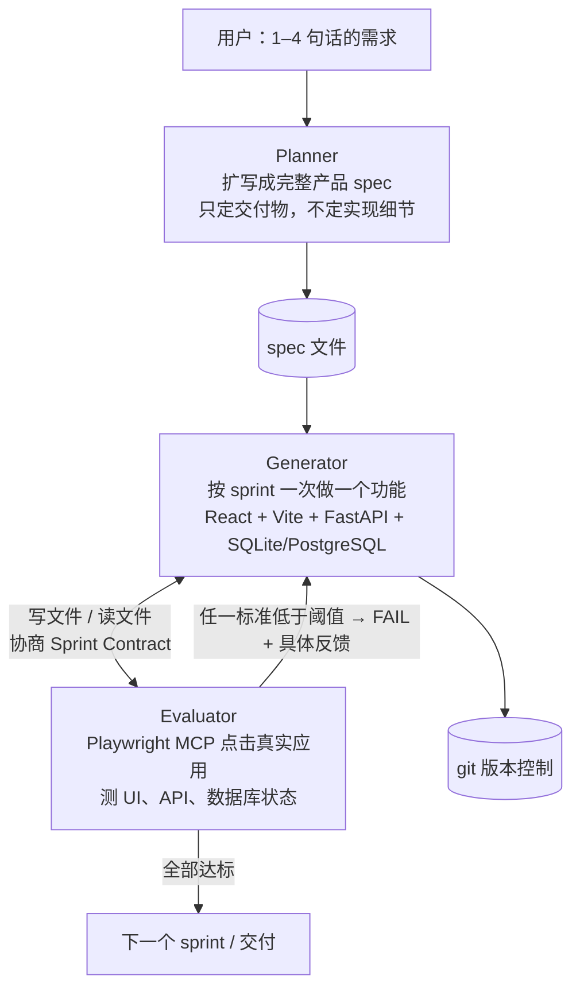
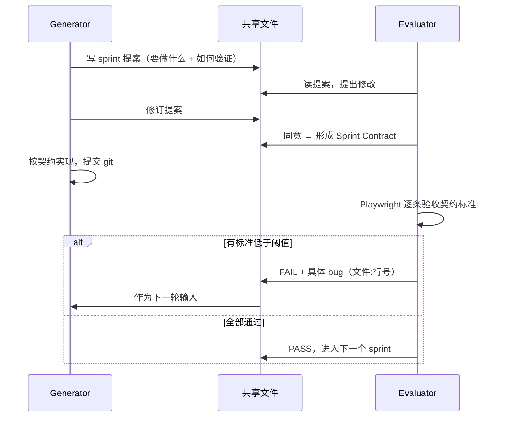

# 16｜Planner / Generator / Evaluator：Anthropic 怎样让 Claude 连续几小时自己做出一个全栈应用

<a class="domain-tag" href="/guide/harness">阶段：6 看原理 · Harness 与内部机制</a>类型：文章工具：Claude Code

**一句话看懂**：让 AI 自己给自己打分，它几乎总说“很好”。Anthropic Labs 的做法是把“干活的”和“打分的”拆成两个代理，再加一个把一句话需求扩写成产品规格的 Planner，结果 6 小时做出的游戏编辑器真能玩，而单代理 20 分钟做出的版本核心功能是坏的。

::: info 为什么值得看
这是 Anthropic 官方工程博客 2026 年 3 月的文章，接续 2025 年 11 月的《Effective harnesses for long-running agents》。它给出了**完整的成本/时长数据表**、**Evaluator 发现的真实 bug 原文**，以及“模型升级后该拆掉哪些脚手架”的方法论。想做长时任务或“做与查分离”的人，这是目前最具体的一手资料。
:::

::: tip 小白先懂这几个词
- [Harness（代理外壳）](/glossary#harness)：包在模型外面、负责循环调用、给工具、管上下文的那层程序。
- [Generator / Evaluator（生成者 / 评估者）](/glossary#generator-evaluator)：一个负责写，一个负责挑毛病，灵感来自 GAN（生成对抗网络）。
- [Sprint Contract（冲刺契约）](/glossary#sprint-contract)：动手前，写代码的代理和验收的代理先约定“做到什么算完成”。
- [Context Reset（上下文重置）](/glossary#context-reset)：清空上下文、开一个全新代理，再靠交接文档接着干；和“压缩（compaction）”不同。
- [Context Anxiety（上下文焦虑）](/glossary#context-anxiety)：模型觉得上下文快满了，就提前草草收工。
- [Playwright MCP](/glossary#playwright)：让代理能真的打开浏览器、点按钮、截图的工具。
:::

> 信息来源：Anthropic Engineering 博客原文全文（WebFetch 抓取于 2026-10-09）。文中英文引用均为原文摘录，中文翻译为本站所加。原文中的截图与视频版权归 Anthropic，本站未转载。

## 1. 基本信息

<SourceCard type="文章" title="Harness design for long-running application development" author="Prithvi Rajasekaran（Anthropic Labs）" date="2026-03-24" url="https://www.anthropic.com/engineering/harness-design-long-running-apps" />

| 项目 | 内容 |
|---|---|
| 链接 | https://www.anthropic.com/engineering/harness-design-long-running-apps |
| 类型 | 官方工程博客（文章） |
| 作者 | Prithvi Rajasekaran（Anthropic Labs 团队） |
| 发布日期 | 2026-03-24 |
| 使用工具 | Claude Agent SDK、Claude Opus 4.5 / 4.6、Playwright MCP、git |
| 前作 | [Effective harnesses for long-running agents](https://www.anthropic.com/engineering/effective-harnesses-for-long-running-agents)（2025-11，Initializer + Coding Agent 两段式） |

## 2. 做了什么

作者想同时解决两个问题：让 Claude 做出**有设计感的前端**，以及让它**无人值守地做完整个应用**。前作的“初始化代理 + 一次做一个功能的编码代理”已经能跑多个会话，但遇到两个顽疾：

1. **上下文越长越跑偏**，部分模型还有“上下文焦虑”：<Trans zh="在它们以为快到上下文上限时，就开始提前收尾">“they begin wrapping up work prematurely as they approach what they believe is their context limit”</Trans>。
2. **自评过于宽容**：<Trans zh="让代理评价自己产出的东西时，它们往往会自信地夸奖——哪怕在人看来质量明显平庸">“When asked to evaluate work they've produced, agents tend to respond by confidently praising the work—even when, to a human observer, the quality is obviously mediocre.”</Trans>

目标：设计一套能连续跑几个小时、产出“真能用”的全栈应用的多代理 harness，并弄清楚**哪些组件是真正承重的**。

## 3. 怎么做的

### 3.1 先在前端设计上验证“做与查分离”

**为什么先做前端**：设计好坏没有单元测试可跑，自评偏宽的问题在这里最明显。

作者把“好看吗”这种主观问题，拆成 4 条可打分的标准，**同时写进 Generator 和 Evaluator 的提示词**：

| 标准 | 原文要点 | 白话 |
|---|---|---|
| Design quality | <Trans zh="设计是否像一个整体，而不是零件的堆砌？">“Does the design feel like a coherent whole rather than a collection of parts?”</Trans> | 有没有统一的气质 |
| Originality | <Trans zh="未修改的现成组件——或者像白色卡片上叠紫色渐变这种明显的 AI 生成痕迹——在这一项不及格">“Unmodified stock components—or telltale signs of AI generation like purple gradients over white cards—fail here.”</Trans> | 拒绝“AI 味”模板 |
| Craft | 字体层级、间距、配色、对比度 | 基本功 |
| Functionality | 用户能否不靠猜就找到主要操作 | 好不好用 |

关键做法：

- **加权**：设计感和原创性权重更高，因为 Claude 在后两项默认就做得不错。
- **校准**：用带详细分数拆解的 few-shot 示例校准 Evaluator，减少分数漂移。
- **让评估者真的去“用”**：Evaluator 配了 Playwright MCP，会自己打开页面、截图、研究实现后再打分。
- **每轮做战略决策**：Generator 看完评语后选择“继续打磨”或“整体换方向”。每次生成跑 5–15 轮，最长 4 小时。

::: tip 一个意外发现
评分标准的措辞本身就会影响产出。原文：<Trans zh="加入“最好的设计具有博物馆级品质”这类措辞，会把设计推向某种特定的视觉趋同">“Including phrases like "the best designs are museum quality" pushed designs toward a particular visual convergence”</Trans>。写评分标准时，用词就是提示词。
:::

### 3.2 扩展到全栈：三代理架构

每个角色都是为了补上前一版暴露的缺口：

- **Planner**：前作要求用户先写好详细 spec。现在 Planner 把一句话扩成完整 spec，并被要求<Trans zh="对范围保持雄心，专注产品语境和高层技术设计，而不是具体实现细节">“be ambitious about scope and to stay focused on product context and high level technical design rather than detailed technical implementation”</Trans>。原因：规格里写错的技术细节会一路传染到实现。
- **Generator**：沿用“一次一个功能”，按 sprint 推进，每个 sprint 结束先自检再交给 QA。
- **Evaluator**：像真实用户一样点击整个应用，按“产品深度、功能、视觉设计、代码质量”打分。**每条标准都有硬阈值，任何一条不达标，这个 sprint 就判失败**。

### 3.3 Sprint Contract：动手前先对齐“完成的定义”

**为什么需要**：spec 故意写得很高层，从“用户故事”到“可测试的实现”之间有缺口。

流程是：Generator 提出“我要做什么、怎么验证”，Evaluator 审核，两边反复修改直到同意。**代理之间通过文件沟通**：一方写文件，另一方读了在同一个文件里回复，或者另写一个新文件。

### 3.4 调教 Evaluator：读日志、找分歧、改提示词

原文很坦诚：<Trans zh="开箱即用的 Claude 是个很差的 QA 代理">“Out of the box, Claude is a poor QA agent.”</Trans> 早期它会发现真问题，然后<Trans zh="说服自己这些问题没什么大不了，照样批准">“talk itself into deciding they weren't a big deal and approve the work anyway”</Trans>，测试也流于表面。

调优方法只有一个循环：**读 Evaluator 的日志 → 找到它和你判断不一致的例子 → 改 QA 提示词**，重复多轮。

### 3.5 模型升级后，逐个拆掉脚手架

核心原则：

::: tr harness 里的每个组件，都编码了一个“模型自己做不到什么”的假设；这些假设值得压力测试，因为它们可能本来就错，也可能随着模型进步很快过时。
> "every component in a harness encodes an assumption about what the model can't do on its own, and those assumptions are worth stress testing, both because they may be incorrect, and because they can quickly go stale as models improve."
:::

作者第一次“大刀阔斧”删减失败了，分不清哪些组件在承重；于是改成**一次只删一个组件，看结果变化**。换到 Opus 4.6 后：

- **删掉 sprint 结构**：模型已经能连续两个多小时保持连贯。
- **保留 Planner**：没有它，Generator 会“范围不足”，直接开干，做出的功能更少。
- **Evaluator 改成最后跑一遍**：它的价值取决于任务是否超出模型单独能稳定完成的边界。
- 上一版 Opus 4.5 也让作者去掉了 context reset，改用 Agent SDK 自带的自动压缩，跑成一个连续会话。

## 4. 结果如何

**实验 1：复古游戏编辑器**（Opus 4.5，提示词只有一句话）

::: tr 做一个 2D 复古游戏制作器，功能包括关卡编辑器、精灵编辑器、实体行为，以及可试玩的测试模式。
> Create a 2D retro game maker with features including a level editor, sprite editor, entity behaviors, and a playable test mode.
:::

| Harness | 时长 | 成本 | 结果 |
|---|---|---|---|
| 单代理（Solo） | 20 分钟 | $9 | 布局浪费空间；**实体不响应输入，游戏是坏的** |
| 完整 harness | 6 小时 | $200 | Planner 扩成 16 个功能、10 个 sprint；**能真正移动角色玩游戏**，还内置了 AI 生成关卡 |

Evaluator 发现的 bug 非常具体（原文节选）：

| 契约标准 | Evaluator 发现 |
|---|---|
| 矩形填充工具可以拖拽填充区域 | <Trans zh="失败——工具只在拖拽起点/终点放置图块，没有填充区域。fillRectangle 函数存在，但在 mouseUp 时没有被正确触发。">“FAIL — Tool only places tiles at drag start/end points instead of filling the region. `fillRectangle` function exists but isn't triggered properly on mouseUp.”</Trans> |
| 可以通过 API 重排动画帧 | <Trans zh="失败——PUT /frames/reorder 路由定义在 /{frame_id} 路由之后，FastAPI 把 reorder 当作 frame_id 整数解析，返回 422。">“FAIL — `PUT /frames/reorder` route defined after `/{frame_id}` routes. FastAPI matches 'reorder' as a frame_id integer and returns 422”</Trans> |

光是 Sprint 3 就有 27 条验收标准。

**实验 2：浏览器里的 DAW 音乐工作站**（Opus 4.6，简化后的 harness）

::: tr 用 Web Audio API 在浏览器里做一个功能完整的 DAW。
> Build a fully featured DAW in the browser using the Web Audio API.
:::

| 阶段 | 时长 | 成本 |
|---|---|---|
| Planner | 4.7 分钟 | $0.46 |
| Build 第 1 轮 | 2 小时 7 分 | $71.08 |
| QA 第 1 轮 | 8.8 分钟 | $3.24 |
| Build 第 2 轮 | 1 小时 2 分 | $36.89 |
| QA 第 2 轮 | 6.8 分钟 | $3.09 |
| Build 第 3 轮 | 10.9 分钟 | $5.88 |
| QA 第 3 轮 | 9.6 分钟 | $4.06 |
| **合计** | **3 小时 50 分** | **$124.70** |

QA 仍然抓到了“只做了展示、没做交互”的问题，比如<Trans zh="录音仍然只是个桩：按钮能切换，但没有麦克风采集">“Audio recording is still stub-only (button toggles but no mic capture)”</Trans>。

::: warning 局限与注意
- 成本高：完整 harness 比单代理贵 20 倍以上。
- QA 仍有盲区：小的布局问题、深层功能里的 bug 没被测到；Claude 听不见声音，音乐品味类反馈基本无效。
- 产品直觉问题（例如“先建精灵再建关卡”的引导缺失）harness 没解决，作者认为这是基础模型的短板。
- 只有两个演示项目，都是全新项目（greenfield），没有存量代码库的数据。
:::

## 5. 可借鉴之处

1. **把“做”和“查”拆成两个代理**：调一个独立的、多疑的 Evaluator，比让 Generator 批评自己容易得多。
2. **把主观标准写成可打分的条目**，并把同一份标准同时给生成者和评估者；用 few-shot 打分样例校准。
3. **Evaluator 要能“真用”产品**：给它浏览器（Playwright MCP）或 API 调用能力，而不是只看代码或截图。
4. **动手前先签 Sprint Contract**：让实现方提出“完成定义 + 验证方法”，验收方审核。这能填平高层 spec 和可测实现之间的缝。
5. **每次模型升级都做一次“拆脚手架”实验**：一次删一个组件，比较结果；把省下的预算投到新能力上。

### 你可以这样试

- [ ] 给你的下一个前端任务写 4 条评分标准（参考 Design quality / Originality / Craft / Functionality），同时贴给写代码的会话和一个新开的“评审”会话。
- [ ] 给评审会话接上 Playwright MCP，要求它“先点击每个主要按钮再打分”，并按“标准 / FAIL 原因 / 文件:行号”输出。
- [ ] 在开始实现前，让代理先写一份 `contract.md`：列出本轮要做的功能和每条的验证步骤，你或评审代理审过再动手。
- [ ] 记录一次单代理和“生成 + 评审”两种方式的时长和花费，自己算算值不值。

::: details 读完自测（点开看答案）
1. **为什么不直接让写代码的代理自己评审？** 代理评价自己的产出时会系统性地偏宽，单独调一个多疑的评估者更容易。
2. **Sprint Contract 解决什么问题？** spec 故意写得高层，契约在动手前把“用户故事”翻译成可测试的完成标准，避免做错方向。
3. **换到 Opus 4.6 后作者删掉了什么、保留了什么？** 删掉 sprint 结构，Evaluator 改为最后一次性验收；保留 Planner，因为没有它 Generator 会把范围做小。
:::
