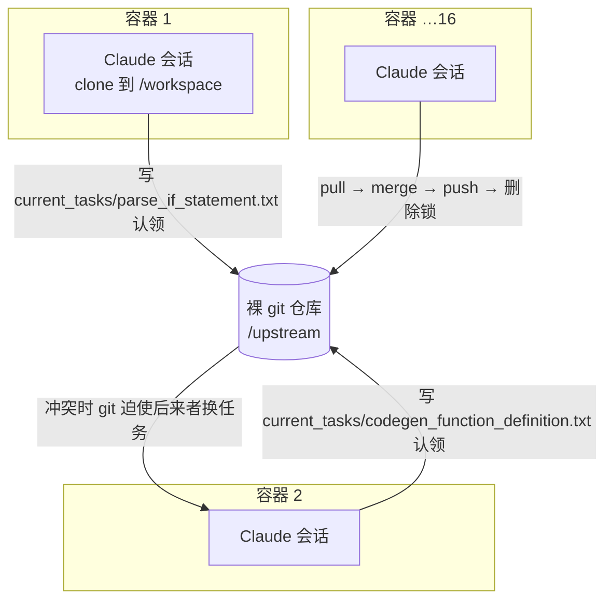
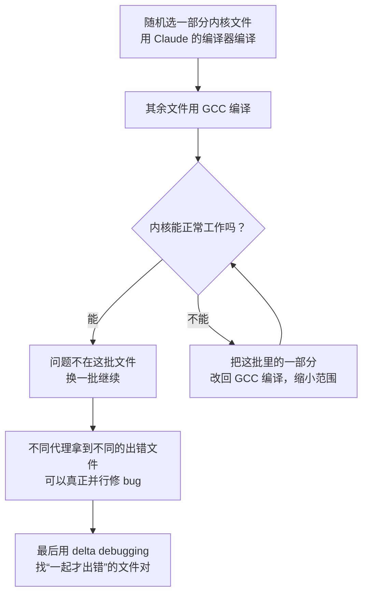

# 16 个 Claude 并行写出 10 万行 C 编译器：没有调度中心的 Agent Teams 是怎么协作的

<div class="meta-tags"><span class="tool-tag tool-claude">Claude Code</span></div>

<div class="hook">

**一句话看懂**：Anthropic 研究员 Nicholas Carlini 把 16 个 Claude 放进各自的 Docker 容器，用一个死循环脚本加一个共享 git 仓库让它们“自己找活干”，两周、约 2,000 个会话、不到 2 万美元，做出了能编译 Linux 内核的 Rust 版 C 编译器。他说大部分功夫花在了**测试和环境**上，而不是提示词。

</div>

::: info 为什么值得看
这是目前公开记录最完整的“多代理长时自主开发”实验之一，作者把 harness 脚本、锁机制、测试设计全写出来了。最有价值的不是“10 万行”这个数字，而是那几条**为 AI 设计测试**的经验：别刷屏、给 `--fast` 采样、用已知正确的系统当“裁判”把大任务拆开。
:::

::: tip 小白先懂这几个词
- [Agent Teams（代理团队）](/glossary#agent-teams)：多个 Claude 实例在同一个代码库上并行工作，没有人实时盯着。
- [Ralph Loop](/glossary#ralph-loop)：用一个 `while true` 循环反复启动代理，做完一个任务马上开下一个会话。
- [Lock 文件（锁）](/glossary#task-lock)：代理在 `current_tasks/` 里写一个文本文件，表示“这个任务我认领了”。
- [Oracle（预言机 / 参考答案）](/glossary#oracle)：一个已知正确的系统（这里是 GCC），用来判断结果对不对。
- [Delta Debugging](/glossary#delta-debugging)：不断缩小范围，找出“一起出错、单独都没事”的最小组合。
- Clean-room（净室实现）：开发时不联网、不抄现成实现，从规范出发自己写。
:::

## 1. 基本信息

<SourceCard type="文章" title="Building a C compiler with a team of parallel Claudes" author="Nicholas Carlini（Anthropic）" date="2026-02-05" url="https://www.anthropic.com/engineering/building-c-compiler" />

| 项目 | 内容 |
|---|---|
| 链接 | https://www.anthropic.com/engineering/building-c-compiler |
| 类型 | 官方工程博客（文章） |
| 作者 | Nicholas Carlini（Anthropic Safeguards 团队研究员） |
| 发布日期 | 2026-02-05 |
| 使用工具 | Claude Code（`claude -p` 无界面模式）、Claude Opus 4.6、Docker、git |
| 规模 | 16 个并行代理、近 2,000 个会话、两周、约 $20,000 |
| 分析依据 | Anthropic Engineering 博客原文全文（WebFetch 抓取于 2026-10-09）。英文引用均为原文摘录。 |

## 2. 做了什么

现有的 Claude Code 默认需要人在线配合：任务一长，它做一部分就会停下来等你回复。作者想测试：**如果没人管，多个代理并行，能把多复杂的项目做完？**

任务：用 Rust 从零写一个 C 编译器，不依赖任何第三方库，兼容 GCC，能编译 Linux 内核，支持多个后端。作者只指定了少量设计（例如要有 SSA IR 以支持多轮优化），其余都交给代理。

这个项目也是 Anthropic 跨 Claude 4 系列的**能力基准**：之前的 Opus 4 几乎做不出能用的编译器；Opus 4.5 能过大型测试集但编译不了真实大项目；这次测 Opus 4.6 的极限。

## 3. 怎么做的

### 3.1 一个死循环，让代理永不停歇

作者的 harness 极简，原文脚本：

::: tr 一个无限循环：每次用当前 commit 号命名日志文件，然后以“跳过所有权限确认”的方式运行 claude，把 AGENT_PROMPT.md 的内容作为提示词。
```bash
#!/bin/bash

while true; do
    COMMIT=$(git rev-parse --short=6 HEAD)
    LOGFILE="agent_logs/agent_${COMMIT}.log"

    claude --dangerously-skip-permissions \
           -p "$(cat AGENT_PROMPT.md)" \
           --model claude-opus-X-Y &> "$LOGFILE"
done
```
:::

::: warning 安全提醒
`--dangerously-skip-permissions` 会让代理不经确认就执行任何命令。原文特别强调：<Trans zh="请在容器里运行，不要在你自己的机器上跑">“Run this in a container, not your actual machine”</Trans>。作者还真遇到过 Claude 不小心执行了 `pkill -9 bash`，把自己杀掉了。
:::

提示词里要求 Claude 把问题拆成小块、记录正在做什么、自己判断下一步做什么，一直做到完美。

### 3.2 没有编排者：git + 锁文件就是协调机制



同步算法只有三步：

1. 在 `current_tasks/` 写一个文本文件“上锁”；如果两个代理抢同一个任务，git 同步会让第二个换一个。
2. 做完后 pull、合并别人的改动、push、删除锁。原文：<Trans zh="合并冲突很频繁，但 Claude 足够聪明，能自己处理">“Merge conflicts are frequent, but Claude is smart enough to figure that out.”</Trans>
3. 循环在一个全新容器里启动新的 Claude 会话，周而复始。

没有编排代理、没有代理间通信。大多数时候 Claude 会挑<Trans zh="下一个最显而易见的问题">"next most obvious" problem</Trans>；卡住时会自己维护一份“失败尝试 + 剩余任务”的文档。

### 3.3 经验一：测试必须近乎完美

::: tr Claude 会自主去解决我给它的任何问题。所以任务的验证器必须近乎完美，否则 Claude 会去解决一个错误的问题。
> "Claude will work autonomously to solve whatever problem I give it. So it's important that the task verifier is nearly perfect, otherwise Claude will solve the wrong problem."
:::

作者的做法：找高质量的编译器测试集；给开源软件包写验证器和构建脚本；观察 Claude 犯的错，针对新的失败模式补测试。项目后期 Claude 频繁“加一个功能就弄坏一个旧功能”，他加了 CI 流水线，强制新提交不能破坏已有代码。

### 3.4 经验二：站在 Claude 的角度设计测试

每个代理都是在没有任何上下文的新容器里醒来的，所以：

- **写 README 和进度文件**：要求代理频繁更新当前状态，方便下一个代理定位。
- **防止上下文污染**：测试只打印几行，详细信息写进日志文件。错误要写成同一行 `ERROR` 加原因，方便 grep；提前算好汇总统计。
- **对付“时间盲”**：原文 <Trans zh="Claude 感知不到时间，放任不管的话，它会开开心心地花好几个小时跑测试，而不是推进进度">“Claude can't tell time and, left alone, will happily spend hours running tests instead of making progress.”</Trans> 解决办法是默认提供 `--fast` 选项，只跑 1% 或 10% 的随机样本。样本**对同一个代理固定、不同容器间随机**，这样整体仍覆盖所有文件，每个代理又能准确识别自己的回归。

### 3.5 经验三：让并行变容易，用 Oracle 把大任务拆开

测试集有几百个独立失败用例时，并行很简单：每个代理挑一个不同的失败测试。通过率到 99% 后，每个代理各自去编译一个开源项目（SQLite、Redis、libjpeg、Lua 等）。

但编译 Linux 内核是“一个巨大的任务”：16 个代理都撞上同一个 bug、各自修、互相覆盖。解法是**用 GCC 当已知正确的参照**：



### 3.6 经验四：并行带来专业分工

除了主线开发，作者还给其他代理分配专门角色：一个合并重复代码（LLM 很爱重复实现已有功能）、一个优化编译器自身性能、一个优化生成代码的效率、一个<Trans zh="从 Rust 开发者的角度批评项目设计">“critique the design of the project from the perspective of a Rust developer”</Trans>并做结构调整、一个写文档。

## 4. 结果如何

- 近 2,000 个 Claude Code 会话，消耗 20 亿输入 token、1.4 亿输出 token，总成本略低于 $20,000。
- 净室实现，只依赖 Rust 标准库；10 万行编译器能构建可启动的 Linux 6.9（x86、ARM、RISC-V），能编译 QEMU、FFmpeg、SQLite、Postgres、Redis，在包括 GCC torture test 在内的大多数编译器测试集上通过率 99%，还能编译运行 Doom。

::: warning 局限与注意（均为作者自述）
- 缺 16 位 x86 代码生成器，启动 Linux 实模式时**调用了 GCC**；作者称这里 Claude <Trans zh="直接作弊">“simply cheats”</Trans>。
- 没有自己的汇编器和链接器，演示视频用的是 GCC 的。
- 生成代码效率低：开满优化也不如 GCC 关闭所有优化。
- Rust 代码质量“合理”，但远不及专家水平；后期修 bug 经常破坏已有功能，已接近 Opus 4.6 的能力极限。
- 作者的担忧：<Trans zh="对于自主系统，很容易看到测试通过就以为工作完成了，而事实很少如此">“it is easy to see tests pass and assume the job is done, when this is rarely the case.”</Trans>
:::

## 5. 可借鉴之处

1. **先投资验证器，再投资提示词**：自主代理会优化你给的目标，测试有漏洞，它就会解决错的问题。
2. **测试输出为 AI 设计**：少打印、写日志、`ERROR` 单行可 grep、预计算汇总、提供快速采样模式。
3. **用 git 当协调层**：锁文件 + pull/merge/push，比自己造任务队列简单得多，适合小规模实验。
4. **找一个 Oracle 把“一个大任务”拆成“很多独立小任务”**：旧系统、参考实现、上一版本都可以当参照。
5. **给代理分专业角色**：去重、性能、文档、架构评审各派一个，主线代理专心推进功能。
6. **强制进度文件**：每个新会话先读 README / 进度文件再动手。

### 你可以这样试

- [ ] 在 Docker 容器里跑一个最小版循环：`while true; do claude -p "$(cat AGENT_PROMPT.md)"; done`，限定在一个小仓库，先跑 3 轮观察日志。
- [ ] 改造你的测试脚本：默认只输出通过/失败计数和失败列表，详细输出写到 `test.log`，错误行统一以 `ERROR:` 开头。
- [ ] 加一个 `--fast` 参数，只跑 10% 的测试样本，在 AGENTS.md / CLAUDE.md 里告诉代理日常用它。
- [ ] 开两个代理，各在 `current_tasks/` 下写锁文件认领不同 bug，观察它们如何处理合并冲突。

::: details 读完自测（点开看答案）
1. **这个实验里代理之间怎么避免抢同一个任务？** 在 `current_tasks/` 写锁文件并推送到共享仓库，git 同步冲突会迫使后来者换任务。
2. **编译 Linux 内核时并行为什么失效，怎么解决？** 内核是一个整体任务，所有代理撞上同一个 bug；用 GCC 当 Oracle，随机让 Claude 只编译一部分文件，把问题拆到不同文件上。
3. **作者为什么给测试加 `--fast` 采样？** Claude 感知不到时间，会花几小时跑全量测试；采样既省时间，又因各代理样本不同而整体覆盖全部文件。
:::
