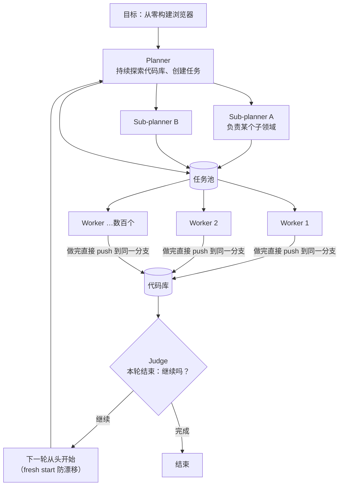

# 18｜几百个代理同时写一个浏览器：Cursor 的 Planner / Worker 多代理实验踩过的坑

<a class="domain-tag" href="/guide/multi-agent">🤝 主题：多代理协作与对抗式验证</a>类型：文章工具：Cursor

**一句话看懂**：Cursor 让数百个编码代理在同一个项目上连续跑了将近一周，写出 100 多万行代码的浏览器。他们先试了“人人平等、靠锁协调”，失败了；最后改成“规划者拆任务、执行者只管埋头干、裁判决定要不要继续”的分层结构才跑起来。

::: info 为什么值得看
和 Anthropic 的 C 编译器实验（无编排者、靠 git 锁）正好形成对照：Cursor 发现扁平的锁协调**扩展不上去**，20 个代理只有两三个代理的吞吐。文章短（约 7 分钟），但每条教训都来自几万亿 token 的真实运行。
:::

::: tip 小白先懂这几个词
- [Long-running Agent（长时代理）](/glossary#long-running-agent)：连续自主工作数小时到数周的代理。
- [Planner / Worker / Judge](/glossary#planner-worker-judge)：规划者（拆任务）、执行者（做任务）、裁判（判断是否继续）。
- Optimistic Concurrency Control（乐观并发控制）：读随便读，写的时候如果数据已被别人改过，这次写入就失败、重来。
- Drift（漂移）/ Tunnel Vision（隧道视野）：代理跑久了偏离目标，或者死盯一个局部问题。
- LoC（Lines of Code）：代码行数。
:::

> 信息来源：Cursor 官方博客原文全文（WebFetch 抓取于 2026-10-09）；补充参考 Simon Willison 的评论文章（2026-01-19，他实际编译运行了该浏览器）和 Cursor 后续文章《Towards self-driving codebases》。英文引用均为原文摘录，中文翻译为本站所加。

## 1. 基本信息

<SourceCard type="文章" title="Scaling long-running autonomous coding" author="Wilson Lin（Cursor）" date="2026-01-14" url="https://cursor.com/blog/scaling-agents" />

| 项目 | 内容 |
|---|---|
| 链接 | https://cursor.com/blog/scaling-agents |
| 类型 | 公司研究博客（文章） |
| 作者 | Wilson Lin（Cursor） |
| 发布日期 | 2026-01-14 |
| 使用工具 | Cursor 自研多代理 harness；GPT-5.2、GPT-5.1-Codex、Opus 4.5（对比） |
| 代码 | 浏览器项目源码：https://github.com/wilsonzlin/fastrender |

## 2. 做了什么

单个代理适合聚焦的小任务，但面对“人类团队要做几个月”的项目就太慢了。自然的下一步是多代理并行，难点在于**怎么协调**。

Cursor 的目标：搞清楚“往一个问题上堆更多代理”能不能扩展自主编码，测试目标是**从零写一个网页浏览器**。

## 3. 怎么做的

### 3.1 第一版：人人平等 + 共享文件 + 锁（失败）

最初的想法是“提前规划太死板”，于是让代理平等地通过一个共享文件自我协调：查看别人在做什么、认领任务、更新状态，用锁防止抢同一个任务。

失败表现（原文要点）：

- 代理持锁太久或忘记释放；即使锁正常，也成了瓶颈。<Trans zh="二十个代理会慢到只剩两三个代理的有效吞吐，大部分时间都在等待">“Twenty agents would slow down to the effective throughput of two or three, with most time spent waiting.”</Trans>
- 系统脆弱：代理可能持锁时崩溃、重复获取已持有的锁，甚至不拿锁就改协调文件。

改用**乐观并发控制**后更简单稳健，但更深层的问题出现了：

::: tr 没有层级时，代理变得规避风险。它们回避困难任务，只做小而安全的改动。没有哪个代理为难题或端到端实现负责。
> "With no hierarchy, agents became risk-averse. They avoided difficult tasks and made small, safe changes instead. No agent took responsibility for hard problems or end-to-end implementation."
:::

### 3.2 第二版：Planner / Worker / Judge 分层

- **Planner**：持续探索代码库、创建任务；可以派生 sub-planner 负责特定区域，<Trans zh="让规划本身也变成并行和递归的">“making planning itself parallel and recursive”</Trans>。
- **Worker**：领到任务就专心做完，不跟其他 worker 协调，也不操心全局，做完就 push。
- **Judge**：每轮结束判断是否继续，下一轮重新开始。

原文结论：这<Trans zh="解决了我们大部分协调问题，让我们能扩展到非常大的项目，而没有任何一个代理陷入隧道视野">“solved most of our coordination problems and let us scale to very large projects without any single agent getting tunnel vision.”</Trans>

### 3.3 按角色选模型

::: tr 对于超长时任务，模型选择很重要。我们发现 GPT-5.2 系列在长时间自主工作上好得多：遵循指令、保持专注、避免漂移、精确完整地实现。
> "Model choice matters for extremely long-running tasks. We found that GPT-5.2 models are much better at extended autonomous work: following instructions, keeping focus, avoiding drift, and implementing things precisely and completely."
:::

同时他们观察到 Opus 4.5 <Trans zh="倾向于更早停下，在方便时走捷径，很快把控制权交回">“tends to stop earlier and take shortcuts when convenient, yielding back control quickly”</Trans>；GPT-5.2 当 planner 比专门为编码训练的 GPT-5.1-Codex 更好。于是**每个角色用最适合的模型**，而不是一个模型包打天下。

::: tip 注意时效
这些模型对比是 2026 年 1 月的观察。Anthropic 后来的文章提到 Opus 4.6 能连续工作更久。模型排名变化很快，可借鉴的是“按角色挑模型”这个做法，而不是具体结论。
:::

### 3.4 删掉复杂度，比加更有效

- 他们一开始设计了一个 **integrator（集成者）** 角色负责质量控制和冲突解决，结果<Trans zh="制造的瓶颈比解决的还多">“created more bottlenecks than it solved”</Trans>，worker 自己就能处理冲突。
- 照搬分布式系统和组织设计的模型，并不都适用于代理。
- 结构要适中：<Trans zh="结构太少，代理会冲突、重复劳动、漂移；结构太多，系统会变脆弱">“Too little structure and agents conflict, duplicate work, and drift. Too much structure creates fragility.”</Trans>
- 最意外的一点：<Trans zh="harness 和模型都重要，但提示词更重要">“The harness and models matter, but the prompts matter more.”</Trans>

## 4. 结果如何

| 项目 | 规模（原文数据） |
|---|---|
| 浏览器（FastRender） | 近一周，100 万+ 行代码，1,000 个文件 |
| Cursor 代码库 Solid → React 原地迁移 | 3 周以上，+266K / -193K 行改动；通过 CI 和初步检查，仍需仔细审查 |
| 视频渲染改写为 Rust | 快 25 倍，已合并、即将上线 |
| Java LSP（仍在跑） | 7.4K commits，550K 行 |
| Windows 7 模拟器（仍在跑） | 14.6K commits，120 万行 |
| Excel（仍在跑） | 12K commits，160 万行 |

::: warning 局限与注意
- 浏览器是**研究产物**，不是可用产品。Hacker News 讨论中有人指出发布初期无法编译、使用了大量开源组件；作者 Wilson Lin 在讨论中回应正在把部分依赖改为仓库内自研。Simon Willison 后来按更新后的 README 成功编译出了能打开网页的窗口。
- 原文承认：planner 应该在任务完成时被唤醒、代理偶尔跑得太久、仍需要定期从头开始来对抗漂移。
- 文中没有给出成本数字，只说用了“数万亿 token”。
:::

## 5. 可借鉴之处

1. **多代理不要扁平化**：至少分出“拆任务的”和“做任务的”两种角色，worker 只对自己的任务负责。
2. **锁是瓶颈的来源**：如果必须共享状态，优先考虑乐观并发（写失败就重读重试），而不是持锁。
3. **加一个 Judge + 定期 fresh start**：每轮由裁判决定是否继续，新一轮从干净上下文开始，对抗漂移。
4. **按角色选模型**：规划、执行、评审可以用不同模型，定期重新评估。
5. **先尝试删组件**：新增的“协调者/集成者”角色往往变成瓶颈，先看 worker 能不能自己处理。

### 你可以这样试

- [ ] 拿一个中等功能，开一个“Planner”会话只负责把它拆成 5–10 个互不依赖的任务写进 `tasks/` 目录，不写代码。
- [ ] 开 2–3 个“Worker”会话（各自用 git worktree），每个只领一个任务文件，做完提交。
- [ ] 最后开一个“Judge”会话，只读 diff 和测试结果，回答“还差什么、要不要再来一轮”。
- [ ] 对比一下：同样的任务，规划者用推理强的模型、执行者用快模型，效果和成本有什么变化。

::: details 读完自测（点开看答案）
1. **扁平协调失败的两个原因是什么？** 锁导致等待和脆弱；没有层级时代理规避风险，只做小改动，没人负责难题。
2. **Judge 代理的作用是什么？** 每轮结束判断是否继续，并让下一轮从头开始，防止漂移和隧道视野。
3. **Cursor 为什么删掉了 integrator 角色？** 它制造的瓶颈比解决的问题多，worker 自己就能处理冲突。
:::
