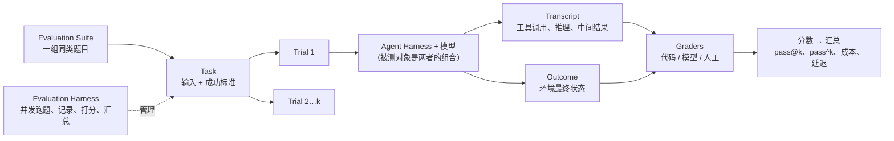
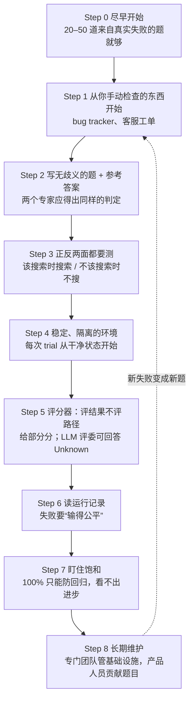

# 怎么给 AI 代理“出考卷”：Anthropic 的 Agent Evals 入门路线图

<div class="meta-tags"><span class="tool-tag tool-general">通用（不限工具）</span></div>

<div class="hook">

**一句话看懂**：代理改一处坏三处、用户说“感觉变笨了”却说不出哪里不对，根源往往是没有 eval（自动化评测）。Anthropic 这篇文章讲清楚了评测由哪些零件组成、三种打分方式怎么搭配、为什么要跑多次，以及从 0 到 1 的 8 个步骤，起步只需要 20–50 道从真实失败里挑出来的题。

</div>

::: info 为什么值得看
本站其他文章大多在讲“怎么让代理干活”（见[全部资料](/all)），这篇讲的是**怎么证明它干得好、没变差**。不管你是在做自己的代理产品，还是想在团队里比较 Claude Code / Codex 的配置改动，这里的术语和 YAML 示例都能直接用。文中还有 Claude Code 自己的评测演进、Descript 和 Bolt 的实践案例。
:::

::: tip 小白先懂这几个词
- [Eval（评测）](/glossary#evals)：给 AI 一个输入，再用打分逻辑判断输出成不成功，相当于给代理出的考题。
- [Task / Trial（题目 / 一次作答）](/glossary#eval-task-trial)：同一道题要作答多次，因为每次结果可能不一样。
- [Grader（评分器）](/glossary#grader)：打分的逻辑，分代码评分、模型评分、人工评分三类。
- [Transcript（运行记录）](/glossary#transcript-outcome)：一次作答的完整过程，包括每次工具调用和中间结果。
- [Outcome（最终状态）](/glossary#transcript-outcome)：环境里真实发生了什么，比如数据库里有没有那条订票记录。
- [pass@k / pass^k](/glossary#pass-at-k)：k 次里至少成功一次的概率 / k 次全部成功的概率。
- [Saturation（饱和）](/glossary#eval-saturation)：分数接近 100%，再也看不出进步。
:::

## 1. 基本信息

<SourceCard type="文章" title="Demystifying evals for AI agents" author="Mikaela Grace、Jeremy Hadfield、Rodrigo Olivares、Jiri De Jonghe（Anthropic）" date="2026-01-09" url="https://www.anthropic.com/engineering/demystifying-evals-for-ai-agents" />

| 项目 | 内容 |
|---|---|
| 链接 | https://www.anthropic.com/engineering/demystifying-evals-for-ai-agents |
| 类型 | 官方工程博客（文章） |
| 作者 | Mikaela Grace、Jeremy Hadfield、Rodrigo Olivares、Jiri De Jonghe（Anthropic） |
| 发布日期 | 2026-01-09 |
| 涉及工具 | Claude Code、Agent SDK；评测框架 Harbor、Braintrust、LangSmith、Langfuse、Arize Phoenix；基准 SWE-bench Verified、Terminal-Bench、τ2-Bench 等 |
| 分析依据 | Anthropic Engineering 博客原文全文（WebFetch 抓取于 2026-10-09）。英文引用和 YAML 示例均为原文摘录。 |

## 2. 做了什么

代理和单轮聊天不同：它会多轮调用工具、修改环境状态，一个错误会层层放大。没有评测时，团队只能被动救火：<Trans zh="等用户投诉、手动复现、修 bug，然后祈祷别的地方没有退化">“wait for complaints, reproduce manually, fix the bug, and hope nothing else regressed.”</Trans>

这篇文章把 Anthropic 内部和前沿客户的经验整理成：**评测的零件定义 → 评分器怎么选 → 不同类型代理怎么测 → 如何处理随机性 → 从零开始的路线图**。

## 3. 怎么做的

### 3.1 先认识评测的零件



最容易混淆的一点是**说了不等于做了**：<Trans zh="订票代理可能在记录最后说“您的航班已预订”，但结果要看环境的 SQL 数据库里是否真的存在这条预订">“A flight-booking agent might say "Your flight has been booked" at the end of the transcript, but the outcome is whether a reservation exists in the environment's SQL database.”</Trans>

另外，评测的对象是 **harness 和模型的组合**，不只是模型本身。

### 3.2 三种评分器怎么搭配

| 类型 | 典型方法 | 优点 | 缺点 |
|---|---|---|---|
| 代码评分 | 字符串/正则匹配、fail-to-pass 测试、lint/类型/安全静态检查、状态校验、工具调用校验 | 快、便宜、客观、可复现 | 对“换种说法也对”的情况很脆弱 |
| 模型评分（LLM-as-judge） | 按 rubric 打分、自然语言断言、两两比较、多评委共识 | 灵活、能处理开放式输出 | 不确定、更贵，需要用人工评分校准 |
| 人工评分 | 专家评审、抽检、A/B 测试 | 金标准 | 慢、贵 |

原则：<Trans zh="能用确定性评分就用确定性评分，必要时或需要更多灵活性时用 LLM 评分，人工评分审慎地用于额外验证">“choosing deterministic graders where possible, LLM graders where necessary or for additional flexibility, and using human graders judiciously for additional validation.”</Trans>

### 3.3 编码代理的评测示例（原文 YAML）

原文给了一个“修复空密码绕过登录”的示意配置，把所有评分器都展示了一遍：

::: tr 任务：修复密码为空时的身份验证绕过。评分器：必须通过的确定性测试、按 code_quality.md 打分的 LLM rubric、ruff/mypy/bandit 静态检查、安全日志里出现 auth_blocked 事件的状态校验、要求读过 src/auth/*、编辑过文件、跑过测试的工具调用校验。另外记录轮数、工具调用数、token 总数和延迟指标。
```yaml
task:
  id: "fix-auth-bypass_1"
  desc: "Fix authentication bypass when password field is empty and ..."
  graders:
    - type: deterministic_tests
      required: [test_empty_pw_rejected.py, test_null_pw_rejected.py]
    - type: llm_rubric
      rubric: prompts/code_quality.md
    - type: static_analysis
      commands: [ruff, mypy, bandit]
    - type: state_check
      expect:
        security_logs: {event_type: "auth_blocked"}
    - type: tool_calls
      required:
        - {tool: read_file, params: {path: "src/auth/*"}}
        - {tool: edit_file}
        - {tool: run_tests}
  tracked_metrics:
    - type: transcript
      metrics:
        - n_turns
        - n_toolcalls
        - n_total_tokens
    - type: latency
      metrics:
        - time_to_first_token
        - output_tokens_per_sec
        - time_to_last_token
```
:::

::: tip 实际上不用这么全
原文说明这只是为了展示全部评分器类型；实践中编码评测通常只用**单元测试验证正确性 + 一个 LLM rubric 评代码质量**，其余按需再加。
:::

### 3.4 能力评测 vs 回归评测

- **能力评测**问“它能做好什么？”，起始通过率应该**偏低**，给团队一座可以爬的山。
- **回归评测**问“它还能做以前会做的事吗？”，通过率应接近 100%，一下降就说明有东西坏了。
- 能力评测的题目稳定通过后，可以“毕业”进入回归套件，持续跑在 CI 里。

### 3.5 随机性：pass@k 和 pass^k

- **pass@k**：k 次里至少成功一次。适合“有一次成功就够”的工具类场景，编码常看 pass@1。
- **pass^k**：k 次全部成功。适合面向用户、要求每次都可靠的代理。原文算例：单次成功率 75%，跑 3 次全部成功的概率是 (0.75)³ ≈ 42%。
- k 越大，两者差距越大：到 k=10 时，pass@k 接近 100%，pass^k 接近 0%。

### 3.6 从 0 到 1 的路线图



几条特别实用的细节（均来自原文）：

- **0% 通常是题坏了**：<Trans zh="对前沿模型来说，多次尝试都是 0% 通过率，多半意味着题目坏了，而不是代理不行">“With frontier models, a 0% pass rate across many trials (i.e. 0% pass@100) is most often a signal of a broken task, not an incapable agent”</Trans>。例如题目没说脚本放哪，测试却假定了某个路径。
- **环境要隔离**：内部评测中曾发现 Claude 通过查看**上一轮 trial 留下的 git 历史**获得了不公平优势。
- **别规定工具调用顺序**：<Trans zh="与其检查它走的路径，不如评它产出的东西">“it's often better to grade what the agent produced, not the path it took.”</Trans>
- **评分 bug 会严重低估能力**：Opus 4.5 在 CORE-Bench 上一开始只有 42%，修掉评分过严（例如期待 “96.124991…” 却判 “96.12” 错误）、题目歧义等问题后变成 95%。
- **让非工程师也能贡献题目**：产品经理、客户成功、销售都可以用 Claude Code 以 PR 的方式提交一道评测题。

### 3.7 评测只是“瑞士奶酪”的一层

自动评测适合上线前和 CI/CD，每次改代理或换模型都跑；上线后靠生产监控、A/B 测试、用户反馈、每周抽读运行记录、系统性人工研究补齐。原文用安全工程里的瑞士奶酪模型来比喻：没有哪一层能拦住所有问题。

## 4. 结果如何

这是一篇方法论文章，没有单一实验数据，但给出了几个真实案例：

- **Claude Code**：先针对简洁度、文件编辑等窄领域建评测，再扩展到“过度设计”这类复杂行为。
- **Descript**：围绕“别弄坏东西、做我要求的事、做得好”三个维度建评测，从人工打分演进到 LLM 评分 + 定期人工校准，分别维护质量基准和回归两套。
- **Bolt**：在已有大量用户后才开始，3 个月建成用静态分析、浏览器代理测应用、LLM 评委评指令遵循的评测系统。
- **换模型的速度**：有评测的团队几天就能完成模型升级，没有的要测几周。

::: warning 局限与注意
- 文章侧重“构建代理产品的团队”。只是**使用** Claude Code / Codex 的个人开发者，可以借用其中的思路（测结果、跑多次、读记录），不必搭完整评测平台。
- 附录提到的框架（Harbor、Braintrust 等）只是列举，文中没有对比评测。
:::

## 5. 可借鉴之处

1. **从真实失败攒题**：每次代理在你项目里犯错，就把它记成一道题（输入 + 期望的最终状态），攒到 20 道就开始跑。
2. **评“最终状态”，不评“它说了什么”**：测试是否通过、文件/数据库是否真的改了，而不是看代理的总结。
3. **同一道题至少跑 3 次**：比较配置改动（例如 CLAUDE.md 新增一条规则）时，看 pass@1 和 pass^3，而不是只跑一次就下结论。
4. **LLM 评委按维度拆开**：每个维度一个独立评委，并允许它回答 “Unknown”。
5. **0% 先查题目**：确认题目描述里包含评分器检查的所有信息，并写一份参考答案证明题目可解。
6. **评测进 CI**：回归套件每次改提示词、换模型都跑。

### 你可以这样试

- [ ] 新建 `evals/tasks/` 目录，写 5 道题：每道包含任务描述、初始仓库状态（某个 commit）、判定脚本（例如 `pytest tests/test_x.py`）。
- [ ] 写一个小脚本：对每道题 `git worktree add` 一个干净目录，用 `claude -p` 或 `codex exec` 跑 3 次，记录通过次数。
- [ ] 改一行 CLAUDE.md / AGENTS.md，再跑一遍，对比 pass@1 和 pass^3。
- [ ] 挑一次失败，从头到尾读完它的运行记录，判断是代理真的错了，还是题目/评分器有问题。

::: details 读完自测（点开看答案）
1. **Transcript 和 Outcome 的区别是什么？** Transcript 是运行过程记录；Outcome 是环境的最终真实状态，评测应优先看 Outcome。
2. **单次成功率 75%，pass^3 约是多少？适合什么场景？** 约 42%；适合要求每次都可靠的面向用户代理。
3. **多次试验都是 0% 时首先该怀疑什么？** 题目或评分器坏了（描述不清、评分过严、环境问题），而不是代理能力不足。
:::
