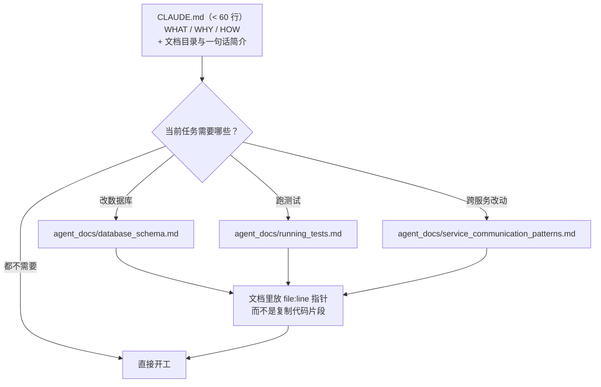

# 20｜CLAUDE.md 写得越多越没用？HumanLayer 的“少即是多”写作指南

<div class="meta-tags"><a class="domain-tag" href="/guide/foundation">阶段：打地基 · 上下文与规范</a><span class="type-tag type-article">类型：文章</span><span class="tool-tag tool-claude">工具：Claude Code</span></div>

<div class="hook">

**一句话看懂**：CLAUDE.md / AGENTS.md 是唯一默认进入每次对话的文件，所以它是 harness 里杠杆最大的地方。HumanLayer 的建议是：只写“是什么、为什么、怎么做”，控制在几十行；具体任务的说明拆到单独文件按需读取；代码风格交给 linter，别交给模型。

</div>

::: info 为什么值得看
本站的 [RPI 那篇（#04，Dex Horthy）](/04-no-vibes-allowed-rpi)讲了 HumanLayer 的整体方法，这篇是同一团队专门讲**规则文件怎么写**的短文，可操作性很强。它还给了一个很多人不知道的细节：Claude Code 注入 CLAUDE.md 时会附上一句“这段内容可能与你的任务无关”的提醒，这解释了为什么规则写多了会被无视。文章同样适用于 Codex、Cursor、OpenCode 用的 AGENTS.md。
:::

::: tip 小白先懂这几个词
- [Stateless（无状态）](/glossary#stateless)：模型权重在使用时已冻结，不会从你的对话里“学会”你的项目；它只知道你喂给它的 token。
- Onboarding（入职引导）：像带新同事一样，告诉代理项目是干什么的、怎么跑起来。
- [Progressive Disclosure（渐进披露）](/glossary#progressive-disclosure)：先只给目录和简介，需要时再读详细文档。
- System Reminder：Claude Code 附加在消息里的系统提醒片段。
- [Stop Hook](/glossary#stop-hook)：代理准备结束本轮时自动触发的脚本。
- Biome：一个可以自动修复问题的 JS/TS linter + formatter。
:::

> 信息来源：HumanLayer 官方博客原文全文（WebFetch 抓取于 2026-10-09）。英文引用和代码块均为原文摘录，中文翻译为本站所加。文中“~150–200 条指令”等数字是作者引用的研究结论，作者自己也说该话题<Trans zh="还没有被非常严格地研究过">“hasn't been investigated in an incredibly rigorous manner”</Trans>。

## 1. 基本信息

<SourceCard type="文章" title="Writing a good CLAUDE.md" author="Kyle（HumanLayer）" date="2025-11-25" url="https://www.humanlayer.dev/blog/writing-a-good-claude-md" />

| 项目 | 内容 |
|---|---|
| 链接 | https://www.humanlayer.dev/blog/writing-a-good-claude-md |
| 类型 | 公司技术博客（文章） |
| 作者 | Kyle（HumanLayer；博客署名仅为 Kyle，第三方转载标注为 Kyle Mistele） |
| 发布日期 | 2025-11-25 |
| 适用工具 | Claude Code（CLAUDE.md）；同样适用于 OpenCode、Zed、Cursor、Codex（AGENTS.md） |

## 2. 做了什么

很多团队把 CLAUDE.md 当成“打补丁”的地方：代理哪里不顺眼，就往里加一条规则，越写越长，结果代理反而越来越不听。

这篇文章从“模型无状态”这个原理出发，解释为什么会这样，并给出一套写法：**写什么、写多长、什么不该写、什么该拆出去**。

## 3. 怎么做的

### 3.1 原理：模型每次会话都对你的项目一无所知

原文的三条推论：

1. <Trans zh="每次会话开始时，编码代理对你的代码库一无所知。">“Coding agents know absolutely nothing about your codebase at the beginning of each session.”</Trans>
2. 每次开会话都必须重新告诉它重要的东西。
3. CLAUDE.md 是做这件事的首选方式。

### 3.2 写什么：WHAT / WHY / HOW

| 维度 | 写什么 | 例子 |
|---|---|---|
| WHAT | 技术栈、项目结构、代码地图 | monorepo 里有哪些 app、哪些共享包、各自干什么 |
| WHY | 项目目的，各部分的作用 | 这个服务为什么存在 |
| HOW | 怎么在项目里干活、**怎么验证改动** | 用 `bun` 而不是 `node`；怎么跑测试、类型检查、编译 |

但不要把代理可能用到的每条命令都塞进去。

### 3.3 为什么 Claude 经常无视 CLAUDE.md

作者用 `ANTHROPIC_BASE_URL` 在 Claude Code 和 API 之间加了一个日志代理，发现 CLAUDE.md 被注入时带着这样一段系统提醒：

::: tr 重要：这段上下文可能与你的任务相关，也可能不相关。除非它与你的任务高度相关，否则你不应回应这段上下文。
```
<system-reminder>
      IMPORTANT: this context may or may not be relevant to your tasks. 
      You should not respond to this context unless it is highly relevant to your task.
</system-reminder>
```
:::

结论：<Trans zh="文件里与当前任务不普遍相关的信息越多，Claude 就越可能无视你在文件里写的指令">“The more information you have in the file that's not universally applicable to the tasks you have it working on, the more likely it is that Claude will ignore your instructions in the file.”</Trans>

### 3.4 少即是多：指令是有“预算”的

作者引用的研究要点：

- 前沿推理模型大约能比较稳定地遵循 **150–200 条**指令；小模型、非推理模型更少。
- 小模型随指令数增加呈**指数级**下降，大模型呈线性下降。
- 模型偏重提示词**开头和结尾**的指令。
- 指令越多，**所有**指令的遵循质量都会均匀下降，不只是后面的。
- 作者分析认为 Claude Code 的系统提示词本身就有约 50 条指令，已经占掉了相当一部分预算。

所以长度上：普遍共识是 300 行以内，越短越好。<Trans zh="在 HumanLayer，我们根目录的 CLAUDE.md 不到 60 行。">“At HumanLayer, our root `CLAUDE.md` file is less than sixty lines.”</Trans>

### 3.5 渐进披露：把细节拆到 agent_docs/



原文给的目录示例：

::: tr agent_docs 目录：构建项目、运行测试、代码约定、服务架构、数据库结构、服务间通信模式。
```
agent_docs/
  |- building_the_project.md
  |- running_tests.md
  |- code_conventions.md
  |- service_architecture.md
  |- database_schema.md
  |- service_communication_patterns.md
```
:::

在 CLAUDE.md 里列出这些文件和一句话描述，让 Claude 自己判断读哪些（或先列出来请你批准）。关键原则：<Trans zh="指针优于副本">“Prefer pointers to copies.”</Trans> 代码片段很快会过时，用 `file:line` 指向权威位置。

### 3.6 别让 Claude 当昂贵的 linter

::: tr 永远不要派 LLM 去干 linter 的活。
> "Never send an LLM to do a linter's job."
:::

- 代码风格规则会塞进一堆指令和无关代码片段，降低指令遵循、占满上下文。
- 模型是**上下文学习者**：只要它搜过几次代码库，自然会跟随已有风格。
- 如果很在意格式，可以配一个 Claude Code **Stop hook** 运行 formatter 和 linter，把错误交给 Claude 修；用能自动修复的工具（作者喜欢 Biome）。
- 也可以做一个 slash command，包含代码规范并指向 `git status` 的改动，把“实现”和“格式”分开处理。

### 3.7 不要用 `/init` 自动生成

作者把它和“坏研究 → 坏计划 → 坏代码”的放大链条类比：CLAUDE.md 影响工作流的**每一个阶段和每一个产物**，所以每一行都值得仔细推敲，不应该自动生成。

## 4. 结果如何

这是一篇经验型指南，没有对照实验数据。可核实的事实是：HumanLayer 自己的根 CLAUDE.md 不到 60 行；Claude Code 注入 CLAUDE.md 时附带“可能不相关”的系统提醒（作者通过代理抓包观察到，具体措辞可能随版本变化）。

::: warning 局限与注意
- 指令数量上限等结论来自外部研究，作者承认研究不够严格，不同模型差异很大。
- “不要写代码风格”的前提是项目已有一致风格并配了 linter；新项目或风格混乱的老项目可能仍需少量明确约定。
- 与 Mitchell Hashimoto“每次犯错就加一行 AGENTS.md”的做法并不矛盾：关键是加的那一行要**普遍适用**，特定任务的经验应放进 agent_docs 或 skill。
:::

## 5. 可借鉴之处

1. **按 WHAT / WHY / HOW 重写根规则文件**，目标 60 行以内，每条都问一句“这对 90% 的任务都有用吗？”
2. **建 `agent_docs/` 目录**，把测试、架构、数据库等细节拆出去，根文件只留目录和一句话简介。
3. **用指针代替副本**：文档里写 `src/auth/session.ts:42`，不贴代码。
4. **风格交给工具**：配 formatter + linter，再用 Stop hook 自动跑，让代理只处理工具报出的错误。
5. **别用 `/init` 一键生成后就不管**：可以生成初稿，但要逐行删改。

### 你可以这样试

- [ ] 数一下你现在的 CLAUDE.md / AGENTS.md 有多少行、多少条指令；把只和某类任务有关的条目剪切到 `agent_docs/<主题>.md`。
- [ ] 在根文件末尾加一个列表：`- agent_docs/running_tests.md：如何只跑相关测试`，并写一句“开始工作前判断需要读哪些文件”。
- [ ] 删掉所有代码风格条目，改为配置一个 Stop hook 运行 `biome check --write` 或你项目的 lint 命令。
- [ ] 用同一个任务对比修改前后代理的表现。

::: details 读完自测（点开看答案）
1. **为什么 CLAUDE.md 写得越长越容易被无视？** Claude Code 注入时提示它“可能不相关”；无关内容越多，模型越倾向整体忽略，且指令越多遵循质量越均匀下降。
2. **什么是“指针优于副本”？** 文档里用 `file:line` 指向代码中的权威位置，而不是复制代码片段，避免过时。
3. **代码风格应该怎么处理？** 交给确定性的 linter / formatter，必要时用 Stop hook 自动运行并把错误交给代理修。
:::
