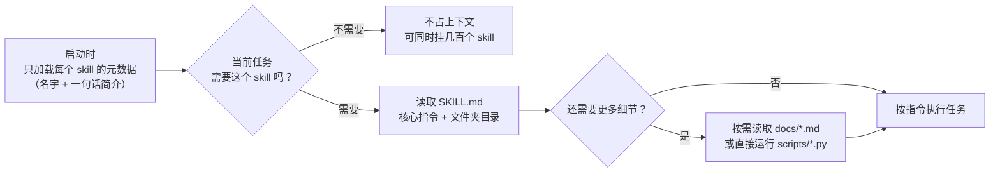
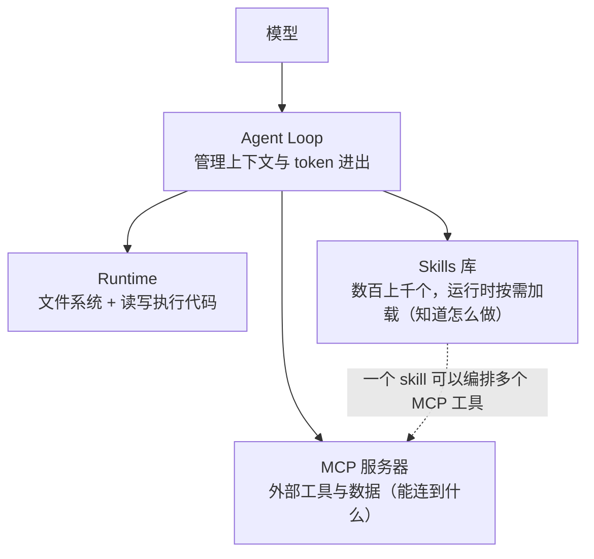

# 21｜别再造新代理了，去写 Skills：Anthropic 讲 Agent Skills 为什么只是一个文件夹

<a class="domain-tag" href="/guide/foundation">阶段：1 打地基 · 上下文与规范</a>类型：视频工具：Claude Code

**一句话看懂**：Agent Skills 的两位创建者认为，通用代理（模型 + bash + 文件系统）已经够聪明了，缺的是“领域经验”。Skills 就是把这些经验装进一个普通文件夹：一份 `SKILL.md` 说明，加上脚本和资料；平时只露出名字和简介，需要时才加载全文。MCP 负责“能连到什么”，Skills 负责“知道怎么做”。

::: info 为什么值得看
本站[术语表](/glossary#skills)里有 Skills，但还没有一篇讲清楚它的**设计动机**和**在代理架构里的位置**。这是 Skills 创建者本人在 AI Engineer Code Summit 上 16 分钟的官方演讲，解释了“为什么是文件夹”“为什么要渐进加载”“和 MCP 什么关系”，以及“把反复生成的脚本存进 skill”这种马上能用的做法。
:::

::: tip 小白先懂这几个词
- [Agent Skills（技能包）](/glossary#skills)：一个文件夹，内含 `SKILL.md`（核心说明 + 目录）以及可选的脚本、文档、素材。
- [Progressive Disclosure（渐进加载）](/glossary#progressive-disclosure)：启动时模型只看到技能的元数据（名字、简介），用到时才读 `SKILL.md`，再按需读其他文件。
- Procedural Knowledge（程序性知识）：“怎么做某件事”的经验，比如报税流程、公司内部的代码规范。
- [MCP](/glossary#mcp)：让代理连接外部工具和数据的协议。
- Agent Runtime（代理运行时）：给代理提供文件系统、能读写和执行代码的环境。
- [skill-creator](/glossary#skill-creator)：Anthropic 提供的“用来创建技能的技能”。
:::

> 信息来源：AI Engineer 官网该演讲页面的带时间戳文字稿（ai.engineer/talks/CEvIs9y1uog-agent-skills）+ YouTube 视频元数据与章节（yt-dlp）+ 视频截图。英文引用均来自文字稿，中文翻译为本站所加。

## 1. 基本信息

<YouTube id="CEvIs9y1uog" title="Don't Build Agents, Build Skills Instead" />

| 项目 | 内容 |
|---|---|
| 链接 | https://www.youtube.com/watch?v=CEvIs9y1uog |
| 讲者 / 频道 | Barry Zhang、Mahesh Murag（Anthropic，Agent Skills 创建者）／ **AI Engineer**（AI Engineer Code Summit 2025） |
| 发布日期 | 2025-12-08 |
| 时长 | 16:22 |
| 使用工具 | Claude Code、Claude Agent SDK、Agent Skills、MCP |
| 文字稿 | https://ai.engineer/talks/CEvIs9y1uog-agent-skills |

## 2. 做了什么

讲者先观察到一个变化：以前大家以为每个领域都要一个专门的代理，各有各的工具和脚手架；做完 Claude Code 后他们发现，**代码本身就是通往数字世界的通用接口**。

::: tr 核心脚手架一下子变得很薄，只剩 bash 和文件系统……但我们很快遇到了另一个问题，那就是领域专业知识。
> "The core scaffolding has suddenly become as thin as just bash and file system, which is great and really scalable, but we very quickly run into a different problem, and that problem is domain expertise."
:::

他们用报税打比方：你会找一个 300 IQ 的数学天才从第一性原理推导税法，还是找一个有经验的税务师？<Trans zh="今天的代理很像那个天才。它们很聪明，但缺少专业经验。">“Agents today are a lot like Mahesh. They're brilliant, but they lack expertise.”</Trans> 代理常常缺少前置上下文、吸收不了你的经验、也不会随时间进步。Skills 就是为了解决这个问题。

## 3. 怎么做的

### 3.1 Skill 就是一个文件夹

::: tr Skills 是有组织的文件集合，为代理打包可组合的程序性知识。换句话说，它们就是文件夹。
> "Skills are organized collections of files that package composable procedural knowledge for agents. In other words, they're folders."
:::

<figure class="shot"><figcaption>📷 视频截图 · <a href="https://www.youtube.com/watch?v=CEvIs9y1uog&t=180s" target="_blank" rel="noopener">3:00</a> · 一个 skill 的样子：<code>anthropic_brand/</code> 文件夹里有 <code>SKILL.md</code>、两份说明文档和一个 Python 脚本 <code>apply_template.py</code>。</figcaption></figure>

刻意做得这么朴素，是为了让人和代理都能用现成工具创建和分享：可以放进 Git 做版本管理，扔进 Google Drive，或者打包发给同事。

### 3.2 把反复生成的代码存成脚本

传统工具有几个毛病：说明写得含糊、模型卡住时改不了工具、工具描述一直占着上下文。代码能解决这些问题：自带文档、可修改、平时躺在文件系统里不占上下文。讲者的例子：

::: tr 我们一直看到 Claude 一遍又一遍地写同一个给幻灯片套样式的 Python 脚本，于是干脆让 Claude 把它存进 skill，作为给未来的自己用的工具。
> "We kept seeing Claude write the same Python script over and over again to apply styling to slides, so we just asked Claude to save it inside of the skill as a tool for his version, uh, f-for his future self."
:::

之后直接运行这个脚本，结果更一致、也更省时间。

### 3.3 渐进加载：为了能装下几百个技能

::: tr 运行时只把这些元数据展示给模型，仅仅表明它拥有这个技能。当代理需要用某个技能时，它可以读入 SKILL.md 的其余部分，里面有核心指令和整个文件夹的目录。
> "At runtime, only this metadata is shown to the model just to indicate that it has the skill. When an agent needs to use a skill, it can read in the rest of the SKILL.md, which contains the core instruction and directory for the rest of the folder."
:::

<figure class="shot"><figcaption>📷 视频截图 · <a href="https://www.youtube.com/watch?v=CEvIs9y1uog&t=290s" target="_blank" rel="noopener">4:50</a> · “Skills are progressively disclosed”：先是 SKILL.md 的元数据，再是正文，附属文档（slide-decks.md、docs.md）只在需要时读取。</figcaption></figure>

### 3.4 生态：三类技能

| 类型 | 演讲中的例子 |
|---|---|
| 基础技能 | Anthropic 的文档技能（创建、编辑专业级 Office 文档）；K-Dense 的科研技能（EHR 数据分析、生物信息学 Python 库） |
| 合作方技能 | Browserbase 为其浏览器自动化工具 Stagehand 做的技能；Notion 帮助 Claude 理解并调研整个工作区的技能 |
| 企业 / 团队技能 | 财富 100 强公司用来教代理组织最佳实践和内部软件用法；服务数千到数万开发者的研发效能团队用来教 Claude Code 内部代码规范 |

讲者还观察到：财务、招聘、会计、法务等**非技术人员**也开始写技能。

### 3.5 在通用代理架构中的位置

::: tr 在这些情况下，MCP 提供与外部世界的连接，而 skills 提供专业知识。
> "MCP is providing the connection to the outside world, while skills are providing the expertise."
:::

讲者说，给代理加一个新领域的能力，可能只需要配上合适的 MCP 服务器和技能库；Anthropic 在金融服务和生命科学领域的产品就是这样组合出来的（演讲没有给出效果数据）。

<figure class="shot"><figcaption>📷 视频截图 · <a href="https://www.youtube.com/watch?v=CEvIs9y1uog&t=596s" target="_blank" rel="noopener">9:56</a> · “Skills: the complete picture”：左边 MCP 服务器提供连接，中间是代理循环，右边文件系统里放着技能库。</figcaption></figure>

### 3.6 下一步：像对待软件一样对待技能

讲者列出的方向（都是“正在做”，不是已完成）：

- **测试与评测**：检查代理是否在正确的时机、为正确的任务加载技能，以及装上技能后输出质量是否达标；
- **版本管理**：技能变了，代理行为也会变，需要清晰的演进记录；
- **显式依赖**：技能可以声明依赖其他技能、MCP 服务器和环境里的软件包，让行为更可预测。

### 3.7 长远愿景：组织的“程序性知识库”

技能被设计为通往持续学习的一步：<Trans zh="Claude 写下的任何东西，都能被未来版本的它自己高效使用。这让学习真正可以迁移。">“Anything that Claude writes down can be used efficiently by a future version of itself. This makes the learning actually transferable.”</Trans> 但讲者也说明了边界：技能**只捕获程序性知识**，不是完整的记忆系统。今天就可以用 skill-creator 技能让 Claude 帮你创建技能。

结尾的类比：模型像处理器，代理运行时像操作系统，**技能是应用层**，是普通开发者把领域经验写进去的地方。

<figure class="shot"><figcaption>📷 视频截图 · <a href="https://www.youtube.com/watch?v=CEvIs9y1uog&t=918s" target="_blank" rel="noopener">15:18</a> · “Moving up the stack”：Models = 处理器，Agents（运行时）= 操作系统，Skills = 应用。</figcaption></figure>

## 4. 结果如何

- 讲者称发布 5 周后已有**数千个技能**的生态（演讲时的口述数据）。
- 演讲以架构观点为主，**没有给出量化的效果对比**，金融、生命科学产品的效果也没有数据。

::: warning 局限与注意
- 技能的测试、版本、依赖管理在演讲时还是“计划中”的方向，实际进展请以 Anthropic 最新文档为准。
- 技能越复杂，越接近需要长期维护的软件；“只是个文件夹”不代表维护成本低。
- 技能会被代理自动选择加载，元数据（名字、简介）写不清楚会导致该用时不用、不该用时乱用。
:::

## 5. 可借鉴之处

1. **发现代理反复写同一段代码时，就让它存进 skill 的 `scripts/`**，下次直接运行。
2. **把 CLAUDE.md / AGENTS.md 里只对某类任务有用的长篇说明，迁移成 skill**，根规则文件只留普遍适用的内容。
3. **写好元数据**：一句话简介要写清“什么时候用我”，这决定了代理能否在对的时机加载它。
4. **MCP 和 Skills 搭配用**：MCP 接通系统，skill 写“用这些工具完成某个流程的步骤和注意事项”。
5. **团队共享**：把技能放进 Git 仓库，像代码一样评审和版本管理，让新同事的代理第一天就懂团队规矩。

### 你可以这样试

- [ ] 找一个你经常让代理做的流程（例如“发版前检查”），新建 `.claude/skills/release-check/SKILL.md`，写清步骤和一句话简介。
- [ ] 回顾最近的会话，找出代理重复生成过的脚本，让它整理成 `scripts/xxx.py` 放进对应 skill，并在 `SKILL.md` 里写明用法。
- [ ] 试用 skill-creator：让 Claude 根据你刚完成的一个任务，生成一个可复用的 skill。
- [ ] 开一个新会话做相关任务，观察代理是否自动加载了这个 skill。

::: details 读完自测（点开看答案）
1. **讲者认为当今代理最大的短板是什么？** 不是智力，而是领域专业知识：缺少前置上下文、吸收不了组织经验、不会随时间进步。
2. **Skills 为什么要渐进加载？** 为了保护上下文窗口，让代理能同时挂载几百个技能，只在需要时读取全文。
3. **MCP 和 Skills 的分工是什么？** MCP 提供与外部工具和数据的连接，Skills 提供使用这些连接完成工作的专业知识。
:::
