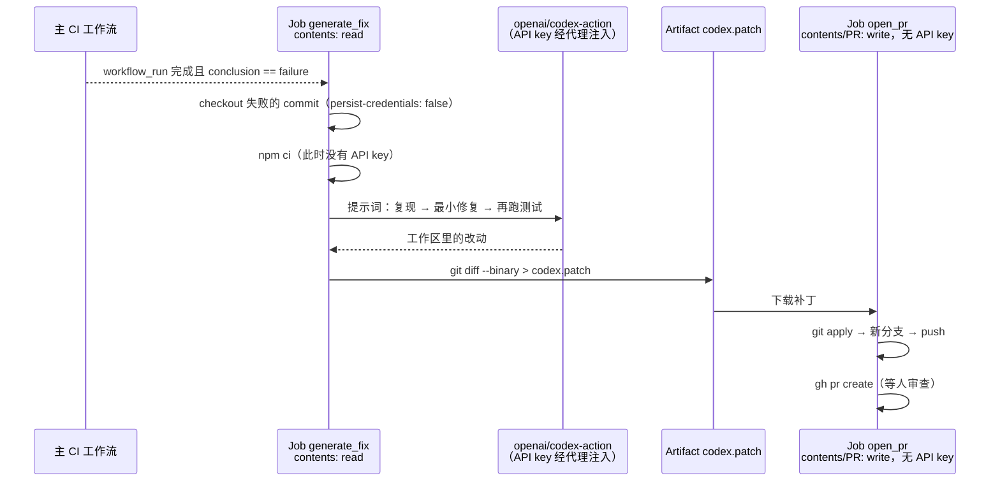

# CI 挂了让代理自动修：OpenAI 官方的 codex exec + Codex GitHub Action 用法与安全布局

<div class="meta-tags"><span class="tool-tag tool-codex">Codex</span></div>

<div class="hook">

**一句话看懂**：`codex exec` 能让 Codex 不开界面、在脚本和 CI 里跑。OpenAI 官方文档给了一个完整范例：CI 失败后触发一个新工作流，Codex 在**只读权限**的 job 里生成补丁，另一个**拿不到 API key** 的 job 负责开 PR。这样拆分，是为了堵住旧教程里“密钥和写权限放在同一个 job”的安全漏洞。

</div>

::: info 为什么值得看
本站的[“自动化 · 后台代理与 CI/CD”阶段](/guide/automation)下目前多是讲思路，这篇是**能直接抄进仓库的 YAML**。特别值得看的是官方自己把旧版 cookbook 标成“归档、不要照抄”，并解释了原因，这是把代理接入 CI 时最容易踩的坑。
:::

::: tip 小白先懂这几个词
- [`codex exec`](/glossary#codex-exec)：Codex 的非交互模式，适合放进脚本、CI、定时任务。
- GitHub Actions / workflow_run：GitHub 的 CI 系统；`workflow_run` 指“另一个工作流跑完后触发我”。
- [Sandbox（沙箱）模式](/glossary#sandbox)：`read-only`（默认只读）、`workspace-write`（可改工作目录）、`danger-full-access`（完全放开）。
- [Patch Artifact（补丁产物）](/glossary#patch-artifact)：把改动导出成 `.patch` 文件，交给下一个 job 使用。
- [Prompt Injection（提示词注入）](/glossary#prompt-injection)：PR 标题、issue 正文里藏着的恶意指令被喂给代理。
- JSONL：每行一个 JSON 对象的日志格式，方便脚本逐行解析。
:::

## 1. 基本信息

<SourceCard type="官方文档" title="Non-interactive mode（Codex 文档，另见 Codex GitHub Action）" author="OpenAI" date="持续更新的文档页（抓取于 2026-10-09）" url="https://developers.openai.com/codex/noninteractive" />

| 项目 | 内容 |
|---|---|
| 主链接 | https://developers.openai.com/codex/noninteractive （跳转至 https://learn.chatgpt.com/docs/non-interactive-mode ） |
| 配套 | https://developers.openai.com/codex/github-action ；Action 源码 https://github.com/openai/codex-action |
| 对照（旧版） | https://developers.openai.com/cookbook/examples/codex/autofix-github-actions （已归档） |
| 类型 | 官方产品文档 |
| 作者 | OpenAI |
| 日期 | 持续更新的文档，抓取于 2026-10-09 |
| 使用工具 | Codex CLI（`codex exec`）、`openai/codex-action@v1`、GitHub Actions |
| 分析依据 | OpenAI Codex 官方文档《Non-interactive mode》与《Codex GitHub Action》的 Markdown 版本（`developers.openai.com/codex/...` 现已 308 跳转到 `learn.chatgpt.com/docs/...`），以及已归档的 OpenAI Cookbook《Autofix CI failures on GitHub with Codex CLI》。均于 2026-10-09 抓取；官方文档为持续更新的页面，没有固定发布日期。英文引用和 YAML 为原文摘录。 |

## 2. 做了什么

想让代理参与 CI/CD，常见需求有三类：CI 失败自动尝试修复、PR 自动审查、定时生成发布说明之类的报告。文档解决的问题是：

1. 怎么让 Codex 在没有人值守的环境里跑，并输出机器可读的结果；
2. 怎么在 GitHub Actions 里跑，而**不把 API key 和仓库写权限暴露给仓库里可能被篡改的代码**。

## 3. 怎么做的

### 3.1 `codex exec` 的几个关键开关

| 用法 | 作用 |
|---|---|
| `codex exec "任务"` | 进度输出到 stderr，**只有最终消息**进 stdout，可直接管道给其他命令 |
| `--sandbox workspace-write` | 允许改文件。默认是只读沙箱；`--full-auto` 已被弃用 |
| `--json` | stdout 变成 JSONL 事件流（`thread.started`、`turn.completed`、`item.*` 等） |
| `--output-schema schema.json -o out.json` | 让最终回答符合 JSON Schema，方便后续步骤读字段 |
| `--ephemeral` | 不把会话记录写到磁盘 |
| `codex exec resume --last "…"` | 接着上一次会话继续，适合“两段式”流水线 |

管道用法很实用，原文例子：

::: tr 把 npm test 的输出交给 Codex：总结失败的测试并给出最小可能的修复建议，结果同时写入 test-summary.md。
```bash
npm test 2>&1 \
  | codex exec "summarize the failing tests and propose the smallest likely fix" \
  | tee test-summary.md
```
:::

::: warning 权限提醒
原文：<Trans zh="只在受控环境中使用 danger-full-access（例如隔离的 CI runner 或容器）。">“Use `danger-full-access` only in a controlled environment (for example, an isolated CI runner or container).”</Trans> 另外 Codex 默认要求在 git 仓库里运行，以防破坏性改动。
:::

### 3.2 旧版教程为什么被归档

旧版 cookbook 的工作流把 `OPENAI_API_KEY` 设成了**整个 job 的环境变量**，同时给了 `contents: write` 和 `pull-requests: write`，还在同一个 job 里跑 `npm ci` 和测试。现在页面顶部写着：

::: tr 归档示例——请使用当前的 CI 指南。下面的工作流把 API key 暴露给整个 job，并且把“执行仓库控制的代码”和“仓库写权限”放在了一起。不要照抄这种凭证和权限布局。
> "Archived example — use the current CI guidance. The workflow below exposes an API key to the whole job and combines repository-controlled execution with repository write permissions. Do not copy that credential and permission layout."
:::

原因在当前文档里写得很清楚：<Trans zh="构建脚本、测试、依赖的生命周期钩子，或同一 job 中被攻陷的 action，都能读取这些环境变量。">“Build scripts, tests, dependency lifecycle hooks, or a compromised action in the same job can read those environment variables.”</Trans>

### 3.3 当前推荐：生成补丁和开 PR 分成两个 job



官方给出的 6 步模式：

1. 主 CI 工作流以失败结束时，触发后续工作流；
2. 用**只读**权限 checkout 失败的 commit；
3. 在 Codex 之前跑安装等准备命令，**这些步骤拿不到 API key**；
4. 运行 Codex GitHub Action；
5. 把 Codex 的本地改动保存为补丁 artifact；
6. 在另一个 job 里应用补丁并开 PR。

其中 Codex 那一步的提示词（原文）：

::: tr CI 工作流在某个 commit 上失败了。运行 npm test --silent 复现失败，找出让测试通过所需的最小改动，只实现这个改动，然后再跑一次 npm test --silent。不要重构无关文件。
```yaml
      - name: Run Codex
        uses: openai/codex-action@v1
        with:
          openai-api-key: ${{ secrets.OPENAI_API_KEY }}
          prompt: |
            The CI workflow "${{ github.event.workflow_run.name }}" failed for commit
            ${{ github.event.workflow_run.head_sha }}.

            Run `npm test --silent` to reproduce the failure. Identify the minimal
            change needed to make the tests pass, implement only that change, and
            run `npm test --silent` again.

            Do not refactor unrelated files.
```
:::

补丁导出步骤：

::: tr 把新文件也纳入 diff，导出二进制安全的补丁；补丁非空时把 has_patch 设为 true，供下一个 job 判断。
```yaml
      - name: Create patch artifact
        id: diff
        run: |
          git add -N .
          git diff --binary HEAD > codex.patch
          if [ -s codex.patch ]; then
            echo "has_patch=true" >> "$GITHUB_OUTPUT"
          else
            echo "has_patch=false" >> "$GITHUB_OUTPUT"
          fi
```
:::

完整 YAML 见原文 “Example: Autofix CI failures in GitHub Actions” 一节。

### 3.4 Codex GitHub Action 的权限开关

| 输入 | 作用 |
|---|---|
| `safety-strategy`（默认 `drop-sudo`） | 运行 Codex 前移除 sudo，且本 job 内不可逆，用来保护内存里的密钥 |
| `unprivileged-user` + `codex-user` | 以指定的低权限账户运行 Codex |
| `sandbox` | `read-only` / `workspace-write` / `danger-full-access`，选能完成任务的最窄选项 |
| `allow-users` / `allow-bots` | 限制谁能触发；默认只有有写权限的用户 |
| `prompt-file` | 把提示词放在仓库里（建议 `.github/codex/prompts/`），便于审查和版本管理 |
| `output-file` / `final-message` | 拿到最终消息，供后续步骤发评论或上传 |

官方安全清单里最值得记住的两条：

- <Trans zh="对来自 PR、commit message 或 issue 正文的提示词输入做清洗，以防提示词注入。喂给 Codex 之前检查 HTML 注释或隐藏文本。">“Sanitize prompt inputs from pull requests, commit messages, or issue bodies to avoid prompt injection. Review HTML comments or hidden text before feeding it to Codex.”</Trans>
- <Trans zh="把 Codex 作为 job 的最后一步运行，这样后续步骤不会继承意外的状态改动。">“Run Codex as the last step in a job so later steps don't inherit any unexpected state changes.”</Trans>

## 4. 结果如何

这是一份产品文档，没有效果数据。它交付的是一套**可复制的工作流模板**：CI 失败 → 自动产出最小修复补丁 → 开一个等人审查的 PR，PR 正文里写着 “Review the changes before merging.”。同一个 Action 也可以用在 PR 自动审查（官方示例：读 `.github/codex/prompts/review.md`，把最终消息发成 PR 评论）。

::: warning 局限与注意
- 自动修复只适合“失败原因能被测试复现”的情况；flaky test、环境问题可能让它做出错误修改，所以必须开 PR 走人工审查，不要直接推到主分支。
- 提示词里的“最小修复”只是约束，不是保证，审查时要特别看它有没有改测试本身来“让测试通过”。
- Windows runner 需要 `safety-strategy: unsafe`，官方明确说不要在多租户 runner 上这样用。
- 文档会持续更新，参数名（例如旧版的 `openai_api_key` 与新版 `openai-api-key`）可能变化，以官方页面为准。
:::

## 5. 可借鉴之处

1. **代理进 CI 的第一原则：密钥和写权限分开**。生成改动的 job 只读、拿密钥；发布改动的 job 有写权限、不拿密钥，中间用 artifact 传补丁。
2. **提示词入库**：放进 `.github/codex/prompts/`，和代码一起走审查。
3. **用 `--output-schema` 让代理输出结构化结果**，下游脚本按字段判断，而不是解析自然语言。
4. **管道是最低成本的入门方式**：`npm test 2>&1 | codex exec "..."`、`gh run view --log | codex exec "..."` 先用起来。
5. **把不可信输入当作攻击面**：PR 标题、issue 正文进入提示词前要清洗。
6. 同样的“只读生成 + 隔离发布”布局也适用于 Claude Code 的无界面模式（`claude -p`）等其他代理。

### 你可以这样试

- [ ] 在本地跑一次：`npm test 2>&1 | codex exec "summarize the failing tests and propose the smallest likely fix"`，看看输出能不能直接用。
- [ ] 写一个 `schema.json`（例如 `{risk_level, files, summary}`），用 `codex exec --output-schema` 生成一份 PR 风险报告。
- [ ] 在一个测试仓库里，照官方两段式 YAML 配置 “Codex auto-fix on CI failure”，故意写错一个测试触发它。
- [ ] 检查你现有的工作流：有没有把任何 AI API key 设成 job 级环境变量，同时又跑了 `npm ci` 或测试？

::: details 读完自测（点开看答案）
1. **旧版 cookbook 的工作流哪里不安全？** API key 设成 job 级环境变量，并且同一个 job 既跑仓库代码又有写权限，依赖钩子或被攻陷的 action 能读到密钥。
2. **新版布局中两个 job 各有什么权限？** `generate_fix` 只有 `contents: read` 并通过 Action 使用密钥；`open_pr` 有写权限但没有 API key。
3. **`codex exec` 默认是什么沙箱？想让它改文件该加什么？** 默认只读；加 `--sandbox workspace-write`。
:::
