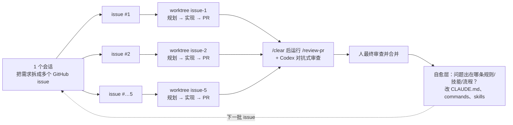

# 23｜同时开 5 个 Claude Code 不打架：Cole Medin 的并行代理“五根支柱”与 worktree 实战

<div class="meta-tags"><a class="domain-tag" href="/guide/execution">阶段：去执行 · 从单代理到多代理</a><span class="type-tag type-video">类型：视频</span><span class="tool-tag tool-claude">工具：Claude Code</span></div>

<div class="hook">

**一句话看懂**：想让 5 个代理并行写代码，光多开几个终端不行，它们会互相覆盖。Cole Medin 的做法是：**每个 GitHub issue 当作规格输入，每个代理一个 git worktree，产出一个 PR，再在全新会话里审查，发现问题就改进“AI 层”**；并现场解决端口冲突、依赖重复安装、数据库互相污染这三个真实工程难题。

</div>

::: info 为什么值得看
本站已有的并行内容偏概念（如 [#01](/01-claude-code-one-year) 的 worktree、[#11](/11-peter-steinberger-openclaw) 的 10 个 checkout），这个视频是**完整演示**：5 个 issue 同时规划、实现、开 PR、审查，配套仓库里有 worktree 创建脚本、按目录名分配端口的脚本、数据库分支脚本和 `/review-pr` 命令，可以直接参考。讲者是有大量实操视频的独立开发者，以 Claude Code 为主，但方法适用于任何编码代理。
:::

::: tip 小白先懂这几个词
- [Git Worktree](/glossary#worktree)：同一个仓库检出多个工作目录，每个目录一个分支，互不干扰。
- [Fan-out（扇出）](/glossary#fan-out)：先用一个会话把工作拆成多个 issue，再同时分发给多个代理。
- [Fresh-context Review（全新上下文审查）](/glossary#fresh-context-review)：在没看过实现过程的新会话里做代码审查。
- [Adversarial Review（对抗式审查）](/glossary#adversarial-review)：让另一家的模型（这里是 Codex）来挑 Claude 的毛病。
- [Database Branching（数据库分支）](/glossary#db-branching)：像 git 分支一样，从生产库复制出一个独立数据库副本（演示用的是 Neon）。
- [Worktree 端口分配](/glossary#port-hashing)：每个 worktree 按目录路径的哈希分到不同端口，多个开发服务器就不会抢同一个端口。
- [Self-healing Layer（自愈层）](/glossary#self-healing-layer)：每发现一个 bug，就修改规则、技能或流程，防止同类问题再出现。
:::

> 信息来源：YouTube 自动字幕（yt-dlp 获取）+ 视频简介与章节 + 配套 GitHub 仓库 `coleam00/GitHubIssueTriager`（`.claude/commands/review-pr.md`、`scripts/assign-port.ts`、`scripts/worktree-setup.sh` 原文）。中文翻译为本站所加。视频简介中包含 Neon 的推广链接，讲者也在推广自己的开源工具 Archon，阅读时请留意。

## 1. 基本信息

<YouTube id="rFGlJ4oIlhw" title="Parallel Claude Code + Git Worktrees" />

| 项目 | 内容 |
|---|---|
| 链接 | https://www.youtube.com/watch?v=rFGlJ4oIlhw |
| 讲者 / 频道 | Cole Medin（独立开发者，开源 harness 构建工具 Archon 作者）／ **Cole Medin** |
| 发布日期 | 2026-04-23 |
| 时长 | 23:53 |
| 使用工具 | Claude Code（`claude -w` worktree、自定义命令、子代理）、Codex 的 Claude Code 插件、GitHub CLI、Neon Postgres |
| 配套仓库 | https://github.com/coleam00/GitHubIssueTriager |

## 2. 做了什么

讲者每天并行运行 3–10 个 Claude Code 会话。他认为单个会话最多让产出翻倍，想要 10 倍就必须并行；但如果只是多开几个实例，<Trans zh="它们会不断踩到彼此、覆盖彼此的改动">“they're going to step on each other's toes constantly, override each other's changes”</Trans>。他也认为 Claude Code 自带的 Agent Teams 功能目前还不够可靠。

演示项目是一个简单的“GitHub issue 分诊看板”（Next.js + Neon Postgres），仓库里有 5 个打开的 issue，目标是同时派 5 个代理各处理一个。

## 3. 怎么做的

<figure class="shot"><figcaption>📷 视频截图 · <a href="https://www.youtube.com/watch?v=rFGlJ4oIlhw&t=200s" target="_blank" rel="noopener">3:20</a> · 五根支柱：Issue 即规格 → 规划/实现/验证 → 并行 worktree → 全新会话审查 → 自愈层；下方是“你的电脑不是为同时跑 5 个代理设计的”。</figcaption></figure>



### 3.1 支柱 1：Issue 就是规格

<Trans zh="实现的输入永远是一个 GitHub issue……验证的输入永远是 pull request。">“my input into any implementation is always a GitHub issue … And then for validation, the input is always the pull request.”</Trans>

好处：每块工作事先已划好范围；通常他会和一个代理一起，批量把一个 sprint 的 bug 和功能写成 issue，这本身就是一次扇出。

### 3.2 支柱 2 + 3：每个代理一个 worktree，各自规划、实现、开 PR

Claude Code 原生支持 worktree：

::: tr 启动 Claude Code，并在名为 issue-10 的新 worktree 里工作。
```bash
claude -w issue-10
```
:::

<figure class="shot"><figcaption>📷 视频截图 · <a href="https://www.youtube.com/watch?v=rFGlJ4oIlhw&t=330s" target="_blank" rel="noopener">5:30</a> · 在终端输入 <code>claude -w issue-10</code>，worktree 会建在项目的 <code>.claude/worktrees/</code> 下。</figcaption></figure>

然后在每个 worktree 里只需改 issue 编号：

::: tr 用 GitHub CLI 查看 issue 1，帮我为它做一个计划。
> use the GitHub CLI to view issue one and help me make a plan for it
:::

计划出来后（演示里为了省时间直接接受；他平时会审计划并迭代），让每个代理<Trans zh="一直实现到开出 pull request">“implement all the way to a pull request”</Trans>。

### 3.3 支柱 4：审查必须在全新上下文里做

::: tr 审查者永远不应该看到编写者的聊天记录。
> "The reviewer should never see the writer's chat."
:::

讲者的比喻：在同一个上下文里让代理审查自己的代码，就像让小孩给自己的作业打分。做法是先 `/clear`，再运行自定义的 `/review-pr` 命令。仓库中这个命令的原则写得很清楚：

::: tr 原则：写代码的会话不应该是审查它的会话。请在一个全新的 claude 会话中运行此命令，这样审查者不会被实现者的推理所影响。不同的模型，不同的盲区；全新的上下文，没有谄媚。
> **Principle:** The session that wrote the code should NOT be the session that reviews it. Run this command in a fresh `claude` session so the reviewers aren't primed by the implementer's reasoning. Different model, different blind spots; fresh context, no sycophancy.
:::

`/review-pr` 的流程（来自仓库原文）：

1. 用 `gh pr view` 找到当前分支的 PR，读 diff 和意图；
2. 按 diff 内容决定派哪些审查子代理：总是派 `code-reviewer`；改了错误处理就派 `silent-failure-hunter`；改了测试就派 `pr-test-analyzer`；最后派 `code-simplifier` 做润色；
3. **在同一条消息里并行启动**所有子代理，要求严重问题必须给出 `file:line`；
4. 汇总为 Critical / Important / Suggestions / Strengths，并给出 `APPROVE / APPROVE_WITH_CHANGES / REQUEST_CHANGES` 结论；
5. 这个命令**不自动修改代码**，只做独立审查。

演示结果：5 个 PR 中 1 个 “approve ship as is”，3 个 “approve with changes”，1 个 “request changes”（发现 2 个严重问题）。随后他又用 Codex 插件的 `/codex adversarial review` 再审一遍，Codex 认为其中 4 个需要处理。

### 3.4 支柱 5：自愈层，修 bug 也修“产生 bug 的系统”

<Trans zh="每当我们在 PR 里遇到一个 bug，不是修完就走，而是去修那个允许这个 bug 出现的底层系统。">“whenever we encounter a bug in a pull request, we don't just fix the bug and move on, but we fix the underlying system that allowed for the bug.”</Trans>

最简单的起手式是直接问代理（它有审查的完整上下文）：

::: tr 嘿，出现了 XYZ 问题。我们可以在规则、技能、工作流等方面修改什么，让它不再发生？
> "Hey, issue XYZ came up. What could we fix in our rules, skills, workflows, etc. so that this doesn't happen again?"
:::

另外，因为输入是 issue、输出是 PR，可以直接对比两者，看代理有没有偏离原来的范围。

### 3.5 真实工程难题：端口、依赖、数据库

要让代理做端到端验证（真的启动应用、像用户一样操作），并行时会遇到冲突。讲者用一个自定义 worktree 脚本（`w.sh` / `w.ps1`）统一处理，且这个脚本**也能给不原生支持 worktree 的代理用**：

| 问题 | 解决办法（仓库中的实现） |
|---|---|
| 端口冲突 | `assign-port.ts`：主目录固定 4000；worktree 用目录路径的 md5 哈希映射到 4100–4199 的端口 |
| 每个 worktree 都要装依赖 | 创建 worktree 时**预先装好** node_modules，代理不用在验证阶段操心 |
| 数据库互相污染 | `worktree-setup.sh`：为每个 worktree 创建名为 `wt-<名字>` 的 Neon 分支，把该分支的 `DATABASE_URL` 写进 worktree 的 `.env`；免费替代方案是每个 worktree 一个本地 SQLite |
| Token 消耗爆炸 | 用 `/model` 切换；代码库分析、网络调研、甚至代码审查可以交给 Haiku / Sonnet 等更便宜的模型，子代理也可以指定模型 |
| PR 堆积（人成为瓶颈） | 一旦觉得自己在审查和修补上花太多时间，就是该去加强自愈层和验证的信号 |

<figure class="shot"><figcaption>📷 视频截图 · <a href="https://www.youtube.com/watch?v=rFGlJ4oIlhw&t=1150s" target="_blank" rel="noopener">19:10</a> · Neon 控制台里，每个 worktree 都有自己的数据库分支（<code>wt-…-issue-1</code> 到 <code>issue-5</code>），父分支是 production。</figcaption></figure>

<figure class="shot"><figcaption>📷 视频截图 · <a href="https://www.youtube.com/watch?v=rFGlJ4oIlhw&t=1245s" target="_blank" rel="noopener">20:45</a> · 代理在 worktree 里启动开发服务器，报告端口 4161，正落在 CLAUDE.md 写明的 4100–4199 范围内。</figcaption></figure>

端口分配脚本原文：

::: tr 如果设置了 PORT 环境变量就直接用；主仓库目录用 4000；其他 worktree 用当前路径的 md5 哈希在 4100 起的 100 个端口里取一个。
```ts
const BASE_PORT = 4000;
const WORKTREE_BASE = 4100;
const WORKTREE_RANGE = 100;

export function assignPort(): number {
  const explicit = process.env.PORT;
  if (explicit) return Number(explicit);

  const cwd = process.cwd();
  const leaf = basename(cwd);

  if (leaf === "GitHubIssueTriager") return BASE_PORT;

  const digest = createHash("md5").update(cwd).digest();
  const offset = digest.readUInt32BE(0) % WORKTREE_RANGE;
  return WORKTREE_BASE + offset;
}
```
:::

## 4. 结果如何

- 演示中 5 个 issue 全部走到了 PR，并完成了 Claude 子代理审查和 Codex 对抗式审查，两轮审查都找到了需要修改的问题。
- 5 个 worktree 的应用同时运行在不同端口（例如 4161、4107），各自连接独立的数据库分支，可以并行做端到端测试。
- “10 倍产出”是讲者的说法，视频中没有测量数据。

::: warning 局限与注意
- 演示为了节奏省略了讲者平时的“审计划、迭代计划”步骤，直接接受了代理的计划；真实使用时不建议省略。
- 演示项目是为视频专门做的小应用，大型存量代码库的效果没有展示。
- 视频有推广成分：Neon（简介中有推广链接）和讲者自己的 Archon。数据库分支用其他方案（本地 SQLite、其他支持分支的数据库）也能实现。
- 讲者强调：代理审查之后，合并前**人仍然要自己审**。
:::

## 5. 可借鉴之处

1. **用 issue 作为每个代理的唯一输入、PR 作为唯一输出**，事后可以直接对比两者，发现代理偏离范围。
2. **审查一律开新会话**，并按改动类型派不同的审查子代理，严重问题必须带 `file:line`。
3. **用第二家模型做对抗式审查**，不同模型有不同盲区。
4. **为并行准备环境**：按 worktree 名确定性分配端口、预装依赖、隔离数据库。
5. **把每个 bug 变成一次“AI 层”改进**：规则、命令、技能、验证流程。
6. **按任务选模型**：调研、分析交给便宜模型，规划和关键实现用最强模型。

### 你可以这样试

- [ ] 挑 2 个互不相关的小 issue，分别运行 `claude -w issue-<编号>`，让每个会话 “use the GitHub CLI to view issue N and make a plan”。
- [ ] 把配套仓库的 `.claude/commands/review-pr.md` 复制到你的项目，实现完后 `/clear` 再运行 `/review-pr`。
- [ ] 给你的开发服务器加一个按目录名计算端口的小脚本，确保两个 worktree 能同时启动。
- [ ] 审查发现一个问题后，问代理“我们的规则、技能、流程要怎么改才能避免它再发生”，并把改动提交到仓库。

::: details 读完自测（点开看答案）
1. **为什么审查要在新会话里做？** 实现会话里积累了偏见，自审就像小孩给自己作业打分，容易放过问题。
2. **并行跑端到端验证时会遇到哪三个基础设施问题？** 端口冲突、每个 worktree 重复安装依赖、多个分支共用一个数据库导致互相污染。
3. **“自愈层”指什么？** 发现 bug 时，不只修 bug，还修改规则、技能、命令或流程，让同类 bug 不再出现。
:::
