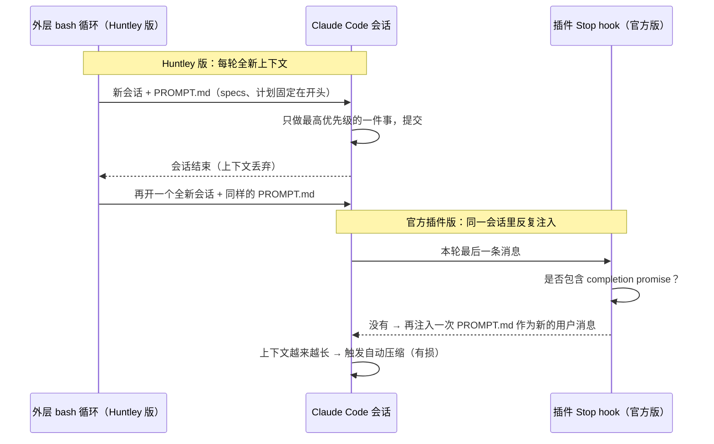

# 24｜Ralph Wiggum 循环到底是什么：发明者 Geoffrey Huntley 和 Dex Horthy 现场对比 bash 循环与官方插件

<div class="meta-tags"><a class="domain-tag" href="/guide/harness">🧠 主题：Harness 工程与内部机制</a><span class="type-tag type-video">类型：视频</span><span class="tool-tag tool-claude">工具：Claude Code</span></div>

<div class="hook">

**一句话看懂**：Ralph 最纯粹的形式就是一行 bash：`while :; do cat PROMPT.md | claude-code ; done`。每一轮都开一个全新的上下文，只给一个目标，做完就退出、再来一轮。发明者 Geoffrey Huntley 在这场直播里解释了它为什么有效，以及为什么 Claude Code 官方的 Ralph 插件（在同一个会话里用 hook 反复注入提示词、依赖自动压缩）“不是那个东西”。

</div>

::: info 为什么值得看
“Ralph 循环”在 2025 年下半年到 2026 年初被大量引用（Anthropic 的 C 编译器实验和 harness 文章都提到了它），但很多人只装了官方插件就下结论。这期 42 分钟的直播是**发明者本人 + 上下文工程的推广者 Dex Horthy** 一起拆原理，还在两台云主机上同时跑 bash 版和插件版做对比。和本站的 RPI（Dex Horthy）那篇正好互补。
:::

::: tip 小白先懂这几个词
- [Ralph / Ralph Wiggum Loop](/glossary#ralph-loop)：用一个外层循环反复启动代理，每轮全新上下文、一个目标。名字来自《辛普森一家》里的角色 Ralph Wiggum。
- [Deliberate Malloc（有意分配）](/glossary#deliberate-malloc)：把上下文窗口看成一个数组，每轮都先固定放入同样的关键内容（规格、计划）。
- [Compaction（压缩）](/glossary#compaction)：上下文快满时把历史总结成摘要；Huntley 认为它是“有损”的。
- [Completion Promise（完成承诺）](/glossary#completion-promise)：官方插件里，模型输出一个约定的字符串表示“我完成了”，否则 hook 会再次注入提示词。
- [Human on the loop（人在环上）](/glossary#human-on-the-loop)：人不参与每一步决策，但在旁观察、随时可以停下和调整；对比 human in the loop（人在环中）。
- [Lethal Trifecta（致命三要素）](/glossary#lethal-trifecta)：能访问网络、能接触不可信输入、能访问私密数据，三者同时具备就很危险。
- [tmux](/glossary#tmux)：终端复用工具，可以分屏运行多个命令并让代理读取各窗格输出。
:::

> 信息来源：YouTube 自动字幕（yt-dlp 获取，口语化、有识别错误，引用时只保留能确认的原话）+ 视频章节 + Geoffrey Huntley 博客《Ralph Wiggum as a "software engineer"》（2025-07-14，ghuntley.com/ralph，其中直接链接了本视频）。中文翻译为本站所加。

## 1. 基本信息

<YouTube id="O2bBWDoxO4s" title="Ralph Wiggum (and why Claude Code's implementation isn't it)" />

| 项目 | 内容 |
|---|---|
| 链接 | https://www.youtube.com/watch?v=O2bBWDoxO4s |
| 讲者 / 频道 | Geoffrey Huntley（Ralph 技术的提出者）、Dex Horthy（HumanLayer 创始人）／ **Geoffrey Huntley** 频道（直播录像） |
| 发布日期 | 2026-01-04 |
| 时长 | 41:56 |
| 使用工具 | Claude Code（`--dangerously-skip-permissions`、官方 Ralph Wiggum 插件）、bash、tmux、GCP 虚拟机 |
| 配套阅读 | https://ghuntley.com/ralph/ |

## 2. 做了什么

Huntley 的博客这样定义 Ralph：

::: tr Ralph 是一种技巧。它最纯粹的形式就是一个 Bash 循环。
> "Ralph is a technique. In its purest form, Ralph is a Bash loop."
:::

::: tr 无限循环：每次把 PROMPT.md 的内容喂给 claude-code。
```bash
while :; do cat PROMPT.md | claude-code ; done
```
:::

Anthropic 后来出了一个官方 Ralph 插件。两人担心大家只试了插件就说“不行”。于是 Dex 准备了两台 GCP 虚拟机、两个空仓库，给它们**同样的规格文档和同样的提示词**：一个用 bash 循环（“Jeff 版”），一个用官方插件，现场对比；同时讲清楚 Ralph 背后的上下文工程原理。

## 3. 怎么做的

### 3.1 先把安全做好：在一次性云主机上放开权限

Ralph 需要代理无人值守地跑，所以 Dex 的 `loop.sh` 就是以 “yolo 模式”（跳过权限确认）运行 Claude，把提示词喂进去。两人强调这必须放在隔离环境里：

- 如果在自己笔记本上放开所有权限，被攻破时可能丢失加密钱包、Slack 和 GitHub 的登录凭证，攻击者还能借此横向移动。
- Dex 的做法：专用的 GCP 开发虚拟机，没有公网 IP，机器上只有模型 API key 和两个仓库的 deploy key。
- Huntley 的原则：<Trans zh="不是会不会被攻破，而是什么时候被攻破">“It's not if it gets popped, it's when it gets popped”</Trans>，所以要提前控制“爆炸半径”。

### 3.2 核心原理：上下文窗口就是一个数组

Huntley 让大家像 C/C++ 工程师一样思考：

::: tr 上下文窗口就是数组。
> "Context windows are arrays."
:::

和模型聊天、模型调用 bash 或工具，都是在往这个数组里“分配”内容；服务端没有记忆，数组就是记忆；模型像一个在数组上滑动的窗口，**需要滑动的范围越小，效果越好**。

<figure class="shot"><figcaption>📷 视频截图 · <a href="https://www.youtube.com/watch?v=O2bBWDoxO4s&t=700s" target="_blank" rel="noopener">11:40</a> · Dex 画的上下文“数组”：前几格（系统消息、specs、当前代码、实施计划）每轮确定性分配，下面是每轮都会变化的工作区。</figcaption></figure>

所以 Ralph 的提示词有两个关键设计：

1. **有意分配（deliberate malloc）**：每一轮开头都固定放入约 5,000 token 的“我们在做什么”，可以是一个满是规格链接的索引文件（`index.md`、`README.md`），足以让模型知道“那里有文件”；效果变差时，可以直接 `@specs` 把规格点名放进去。
2. **一轮只做一件事**：提示词里写的是实现**最高优先级的那一个**功能（字幕里 Dex 读到 “implement the single highest priority feature”）。

### 3.3 为什么“一轮一个目标”：留在 smart zone

Dex 画出“性能明显下降的那条线”（dumb zone，见 [#04 RPI](/04-no-vibes-allowed-rpi)）：如果一个上下文里要做太多事，最关键的收尾阶段（跑测试、测试失败后修复、git 提交推送）就会落在 dumb zone 里，开始手忙脚乱。目标是让整件事**连同收尾的余量**都在 smart zone 里完成。

Huntley 的总结：

::: tr 一个上下文窗口，一个活动，一个目标。
> "One context window, one activity, one goal"
:::

目标可以很细，比如“做一次重构”“加结构化日志”，也可以同时跑多个 Ralph 循环。

### 3.4 bash 循环 vs 官方插件：差在哪



<figure class="shot"><figcaption>📷 视频截图 · <a href="https://www.youtube.com/watch?v=O2bBWDoxO4s&t=975s" target="_blank" rel="noopener">16:15</a> · Dex 画的官方插件流程：最后一条消息不含“完成承诺”就再注入一次 PROMPT.md，上下文在同一会话里越堆越长，越过虚线（性能下降线）。</figcaption></figure>

两人指出的差别：

- **插件**：在同一个 Claude Code 会话里，用 hook 检查最后一条消息有没有“完成承诺”，没有就把提示词再注入一次。上下文不断变长，最终触发**自动压缩**。Huntley 的说法是 <Trans zh="压缩是魔鬼">“compaction is the devil”</Trans>：压缩是有损的，可能把规格、任务和目标都压掉；没压缩时，模型又得在多个目标（有些已完成）之间滑动。
- **bash 循环**：外层编排器反复启动 harness，每轮**从不压缩**，上下文分配是确定的。
- 直播中的实际观察：插件版读完提示词、做完第一件事后**直接输出了完成承诺，就不再循环了**，Dex 只好去掉完成承诺重新启动。

<figure class="shot"><figcaption>📷 视频截图 · <a href="https://www.youtube.com/watch?v=O2bBWDoxO4s&t=1100s" target="_blank" rel="noopener">18:20</a> · 同时启动两个版本：左边是 bash 循环仓库，右边在插件仓库里输入 <code>/ralph-wiggum:ralph-loop</code>。</figcaption></figure>

### 3.5 外层编排器：Ralph 不只是“一直循环”

Huntley 说 Ralph 的本质是<Trans zh="一个外层编排器，而不是在会话内部循环">“an outer layer orchestrator, not a in a loop”</Trans>。外层可以加入确定性步骤：

- 确定性的 `git commit` / `git push`（Dex 发现自己的提示词忘了写 push，Huntley 指出这类事交给外层脚本更可靠）；
- 确定性的评估：是否达到标准？要 `git reset --hard` 重来，还是在现有结果上继续？
- 监督者：例如他发现 Opus 4.5 总忘记做翻译，就在外层加一个检查“翻译做了没有”的循环去“提醒”它。

### 3.6 观察与调优：把代理当“壁炉”看

- Huntley 认为 LLM 是<Trans zh="操作者技能的放大器">amplifier of operator skill</Trans>，不能设好就走开：要盯着它，好奇它为什么那样做，然后把行为调进或调出，<Trans zh="永远不要怪模型">“never blame the model”</Trans>。
- 他会开直播当“便携显示器”，一边做家务一边看；直播里的说法是把 Claude Code 当成<Trans zh="壁炉">fireplace</Trans>，像露营时看火一样看着它。
- 给代理“回路”：让它用 tmux 分屏启动 Web 服务和后端 API，再自己读取窗格日志排查问题。
- **测试输出要省 token**：大多数测试运行器输出太多；代理常用 `tail -100` 截断，错误在开头时就看不到了。只输出失败用例。
- **反向提示是陷阱**：写“千万不要做 XYZ”，XYZ 就进了上下文。原话 <Trans zh="上下文窗口里的东西越少，结果越好">“The less that's in that context window, the better your outcomes.”</Trans>
- 规格错了，什么都白费：Huntley 做 Cursed 语言时把 `and` 和 `or` 声明成了同一个关键字，导致代理反复推倒重写词法和语法分析器，他一度以为是模型的问题。

### 3.7 上下文到底有多大

Huntley 的估算：200K 的窗口里，模型和 harness 各自有约 16K 开销，可用的大约 176K；他把《星球大战：首部曲》剧本做了 tokenize，约 60K token、136KB。也就是说，一个上下文窗口只能装下一到两部电影剧本，而且还要算上工具输出、规格和提示词。两人建议：**AGENTS.md 只写约 60 行**，用 tokenizer 实际测一下你的规则文件有多少 token。

## 4. 结果如何

- 这是一场边聊边跑的直播，**结束时两个仓库的循环仍在运行，没有给出最终对比结果**。唯一可观察到的差异是：插件版在第一轮后就自行宣告完成、停止循环。
- 讲者引用的成果：Huntley 用 Ralph 做出了 Cursed 编程语言（先后用 C、Rust、Zig 实现了三次）。

::: warning 局限与注意
- 字幕是自动识别的，口语化、有错误；文中只引用能确认的短句，其余为转述。
- 官方插件后续可能已更新，对比结论只代表录制时的版本。
- “放开所有权限无人值守跑”必须在隔离环境中进行，且要限制网络和凭证。
- Ralph 适合规格清晰、能自动验证的任务；规格错了会被高效地放大。
:::

## 5. 可借鉴之处

1. **把“上下文=数组”当作设计原则**：每轮固定放入最关键的规格和计划，其余按需加载。
2. **一轮一个目标**：让代理每次只做计划里优先级最高的一项，并在 smart zone 内完成收尾。
3. **确定性的事交给外层脚本**：提交、推送、跑评估、决定重来还是继续，不要指望模型记得。
4. **优先“重置上下文”而不是“压缩上下文”**：长任务用全新会话 + 交接文件，避免有损压缩丢掉目标。
5. **少写“不要做什么”**：把规则改写成正面要求，并控制规则文件长度。
6. **测试输出只打印失败用例**，别让代理被几万行日志淹没。

### 你可以这样试

- [ ] 在一个容器或一次性虚拟机里新建仓库，写 `specs/` 和 `IMPLEMENTATION_PLAN.md`，再写一个 `PROMPT.md`：先读 specs 索引和计划，实现最高优先级的一项，跑测试，更新计划。
- [ ] 写 `loop.sh`：`while :; do cat PROMPT.md | claude -p --dangerously-skip-permissions; git push; done`，先只跑 2–3 轮并盯着看。
- [ ] 观察 3 轮，记下一个“让你皱眉”的行为，改 PROMPT.md 或规格，而不是骂模型。
- [ ] 用 tokenizer 测一下你的 CLAUDE.md / AGENTS.md 有多少 token，试着压到 60 行以内。

::: details 读完自测（点开看答案）
1. **Ralph 的最简形式是什么？** 一个反复把 PROMPT.md 喂给编码代理的 bash 无限循环，每轮都是全新上下文。
2. **Huntley 认为官方插件哪里不对？** 它在同一会话里用 hook 反复注入提示词，上下文越来越长并触发有损的自动压缩，失去了“确定性分配、一轮一个目标”。
3. **为什么要把 git push 这类步骤放到外层脚本？** 外层脚本是确定性的，不会忘；模型可能因提示词遗漏或注意力问题而漏做。
:::
