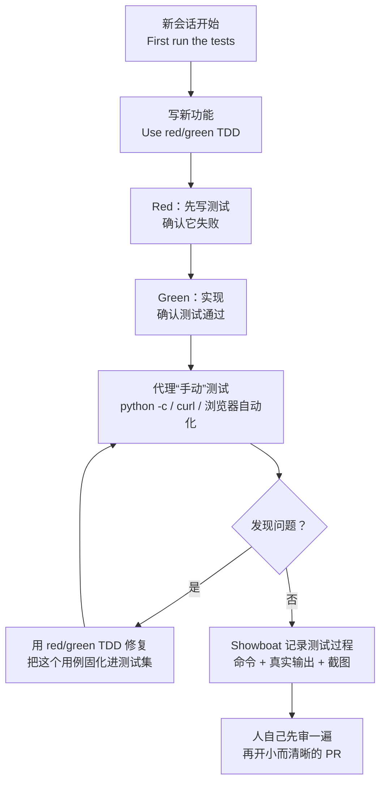

# 25｜四个字的提示词也能很管用：Simon Willison《Agentic Engineering Patterns》里的测试与验收模式

<a class="domain-tag" href="/guide/verification">阶段：做验证 · 测试、评测与审查</a>类型：指南工具：通用（不限工具）

**一句话看懂**：Django 联合创始人 Simon Willison 从 2026 年 2 月开始写一本“持续更新的书”《Agentic Engineering Patterns》。其中“测试与 QA”几章给出了几条极短但很管用的提示词：“Use red/green TDD”“First run the tests”，再让代理用 `python -c`、`curl`、浏览器自动化去“手动测试”。最后一条规矩是：**没自己审过的代码，不要丢给同事 review**。

::: info 为什么值得看
Simon 是最早系统记录 AI 编程实践的工程师之一，写了 400 多篇相关文章。这份指南按“设计模式”的形式组织，每章短小、有可直接复制的提示词。本文挑出和“规划 → 执行 → 验证”最相关的 4 章；其余章节（Subagents、Git、Linear walkthroughs 等）可以作为后续收录。
:::

::: tip 小白先懂这几个词
- Agentic Engineering（代理式工程）：专业工程师用能生成**并执行**代码的编码代理来放大自身能力；和“完全不看代码”的 Vibe Coding 相对。
- TDD（测试驱动开发）：先写测试，再写实现。
- [Red / Green](/glossary#red-green-tdd)：先看到测试**失败**（红），再让它**通过**（绿）。
- `python -c`：把一段 Python 代码直接交给解释器执行，适合快速试验。
- [Playwright / Rodney / agent-browser](/glossary#playwright)：让代理操作真实浏览器的工具。
- [Agentic Manual Testing（代理手动测试）](/glossary#agentic-manual-testing)：测试通过后，让代理像人一样亲手把程序跑一遍。
- [Showboat](/glossary#showboat)：Simon 写的工具，让代理把测试过程（命令 + 真实输出 + 截图）记录成 Markdown 文档。
:::

> 信息来源：Simon Willison 博客上的指南首页、介绍文章（2026-02-23）以及 “Red/green TDD”“First run the tests”“Agentic manual testing”“Anti-patterns: things to avoid” 四章原文（抓取于 2026-10-09）。指南章节会持续更新，引用以抓取时版本为准。英文引用均为原文摘录，中文翻译为本站所加。

## 1. 基本信息

<SourceCard type="指南" title="Agentic Engineering Patterns（测试与 QA 章节）" author="Simon Willison" date="2026-02-23 起连载" url="https://simonwillison.net/guides/agentic-engineering-patterns/" />

| 项目 | 内容 |
|---|---|
| 链接 | https://simonwillison.net/guides/agentic-engineering-patterns/ |
| 介绍文章 | https://simonwillison.net/2026/Feb/23/agentic-engineering-patterns/ |
| 类型 | 个人博客上的连载指南（文章） |
| 作者 | Simon Willison（Django 联合创始人、Datasette 作者） |
| 发布日期 | 2026-02-23 起连载，章节持续更新 |
| 涉及工具 | Claude Code、OpenAI Codex；`uv`/pytest、Playwright、Rodney、agent-browser、Showboat |

## 2. 做了什么

Simon 想回答一个问题：<Trans zh="我怎样才能从这些东西里得到好结果">“how do I get good results out of this stuff”</Trans>，并把答案集中在一个地方。他对“代理式工程”的定义是：

::: tr 我用 Agentic Engineering 指用编码代理来构建软件——比如 Claude Code 和 OpenAI Codex，它们的决定性特征是既能生成代码、也能执行代码，从而可以在没有人类逐轮指导的情况下测试并迭代这些代码。
> "I'm using Agentic Engineering to refer to building software using coding agents—tools like Claude Code and OpenAI Codex, where the defining feature is that they can both generate and execute code—allowing them to test that code and iterate on it independently of turn-by-turn guidance from their human supervisor."
:::

他特别声明：指南的文字是自己写的，不是 LLM 生成的。

## 3. 怎么做的

### 3.1 Red/green TDD：一句话装进整套纪律

**为什么有用**：编码代理最常见的两个风险是写出不能运行的代码，或者写出根本用不上的代码。先写测试能同时防住这两点，还顺便留下一套防回归的测试集。

关键是**先看到测试失败**：<Trans zh="如果跳过这一步，你可能写出一个本来就能通过的测试，于是根本没有检验到新实现">“If you skip that step you risk building a test that passes already, hence failing to exercise and confirm your new implementation.”</Trans>

好模型都能把 “red/green TDD” 理解成一长串要求的简写。原文示例提示词：

::: tr 写一个从 markdown 字符串中提取标题的 Python 函数。使用 red/green TDD。
> Build a Python function to extract headers from a markdown string. Use red/green TDD.
:::

### 3.2 First run the tests：新会话的第一句话

<Trans zh="和编码代理一起工作时，自动化测试不再是可选项。">“Automated tests are no longer optional when working with coding agents.”</Trans> 以前不写测试的借口（耗时、代码变得快要一直改）已经不成立，因为代理几分钟就能改好。

Simon 每次在已有项目里开新会话，都会先说：

::: tr 先跑一遍测试
> First run the tests
:::

Python 项目里他会更具体：

::: tr 运行 “uv run pytest”
> Run "uv run pytest"
:::

这四个词的作用（原文要点）：

1. 告诉代理“这里有测试集”，并逼它弄清楚怎么跑，之后它几乎一定会主动跑测试确认没弄坏东西；
2. 测试数量能让代理大致感知项目规模，并暗示它可以读测试来了解代码；
3. 让代理进入“测试心态”，之后会自然地补充新测试。

### 3.3 Agentic manual testing：测试通过 ≠ 能用

::: tr 在代码被真正执行之前，永远不要假设 LLM 生成的代码能用。
> "Never assume that code generated by an LLM works until that code has been executed."
:::

测试全绿但服务一启动就崩、关键按钮没显示，这种情况很常见。所以 Simon 也让代理做“手动测试”，按代码类型选手段，原文提示词：

| 场景 | 提示词原文 | 中文 |
|---|---|---|
| Python 函数 | <Trans zh="用 python -c 在一些边界情况上试试这个新函数">Try that new function on some edge cases using `python -c`</Trans> | 直接执行代码片段 |
| 编译型语言 | <Trans zh="在 /tmp 写代码，试这个函数的边界情况，然后编译运行">Write code in `/tmp` to try edge cases of that function and then compile and run it</Trans> | 放在 /tmp，避免误提交 |
| JSON API | <Trans zh="启动开发服务器，用 curl 探索这个新的 JSON API">Run a dev server and explore that new JSON API using `curl`</Trans> | “explore”会让它尝试很多方面 |
| Web UI | <Trans zh="启动开发服务器，然后用 uvx rodney --help 测试新首页，看截图确认菜单位置正确">Start a dev server and then use `uvx rodney --help` to test the new homepage, look at screenshots to confirm the menu is in the right place</Trans> | 浏览器自动化 + 看截图 |

最后一条提示词里藏着三个技巧：`uvx` 会在首次调用时自动安装工具；`--help` 的输出专门写给代理看，教会它怎么用；“look at screenshots”提醒它用自己的视觉能力检查截图。

手动测试发现的问题，再**用 red/green TDD 修复**，这样这个用例就进入了永久测试集。

### 3.4 用 Showboat 让代理“出示工作记录”

::: tr 运行 uvx showboat --help，然后创建一个 notes/api-demo.md 的 showboat 文档，用它来测试并记录那个新 API。
> Run `uvx showboat --help` and then create a `notes/api-demo.md` showboat document and use it to test and document that new API.
:::

Showboat 有三个命令：`note`（追加说明）、`exec`（记录命令并执行、记录真实输出）、`image`（插入截图）。`exec` 最关键：它记录的是**真实运行结果**，原文说这<Trans zh="旨在防止代理作弊，把它希望发生的事写进文档">“is designed to discourage the agent from cheating and writing what it hoped had happened into the document”</Trans>。

### 3.5 反模式：把没审过的代码丢给同事

::: tr 不要提交你自己都没审过的代码的 PR。
> "Don't file pull requests with code you haven't reviewed yourself."
:::

如果你提交了几百上千行代理生成、自己没验证过的代码，<Trans zh="你是在把真正的工作委派给别人">“you are delegating the actual work to other people”</Trans>。一个好的代理式工程 PR 应该：

- 代码能用，而且你确信它能用；
- 改动足够小，审查者不会负担过重（多个小 PR 胜过一个大 PR，拆 commit 可以让代理来做）；
- 附上上下文：服务于什么目标，链接相关 issue 或 spec；
- **PR 描述也要自己审**，代理写的描述看起来很有说服力；
- 附上证据：手动测试笔记、截图或视频。

## 4. 结果如何

这是一份方法指南，没有量化数据。它的价值在于**提示词极短、可以立刻用**：几个英文单词就能调用模型已经学会的整套工程纪律。Simon 也说明他的博客“指南”功能本身的大部分代码，是 Claude Opus 4.6 在 Claude Code for web 中写的，他通过 iPhone 操作。

::: warning 局限与注意
- 指南仍在连载，章节可能修改或新增；引用以抓取时版本为准。
- 例子以 Python 和 Web 项目为主；其他技术栈需要找对应的“手动测试”手段。
- Rodney、Showboat 都是作者自己的开源工具，可以换成 Playwright、agent-browser 等同类工具。
:::

## 5. 可借鉴之处

1. **把 “First run the tests” 当作每个新会话的第一句**，或者写进 CLAUDE.md / AGENTS.md 的 HOW 部分（例如 `uv run pytest`）。
2. **新功能默认加一句 “Use red/green TDD”**，并检查代理是否真的先看到了失败。
3. **为你的项目准备“手动测试”通道**：Python 用 `python -c`，API 用 `curl`，前端用 Playwright 并要求看截图。
4. **手动测出的 bug 必须变成自动化测试**，防止同样的问题再出现。
5. **要求代理留下可验证的工作记录**：命令和真实输出，而不是它写的总结。
6. **PR 前自己先审**：代码、描述、证据三样都过一遍。

### 你可以这样试

- [ ] 下一个新会话开头输入 `First run the tests`，观察代理之后是否会主动跑测试。
- [ ] 让代理实现一个小函数，提示词结尾加 `Use red/green TDD.`，检查它的输出里有没有“测试先失败”的记录。
- [ ] 做完一个 API 改动后，补一句 `Run a dev server and explore that new JSON API using curl`，看它能否发现单元测试没覆盖的问题。
- [ ] 下次提 PR 前，在描述里加一段“我是怎么验证的”（命令 + 截图）。

::: details 读完自测（点开看答案）
1. **为什么 red/green TDD 要先确认测试失败？** 否则可能写出一个本来就能通过的测试，根本没检验新代码。
2. **“First run the tests” 这四个词起到哪三个作用？** 让代理知道有测试集并学会怎么跑；感知项目规模；进入测试心态。
3. **Showboat 的 `exec` 命令为什么重要？** 它记录真实的命令和输出，防止代理把“希望发生的事”写进文档。
:::
