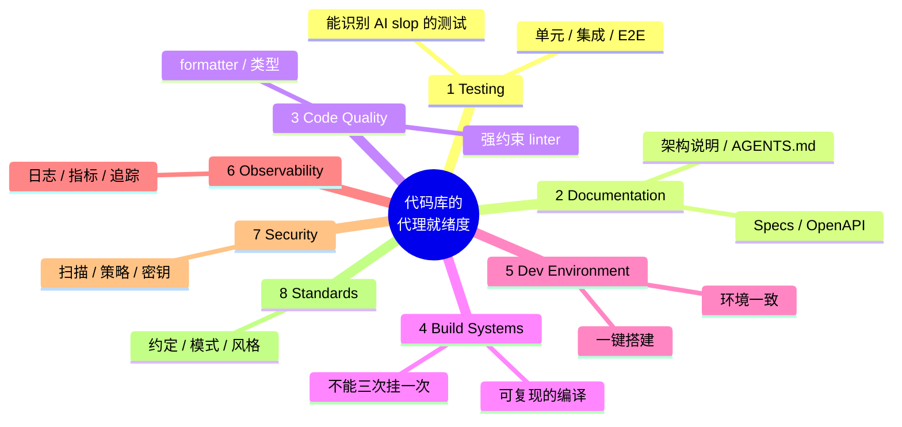
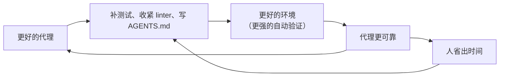

# 代理不好用，往往不是工具的问题：Factory CTO 讲“让代码库为代理做好准备”的 8 根验证支柱

通用（不限工具）

**一句话看懂**：Factory 联合创始人兼 CTO Eno Reyes 认为，限制编码代理的不是模型能力，而是你的代码库有没有足够的**自动化验证**：测试、文档、linter、构建、开发环境、可观测性、安全扫描、规范。与其花 45 天比较哪个工具在 SWE-bench 上高 10%，不如把这 8 根支柱补齐，所有工具都会变好用。

::: info 为什么值得看
这是一场面向技术负责人的 15 分钟演讲，**和具体工具无关**。它把“为什么同一个代理在 A 公司好用、在 B 公司不好用”讲清楚了，还给了一个可以拿来给自己代码库打分的 8 项清单。适合准备在团队推广编码代理、却发现初级工程师用不起来的人。
:::

::: tip 小白先懂这几个词
- Verification（验证）/ Validation（校验）：自动判断一个改动对不对，比如测试、lint、类型检查。
- [Asymmetry of Verification（验证的不对称性）](/glossary#asymmetry-of-verification)：很多问题“验证答案”比“求出答案”容易得多。
- [Specification-Driven Development（规格驱动开发）](/glossary#spec-driven-development)：先写清要什么、怎么验证，再让代理生成，最后验证和迭代。
- Opinionated Linter（强约束的 linter）：规则严格到能把代码风格和质量拉到资深工程师水平。
- [AGENTS.md](/glossary#agents-md)：几乎所有编码代理都支持的开放规则文件标准。
- [Droid](/glossary#droid)：Factory 自家编码代理的名字。
:::

## 1. 基本信息

<YouTube id="ShuJ_CN6zr4" title="Making Codebases Agent Ready" />

| 项目 | 内容 |
|---|---|
| 讲者 / 频道 | Eno Reyes（Factory 联合创始人兼 CTO）／ **AI Engineer**（AI Engineer Code Summit 2025） |
| 发布日期 | 2025-12-22 |
| 时长 | 15:33 |
| 使用工具 | 与工具无关；提到 Factory 的 Droid、AGENTS.md、Browserbase 等 |
| 分析依据 | AI Engineer 官网该演讲页面的带时间戳文字稿（ai.engineer/talks/ShuJ_CN6zr4-making-codebases-agent-ready）+ YouTube 元数据与章节（yt-dlp）+ 视频截图（8 根支柱的名称来自 4:30 的幻灯片）。英文引用均来自文字稿。 |

## 2. 做了什么

讲者想回答：**为什么有的组织能把编码代理用到并行、大规模迁移，有的连单个任务都不稳定？** 他的答案是验证基础设施。

很多代码库的测试覆盖率只有 50%–60%，构建三次挂一次，大家心照不宣地忍着，因为人类会手动补测。但代理不会：

::: tr 当你开始把 AI 代理引入软件开发生命周期时——我不只是指交互式编码，而是方方面面：审查、文档、测试——这会让它们的能力崩掉。
> "But when you start introducing AI agents into your software development lifecycle, and I don't just mean in interactive coding, but really across the board, right? Uh, review, documentation, testing, all this stuff, um, this breaks their capabilities."
:::

## 3. 怎么做的

### 3.1 先理解：软件开发为什么是 AI 的最前沿

讲者引用 Andrej Karpathy 的 “Software 2.0” 和 Jason Wei 的“验证不对称性”：能被 AI 解决的问题边界，取决于你能否**定义目标并在解空间里搜索**。最适合 AI 的问题有这些特点：有客观真相、验证快、可并行扩展、噪音低、信号连续（不只是对/错，还有 30%、70%）。

<figure class="shot"><figcaption>📷 视频截图 · <a href="https://www.youtube.com/watch?v=ShuJ_CN6zr4&t=150s" target="_blank" rel="noopener">2:30</a> · “Asymmetry of Verification”：可验证任务的五个属性。</figcaption></figure>

软件开发恰好**高度可验证**，几十年来积累了大量自动化验证手段，这就是编码代理是目前最先进代理的原因。

### 3.2 给你的代码库打分：8 根验证支柱

<figure class="shot"><figcaption>📷 视频截图 · <a href="https://www.youtube.com/watch?v=ShuJ_CN6zr4&t=270s" target="_blank" rel="noopener">4:30</a> · 8 根验证支柱：测试、文档、代码质量、构建、开发环境、可观测性、安全、规范。</figcaption></figure>

讲者建议的自检问题（原文）：

- <Trans zh="你的 linter 是否严格到能让编码代理写出的代码永远达到资深工程师的水平？">“Do you have linters that are so opinionated that a coding agent will always make code that is exactly at the level of what your senior engineers will produce?”</Trans>
- <Trans zh="你的测试会不会在引入 AI slop 时失败、在引入高质量 AI 代码时通过？">“Do you have tests that will fail when AI slop has been introduced, uh, and when high-quality AI code is introduced, those tests pass, right?”</Trans>

### 3.3 开发循环变成“规格 → 生成 → 验证 → 迭代”

传统循环是“理解问题 → 设计 → 编码 → 测试”。有了严格的验证后，用代理开发变成：**写清约束和要构建的东西 → 生成方案 → 用自动验证 + 你的直觉去验证 → 迭代**。各家工具的 spec mode、plan mode 都在朝这个方向走。

<figure class="shot"><figcaption>📷 视频截图 · <a href="https://www.youtube.com/watch?v=ShuJ_CN6zr4&t=420s" target="_blank" rel="noopener">7:00</a> · 规格 + 验证 = 可靠的 AI 生成代码；对比“提示一下，然后祈祷它能用”。</figcaption></figure>

### 3.4 先把单任务做到接近 100%，再谈并行

::: tr 如果单个任务的执行——简单的“我想完成这件事，这是我希望的做法，这是你该如何验证”——都不能做到几乎 100% 成功，那你基本可以忘了在公司里大规模使用其他那些东西。
> "And if the single task execution, right? The simple, "I would like to get this done, here's exactly how I'd like it to be done, and here's how you should validate," if that does not work nearly a hundred percent of the time, you can sort of forget successfully using these other things at scale in your company."
:::

没有能自动判断 PR 是否基本可用的验证，就不可能同时并行多个代理，也不可能把大型现代化迁移拆成子任务交给代理。

### 3.5 让代理帮你补验证：正反馈循环

代理不会凭空创造验证标准，但**能帮你找出缺口并补上**：例如问它“我们的 linter 哪里约束不够？”，让它生成测试。讲者引用同事 Alvin 的一句话：<Trans zh="烂测试也比没有测试好。">“A slop test is better than no test.”</Trans> 有了测试，人会去改进它，其他代理也会注意到并模仿这些模式。

讲者称这是新的 DevX 循环：投资的不只是“多招 10 个人”，而是让每个人和每个工具都更成功的**环境反馈回路**。

## 4. 结果如何

讲者的主张（均为观点，演讲中没有给出实验数据）：

- “从 bug 提交到代理修复、开发者批准、合并上线只要一两个小时”的全自动流程，技术上今天就可行，<Trans zh="限制因素不是编码代理的能力，而是你所在组织的验证标准">“The limiter is not the capability of the coding agent. The limit is your organization's validation criteria.”</Trans>
- 投资验证带来的不是 1.5 倍、2 倍，而是 5–7 倍的提升（讲者口述，无数据支撑）。
- 初级工程师用不好代理，往往不是能力问题，而是代码库有一些“小众做法”没有自动验证。

<figure class="shot"><figcaption>📷 视频截图 · <a href="https://www.youtube.com/watch?v=ShuJ_CN6zr4&t=730s" target="_blank" rel="noopener">12:10</a> · “The Path Forward”：评估 → 改进 → 部署 → 迭代。</figcaption></figure>

::: warning 局限与注意
- 演讲中有产品推广成分（Factory 提供评估代理就绪度的服务），但核心清单与工具无关。
- 5–7 倍等数字没有给出测量方法，应视为观点。
- “烂测试也比没有好”有争议，讲者自己也说“slightly controversial”；烂测试可能把错误行为固化，需要后续有人改进。
:::

## 5. 可借鉴之处

1. **用 8 根支柱给代码库打分**，每项 0–2 分，最低的那项就是下一步投入方向。
2. **先追求单任务成功率**：选 10 个典型小任务让代理做，成功率不高之前不要急着搞并行和后台代理。
3. **把“资深工程师的品味”写进 linter 和测试**，而不是写进提示词。
4. **让代理帮你补验证**：问它“哪些目录没有测试”“哪些 lint 规则太松”，让它生成第一版测试再由人改进。
5. **观察谁用不好代理**：如果是初级工程师，找出他们踩到的、没有自动验证的“隐性规矩”。
6. **把时间投资到工具无关的地方**：好的验证体系对任何代理、任何代码审查工具都有效。

### 你可以这样试

- [ ] 复制下面的清单到一个 issue，给你的仓库逐项打分：Testing / Documentation / Code Quality / Build Systems / Dev Environment / Observability / Security / Standards。
- [ ] 让代理执行：“列出本仓库没有任何测试覆盖的模块，并按改动频率排序。”
- [ ] 让代理检查 lint 配置：“找出我们代码中反复出现、但 linter 没有拦住的 3 种坏模式，并建议对应的规则。”
- [ ] 确认仓库根目录有 AGENTS.md / CLAUDE.md，且写清了如何运行测试和 lint。

::: details 读完自测（点开看答案）
1. **讲者认为编码代理能力的上限由什么决定？** 组织的自动化验证标准，而不是代理本身的能力。
2. **8 根验证支柱是哪些？** 测试、文档、代码质量、构建系统、开发环境、可观测性、安全、规范。
3. **为什么要先把单任务成功率做高？** 单任务都不可靠的话，并行代理、大规模迁移拆分等更复杂的用法都无法成功。
:::
