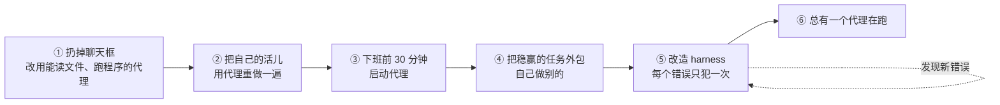

# 27｜从 AI 怀疑者到“总有一个代理在跑”：Mitchell Hashimoto 的六步采用路线

<a class="domain-tag" href="/guide/execution">阶段：去执行 · 从单代理到多代理</a>类型：文章工具：通用（不限工具）

**一句话看懂**：HashiCorp 联合创始人、Ghostty 作者 Mitchell Hashimoto 用六步讲清楚他怎么从“觉得 AI 写代码没用”走到“离不开”：先扔掉聊天框，再把自己的活儿用代理重做一遍，然后利用下班前 30 分钟、把稳赢的任务外包出去、为每个错误“改造 harness”，最终目标是总有一个代理在后台干活。

::: info 为什么值得看
这篇文章没有炒作，作者明确说全文手写、不在任何 AI 公司任职或投资。它最适合**刚开始用编码代理、还没感到提效**的人：每一步都有具体动作，也坦白承认每一步一开始都“又难受又没用”。文中“harness engineering”的说法，和本站 Ryan Lopopolo 那篇 Harness Engineering 视频可以对照着读。
:::

::: tip 小白先懂这几个词
- [Agent（代理）](/glossary#agent)：能在循环里对话并调用外部能力的 LLM。作者给的最低标准：能读文件、能执行程序、能发 HTTP 请求。
- [Harness Engineering](/glossary#harness)：每当代理犯一个错，就花时间改造环境（规则文件或脚本工具），让它再也不犯这个错。
- [AGENTS.md](/glossary#agents-md)：放在仓库里、写给代理看的说明文件（Claude Code 对应 CLAUDE.md）。
- Triage（分诊）：快速浏览 issue / PR，判断优先级和难度。
- [Slam Dunk（稳赢的任务）](/glossary#slam-dunk)：你已经很有把握代理能做好的任务。
:::

> 信息来源：作者个人博客原文全文（WebFetch 抓取于 2026-10-09）。英文引用均为原文摘录，中文翻译为本站所加。

## 1. 基本信息

<SourceCard type="文章" title="My AI Adoption Journey" author="Mitchell Hashimoto" date="2026-02-05" url="https://mitchellh.com/writing/my-ai-adoption-journey" />

| 项目 | 内容 |
|---|---|
| 链接 | https://mitchellh.com/writing/my-ai-adoption-journey |
| 类型 | 个人技术博客（文章） |
| 作者 | Mitchell Hashimoto（HashiCorp 联合创始人，终端模拟器 Ghostty 作者） |
| 发布日期 | 2026-02-05 |
| 提到的工具 | Claude Code、Gemini（网页版）、Amp 的 deep mode、GitHub CLI（`gh`） |
| 配套示例 | 文中链接的 Ghostty 仓库 AGENTS.md |

## 2. 做了什么

作者认为采用任何有意义的工具都要经历三个阶段：<Trans zh="（1）低效期（2）够用期，最后（3）改变工作流和生活的发现期">“(1) a period of inefficiency (2) a period of adequacy, then finally (3) a period of workflow and life-altering discovery.”</Trans>

这篇文章就是他从怀疑者一路熬过前两个阶段的记录，目标是给出一个<Trans zh="更有分寸、更克制的看法">“more nuanced, measured approach”</Trans>，而不是又一篇夸张的热评。

## 3. 怎么做的

### 3.1 第一步：扔掉聊天框

**为什么**：在聊天框里写代码，基本是在赌模型凭训练数据猜对；改错要靠你一遍遍告诉它“不对”，还得来回复制粘贴。

作者的第一个“哇”时刻是把 Zed 编辑器命令面板的截图贴给 Gemini，让它用 SwiftUI 复刻，结果 Ghostty 现在 macOS 版的命令面板只是在那份代码上轻微改过。但换到存量项目（brownfield）就频频失望。结论：

::: tr 想获得价值，就必须用代理。
> "To find value, you must use an agent."
:::

### 3.2 第二步：把自己的活儿重做一遍

他开始用 Claude Code，一开始并不满意，觉得改它的产出比自己写还慢。于是他强迫自己<Trans zh="我真的把每件工作做了两遍">“I literally did the work twice”</Trans>：先手动完成，再让代理在**看不到手动答案**的情况下做出同等质量的结果。

这个过程很痛苦，但他自己从第一性原理总结出了三条：

1. <Trans zh="把会话拆成独立、清晰、可执行的任务。不要试图在一个超长会话里“画完整只猫头鹰”。">“Break down sessions into separate clear, actionable tasks. Don't try to "draw the owl" in one mega session.”</Trans>
2. <Trans zh="对于模糊的需求，把工作拆成单独的规划会话和执行会话。">“For vague requests, split the work into separate planning vs. execution sessions.”</Trans>
3. <Trans zh="如果你给代理一种验证自己工作的方法，它多半会自己修好错误、防止回归。">“If you give an agent a way to verify its work, it more often than not fixes its own mistakes and prevents regressions.”</Trans>

另一个收获是“负空间”：**知道什么时候不该用代理**，本身就省时间。

### 3.3 第三步：下班前 30 分钟启动代理

思路是<Trans zh="与其在有限的时间里做更多，不如在我本来就不工作的时间里做更多">“instead of trying to do more in the time I have, try to do more in the time I don't have.”</Trans> 他发现三类任务特别合适：

- **深度调研**：例如找出某语言下某种许可证的所有库，为每个写多页的优劣分析。
- **并行试探模糊想法**：不指望能直接上线，但可能照出“未知的未知”。
- **Issue / PR 分诊**：用 `gh` 批量启动代理做分诊，但**不允许代理回复**，只要第二天的报告。

结果是第二天早上有一个“热启动”。

### 3.4 第四步：把稳赢的任务外包出去

每天早上从前一晚的分诊结果里**人工筛出代理几乎一定能做好的 issue**，让它在后台跑（一次一个，不并行），自己去做别的深度工作。

::: tip 关掉代理的桌面通知
原文：<Trans zh="上下文切换非常昂贵……什么时候打断代理应该由我这个人来决定，而不是反过来">“Context switching is very expensive. In order to remain efficient, I found that it was my job as a human to be in control of when I interrupt the agent, not the other way around.”</Trans> 在自然的休息间隙再切过去看一眼。
:::

他还认为“自己做别的”能缓解技能退化的担忧：委派出去的任务不再练手，但自己手动做的任务仍在持续积累技能。

### 3.5 第五步：改造 harness

::: tr 每当你发现代理犯了一个错误，就花时间设计一个解决方案，让代理再也不会犯这个错误。
> "anytime you find an agent makes a mistake, you take the time to engineer a solution such that the agent never makes that mistake again."
:::

两种形式：

1. **更好的隐式提示（AGENTS.md）**：代理反复跑错命令、找错 API，就写进 `AGENTS.md`。他提到 Ghostty 的 AGENTS.md 里<Trans zh="每一行都源于一次糟糕的代理行为，而它几乎完全解决了这些问题">“Each line in that file is based on a bad agent behavior, and it almost completely resolved them all.”</Trans>
2. **真正写成程序的工具**：截图脚本、过滤测试的脚本等，并在 AGENTS.md 里告诉代理有这些工具。

### 3.6 第六步：总有一个代理在跑

如果没有代理在跑，就问自己：<Trans zh="现在有没有什么事是代理可以替我做的？">“is there something an agent could be doing for me right now?”</Trans> 他偏好搭配更慢但更深思的模型（Amp 的 deep mode），小改动可能要 30 分钟以上，但结果很好。

他目前**不跑多个代理**，也不太想；坦白说现在大约只有一个工作日的 10%–20% 时间有后台代理在跑。

## 4. 结果如何

- 第二步之后：用代理“不比自己慢”，但也没觉得更快。
- 第三步之后：开始觉得比用 AI 之前多做了一点。
- 第四步之后：<Trans zh="彻底进入“不可能回头”的状态">“firmly in the "no way I can go back" territory”</Trans>，最喜欢的是能专注在自己热爱的任务上。

::: warning 局限与注意
- 这是个人经验，没有量化数据。
- 作者明确表示担心初级工程师在基础不牢时的技能形成问题。
- 他只跑一个后台代理；文中没有多代理并行的经验。
:::

## 5. 可借鉴之处

1. **用“做两遍”练手**：选几个你刚手动完成的小 commit，让代理在看不到答案的情况下重做，对比差异，比看教程学得快。
2. **建立“代理能力地图”**：记录哪些任务它稳赢、哪些必败，必败的不要再浪费时间。
3. **把下班前 30 分钟变成代理时间**：调研、试探想法、分诊，第二天看报告。
4. **AGENTS.md / CLAUDE.md 每一行都对应一个真实错误**：不要写空泛原则，写“它犯过的错 + 正确做法”。
5. **给代理验证工具**：截图、只跑相关测试的脚本，并在规则文件里告诉它怎么用。
6. **关掉通知**，由你决定何时查看代理。

### 你可以这样试

- [ ] 挑一个上周你亲手完成的小改动，新开分支让代理重做（不给它看你的提交），对比两份结果，记下 3 条它做得不好的地方。
- [ ] 今天下班前 30 分钟，用 `gh issue list` 挑 5 个 issue，让代理各写一份分诊报告（难度、可能的修改位置），禁止它在 GitHub 上回复。
- [ ] 打开你的 AGENTS.md / CLAUDE.md，删掉一条空泛原则，补上一条“代理上周真的犯过的错”。
- [ ] 关掉代理工具的桌面通知，坚持一天。

::: details 读完自测（点开看答案）
1. **作者认为代理至少要具备哪三种能力？** 读文件、执行程序、发 HTTP 请求。
2. **“下班前代理”适合哪三类任务？** 深度调研、并行试探模糊想法、issue/PR 分诊（只出报告不回复）。
3. **作者说的 harness engineering 有哪两种形式？** 更新 AGENTS.md 这类隐式提示；编写真正的脚本工具并告诉代理。
:::
