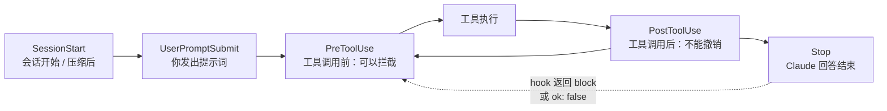

# 让规则“一定会执行”：Claude Code Hooks 官方指南（附 Gemini CLI hooks 对照）

<div class="meta-tags"><span class="tool-tag tool-claude">Claude Code</span></div>

<div class="hook">

**一句话看懂**：写进 CLAUDE.md 的规则，模型可能照做，也可能忘掉；写成 hook 的规则，Claude Code 在固定时刻**一定会执行**。官方指南给出了一组可以直接复制的 `settings.json` 配置：改完文件自动格式化、拦住对 `.env` 的修改、压缩上下文后重新提醒约定、收工前让模型或子代理检查测试是否通过。

</div>

::: info 为什么值得看
本站多篇文章都提到“用 hook 把规范变成确定性检查”：HumanLayer 建议用 Stop hook 跑 linter（[[20§3.6]]），官方 Ralph 插件靠 hook 反复注入提示词（[[24§3.4]]），Codex 也有 hooks（[[08§3.6]]），但之前没有一篇给出**可以逐字照抄的配置**。这篇官方文档补上了这个缺口，下文第 3 节逐字给出了它的示例配置。文末附上 Google 官方博客里 Gemini CLI hooks 的写法作对照，两者的设计几乎一样。
:::

::: tip 小白先懂这几个词
- [Hooks（钩子）](/glossary#hooks)：在代理生命周期的固定时刻自动运行的脚本。
- PreToolUse / PostToolUse：工具调用**之前** / **之后**触发的事件；前者可以拦截，后者只能补救。
- [Stop Hook](/glossary#stop-hook)：Claude 每次回答结束时触发的 hook。
- Matcher（匹配器）：决定 hook 只对哪些工具或场景生效，例如 `Edit|Write`。
- Exit code 2：hook 脚本以退出码 2 结束，表示“拦下这个动作”，stderr 里的文字会作为理由交给 Claude。
- [Prompt / Agent Hook](/glossary#prompt-agent-hook)：不跑 shell 命令，而是让模型（或带工具的子代理）来判断条件是否满足。
:::

## 1. 基本信息

<SourceCard type="官方文档" title="Automate actions with hooks" author="Anthropic（Claude Code 文档）" date="持续更新的文档页（抓取于 2026-10-09）" url="https://code.claude.com/docs/en/hooks-guide" />

| 项目 | 内容 |
|---|---|
| 主链接 | https://code.claude.com/docs/en/hooks-guide |
| 完整参考 | https://code.claude.com/docs/en/hooks （事件的输入输出格式） |
| 对照 | https://developers.googleblog.com/tailor-gemini-cli-to-your-workflow-with-hooks/ （Edi Palencia、Jack Wotherspoon、Abhi Patel，Google，2026-01-28） |
| 类型 | 官方产品文档 |
| 作者 | Anthropic |
| 日期 | 持续更新的文档，抓取于 2026-10-09 |
| 使用工具 | Claude Code（`settings.json`、`/hooks`）、`jq`、Prettier；对照部分为 Gemini CLI |
| 分析依据 | Claude Code 官方文档《Automate actions with hooks》的 Markdown 版本（`code.claude.com/docs/en/hooks-guide.md`），以及 Google Developers Blog《Tailor Gemini CLI to your workflow with hooks》（2026-01-28）。均于 2026-10-09 抓取。Claude Code 文档持续更新，没有固定发布日期，文中出现的事件名和版本号以抓取时为准。英文引用和配置均为原文摘录。 |

## 2. 做了什么

规则文件（CLAUDE.md / AGENTS.md）是写给模型看的“建议”，模型会不会照做取决于它当时注意到了什么。有些事情不能靠模型自觉，比如“每次改完文件都要格式化”“永远不许改 `.env`”。文档开头就说明了 hooks 的定位：

::: tr Hooks 是用户定义的 shell 命令，Claude Code 在生命周期的特定时刻运行它们。这带来确定性的控制：某些动作一定会发生，而不是依赖 LLM 自己选择去运行它们。
> "Hooks are user-defined shell commands. Claude Code runs them at specific points in its lifecycle, which gives you deterministic control: certain actions always happen rather than relying on the LLM to choose to run them."
:::

指南按“常见需求”组织，每个需求给一段可以直接加进 `settings.json` 的配置，然后解释事件、输入输出、匹配器和排错方法。

## 3. 怎么做的

### 3.1 hook 写在哪里、在什么时候触发



配置放在哪个文件，决定了 hook 的作用范围（节选原文表格）：

| 位置 | 作用范围 | 能否共享 |
|---|---|---|
| `~/.claude/settings.json` | 你的所有项目 | 否，只在本机 |
| `.claude/settings.json` | 单个项目 | 可以提交到仓库 |
| `.claude/settings.local.json` | 单个项目 | 否 |
| Managed policy settings | 整个组织 | 由管理员控制 |
| 插件的 `hooks/hooks.json` | 启用插件时 | 随插件分发 |

在 Claude Code 里输入 `/hooks` 可以看到所有已配置的 hook。团队共享的规则放 `.claude/settings.json`，跟代码一起提交。

### 3.2 改完文件自动格式化（PostToolUse）

这是最常见的用法：每次 Claude 用 `Edit` 或 `Write` 改完文件，就对那个文件跑 Prettier。

::: tr 在项目的 .claude/settings.json 里：每次 Edit 或 Write 之后，用 jq 取出被改文件的路径，交给 Prettier 格式化。
```json
{
  "hooks": {
    "PostToolUse": [
      {
        "matcher": "Edit|Write",
        "hooks": [
          {
            "type": "command",
            "command": "jq -r '.tool_input.file_path' | xargs npx prettier --write"
          }
        ]
      }
    ]
  }
}
```
:::

要注意：Claude 也可能通过 `Bash` 命令改文件，这时 `Edit|Write` 匹配不到。文档给了三种办法：想在某个文件变化时（不管谁改的）都触发，用 `FileChanged` hook；必须看到每一处改动（如合规扫描、审计日志）时，加一个每轮扫描一次工作区的 `Stop` hook；或者也匹配 `Bash|PowerShell`，在脚本里用 `git status --porcelain` 列出改过的文件。

### 3.3 拦住对敏感文件的修改（PreToolUse + 退出码 2）

hook 在工具执行**之前**运行，脚本从 stdin 读到这次调用的 JSON，用退出码告诉 Claude Code 怎么办：

::: tr 保存为 .claude/hooks/protect-files.sh：读取要改的文件路径，如果命中 .env、package-lock.json 或 .git/，就把原因写到 stderr 并以退出码 2 拦下。
```bash
#!/bin/bash
# protect-files.sh

INPUT=$(cat)
FILE_PATH=$(echo "$INPUT" | jq -r '.tool_input.file_path // empty')

# Normalize Windows backslash separators so the patterns below match
FILE_PATH="${FILE_PATH//\\//}"

PROTECTED_PATTERNS=(".env" "package-lock.json" ".git/")

for pattern in "${PROTECTED_PATTERNS[@]}"; do
  if [[ "$FILE_PATH" == *"$pattern"* ]]; then
    echo "Blocked: $FILE_PATH matches protected pattern '$pattern'" >&2
    exit 2
  fi
done

exit 0
```
:::

再在 `.claude/settings.json` 里注册：

::: tr 在任何 Edit 或 Write 之前运行上面的脚本。$CLAUDE_PROJECT_DIR 指向项目根目录。
```json
{
  "hooks": {
    "PreToolUse": [
      {
        "matcher": "Edit|Write",
        "hooks": [
          {
            "type": "command",
            "command": "\"$CLAUDE_PROJECT_DIR\"/.claude/hooks/protect-files.sh"
          }
        ]
      }
    ]
  }
}
```
:::

退出码的含义：`0` 表示 hook 不反对（对 PreToolUse 来说**不等于批准**，正常的权限流程照常进行）；`2` 表示拦下这个动作，stderr 的内容会作为反馈交给 Claude，让它换个做法。还有一个重要性质：

::: tr PreToolUse hook 在任何权限模式检查之前触发……返回 permissionDecision: "deny" 的 hook 即使在 bypassPermissions 模式或使用 --dangerously-skip-permissions 时也会拦下这个工具调用。
> "`PreToolUse` hooks fire before any permission-mode check, in every permission mode, including `dontAsk`. A hook that returns `permissionDecision: "deny"` blocks the tool even in `bypassPermissions` mode or with `--dangerously-skip-permissions`."
:::

反过来不成立：hook 返回 `"allow"` 绕不过 settings 里的 deny 规则。也就是说，hook 只能**收紧**限制，不能放宽。

### 3.4 压缩上下文之后，把关键约定再说一遍（SessionStart）

上下文快满时，[压缩](/glossary#compaction)会把对话总结成摘要，细节可能丢失。文档的做法是用 `compact` 匹配器，在每次压缩后重新注入提醒：

::: tr 每次压缩后，把“用 Bun 不用 npm、提交前跑 bun test、当前冲刺是 auth 重构”这段提醒加回 Claude 的上下文。
```json
{
  "hooks": {
    "SessionStart": [
      {
        "matcher": "compact",
        "hooks": [
          {
            "type": "command",
            "command": "echo 'Reminder: use Bun, not npm. Run bun test before committing. Current sprint: auth refactor.'"
          }
        ]
      }
    ]
  }
}
```
:::

`echo` 可以换成任何有输出的命令，比如 `git log --oneline -5`。文档也提醒：如果是**每次会话开始**都要注入的内容，应该写进 CLAUDE.md，而不是 hook。

### 3.5 收工前让模型检查：prompt hook 与 agent hook

有些条件不是脚本能判断的，比如“用户要求的事都做完了吗”。这时可以用 `type: "prompt"`，让一个 Claude 模型来判断。返回 `"ok": false` 时，`reason` 会作为下一条指令交给 Claude，它会接着干：

::: tr Stop hook：让模型检查所有任务是否完成；没完成就返回 ok: false 和“还剩什么要做”。
```json
{
  "hooks": {
    "Stop": [
      {
        "hooks": [
          {
            "type": "prompt",
            "prompt": "Check if all tasks are complete. If not, respond with {\"ok\": false, \"reason\": \"what remains to be done\"}."
          }
        ]
      }
    ]
  }
}
```
:::

如果要真正**跑测试**才能判断，就用 `type: "agent"`：它会派出一个能读文件、跑命令的子代理（文档注明 agent hook 仍是实验功能，生产环境优先用 command hook）：

::: tr Stop hook：派一个子代理运行单元测试并检查结果，测试没全过就不让 Claude 停下；超时 120 秒。
```json
{
  "hooks": {
    "Stop": [
      {
        "hooks": [
          {
            "type": "agent",
            "prompt": "Verify that all unit tests pass. Run the test suite and check the results. $ARGUMENTS",
            "timeout": 120
          }
        ]
      }
    ]
  }
}
```
:::

::::: warning Stop hook 的死循环保护
如果 Stop hook 连续 8 次拦住 Claude（期间没有任何工具调用），Claude Code 会强行放行。自己写的 Stop hook 脚本应先检查输入里的 `stop_hook_active` 字段，已经是 `true` 就直接退出，原文示例：

::: tr 如果 stop_hook_active 已经是 true，就直接放行（exit 0），避免无限续跑。
```bash
#!/bin/bash
INPUT=$(cat)
if [ "$(echo "$INPUT" | jq -r '.stop_hook_active')" = "true" ]; then
  exit 0  # Allow Claude to stop
fi
# ... rest of your hook logic
```
:::
:::::

### 3.6 对照：Gemini CLI 的 hooks

Google 在 2026 年 1 月给 Gemini CLI 加上了几乎同样的机制，把 hooks 比作代理的“中间件”（middleware）。事件名不同（`BeforeTool`、`AfterTool`、`AfterAgent` 等），配置结构几乎一样。博客的完整示例是拦截写入密钥的 `BeforeTool` hook，配置部分原文如下：

::: tr .gemini/settings.json：Gemini 每次调用 write_file 或 replace 之前，先运行项目里的 block-secrets.sh 扫描要写入的内容。
```json
{
  "hooks": {
    "BeforeTool": [
      {
        "matcher": "write_file|replace",
        "hooks": [
          {
            "name": "secret-scanner",
            "type": "command",
            "command": "$GEMINI_PROJECT_DIR/.gemini/hooks/block-secrets.sh",
            "description": "Prevent committing secrets"
          }
        ]
      }
    ]
  }
}
```
:::

对应的脚本保存为 `.gemini/hooks/block-secrets.sh`，博客原文如下。注意它用 JSON 里的 `"decision": "deny"` 表达拒绝，退出码仍是 0；正则只是示例，覆盖不了所有密钥格式。

::: tr block-secrets.sh：从 stdin 读取 hook 输入，用 jq 取出要写入的内容；匹配到常见密钥模式就返回结构化的拒绝（deny），否则放行（allow）。
```bash
#!/usr/bin/env bash
# Read hook input from stdin
input=$(cat)

# Extract content being written using jq
content=$(echo "$input" | jq -r '.tool_input.content // .tool_input.new_string // ""')

# Check for common secret patterns
if echo "$content" | grep -qE 'api[_-]?key|password|secret|AKIA[0-9A-Z]{16}'; then
  # Return structured denial to the agent
  cat <<EOF
{
  "decision": "deny",
  "reason": "Security Policy: Potential secret detected in content.",
  "systemMessage": "Security scanner blocked operation"
}
EOF
  exit 0
fi

# Allow the operation
echo '{"decision": "allow"}'
exit 0
```
:::

脚本发现疑似密钥时返回 `{"decision": "deny", ...}`，代理会收到拒绝理由并自己修正。博客还提到，社区的 Ralph 扩展就是用 `AfterAgent` hook 拦截“完成”信号、让 Gemini CLI 继续循环，这和 Claude Code 官方 Ralph 插件的思路相同（对比见 [[24§3.4]]）。博客给的三条建议很实用：

- <Trans zh="保持 hook 快速：它们是同步运行的，脚本的任何延迟都会拖慢代理的响应。">“Keep hooks fast: Because they run synchronously, any delay in your script will delay the agent’s response”</Trans>
- <Trans zh="使用具体的匹配器，而不是让 hook 对每个工具都运行。">“Use specific matchers: Instead of running a hook for every single tool, use the `matcher` property”</Trans>
- <Trans zh="安全第一：hook 以你的用户权限执行，启用项目级 hook 前一定要审查它的来源。">“Security first: Hooks execute with your user privileges, so always review the source of project-level hooks before enabling them.”</Trans>

## 4. 结果如何

这是一份操作指南，没有效果数据。它的价值在于把“规则”分成了两类：

| 写在哪 | 适合什么 | 例子 |
|---|---|---|
| CLAUDE.md / AGENTS.md | 需要判断、每次会话都要知道的背景 | 项目结构、为什么这样设计 |
| command hook | 必须每次都执行、能用脚本判断的规则 | 格式化、禁止改 `.env`、记录命令 |
| prompt / agent hook | 需要判断、但要在固定时刻检查的条件 | 收工前确认任务做完、测试通过 |

::: warning 局限与注意
- `PostToolUse` 发生在工具执行之后，**不能撤销**已经发生的动作；要拦截就用 `PreToolUse`。
- `Stop` hook 在 Claude **每次**回答结束时触发，不只是任务完成时；用户中断时不触发。
- 只匹配 `Edit|Write` 会漏掉通过 `Bash` 改文件的情况（见 3.2）。
- command hook 用你的用户权限运行。克隆别人的仓库时，先看看 `.claude/settings.json` 里有没有 hook。
- 文档是持续更新的页面，事件列表很长（抓取时有 30 多种），部分功能标注了最低版本号；以官方页面为准。
:::

## 5. 可借鉴之处

1. **能写成脚本的规则，不要只写在 CLAUDE.md 里**：格式化、敏感文件保护、命令日志都交给 hook。
2. **拦截用 PreToolUse，补救用 PostToolUse**：前者能用退出码 2 阻止动作，并把理由告诉 Claude。
3. **用 hook 给压缩“打补丁”**：`SessionStart` + `compact` 匹配器，在压缩后重新注入关键约定。
4. **“做完了吗”交给 Stop hook**：简单条件用 prompt hook，需要跑测试的用 agent hook，并记得处理 `stop_hook_active`。
5. **团队规则放进 `.claude/settings.json` 提交**，个人偏好放 `~/.claude/settings.json`。
6. **换工具时规则可以迁移**：Gemini CLI 的 hooks 结构几乎相同，事件名不同而已。

### 你可以这样试

- [ ] 在一个练习仓库里加上 3.2 的 Prettier hook，让 Claude 写一行带单引号的 JS，看文件是否被自动改成双引号。
- [ ] 加上 3.3 的 `protect-files.sh`，让 Claude 往 `.env` 加一行注释，确认它被拦下并收到 `Blocked:` 提示。
- [ ] 在 Claude Code 里运行 `/hooks`，确认能看到刚加的 hook。
- [ ] 想想你的 CLAUDE.md 里哪三条规则其实可以写成脚本，把它们改成 hook。

::: details 读完自测（点开看答案）
1. **hook 和 CLAUDE.md 里的规则最大的区别是什么？** hook 是确定性的，在固定时刻一定会执行；CLAUDE.md 里的规则要靠模型自己注意到并选择照做。
2. **PreToolUse hook 以退出码 0 结束，是否等于批准这次工具调用？** 不是。0 只表示 hook 不反对，正常的权限流程照常进行；退出码 2 才是拦截。
3. **为什么要检查 `stop_hook_active`？** 防止 Stop hook 一直拦着 Claude 不让停，形成无限续跑；Claude Code 在连续拦截 8 次后也会强制放行。
4. **Gemini CLI 里对应 PreToolUse 的事件叫什么？** `BeforeTool`。
:::
