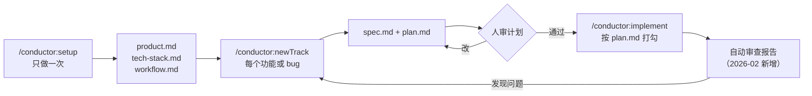

# 把计划写进仓库：Gemini CLI 的 Conductor 扩展与“上下文驱动开发”

<div class="meta-tags"><span class="tool-tag tool-gemini">Gemini CLI</span></div>

<div class="hook">

**一句话看懂**：Google 给 Gemini CLI 做的 Conductor 扩展，把“项目背景、需求、计划”从聊天记录搬进仓库里的 Markdown 文件：先 `/conductor:setup` 写下产品、技术栈和团队流程，每个新需求用 `/conductor:newTrack` 生成 `spec.md` 和 `plan.md`，人审过计划再 `/conductor:implement`，代理按 `plan.md` 一项项打勾。两个月后又加上了“自动审查”：做完后对照计划、规范和测试出一份报告。

</div>

::: info 为什么值得看
本站“做规划”阶段的资料大多来自 Claude Code 用户（[[04]]、[[03]]）。这篇来自 Google 官方，是 **Gemini CLI 生态里最完整的规划工作流**，思路和 RPI 很像：先把上下文和计划写成文件，再让代理执行。不同的是，Conductor 把这一套做成了现成的命令和文件模板，而且计划文件会一直留在仓库里，换台电脑、换个人都能接着做。
:::

::: tip 小白先懂这几个词
- [Gemini CLI](/glossary#gemini-cli)：Google 的开源终端编码代理，可以安装扩展（extension）。
- [Context-driven Development（上下文驱动开发）](/glossary#context-driven-development)：把项目背景当成和代码一样受管理的文件，每次交给代理的任务都从这些文件出发。
- Track（轨道）：Conductor 对“一个功能或一个 bug 修复”这类工作单元的叫法。
- [Spec（规格）](/glossary#spec)：要做什么、为什么做的详细说明。
- [Brownfield（棕地项目）](/glossary#brownfield)：已经有大量代码的老项目，和从零开始的 greenfield 相对。
:::

## 1. 基本信息

<SourceCard type="文章" title="Conductor: Introducing context-driven development for Gemini CLI" author="Keith Ballinger、Jay Kornder、Sherzat Aitbayev（Google）" date="2025-12-17" url="https://developers.googleblog.com/conductor-introducing-context-driven-development-for-gemini-cli/" />

| 项目 | 内容 |
|---|---|
| 链接 | https://developers.googleblog.com/conductor-introducing-context-driven-development-for-gemini-cli/ |
| 后续更新 | https://developers.googleblog.com/conductor-update-introducing-automated-reviews/ （Sherzat Aitbayev、Mahima Shanware、Jay Kornder，2026-02-13） |
| 代码仓库 | https://github.com/gemini-cli-extensions/conductor （Apache-2.0） |
| 类型 | 官方工程博客（文章） |
| 作者 | Keith Ballinger、Jay Kornder、Sherzat Aitbayev |
| 发布日期 | 2025-12-17 |
| 使用工具 | Gemini CLI + Conductor 扩展（`gemini extensions install https://github.com/gemini-cli-extensions/conductor`） |
| 分析依据 | Google Developers Blog 的两篇文章：《Conductor: Introducing context-driven development for Gemini CLI》（2025-12-17）和《Conductor Update: Introducing Automated Reviews》（2026-02-13），以及 GitHub 仓库 `gemini-cli-extensions/conductor` 的 README 和 `workflow.md` 模板（Apache-2.0 许可）。均于 2026-10-09 抓取。英文引用为原文摘录。 |

## 2. 做了什么

文章的出发点是一句老话：<Trans zh="不做计划，就是计划失败。">“Failing to plan is planning to fail”</Trans>。用 AI 写代码时，人们常常还没想清楚要做什么就直接开工，计划只存在于聊天记录里，会话一结束就没了。Conductor 的做法是：

::: tr Conductor 不依赖转瞬即逝的聊天记录，而是帮你写出正式的规格和计划，以 Markdown 文件的形式和代码放在一起长期保存。这样你可以先计划再动手，在写代码之前审查计划，并让人类开发者始终掌握方向盘。
> "Rather than depending on impermanent chat logs, Conductor helps you create formal specs and plans that live alongside your code in persistent Markdown files. This allows you to plan before you build, review plans before code is written, and keep the human developer firmly in the driver's seat."
:::

核心理念被称为“上下文驱动开发”：

::: tr 把上下文当成和代码一起管理的产物，你的仓库就成了唯一的事实来源，驱动每一次与代理的交互，让代理对项目有深入、持久的了解。
> "By treating context as a managed artifact alongside your code, you transform your repository into a single source of truth that drives every agent interaction with deep, persistent project awareness."
:::

## 3. 怎么做的



### 3.1 第一步：把项目背景写成文件

运行 `/conductor:setup`，Conductor 通过交互问答帮你定义三类上下文：

- **Product**：用户是谁、产品目标、主要功能；
- **Tech stack**：语言、数据库、框架等技术偏好；
- **Workflow**：团队的工作方式，例如是否遵循测试驱动开发。

这些文件对整个团队生效。文章的说法是，团队可以事先定好测试策略，之后 Gemini 会自动遵循，<Trans zh="不管是哪位开发者运行这个命令">“regardless of which developer runs the command”</Trans>。

对已有代码的老项目（brownfield），Conductor 会先发起一次交互，帮你写出关于架构、规范和目标的基础文档，之后随着新功能的开发不断更新这份共享上下文。

### 3.2 第二步：每个需求开一个 track，先写规格和计划

运行 `/conductor:newTrack` 开始一个新功能或 bug 修复。Conductor 不会立刻写代码，而是先生成两个文件：

- **Spec（规格）**：这次具体要做什么、为什么做；
- **Plan（计划）**：可执行的待办清单，分为阶段（Phases）、任务（Tasks）和子任务（Sub-tasks）。

Conductor 会根据已有的上下文给每一项建议答案，帮你更快写出高质量的规格和计划。**人审过计划之后才进入下一步。**

### 3.3 第三步：按计划执行，状态存在文件里

计划通过后运行 `/conductor:implement`，代理逐项完成 `plan.md` 里的任务并打勾。

::: tr 因为状态保存在文件里，你可以停下来去喝杯咖啡，回来接着做，不会丢失进度。
> "Because the state is saved in a file, you can stop, grab coffee, and resume later without losing your place."
:::

文章还提到两点：有用于回退到之前版本的检查点（checkpoints），以及可以在执行中途修改计划。

### 3.4 团队流程模板 `workflow.md`

仓库里附带的 `workflow.md` 模板，开头的“指导原则”是这样写的（2026-10-09 抓取的版本，原文节选）：

::: tr 指导原则：1. 计划是唯一事实来源，所有工作都要记录在 plan.md；2. 技术栈是有意选择的，改动前先写进 tech-stack.md；3. 测试驱动开发，先写单元测试；4. 所有模块代码覆盖率目标 >80%；5. 用户体验优先；6. 非交互、适应 CI：优先用非交互命令，对 watch 模式的工具设置 CI=true，保证只执行一次。
```markdown
## Guiding Principles

1.  **The Plan is the Source of Truth:** All work must be tracked in `plan.md`
2.  **The Tech Stack is Deliberate:** Changes to the tech stack must be
    documented in `tech-stack.md` *before* implementation
3.  **Test-Driven Development:** Write unit tests before implementing
    functionality
4.  **High Code Coverage:** Aim for >80% code coverage for all modules
5.  **User Experience First:** Every decision should prioritize user experience
6.  **Non-Interactive & CI-Aware:** Prefer non-interactive commands. Use
    `CI=true` for watch-mode tools (tests, linters) to ensure single execution.
```
:::

模板接下来规定了每个任务的生命周期：从 `plan.md` 里选下一个任务，把 `[ ]` 改成 `[~]` 表示进行中，先写会失败的测试（Red），再写最少的代码让测试通过（Green），然后重构、检查覆盖率；如果实现和技术栈不一致，就**停下来**先更新 `tech-stack.md`。这和 [[25§3.1]] 讲的 Red/Green TDD 是同一套纪律，只是写成了代理每次都会读到的文件。

### 3.5 两个月后补上“验证”：Automated Review

2026 年 2 月的更新加入了自动审查：代理做完任务后，Conductor 生成一份实现后报告，包含五项检查：

| 检查项 | 内容（据原文概括） |
|---|---|
| Code review | 对新文件做静态和逻辑分析，例如异步代码里的竞态、空指针风险 |
| Plan compliance | 对照 `plan.md` 和 `spec.md`，确认每个阶段都完成、没有漏掉核心需求 |
| Guideline enforcement | 检查是否遵守项目的风格指南和规划阶段生成的规范文件 |
| Test-suite validation | 运行相关的单元测试和集成测试，把结果和覆盖率写进报告 |
| Basic security review | 扫描硬编码的 API key、可能的个人信息泄露、不安全的输入处理 |

发现的问题按 High / Medium / Low 分级，并给出具体文件路径，可以直接开一个新 track 去修。文章对这一步的定位是：

::: tr 这种细致程度确保了“代理式”开发不等于“无人监督”的开发。它形成的工作流是：AI 提供劳动力，开发者在自动验证的支持下负责高层架构把关。
> "This level of detail ensures that "agentic" development doesn't mean "unsupervised" development. Instead, it creates a workflow where the AI provides the labor and the developer provides the high-level architectural oversight, backed by automated verification."
:::

## 4. 结果如何

两篇博客都是产品发布文章，**没有给出效果数据**。可以确认的是这个扩展的演进：

- 2025-12：以 Gemini CLI 扩展的形式发布预览版，命令是 `/conductor:setup`、`/conductor:newTrack`、`/conductor:implement`。
- 2026-02：加入 Automated Review。
- 2026-10-09 抓取时，GitHub 仓库的 README 已把它描述为面向多种编码代理（包括 Antigravity 和 Claude Code）的插件，命令改名为 `/conductor:conductor-setup`、`/conductor:conductor-new-track` 等，另有 `status`、`revert`、`review` 命令。

::: warning 局限与注意
- **会多花 token**。README 原文提醒：<Trans zh="Conductor 的规格驱动方式需要阅读和分析项目的上下文、规格和计划，这会增加 token 消耗，尤其是在大型项目或规划、实现阶段较长时。">“Conductor's spec-driven approach involves reading and analyzing your project's context, specifications, and plans. This can lead to increased token consumption, especially in larger projects or during extensive planning and implementation phases.”</Trans>
- 命令名和文件布局在不断变化，照着本文操作前先看仓库最新 README。
- 文中“适合比简单代码修改更复杂的任务”是官方定位；改一行代码不值得开 track。
- 自动审查是同一个代理体系的自查，不能代替人审和 CI。
:::

## 5. 可借鉴之处

1. **把计划从聊天窗口搬进仓库**：即使不用 Conductor，也可以约定每个功能有 `spec.md` + `plan.md`，代理按清单打勾。
2. **上下文分层**：产品背景、技术栈、团队流程各一个文件，比一个越写越长的规则文件更好维护（对照 [[20§3.5]]）。
3. **先审计划，再写代码**：计划阶段改一句话，比代码写完再返工便宜得多。
4. **把团队纪律写进模板**：`workflow.md` 把 TDD、覆盖率、技术栈变更流程写成代理每次都会读的规则。
5. **执行完再对照计划审一遍**：检查“计划里的每一项都做了吗”，是很容易自动化、又常被忽略的一步。

### 你可以这样试

- [ ] 在练习项目里安装 Conductor（按仓库 README 选择你用的代理），运行 setup，看它生成了哪些文件。
- [ ] 用 newTrack 描述一个小功能，**先别执行**，花 5 分钟读 `spec.md` 和 `plan.md`，改掉你不同意的地方。
- [ ] 执行中途关掉终端，重新打开后让代理接着做，确认它能从 `plan.md` 的打勾状态恢复。
- [ ] 做完后运行 review 命令，对照报告里的问题和你自己的判断。

::: details 读完自测（点开看答案）
1. **Conductor 说的“上下文驱动开发”指什么？** 把项目背景、规格和计划当成和代码一样受管理的文件放在仓库里，让每次代理交互都从这些文件出发，而不是依赖聊天记录。
2. **一个 track 会生成哪两个关键文件？** `spec.md`（做什么、为什么）和 `plan.md`（阶段、任务、子任务的清单）。
3. **为什么中途停下也不会丢进度？** 状态保存在 `plan.md` 里，代理完成一项就打勾。
4. **Automated Review 包含哪五项检查？** 代码审查、计划符合度、规范遵守、测试套件验证、基础安全检查。
:::
