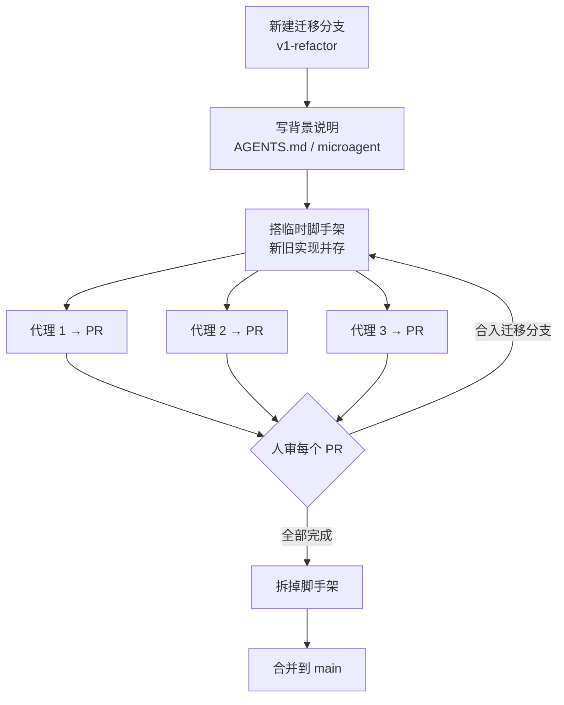

# 30｜大型重构怎么拆给多个代理：OpenHands 的并行代理编排方法

<a class="domain-tag" href="/guide/execution">阶段：去执行 · 从单代理到多代理</a>类型：视频工具：OpenHands

**一句话看懂**：几百个文件的迁移或重构，一个代理“一次搞定”是做不到的：它会说“我迁移了 100 个服务里的 3 个，剩下的请招 6 个人来做”。OpenHands 的 CEO Robert Brennan 给出的做法是：**开一个专用分支并写好背景说明，把任务按依赖关系拆成“一个代理能一次做完、一个人能快速判断对错”的小块，同时只跑 3–5 个代理，每块都经过人审再合并**；目标是 90% 自动化，而不是 100%。

::: info 为什么值得看
本站“去执行”阶段已经有并行代理的实操（[#23](/23-cole-medin-parallel-worktrees) 的 worktree、[#17](/17-anthropic-c-compiler-agent-teams) 的代理团队），但它们处理的大多是互相独立的新功能。这场研讨会讲的是另一类常见任务：**互相依赖的大规模迁移和重构**（Redux 换 Zustand、Spark 2 升 Spark 3、清理代码坏味道）。拆任务的五条标准、按依赖图从叶子节点往上做、用“临时脚手架”让新旧代码共存，这些方法不依赖 OpenHands，换任何代理都能用。
:::

::: tip 小白先懂这几个词
- [OpenHands](/glossary#openhands)：开源的编码代理平台，可以本地运行，也有云端版本和 Agent SDK。
- Orchestration（编排）：一个人（或一个代理）把大任务拆开，分派给多个代理，再把结果汇总起来。
- [Definition of Done（完成标准）](/glossary#definition-of-done)：什么样算“做完了”，要在开工前说清楚。
- [Migration Scaffolding（迁移脚手架）](/glossary#migration-scaffolding)：迁移期间临时加的兼容代码，让新旧两套实现能同时运行，迁完再删掉。
- [Microagent（微代理）](/glossary#microagent)：OpenHands 里一段给代理看的 Markdown 背景说明，作用类似 AGENTS.md。
- [Codemod](/glossary#codemod)：批量改写代码的自动化脚本或工具。
:::

> 信息来源：AI Engineer 频道发布的研讨会录像，文字依据 ai.engineer 网站提供的带时间戳字幕（自动转写，有少量识别错误，引用时已尽量对照上下文）。截图为视频真实画面。本文只整理前 35 分钟的方法论部分，后半段的动手练习（用 SDK 批量修复依赖漏洞）没有展开。中文翻译为本站所加。

## 1. 基本信息

<YouTube id="rcsliSIy_YU" title="Automating Large Scale Refactors with Parallel Agents - Robert Brennan, OpenHands" />

| 项目 | 内容 |
|---|---|
| 链接 | https://www.youtube.com/watch?v=rcsliSIy_YU |
| 讲者 / 频道 | Robert Brennan（OpenHands 联合创始人兼 CEO），另有同事 Calvin 演示 Refactor SDK ／ **AI Engineer** |
| 发布日期 | 2026-01-08 |
| 时长 | 1:16:21（本文覆盖 0:00–35:00） |
| 使用工具 | OpenHands、OpenHands Agent SDK、OpenHands Refactor SDK（演示） |

## 2. 做了什么

讲者先列出这类任务的特点：大量的技术债清理、依赖升级、框架迁移，<Trans zh="这些任务非常适合自动化……但它们通常太大，没法一次性完成。">“these are tasks that are super automatable … but they tend to be way too big for like, you know, a single just one shot.”</Trans>

然后分析为什么一个代理做不了，再给出一套“人在环中”的编排流程，由同事 Calvin 演示内部工具 Refactor SDK，最后总结拆任务和共享上下文的策略。

## 3. 怎么做的

### 3.1 为什么一个代理做不完：代理的问题，也是人的问题

<figure class="shot"><figcaption>📷 视频截图 · <a href="https://www.youtube.com/watch?v=rcsliSIy_YU&t=800s" target="_blank" rel="noopener">13:20</a> · 为什么需要编排：左边是代理的问题，右边是人的问题。</figcaption></figure>

代理这边有四个问题：上下文窗口装不下、偷懒、缺少领域知识、错误会累积。讲者描述的“偷懒”很形象：

::: tr 我试过一次性完成这类任务，代理会说：“好的，我已经迁移了你 100 个服务中的 3 个。现在你需要招一个 6 人团队来做剩下的。”
> "I've tried to one-shot some of these types of tasks, and the agent will say, "Okay, I've migrated three of your hundred services. Now you need to hire a team of six people to do the rest.""
:::

人这边也有问题：很难把直觉传达给代理，不知道怎么拆任务，需要在中途审查，以及<Trans zh="没有清晰的完成标准。如果你自己都不知道“做完”是什么样子，就很难告诉代理。">“not having a clear definition of done. I think, uh, if you don't really know what finished looks like for this project, it's hard to tell the agent.”</Trans>

他也给预期降了温：编排不会让所有工作都大幅提速，<Trans zh="你不会在所有软件工程工作上看到 3000% 的生产力提升，更可能是大家都在说的那种 20% 的提升。">“You're not gonna see a three thousand percent lift in productivity for all software engineering. You're probably gonna get more of that, you know, twenty percent lift that everybody's been reporting.”</Trans> 但对漏洞修复、代码现代化这类特定任务，收益可以大得多。他举了一个客户的例子：用编排的方式修复依赖漏洞，<Trans zh="漏洞修复耗时缩短到原来的三十分之一">“a thirty X improvement on time to resolution for these CVEs”</Trans>（讲者没有给出基线数据）。

### 3.2 Git 工作流：一条迁移分支 + 3–5 个代理

<figure class="shot"><figcaption>📷 视频截图 · <a href="https://www.youtube.com/watch?v=rcsliSIy_YU&t=1000s" target="_blank" rel="noopener">16:40</a> · 讲者常用的 Git 工作流：迁移分支、背景说明、脚手架、并行代理、拆脚手架、合并。</figcaption></figure>

关键是**每一步都有人把关**：

::: tr 我常跟大家说，目标不是把这个过程 100% 自动化，而是大约 90% 自动化。这仍然是一个数量级的生产力提升。
> "I like to tell folks the goal is not to automate this process a hundred percent. It's something like ninety percent automation. Uh, that's still, you know, an order of magnitude productivity lift."
:::

并发数量的建议：

::: tr 如果你刚开始尝试，我建议同时只跑大约 3 到 5 个代理。我发现再多的话，你的脑子就转不过来了。
> "if you're, you're kind of getting started with this, I would suggest limiting yourself to about three to five concurrent agents. Uh, I find more than that, your brain starts to break."
:::

他也提到，大规模使用编排的团队会同时运行成百上千个代理，那时不再由一个人审所有结果，而是由代理把 PR 发给各个负责的团队。

### 3.3 演示：按依赖图分批，“验证器 + 修复器”把整张图变绿

Calvin 用 OpenHands 自己的代码库演示：目标是清除代码坏味道，仅核心代理部分就有<Trans zh="大约 380 个文件，共 6 万行代码">“about three hundred and eighty files, uh, spanning sixty thousand lines of code”</Trans>。步骤是：

1. **画出依赖图**：每个节点是一个文件，边表示谁导入了谁。
2. **分批**：按目录结构把语义相关的文件放进同一批，每批相当于<Trans zh="一个代理能处理、一个人能看懂的 PR 大小">“PR-sized batches that an agent can handle and a human can understand”</Trans>，再把文件图简化成“批次图”。
3. **按依赖顺序跑验证器（verifier）**：验证器可以是一条 Bash 命令（跑测试、linter、类型检查），也可以是按规则检查代码的语言模型。通过的批次变绿，不通过的变红。
4. **对红色批次跑修复器（fixer）**：最强的修复器会用 Agent SDK 启动一个完整的 OpenHands 代理，修完生成一个 PR 等人审。修复后批次状态重置，需要重新验证。
5. **重复，直到整张图变绿。**

<figure class="shot"><figcaption>📷 视频截图 · <a href="https://www.youtube.com/watch?v=rcsliSIy_YU&t=1340s" target="_blank" rel="noopener">22:20</a> · 配置一个基于 LLM 的验证器，提示词里写明要找哪些代码坏味道。</figcaption></figure>

演示里有一句话值得记下：<Trans zh="重构是自动化的，不代表它就不需要审查。">“Just because the refactor is automated doesn't mean it needs to be unreviewed.”</Trans> 分批加上明确的修复范围，让每个 PR 都足够小（演示的 PR 只改了几百行），代理更容易做对，人也更容易审。

### 3.4 拆任务的五条标准

<figure class="shot"><figcaption>📷 视频截图 · <a href="https://www.youtube.com/watch?v=rcsliSIy_YU&t=1700s" target="_blank" rel="noopener">28:20</a> · 好的子任务应满足的条件。</figcaption></figure>

| 标准 | 讲者的解释（转述） |
|---|---|
| 单个代理能一次做完 | 不想和每个子代理反复来回，最好能直接批准合并 |
| 能放进一个提交 / 一个 PR | 范围小，好审 |
| 能并行 | 如果只能一个接一个做，不如用一个代理 |
| 能快速验证 | 最好看 CI 是否全绿就有把握；必要时人点一下应用 |
| 依赖和顺序清晰 | A 做完解锁 B、C、D，它们都完成后再做 E |

他指出，<Trans zh="这些标准和你给一个工程团队拆分工作的方式很像">“these, uh, criteria are pretty similar to how you might break down work for an engineering team”</Trans>。

三种常见的拆分策略：

- **逐个处理**：按文件、目录、函数一个个来。适合互相依赖不多的改动，比如给 Python 代码加类型注解，最后汇总成一个 PR。
- **按依赖树**：从依赖图的叶子节点（比如工具函数文件）开始，逐层往上，直到应用入口。讲者认为这通常是更好的方式。
- **临时脚手架**：让迁移前后的两套实现同时可用。OpenHands 把前端状态管理从 Redux 迁到 Zustand 时，先让代理搭了一层能同时使用两者的兼容代码，<Trans zh="很丑，不是你真正想要的东西">“pretty ugly, not something you would actually really wanna do”</Trans>，但这样每迁完一个组件就能测试应用是否正常；全部迁完后再删掉脚手架。

### 3.5 代理之间怎么共享学到的东西

大项目做到一半，你会发现最初的理解不完整，或者十个代理都卡在同一个问题上。讲者比较了四种共享上下文的方式：

| 方式 | 讲者的评价（转述） |
|---|---|
| 共享一切：每个代理都看到其他代理的全部上下文 | 最差，等于一个代理串行在做，很快把上下文窗口用完 |
| 人手动传话：在每个代理的对话里粘贴说明，或更新 AGENTS.md / microagent | 有效，但要人一直盯着，不好扩展 |
| 代理自己更新共享文件（如 AGENTS.md），通过 PR 提交 | 代理有时会写进不重要的内容，加一道人审有帮助 |
| 给代理发消息的工具（广播或点对点） | 最前沿，好玩但难做对；增加了不确定性 |

关于最后一种，他举了个例子：两个代理互相对话，结果<Trans zh="陷入了一个互相祝愿对方达到禅意完美的循环">“just entered into a loop of wishing each other Zen perfection”</Trans>。

## 4. 结果如何

讲者给出的成果都是定性或来自客户的描述：

- OpenHands 用这套方法把自家前端从 Redux 迁到了 Zustand，也在帮客户把 Spark 2 作业迁到 Spark 3。
- Refactor SDK 已用于 OpenHands 代码库的一些大改动，包括严格类型检查和提升测试覆盖率（演示中的说法）。
- 某客户修复依赖漏洞的耗时缩短到原来的约 1/30（无基线数据）。

::: warning 局限与注意
- 这是 OpenHands 的产品研讨会，演示的 Refactor SDK 是他们自己的工具；没有和其他方法做对比实验。
- 字幕是自动转写，部分句子有识别错误；表格中标“转述”的内容是对讲者原话的概括。
- “3–5 个代理”是讲者面向新手的经验建议，不是测出来的上限。
- 30 倍的数字只是讲者转述的客户反馈，没有给出基线和测量方式。
- 视频后半段是用 SDK 批量修复依赖漏洞的动手练习，本文没有覆盖。
:::

## 5. 可借鉴之处

1. **大迁移开一条专用分支**，写一份背景说明（AGENTS.md），代理的 PR 都合进这条分支，最后整体合入 main。
2. **按“一个代理一次做完、一个人快速审完”来拆任务**，拆不到这个粒度就继续拆。
3. **有依赖就从叶子节点往上做**，每一层合并后再派下一层。
4. **需要新旧共存时，先让代理搭临时脚手架**，每迁完一块都能运行测试，最后统一删掉。
5. **刚开始只同时跑 3–5 个代理**，把精力花在审查上；目标是 90% 自动化。
6. **代理发现的共性问题写进共享文件**，但要经过人审，避免写进噪音。

### 你可以这样试

- [ ] 找一个你一直想做但嫌麻烦的批量改动（加类型注解、换日志库、升级某个依赖），先写一段“完成标准”。
- [ ] 用依赖分析工具（或让代理帮你）列出受影响文件的依赖关系，标出叶子节点。
- [ ] 开一条迁移分支，派 3 个代理各处理一批叶子文件，每个产出一个 PR，逐个审查合并。
- [ ] 记下代理反复遇到的问题，整理成迁移分支里的 AGENTS.md 补充说明。

::: details 读完自测（点开看答案）
1. **讲者说的“偷懒问题”是什么？** 让代理一次完成大迁移时，它只做了一小部分就停下，并把剩下的推回给人。
2. **好的子任务应满足哪五条标准？** 单个代理能一次做完；能放进一个提交或 PR；能并行；能快速验证；依赖和顺序清晰。
3. **迁移脚手架有什么用？** 让新旧两套实现同时可用，每迁移完一个部分就能测试整个应用，全部完成后再删掉。
4. **为什么“共享一切”不是好办法？** 每个代理都要读其他代理的全部上下文，很快耗尽上下文窗口，效果等同于一个代理串行在做。
:::
