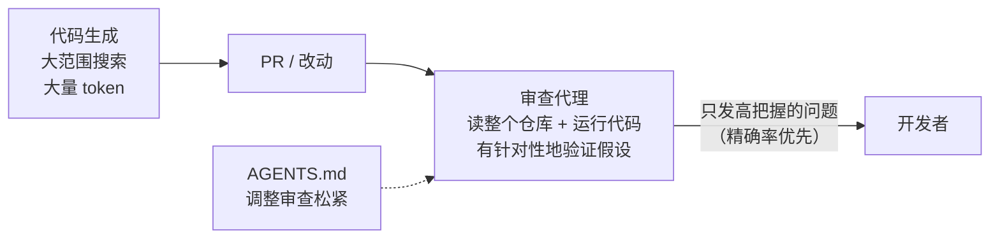

# 31｜AI 代码审查为什么要“宁缺毋滥”：OpenAI 训练 Codex 审查代理的经验

<div class="meta-tags"><a class="domain-tag" href="/guide/verification">阶段：做验证 · 测试、评测与审查</a><span class="type-tag type-article">类型：文章</span><span class="tool-tag tool-codex">工具：Codex</span></div>

<div class="hook">

**一句话看懂**：代码越来越多是 AI 写的，人审不过来，必须用 AI 审。OpenAI 的结论是：**审查工具要先保证“说的都是真问题”（精确率），再去追求“问题都找到”（召回率）**，否则开发者会直接忽略它；同时要让审查者能读整个仓库、能运行代码，而不是只看 diff。上线后，被评论的问题有 52.7% 让作者改了代码，每天审查超过 10 万个外部 PR。

</div>

::: info 为什么值得看
本站讲过很多“让代理写完再审一遍”的做法（[#08](/08-codex-masterclass) 的 `/review`、[#23](/23-cole-medin-parallel-worktrees) 的全新会话审查），但很少讨论**审查工具本身该怎么设计**。这篇来自 OpenAI 对齐团队和 Codex 团队，从训练和部署两方面讲了一个反直觉的取舍：宁可少报，也不要误报。这个原则同样适用于你自己写的审查提示词、Stop hook 或 CI 检查。
:::

::: tip 小白先懂这几个词
- [Code Review（代码审查）](/glossary#code-review)：合并代码前检查改动是否有问题。
- [精确率 / 召回率](/glossary#precision-recall)：精确率是“报出的问题里有多少是真的”，召回率是“真实的问题里有多少被报出来了”。
- 误报（False Alarm）：工具报了问题，但其实不是问题。
- [Reward Model（奖励模型）](/glossary#reward-model)：训练时用来给模型输出打分的模型。
- [AGENTS.md](/glossary#agents-md)：写给编码代理看的项目说明文件，也可以用来调整审查的松紧。
:::

> 信息来源：OpenAI Alignment Research Blog《A Practical Approach to Verifying Code at Scale》全文，2026-10-09 抓取。文中所有数字均来自原文。英文引用为原文摘录，中文翻译为本站所加。

## 1. 基本信息

<SourceCard type="文章" title="A Practical Approach to Verifying Code at Scale" author="Maja Trębacz、Sam Arnesen、Albin Cassirer、Max Johnson、Xin Lin、Thibault Sottiaux（OpenAI，与 Codex 团队合作）" date="2025-12-01" url="https://alignment.openai.com/scaling-code-verification/" />

| 项目 | 内容 |
|---|---|
| 链接 | https://alignment.openai.com/scaling-code-verification/ |
| 类型 | 研究博客（文章） |
| 作者 | Maja Trębacz、Sam Arnesen、Albin Cassirer、Max Johnson、Xin Lin、Thibault Sottiaux，与 Codex 团队其他成员合作 |
| 发布日期 | 2025-12-01 |
| 涉及模型 | gpt-5-codex、gpt-5.1-codex-max（生成和审查是同一个模型，训练方法不同） |
| 怎么用 | Codex CLI 里运行 `/review`；或在 Codex Cloud 仓库设置里打开 Code Review，在 PR 下评论 `@codex review` |

## 2. 做了什么

文章开头讲了问题：

::: tr 随着自主协作编码系统越来越多，产出的代码量很快超出了人类全面审查的能力……我们不能假设生成代码的系统是可信或正确的；我们必须检查它们的工作。
> "As autonomous collaborative coding systems proliferate, the volume of produced code quickly exceeds the limits of thorough human oversight. … We cannot assume that code-generating systems are trustworthy or correct; we must check their work."
:::

OpenAI 为 Codex 专门训练了一个能使用工具的代码审查代理，并在内部和外部大规模部署。文章总结了四条经验。

## 3. 怎么做的

### 3.1 精确率比召回率更重要

::: tr 防御措施失败，往往不是因为技术上不对，而是因为太不实用，用户选择不用。一个慢、吵、麻烦的系统会被绕开。
> "Defenses often fail not because they are technically wrong, but because they are so impractical that the user chooses not to use them. A system that is slow, noisy, or cumbersome will be bypassed."
:::

所以他们明确接受了一个取舍：<Trans zh="适度降低召回率，换取高信号质量和开发者的信任">“modestly reduced recall in exchange for high signal quality and developer trust”</Trans>。文章用一个式子说明每条审查意见是否值得发出（原文公式，变量名为本站翻译）：

```text
P(正确) × 节省的成本 − 人工核实的成本 − P(错误) × 误报的代价
```

也就是说，只有当“发现真 bug 的期望收益”大于“人去核实它的成本加上误报的损失”时，这条意见才值得发。一条技术上正确、但只是风格问题的评论，收益甚至可能是负的，原文的例子是：在个人研究笔记本里指出注释里的错别字，可能不值得。

这个平衡点不是固定的：

::: tr 我们认为，应该允许通过自定义任务指令，或包级、仓库级的 AGENTS.md 来调整这种取舍和其他准则。
> "we believe it's important to allow this tradeoff and other guidelines to be steerable by the custom task instructions or package- or repo-level AGENTS.md specification."
:::

文中的图展示了从<Trans zh="只输出最关键、最确定的破坏性问题">“only output the most critical and certain breaking issues”</Trans>到<Trans zh="尽可能多地分享发现">“share as many findings as possible”</Trans>的不同指令，会落在精确率和召回率曲线的不同位置。

### 3.2 只看 diff 不够：要能读整个仓库、能运行代码

以前的大多数 AI 审查只把 diff 和少量上下文交给模型。这样最快，但<Trans zh="经常漏掉关于整个代码库的重要背景，以及这次改动和它的依赖之间的相互作用">“it often misses important context about the whole codebase and the interaction of the change with its dependencies”</Trans>。

他们的实验结果：给 GPT-5 加上仓库访问和代码执行能力后，审查者<Trans zh="能发现更多关键问题，误报也更少">“catching more critical issues and raising fewer false alarms”</Trans>；再针对代码审查做专门训练，效果进一步提升。

### 3.3 训练时的“检查器”和交给人用的审查者不是一回事

训练代码生成模型时，自动检查要尽量多抓错误，**宁可过于敏感**，而且可以利用任务的额外信息。真正部署给人用的审查正好相反：面对的是真实、意图不明确的代码，必须避免武断地猜测作者意图，最重要的是赢得用户信任。

::: tr 在两种场景下用同一个验证器，可能两边都会失败。
> "Using a single verifier for both settings risks failure in both."
:::

### 3.4 验证可以比生成便宜

::: tr 生成一个正确的代码改动通常需要大范围搜索和大量 token，而否定一个提议的改动通常只需要有针对性地提出假设并检查。
> "Generating a correct code change often requires broad search and many tokens, while falsifying a proposed change usually needs only targeted hypothesis generation and checks."
:::

他们的对照实验发现：审查者只用生成者一小部分的 token 预算，也能抓到很大一部分已知的高严重性问题；增加预算主要是提升校准、减少误报。但审查 AI 生成的代码时，性能随思考预算降低而下降得比审查人写的代码更快。文章也承认这个实验的局限：测试集只包含人已经发现的问题，审查者给出的新发现是否正确，需要额外的人工判断。



## 4. 结果如何

文中给出的部署数据：

| 指标 | 数值 |
|---|---|
| Codex Cloud 完全由 Codex 生成的 PR，被审查者评论的比例 | 36% |
| 其中评论导致作者修改代码的比例 | 46%（人写的 PR 上为 53%） |
| OpenAI 内部，审查者留下评论后作者用代码修改回应的比例 | 52.7% |
| 截至 2025 年 10 月，每天处理的外部 PR | 超过 10 万个 |
| 评论收到的表情反应中正面的比例 | 超过 80% |

此外，OpenAI 内部每个 PR 都会自动审查，很多工程师推送前会在 Codex CLI 里先运行 `/review`。文章还提到，他们看到合并后需要再修 bug 的 PR 变少了。

::: warning 局限与注意
- 这是 OpenAI 关于自家产品的研究博客，数据没有公开的复现方式。
- 文章自己强调了**过度依赖**的风险：<Trans zh="团队可能会把一次干净的审查当成安全的保证，而不是多层防御中的一层。我们希望大家明白，审查者是辅助工具，不能代替仔细的判断。">“Teams could start treating a clean review as a guarantee of safety rather than as one layer of defense. We want people to understand that the reviewer is a support tool, not a replacement for careful judgment.”</Trans>
- 生成者和审查者是同一个模型，作者也在关注模型是否会学会“绕开”自己的检查，目前用的是间接指标，没有直接测量方法。
- 文章讲的是审查器的设计原则，没有给出可以复制的提示词。
:::

## 5. 可借鉴之处

1. **审查意见宁缺毋滥**：写审查提示词时明确要求“只报有把握的、会造成实际问题的发现”，否则大家很快会忽略它。
2. **给审查者完整的仓库和运行能力**：只看 diff 会漏掉改动和其他代码的交互。
3. **用 AGENTS.md 调松紧**：研究笔记本和支付系统需要的审查强度不同，写进规则文件里。
4. **训练用的检查和给人看的审查分开设计**：类比到日常，CI 里的硬性检查可以严格，交给人看的 AI 评论要克制。
5. **审查是一层防御，不是保证**：审查通过不代表没问题，仍然要有测试和人工判断。

### 你可以这样试

- [ ] 在你的 AGENTS.md 里加一段审查准则，例如“只报告会导致错误行为、安全问题或数据丢失的问题，忽略纯风格问题”，对比加之前和之后的审查结果。
- [ ] 下次推送前在 Codex CLI 运行 `/review`（或用你的代理做一次审查），记录有多少条意见你真的改了代码。
- [ ] 统计一周内 AI 审查意见的“采纳率”，作为调整审查提示词的依据。

::: details 读完自测（点开看答案）
1. **为什么 OpenAI 把精确率放在召回率前面？** 误报多的工具会被开发者绕开，再高的召回率也没用；先赢得信任，再在不损害可靠性的前提下提高召回率。
2. **只给审查者看 diff 有什么问题？** 会漏掉整个代码库的背景，以及改动和依赖之间的相互作用。
3. **为什么“验证可以比生成便宜”？** 生成正确的改动需要大范围搜索和大量 token，而否定一个改动只需要有针对性地提出假设并检查。
4. **审查者留下评论后，作者修改代码的比例是多少？** OpenAI 内部为 52.7%。
:::
