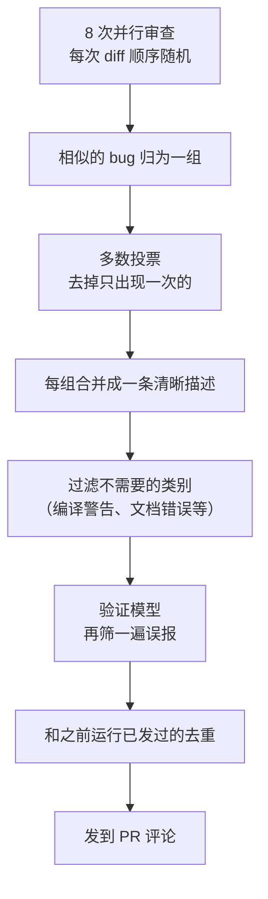

# PR 审查机器人怎么越做越好：Cursor 打磨 Bugbot 的 40 次实验

Cursor

**一句话看懂**：Bugbot 是 Cursor 自动审查每个 PR 的机器人。它的第一版靠“8 次并行审查 + 多数投票 + 验证模型”压低误报；真正让它持续进步的，是一个新指标“解决率”：**合并 PR 时，用 AI 判断机器人报的 bug 有多少被作者真的修掉了**。有了这个指标，团队跑了 40 次大实验，解决率从 52% 提升到 70% 以上；改成完全代理式的架构后，提示词反而要从“克制”改成“激进”。

::: info 为什么值得看
本站“自动化”阶段讲过让代理在 CI 里修测试（[#22](/22-openai-codex-ci-autofix)）、在 GitHub 上被 @ 调用（[#10](/10-how-openai-uses-codex)），但没有讲过**一个常驻的 PR 机器人怎么衡量和迭代**。这篇给出了一个可以借鉴的度量方法（解决率），也记录了一个和 [#31](/31-openai-verifying-code-at-scale) 有意思的对照：OpenAI 强调压低误报，而 Bugbot 改成代理式之后发现模型“太谨慎”，转而鼓励它多报。
:::

::: tip 小白先懂这几个词
- [Bugbot](/glossary#bugbot)：Cursor 的 PR 代码审查代理，自动检查逻辑错误、性能问题和安全漏洞。
- [Resolution Rate（解决率）](/glossary#resolution-rate)：机器人报出的 bug 中，在 PR 合并时已被作者修复的比例。
- [Majority Voting（多数投票）](/glossary#majority-voting)：多次独立运行，只保留多数次都发现的结果。
- [Hill-climbing（爬山式迭代）](/glossary#hill-climbing)：有了一个可靠的指标后，每次小改动都用指标检验，变好就保留。
- [Benchmark（基准测试）](/glossary#benchmark)：固定的测试集，用于比较不同版本的效果。
:::

## 1. 基本信息

<SourceCard type="文章" title="Building a better Bugbot" author="Jon Kaplan（Cursor）" date="2026-01-15" url="https://cursor.com/blog/building-bugbot" />

| 项目 | 内容 |
|---|---|
| 链接 | https://cursor.com/blog/building-bugbot |
| 类型 | 公司研究博客（文章） |
| 作者 | Jon Kaplan |
| 发布日期 | 2026-01-15 |
| 使用工具 | Cursor Bugbot（GitHub PR 审查）、Bugbot rules、Bugbot Autofix（Beta） |
| 分析依据 | Cursor 官方博客《Building a better Bugbot》全文，2026-10-09 抓取。文中所有数字均来自原文。英文引用为原文摘录。 |

## 2. 做了什么

::: tr 随着编码代理越来越强，我们发现自己花在审查上的时间越来越多。为了解决这个问题，我们做了 Bugbot：一个代码审查代理，在 PR 进入生产环境前分析其中的逻辑错误、性能问题和安全漏洞。
> "As coding agents became more capable, we found ourselves spending more time on review. To solve this, we built Bugbot, a code review agent that analyzes pull requests for logic bugs, performance issues, and security vulnerabilities before they reach production."
:::

Bugbot 2025 年 7 月发布第 1 版，2026 年 1 月发布第 11 版。文章回顾了从凭感觉调整到用指标迭代的过程。

## 3. 怎么做的

### 3.1 第一版：多次并行审查 + 多数投票

早期最有效的改进之一是**并行跑多次查 bug，然后投票**。每次给模型的 diff 顺序不同，促使它沿不同的思路推理；多次独立发现同一个问题，就更可能是真 bug。上线时的流程是（原文七步）：

### 3.2 上生产：工程基础 + 团队自定义规则

要在真实环境跑起来，除了审查逻辑，还要投入很多基础工程：用 Rust 重写 Git 集成、尽量少拉数据，加上速率限制监控、请求批处理和代理服务器，以适应 GitHub 的限制。

随着使用的团队变多，大家需要检查自己代码库特有的规则，比如不安全的数据库迁移、内部 API 的错误用法。为此 Cursor 加了 **Bugbot rules**，让团队自己写规则，而不是把它们硬编码进系统。

### 3.3 衡量真正重要的东西：解决率

光有上面这些，团队仍然不知道质量是否真的在提升。

::: tr 我们设计了一个叫“解决率”的指标。它在 PR 合并时用 AI 判断，哪些 bug 在最终代码里确实被作者解决了。
> "we devised a metric called the resolution rate. It uses AI to determine, at PR merge time, which bugs were actually resolved by the author in the final code."
:::

开发这个指标时，他们和 PR 作者逐一核对了内部的每个例子，发现 LLM 几乎全部判断正确。文章认为，对于评估效果，<Trans zh="它比零散的反馈或评论上的表情反应清楚得多">“it's a much clearer signal than anecdotal feedback or reactions on comments”</Trans>。这个指标也直接显示在 Bugbot 的团队仪表盘上。

### 3.4 有了指标，才能“爬山”

::: tr 定义解决率改变了我们构建 Bugbot 的方式。第一次，我们可以基于真实信号而不是感觉来爬山式迭代。
> "Defining resolution rate changed how we built Bugbot. For the first time, we could hill-climb on the basis of real signal, rather than just feel."
:::

他们同时用两种方式评估改动：线上看真实的解决率，线下用 **BugBench**，一个由真实代码 diff 和人工标注的 bug 组成的基准测试集。实验覆盖模型、提示词、迭代次数、验证器、上下文管理、类别过滤和代理式设计。一个意外的发现是：很多改动反而让指标变差了，早期凭感觉做出的很多判断其实是对的。

### 3.5 改成代理式架构：提示词从“克制”变“激进”

最大的提升来自改成完全代理式的设计：代理可以对 diff 推理、调用工具、自己决定往哪里深挖，而不是走固定的多轮流程。这带来了一个反转：

::: tr 在早期版本中，我们需要约束模型，以尽量减少误报。但用代理式方法时，我们遇到了相反的问题：它太谨慎了。我们改用激进的提示词，鼓励代理调查每一个可疑的模式，宁可多报潜在问题。
> "With earlier versions of Bugbot we needed to restrain the models to minimize false positives. But with the agentic approach we encountered the opposite problem: it was too cautious. We shifted to aggressive prompts that encouraged the agent to investigate every suspicious pattern and err on the side of flagging potential issues."
:::

另外两点经验：

- **从静态上下文改为动态上下文**：减少一开始塞给模型的信息，模型会在运行时自己拉取需要的上下文。
- **工具设计影响很大**：<Trans zh="即使是工具设计或可用性上的小改动，也会对结果产生不成比例的影响。">“even small changes in tool design or availability had an outsized impact on outcomes.”</Trans>

## 4. 结果如何

| 指标 | 变化 |
|---|---|
| 解决率 | 52% → 70% 以上 |
| 每次运行平均报出的 bug 数 | 0.4 → 0.7 |
| 每个 PR 平均被解决的 bug 数 | 约 0.2 → 约 0.5（翻了一倍多） |
| 大型实验次数 | 40 次 |
| 每月审查的 PR | 超过 200 万 |

文章说，新版本在多发现 bug 的同时，误报没有相应增加。Cursor 内部所有代码也都由 Bugbot 审查。文末提到的下一步：刚发布的 **Bugbot Autofix**（Beta）会为审查发现的 bug 自动启动一个云端代理来修复；之后计划让 Bugbot 运行代码来验证自己的报告，以及做一个持续扫描整个代码库、不等 PR 的常驻版本。

::: warning 局限与注意
- 这是 Cursor 介绍自家产品的博客；解决率由 AI 判断，作者说内部抽查“几乎全部正确”，但没有给出具体准确率。
- BugBench 没有公开，无法独立复现数字。
- “解决率”衡量的是作者是否修了，不等于这个 bug 真的存在或修得正确；如果团队习惯“机器人说什么就改什么”，解决率也会偏高。
- 文中的路线图（运行代码验证、常驻扫描）是发布时的计划，现状请看 Cursor 最新文档。
:::

## 5. 可借鉴之处

1. **给自动审查找一个“结果指标”**：不要只看点赞或主观感受，看报出的问题有多少最终被修了。
2. **多次独立运行 + 投票是降低误报的便宜办法**：同一个问题被多次独立发现，更可能是真的。
3. **有指标之后再迭代**：每次改提示词、换模型都用同一个指标检验，很多“看起来更好”的改动其实是退步。
4. **团队特有的规则交给团队写**：比如“禁止在迁移里直接删列”，写成审查规则，而不是指望通用模型知道。
5. **架构变了，提示词的方向可能要反过来**：固定流程时要约束模型少报，代理式时可能要鼓励它多查。
6. **工具接口值得反复打磨**：代理的行为很大程度上由它能调用的工具决定。

### 你可以这样试

- [ ] 如果你的仓库已经有 AI 审查（Bugbot、Codex Review 或自建的），统计最近 20 个 PR：机器人报了多少条，合并时有多少被修了，算出你自己的“解决率”。
- [ ] 把团队里最常见的两条“代码库特有规则”写进审查规则文件（Bugbot rules 或 AGENTS.md）。
- [ ] 对同一个 PR 让审查提示词跑 3 次，只保留至少出现 2 次的问题，对比单次运行的结果。

::: details 读完自测（点开看答案）
1. **什么是解决率？** 在 PR 合并时，用 AI 判断机器人报出的 bug 中有多少已被作者在最终代码里解决。
2. **第一版 Bugbot 用什么办法压低误报？** 8 次并行审查（diff 顺序随机）、多数投票、验证模型筛选、类别过滤和去重。
3. **改成代理式架构后，提示词为什么要变？** 代理式版本反而太谨慎，所以改用激进的提示词，鼓励它调查每个可疑模式。
4. **为什么说有了指标才能“爬山”？** 之前只能凭感觉判断改动好坏；有了解决率和 BugBench，每个改动都能用真实信号检验，结果发现很多改动其实会退步。
:::
