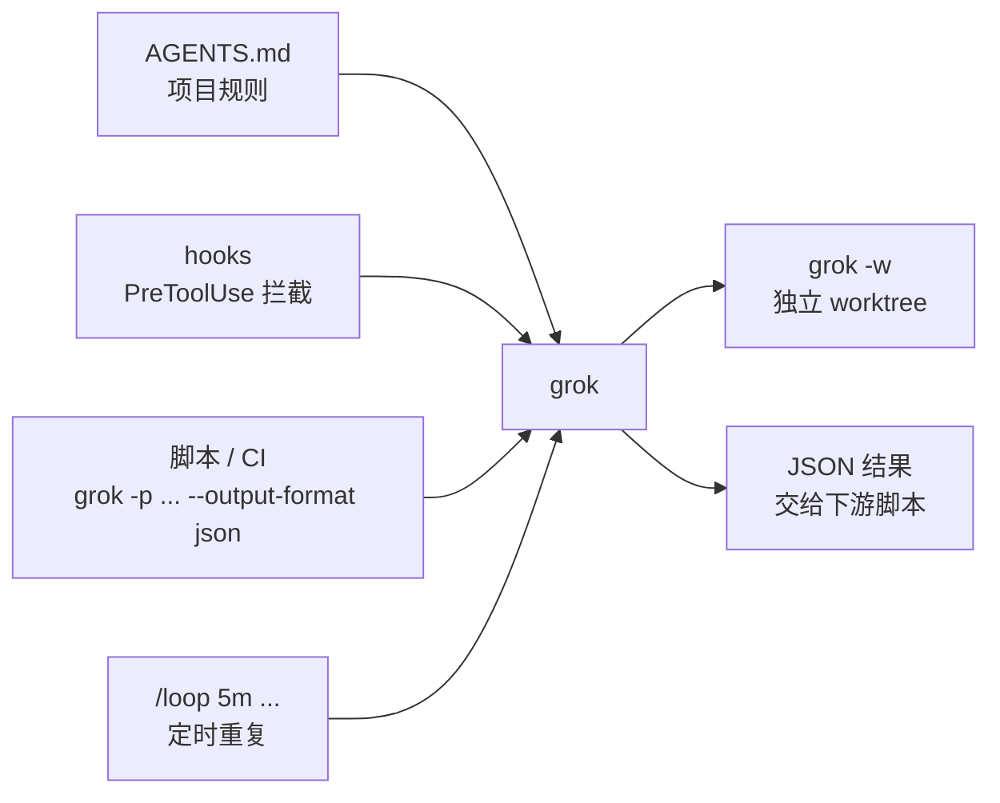

# 34｜让 Grok Build 跑进脚本和 CI：官方文档里的 headless、hooks、/loop 与 worktree

<div class="meta-tags"><a class="domain-tag" href="/guide/automation">阶段：自动化 · 后台代理与 CI/CD</a><span class="type-tag type-docs">类型：官方文档</span><span class="tool-tag tool-grokbuild">工具：Grok Build</span></div>

<div class="hook">

**一句话看懂**：Grok Build 不只是一个终端里的聊天界面。官方文档给出了让它“无人值守”运行的几块积木：`grok -p` 在脚本和 CI 里跑一次性任务并输出 JSON；hooks 在工具调用前拦截危险命令（还能直接读取 Claude Code 和 Cursor 的 hook 文件）；`/loop` 定时重复执行一个提示词；`grok -w` 让每个代理在独立的 worktree 里工作。

</div>

::: info 为什么值得看
本站已有的 Grok Build 资料都是视频实测（[#13](/13-bijan-bowen-grok-build)、[#14](/14-orcdev-grok-build-skills)、[#15](/15-arcade-grok-build-57-agents)），偏交互式使用。这篇整理的是 **xAI 官方文档**中和自动化相关的几页，回答“怎么把 Grok Build 接进脚本、CI 和团队规则”。如果你已经在用 Claude Code 或 Cursor，会发现它在 hooks、规则文件上刻意做了兼容，迁移成本很低。
:::

::: tip 小白先懂这几个词
- [Grok Build](/glossary#grok-build)：xAI 的终端编码代理（命令是 `grok`）。
- [Headless（无界面模式）](/glossary#headless)：不打开交互界面，一条命令跑完就退出，适合脚本和 CI。
- [Hooks（钩子）](/glossary#hooks)：在代理生命周期的固定时刻自动运行的脚本。
- [Fail-open（故障放行）](/glossary#fail-open)：检查程序自己出错时，默认放行而不是拦截。
- [ACP（Agent Client Protocol）](/glossary#acp)：编辑器和编码代理之间通信的协议，让 IDE 能把代理当作后端来调用。
- [Git Worktree](/glossary#worktree)：同一个仓库检出多个工作目录，每个目录一个分支，互不干扰。
:::

> 信息来源：xAI 官方 Grok Build 文档（docs.x.ai/build）的六个页面：Hooks（页面标注最后更新 2026-07-02）、Headless & Scripting（2026-06-10）、AGENTS.md 项目规则（2026-07-04）、Background Tasks、Worktrees、Subagents（均为 2026-07-21）。均于 2026-10-09 抓取。文档在持续更新，命令和参数以官方页面为准。配置和命令均为原文摘录，中文说明为本站所加。

## 1. 基本信息

<SourceCard type="官方文档" title="Hooks" author="xAI · Grok Build 文档（另含 Headless & Scripting、AGENTS.md、Background Tasks、Worktrees 等页）" date="2026-07-02 更新（抓取于 2026-10-09）" url="https://docs.x.ai/build/features/hooks" />

| 项目 | 内容 |
|---|---|
| Hooks | https://docs.x.ai/build/features/hooks |
| Headless & Scripting | https://docs.x.ai/build/cli/headless-scripting |
| AGENTS.md（项目规则） | https://docs.x.ai/build/features/project-rules |
| Background Tasks | https://docs.x.ai/build/features/background-tasks |
| Worktrees / Subagents | https://docs.x.ai/build/features/worktrees ／ https://docs.x.ai/build/features/subagents |
| 类型 | 官方产品文档 |
| 作者 | xAI |
| 使用工具 | Grok Build CLI（`grok`） |

## 2. 做了什么

这几页文档覆盖了把代理从“人盯着聊天”变成“脚本、定时器和事件驱动”的几个环节：



## 3. 怎么做的

### 3.1 Headless：在脚本和 CI 里跑一次

最基本的用法是 `-p`（单次提示词）：

```bash
grok -p "Your prompt here"
```

常用参数（节选原文表格）：

| 参数 | 作用 |
|---|---|
| `-p, --single <PROMPT>` | 发送一个提示词 |
| `-m, --model <MODEL>` | 选择模型 |
| `-s, --session-id <ID>` | 创建或恢复一个命名的 headless 会话 |
| `-c, --continue` | 继续当前目录最近的会话 |
| `--output-format <FMT>` | 选择 `plain`、`json` 或 `streaming-json` |
| `--always-approve` | 自动批准所有工具调用 |

需要程序处理结果时用 JSON 输出：`json` 在结束时输出一个 JSON 对象，`streaming-json` 逐行输出事件。

```bash
grok -p "List TODO comments" --output-format json
grok -p "Explain the architecture" --output-format streaming-json
```

在 CI 等自动化环境里，文档建议加上 `--no-auto-update`，跳过后台的更新检查：

::: tr 在脚本、CI 或其他自动化环境中使用 headless 模式（-p）或 ACP（grok agent stdio）时，传入 --no-auto-update 以跳过后台更新检查。
> "When using headless mode (`-p`) or ACP (`grok agent stdio`) in scripts, CI, or other automated environments, pass `--no-auto-update` (e.g. `grok --no-auto-update -p "..."`) to skip background update checks."
:::

如果要把 Grok 接进编辑器或自己的工具，可以用 `grok agent stdio` 以 ACP 协议（stdin/stdout 上的 JSON-RPC）运行它，文档附有完整的 Node.js 客户端示例。

### 3.2 Hooks：在工具调用前拦下危险命令

hook 是 JSON 文件：个人的放 `~/.grok/hooks/*.json`，项目的放 `<project>/.grok/hooks/*.json`。原文示例：

::: tr 每次运行 Bash 工具前，先执行 bin/safety-check.sh，超时 10 秒。
```json
{
  "hooks": {
    "PreToolUse": [
      {
        "matcher": "Bash",
        "hooks": [{ "type": "command", "command": "bin/safety-check.sh", "timeout": 10 }]
      }
    ]
  }
}
```
:::

几个要点：

- **兼容其他工具**：<Trans zh="Claude Code（.claude/settings.json）和 Cursor（.cursor/hooks.json）的 hook 文件也会被读取，包括 Cursor 的驼峰式事件名。">“Claude Code (`.claude/settings.json`) and Cursor (`.cursor/hooks.json`) hook files are read as well, including Cursor's camelCase event names.”</Trans> Claude 的工具名（`Bash`、`Read`、`Edit`）会自动映射。
- **项目 hook 需要先信任**：第一次打开带 hook 的仓库时，要用 `/hooks-trust` 或启动参数 `--trust` 授权，这个决定也覆盖项目里的 MCP 和 LSP 服务器。
- **只有 `PreToolUse` 能拦截**：其余事件（`SessionStart`、`PostToolUse`、`Stop`、`SubagentStart`、`PreCompact` 等）都是被动通知。
- **默认超时 5 秒**，`type` 可以是 `"command"` 或 `"http"`（把事件 POST 到一个 URL）。

拦截的方式是在 stdout 输出 JSON：

```json
{ "decision": "deny", "reason": "Unsafe command detected" }
```

需要特别注意的是**故障放行**：

::: tr 退出码 0 表示放行，退出码 2 表示拒绝。其他所有情况（超时、崩溃、输出格式错误）都是故障放行：失败会记录在会话里，但工具调用照常进行。只有明确的 deny 才会拦截。
> "Exit code 0 allows, exit code 2 denies. Everything else — timeouts, crashes, malformed output — is fail-open: the failure is recorded in the session but the tool call proceeds. Only an explicit `deny` blocks."
:::

### 3.3 /loop：定时重复一个任务

在会话里用 `/loop` 按固定间隔重复执行一个提示词：

```text
/loop 5m Check if the test suite passes and report any failures
```

规则（原文）：间隔支持 `Ns`（最少 60 秒）、`Nm`、`Nh`、`Nd`；提示词会立即执行一次，然后重复，每次都是新的一轮；循环 7 天后过期，同时最多 50 个定时任务。如果需要盯实时的日志或 CI 运行，可以让代理挂一个“监视器”（monitor）脚本，脚本每输出一行就变成对话里的一条通知，文档提醒监视脚本要有选择地输出，因为每一行都会打断对话。

### 3.4 Worktree 与子代理：并行时互不覆盖

::: tr worktree 会话运行在仓库的一个隔离副本中，所以并行的代理不会覆盖彼此的文件。
> "A worktree session runs in an isolated copy of your repository, so parallel agents cannot overwrite each other's files."
:::

```bash
grok -w
grok --worktree=feat "refactor module X" # = keeps the prompt out of the name
grok -w --ref main "fix the flaky test"  # clean checkout of the ref
grok -w -r <session-id>                  # resume in a fresh worktree
```

worktree 放在 `~/.grok/worktrees/<repo>/<name>`，从当前 HEAD（包括未提交的改动）开始；会话结束后不会自动删除，需要用 `grok worktree gc` 或 `rm` 清理。子代理也可以在父会话分派并行工作时申请 worktree 隔离。内置的子代理类型有 `general-purpose`、只读的 `explore` 和只做计划的 `plan`。

### 3.5 规则文件：AGENTS.md，也读 CLAUDE.md

Grok Build 会按目录层级加载规则：先是 `~/.grok/` 里的全局规则，然后从仓库根目录一直到当前工作目录，越深的文件优先级越高。每个目录里会读取 `AGENTS.md`、`CLAUDE.md` 等文件，以及 `.grok/rules/` 下的所有 `.md`（也兼容读取 `.claude/rules/` 和 `.cursor/rules/`）；被 `.gitignore` 忽略的文件会跳过。文档提醒：

::: tr 文件会被完整加载，没有大小上限；简短、具体的指令比长的指令更容易被可靠地遵循。
> "Files are loaded in full, with no size cap; short, specific instructions are followed more reliably than long ones."
:::

运行 `grok inspect` 可以列出 Grok 找到的每个规则文件，以及它们大约占多少 token。

## 4. 结果如何

这是产品文档，没有效果数据。把这几页放在一起看，可以得到一套和 Claude Code、Codex 类似的自动化能力：

| 需求 | Grok Build | 本站对照 |
|---|---|---|
| 脚本 / CI 里跑一次 | `grok -p ... --output-format json` | Codex 的 `codex exec`（[[22§3.1]]） |
| 工具调用前拦截 | `PreToolUse` hook，退出码 2 或 `deny` | Claude Code hooks（[[28§3.3]]） |
| 定时重复 | `/loop 5m ...` | Claude Code 的 Routines 与 Loop（[[01§3.3]]、[[01§3.5]]） |
| 并行隔离 | `grok -w` | `claude -w`（[[23§3.2]]） |

::: warning 局限与注意
- **hook 是故障放行的**：脚本超时（默认 5 秒）、崩溃或输出格式错误时，工具调用会照常执行。安全检查脚本要保持快速，并确保在需要拦截时明确输出 `deny` 或退出码 2。
- `--always-approve` 会自动批准所有工具调用，只应在隔离环境（容器、CI 沙箱）里使用。
- `/loop` 有 7 天过期和 50 个任务的上限，不能替代真正的定时任务系统（cron、CI 计划任务）。
- 规则文件没有大小上限，但越长越不容易被遵循；同时读取 CLAUDE.md 和 AGENTS.md 时注意内容不要互相矛盾。
- 文档持续更新，本文依据的是 2026-10-09 抓取时的版本。
:::

## 5. 可借鉴之处

1. **CI 里用 headless + JSON 输出**：`grok --no-auto-update -p "..." --output-format json`，让下游脚本解析结果。
2. **一份 hook 配置多处复用**：Grok Build 能读 Claude Code 和 Cursor 的 hook 文件，团队混用工具时可以共用一套规则。
3. **安全检查要考虑“故障放行”**：hook 自己出错时不会拦截，关键检查最好在 CI 或沙箱层再做一道。
4. **定期检查用 `/loop`，实时事件用监视器**：前者适合“每 5 分钟看一次测试”，后者适合盯日志。
5. **并行就开 worktree**，并定期 `grok worktree gc` 清理。
6. **用 `grok inspect` 检查规则文件**：确认代理到底读到了哪些规则、占了多少 token。

### 你可以这样试

- [ ] 在练习仓库里运行 `grok -p "List TODO comments" --output-format json`，用 `jq` 解析输出。
- [ ] 在 `.grok/hooks/` 下加一个 `PreToolUse` hook，对包含 `rm -rf` 的 Bash 命令输出 `{"decision": "deny", ...}`，再让 Grok 尝试执行，确认被拦下。
- [ ] 故意让 hook 脚本 `sleep 10`，观察超时后工具调用是否照常进行，体会“故障放行”。
- [ ] 运行 `grok inspect`，看看你的项目里有哪些规则文件被加载。

::: details 读完自测（点开看答案）
1. **在 CI 里运行 Grok Build，文档建议加哪个参数？** `--no-auto-update`，跳过后台更新检查。
2. **Grok Build 里哪个 hook 事件能拦截工具调用？** 只有 `PreToolUse`。
3. **hook 脚本超时了会怎样？** 故障放行：失败会记录在会话里，但工具调用照常执行。
4. **`/loop` 的最短间隔和过期时间是多少？** 最短 60 秒；7 天后过期。
:::
