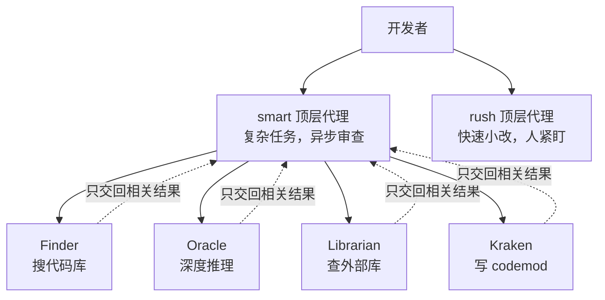

# 子代理不是“换个人设”：Amp 的 Finder / Oracle / Librarian 架构与“少给工具”的取舍

Amp

**一句话看懂**：Sourcegraph 联合创始人 Beyang Liu 用 18 分钟讲了 Amp 这个编码代理的几个“反主流”设计：**代理就是“模型 + 工具 + 循环”，所以能调的只有这三根杠杆**；工具要自己精心打磨，而不是一股脑接 MCP；子代理的用处是给主代理“省上下文”，并且按专长分工（搜代码、深度推理、查外部库、批量重构）；不让用户选模型，只给“聪明”和“快速”两个顶层代理。

::: info 为什么值得看
本站讲过 Codex 的 harness（[#09](/09-how-codex-works)）和 Anthropic 的多代理 harness（[#16](/16-anthropic-harness-design-long-running-apps)）。这场演讲提供了第三种思路，重点在于**为什么某些设计是这样**：工具太多为什么会让代理变笨、为什么上下文不够会导致“死循环”、为什么把推理模型做成子代理而不是模型选择器。即使你不用 Amp，这些判断也能帮你设计自己的子代理和工具集。
:::

::: tip 小白先懂这几个词
- [Amp](/glossary#amp)：Sourcegraph 团队做的编码代理，演讲时有终端和编辑器两种界面。
- [Subagent（子代理）](/glossary#subagent)：主代理派出去的子任务代理，有自己独立的上下文窗口，做完只把结果交回来。
- [Doom Loop（死循环）](/glossary#doom-loop)：代理一开始没收集到足够的上下文，于是不断重复同一个失败的尝试。
- [MCP](/glossary#mcp)：一种让代理接入外部工具和数据的开放协议。
- [Codemod](/glossary#codemod)：批量改写代码的自动化脚本或工具。
- [Context Window（上下文窗口）](/glossary#context-window)：模型一次能“看到”的全部内容的上限。
:::

## 1. 基本信息

<YouTube id="gvIAkmZUEZY" title="Amp Code: Next Generation AI Coding – Beyang Liu, Amp Code" />

| 项目 | 内容 |
|---|---|
| 讲者 / 频道 | Beyang Liu（Sourcegraph 联合创始人兼 CTO，幻灯片署名）／ **AI Engineer** |
| 发布日期 | 2025-12-22（AIE Code 2025 演讲；讲者提到 Gemini 3 “两天前”发布） |
| 时长 | 18:30 |
| 使用工具 | Amp（终端 UI、编辑器扩展、子代理） |
| 分析依据 | AI Engineer 频道发布的 AIE Code 2025 演讲录像，文字依据 ai.engineer 网站提供的带时间戳字幕（只引用讲者原话，不引用页面上的编辑摘要），截图为视频真实画面。演讲后 Amp 的产品有较大变化，第 4 节据 Amp 官方新闻（2026-02-19、2026-03-30）补充。 |

## 2. 做了什么

讲者开场就说，他不打算证明 Amp 比别的代理更好，而是要展示团队在架构上做了哪些“与众不同、有主见、甚至有点怪”的决定。演讲按构建 Amp 的过程，依次讲了代理的本质、工具选择、子代理、顶层代理和界面。

## 3. 怎么做的

### 3.1 代理就是一个循环：你只有三根杠杆

<figure class="shot"><figcaption>📷 视频截图 · <a href="https://www.youtube.com/watch?v=gvIAkmZUEZY&t=245s" target="_blank" rel="noopener">4:05</a> · “Hello, Agent”：代理的核心就是一个调用模型和工具的 while 循环。</figcaption></figure>

::: tr 代理的核心是什么？……它就是一个 for 循环，中间是工具调用和一个模型。
> "What is an agent at its core? Well, all an agent is, as I'm sure most of you know, uh, is it's a for loop, uh, with tool calls and a model, uh, in the middle."
:::

这样看的好处是，你能清楚知道作为代理的构建者有哪些杠杆：<Trans zh="你可以换模型，可以改工具描述，可以改模型和这些工具迭代的方式，这些实际上就是你全部的杠杆。">“You can change the choice of model, you can change the tool descriptions, and you can change, uh, how the model iterates with those tools, and those are effectively your levers.”</Trans>

### 3.2 工具：自己打磨，而不是一股脑接 MCP

Amp 早期的一个决定是：大部分精力放在自己的核心工具集上，而不是大量集成 MCP 服务器。讲者给了两个理由：

1. **代理的关键是闭合反馈回路**，需要专门为此打磨的工具：<Trans zh="MCP 服务器的作者不知道你的代理想做什么，所以他们不会针对你要完成的事去调整工具描述。">“The creator of the MCP server doesn't know what your agent is trying to do, and so they're not gonna tune the tool descriptions to what you're trying to accomplish.”</Trans>
2. **上下文混乱**：上下文里的工具越多，代理要选的东西越多；如果工具和当前任务无关，它就会被搞糊涂。

### 3.3 工具调用也吃上下文：死循环与子代理

<figure class="shot"><figcaption>📷 视频截图 · <a href="https://www.youtube.com/watch?v=gvIAkmZUEZY&t=415s" target="_blank" rel="noopener">6:55</a> · 工具调用吃掉上下文：读太多会耗尽上下文，读太少会陷入死循环，子代理是第三条路。</figcaption></figure>

讲者描述了每个做代理的人都会遇到的两难：

- 代理先 grep、读很多文件收集上下文，等到真正改代码时上下文已经快用完，只能提前停下；
- 如果提示它少读一点，又会进入另一种失败：

::: tr 这就导致另一种失败模式，我称之为“死循环”模式：它一开始没有收集到足够的上下文，于是搞不清自己要做什么，只能一遍又一遍地重试同样的事情。
> "But then this leads to another failure mode, which I call the doom loop mode, which is it doesn't gather enough context in the beginning, and so it ends up not figuring out what it needs to do and just tr- retries the same thing over and over again."
:::

解决办法是子代理：<Trans zh="子代理相当于普通编程语言里的子程序调用。它能把一个子任务用掉的上下文分离到另一个独立的上下文窗口里。">“subagents are the analog to subroutine calls in regular programming languages. It's how you can factor out the context window used for a subtask into a separate context window”</Trans>，做完只把相关结果交回主代理。这和 [[04§3.3]] 里“子代理用来控制上下文，而不是扮演角色”是同一个观点。

### 3.4 按专长分工的子代理

<figure class="shot"><figcaption>📷 视频截图 · <a href="https://www.youtube.com/watch?v=gvIAkmZUEZY&t=520s" target="_blank" rel="noopener">8:40</a> · Amp 的四个子代理及各自的模型和工具（演讲时的配置）。</figcaption></figure>

Amp 没有做“改改系统提示词就是一个新角色”的通用子代理，而是做了几个功能很明确的：

| 子代理 | 用途 | 讲者的说明（据字幕整理） |
|---|---|---|
| `Finder` | 搜索代码库 | 用较小、较快的模型驱动一组受限的工具（读文件、grep、glob），专门快速找到相关上下文 |
| `Oracle` | 深度推理 | Amp 的推理能力放在这里，而不是让用户切换模型；主代理遇到难题时调用它 |
| `Librarian` | 查外部库 | 获取代码库之外的上下文，比如你依赖的库和框架 |
| `Kraken`（实验） | 大规模重构 | 不逐个改文件，而是写 codemod 来批量改 |

关于 `Oracle`，讲者分享了个人体验：遇到不想花一两个小时钻进去的问题，就让主代理去调用它，有时要想好几分钟，<Trans zh="但我觉得大概五次里有四次，它都能神奇地找到根本原因。">“but I think like four, uh, out of five times, it just magically finds, uh, uh, the, the underlying issue.”</Trans>（这是讲者的个人估计，不是测量数据。）

把推理模型放在子代理里的好处是：主代理保持响应快、能灵活使用各种工具，只有在需要调试难题或做细致规划时才“下沉”到推理模型。

### 3.5 不做模型选择器：“聪明”和“快速”两个顶层代理

::: tr 我理解开发者喜欢选择，或者至少喜欢有选择的可能，但选择的问题在于还有“选择的悖论”。
> "I get that, you know, developers like choice, or at least the, the possibility of choice, but the problem with choice is that there's also a paradox of choice."
:::

讲者的理由是架构层面的：如果一个 harness 要支持 N 个模型，每个模型都只能轻度定制，就永远无法针对某个模型做到最好。所以 Amp 只有两个顶层代理：

- **smart**：能调用所有子代理，慢一些，可以交给它更复杂的指令，适合“派出去、做完再审”的异步模式；
- **rush**：用于需要人紧盯、快速做小改动的场景。

演讲时 smart 代理的模型只换过一次，就是两天前换成了 Gemini 3。

### 3.6 瓶颈在审查：“readitor”与共享对话

讲者说，他现在大部分时间其实在做代码审查，这限制了他能同时运行的代理数量。所以 Amp 的编辑器更像一个“阅读器”（他称为 readitor）：

<figure class="shot"><figcaption>📷 视频截图 · <a href="https://www.youtube.com/watch?v=gvIAkmZUEZY&t=735s" target="_blank" rel="noopener">12:15</a> · 为审查代理产出设计的 diff 视图（演讲时的编辑器版本）。</figcaption></figure>

这个审查界面可以选任意提交范围、逐文件看 diff、直接编辑、跳转到定义；底部有“改动导览”功能，告诉你先读哪些文件，因为<Trans zh="审查一个大改动时，一半的难度在于搞清楚从哪里开始读。">“half the battle when reviewing a large change is figuring out where to start.”</Trans>

另一个早期功能是**和团队共享对话（thread）**：同事可以看到彼此是怎么用代理的，分享好用的提示技巧，或者把卡住的对话发给别人，一起想怎么把代理接到更好的反馈回路上。

## 4. 结果如何

这是产品介绍型演讲，没有给出量化的效果数据。演讲之后 Amp 的产品发生了几处重要变化（据 Amp 官方新闻，2026-10-09 抓取）：

- **2026-02-19**，Amp 发文《The Coding Agent Is Dead》，宣布停用 VS Code 和 Cursor 编辑器扩展（3 月 5 日停用），转向 CLI。文中写道：<Trans zh="对于最新的模型，代理（你包在模型外面的提示词和工具）已经不再是限制因素。">“With the newest models, the agent — the prompts and tools you wrap around a model — is no longer the limiting factor.”</Trans> 也就是说，演讲第 3.6 节展示的编辑器审查界面已经不存在。
- **2026-03-30**，Amp 宣布免费版不再显示广告（演讲中提到的“在终端里放广告来补贴推理成本”的实验已经结束）。

::: warning 局限与注意
- 这是 Amp 团队介绍自家产品的演讲，“`Oracle` 五次里有四次能找到问题”是讲者个人感受。
- 截图和表格里的子代理模型配置是演讲时（2025 年 11 月）的状态，之后很可能已经改变。
- 讲者对 MCP 的看法是“核心能力靠自研工具”，不是说 MCP 没用；他讨论的是投入重点放在哪里。
- Amp 后来自己也承认，随着模型变强，harness 设计的影响在减小。阅读时可以把本文当作“2025 年底代理设计的一种思路”，而不是最终答案。
:::

## 5. 可借鉴之处

1. **把代理看成“模型 + 工具 + 循环”**：遇到效果问题时，先想是哪根杠杆出了问题。
2. **工具少而精**：不相关的工具会让代理困惑；自己写的工具描述要针对你的任务。
3. **注意“读太多”和“读太少”两种失败**：前者耗尽上下文，后者陷入死循环；把搜索交给子代理是折中。
4. **子代理按专长设计**：搜索用快模型 + 只读工具，难题交给推理模型，外部库查询单独一个，批量改动用 codemod。
5. **审查是瓶颈**：多开代理之前，先想想你审得过来吗；给自己找一个“先读哪个文件”的顺序。
6. **把好的对话分享给团队**：别人怎么用代理，是学习这门新手艺最直接的材料。

### 你可以这样试

- [ ] 在你常用的代理里定义一个“只读搜索”子代理（只给读文件和搜索工具），让主代理遇到“先找找相关代码”时调用它，比较主对话的上下文用量。
- [ ] 检查你接入的 MCP 服务器，关掉和当前项目无关的，看代理选工具时是否更准确。
- [ ] 下次代理反复重试同一件事时，判断它是不是“上下文不够”，让它先做一次完整的搜索再动手。
- [ ] 把一次用代理解决难题的完整对话分享给同事，请他们指出哪里可以更好。

::: details 读完自测（点开看答案）
1. **讲者说构建代理只有哪三根杠杆？** 模型的选择、工具描述、模型和工具迭代的方式。
2. **什么是“死循环”模式？** 代理一开始没收集到足够的上下文，搞不清要做什么，只能反复重试同样的事情。
3. **为什么 Amp 把推理模型做成子代理（`Oracle`），而不是模型选择器？** 主代理可以保持快速和灵活，只有遇到难题时才调用推理模型；而且不让用户在 N 个模型间选，能针对少数模型深度优化。
4. **演讲后 Amp 有哪两个重要变化？** 停用了编辑器扩展、转向 CLI（2026-02/03）；免费版取消了广告（2026-03-30）。
:::
