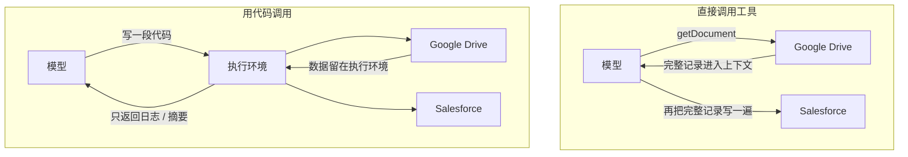

# 工具太多把上下文撑爆怎么办：Anthropic 的“用代码调用 MCP”

<div class="meta-tags"><span class="tool-tag tool-general">通用（不限工具）</span></div>

<div class="hook">

**一句话看懂**：代理接的 MCP 服务器越多，就越慢、越贵，因为两件事都在吃上下文：**所有工具的定义一开始就塞进上下文**，以及**每次工具调用的中间结果都要经过模型**。Anthropic 的方案是把 MCP 服务器包装成文件系统里的代码 API，让代理写代码去调用：需要哪个工具才读哪个文件，大数据在代码里过滤完再交给模型。文中的例子把 token 用量从 15 万降到 2000，减少 98.7%。

</div>

::: info 为什么值得看
[#35](/35-amp-next-generation-ai-coding) 里 Amp 选择“少接 MCP、精选工具”来避免上下文混乱，这篇是 Anthropic 给出的另一条路：**工具可以多，但不要一次全部加载**。如果你在设计 MCP 服务器、给代理接了很多工具，或者想理解为什么 Skills（[#21](/21-anthropic-agent-skills-talk)）要“渐进披露”，这篇讲清楚了背后的原理，示例代码也很直观。
:::

::: tip 小白先懂这几个词
- [MCP](/glossary#mcp)：Model Context Protocol，让代理接入外部工具和数据的开放标准。
- [Tool Call（工具调用）](/glossary#tool-call)：模型输出一段结构化请求，由 harness 去执行对应的工具，再把结果交回模型。
- [Code Execution with MCP / Code Mode](/glossary#code-execution-mcp)：把 MCP 工具包装成代码 API，让代理写代码调用，而不是逐个直接调用工具。
- [Progressive Disclosure（渐进披露）](/glossary#progressive-disclosure)：先只给目录和摘要，需要时再加载细节。
- [Sandbox（沙箱）](/glossary#sandbox)：隔离的执行环境，限制代码能访问的文件、网络和资源。
:::

## 1. 基本信息

<SourceCard type="文章" title="Code execution with MCP: Building more efficient agents" author="Adam Jones、Conor Kelly（Anthropic）" date="2025-11-04" url="https://www.anthropic.com/engineering/code-execution-with-mcp" />

| 项目 | 内容 |
|---|---|
| 链接 | https://www.anthropic.com/engineering/code-execution-with-mcp |
| 类型 | 公司工程博客（文章） |
| 作者 | Adam Jones、Conor Kelly |
| 发布日期 | 2025-11-04 |
| 适用范围 | 任何支持 MCP 且有代码执行环境的代理（文中示例为 TypeScript） |
| 分析依据 | Anthropic Engineering 博客《Code execution with MCP: Building more efficient agents》全文，2026-10-09 抓取。文中数字和代码均为原文摘录。 |

## 2. 做了什么

文章先指出 MCP 普及之后的新问题：

::: tr 如今开发者经常构建能访问几十个 MCP 服务器、成百上千个工具的代理。然而，随着连接的工具增多，一开始就加载所有工具定义、并让中间结果穿过上下文窗口，会拖慢代理并增加成本。
> "Today developers routinely build agents with access to hundreds or thousands of tools across dozens of MCP servers. However, as the number of connected tools grows, loading all tool definitions upfront and passing intermediate results through the context window slows down agents and increases costs."
:::

然后给出方案：<Trans zh="把 MCP 服务器呈现为代码 API，而不是直接的工具调用。">“present MCP servers as code APIs rather than direct tool calls.”</Trans>

## 3. 怎么做的

### 3.1 问题一：工具定义一次性塞满上下文

大多数 MCP 客户端会把所有工具的定义（名称、描述、参数、返回值）提前放进上下文。文中说，连接了几千个工具的代理，<Trans zh="在读到请求之前就要先处理几十万个 token">“they’ll need to process hundreds of thousands of tokens before reading a request”</Trans>。

### 3.2 问题二：中间结果要经过模型两次

例子：“把会议记录从 Google Drive 下载下来，附到 Salesforce 的销售线索上”。直接调用工具时，模型先拿到完整的会议记录（进入上下文），再把整份记录原样写进下一个工具调用（又一次进入上下文）。文中估计，一场 2 小时的销售会议可能多处理 5 万个 token；文档再大一些甚至会超出上下文窗口。而且在工具之间复制大量数据时，模型更容易出错。



### 3.3 方案：把 MCP 服务器变成文件树

一种实现方式是给每个连接的服务器生成一个目录，每个工具一个文件（原文）：

```text
servers
├── google-drive
│   ├── getDocument.ts
│   ├── ... (other tools)
│   └── index.ts
├── salesforce
│   ├── updateRecord.ts
│   ├── ... (other tools)
│   └── index.ts
└── ... (other servers)
```

每个工具文件是对 MCP 调用的一层薄包装：

::: tr 读取 Google Drive 文档的工具文件：定义输入输出类型，内部调用 MCP 工具 google_drive__get_document。
```ts
// ./servers/google-drive/getDocument.ts
import { callMCPTool } from "../../../client.js";

interface GetDocumentInput {
  documentId: string;
}

interface GetDocumentResponse {
  content: string;
}

/* Read a document from Google Drive */
export async function getDocument(input: GetDocumentInput): Promise<GetDocumentResponse> {
  return callMCPTool<GetDocumentResponse>('google_drive__get_document', input);
}
```
:::

前面的例子就变成了一段代码，会议记录只在执行环境里流转，不经过模型：

::: tr 从 Google Docs 读取会议记录，写进 Salesforce 的销售线索。
```ts
// Read transcript from Google Docs and add to Salesforce prospect
import * as gdrive from './servers/google-drive';
import * as salesforce from './servers/salesforce';

const transcript = (await gdrive.getDocument({ documentId: 'abc123' })).content;
await salesforce.updateRecord({
  objectType: 'SalesMeeting',
  recordId: '00Q5f000001abcXYZ',
  data: { Notes: transcript }
});
```
:::

代理通过浏览文件系统来发现工具：先列出 `./servers/` 看有哪些服务器，再只读当前任务需要的工具文件。

::: tr 这把 token 用量从 15 万降到了 2000，节省了 98.7% 的时间和成本。
> "This reduces the token usage from 150,000 tokens to 2,000 tokens—a time and cost saving of 98.7%."
:::

文章也提到 Cloudflare 发表过类似的发现，称之为“Code Mode”，核心观点相同：LLM 擅长写代码，应该利用这一点。

### 3.4 带来的五个好处

| 好处 | 做法（据原文） |
|---|---|
| 渐进披露 | 工具定义按需读取；也可以给服务器加一个 `search_tools` 工具，并提供“详细程度”参数（只要名称 / 名称加描述 / 完整定义） |
| 结果先过滤 | 例如读取 1 万行的表格，在代码里筛出待处理订单，只打印前 5 行给模型看 |
| 控制流更省 | 循环、条件、错误处理直接写在代码里，比如轮询 Slack 直到出现“deployment complete”，不必每轮都经过模型 |
| 保护隐私 | 中间结果默认留在执行环境；harness 还可以把邮箱、电话等个人信息替换成 `[EMAIL_1]` 这样的占位符，在下一个工具调用时再还原，真实数据不经过模型 |
| 状态与技能 | 中间结果写进文件以便中断后继续；跑通的代码可以保存成可复用的函数，加上 `SKILL.md` 就成了一个技能 |

“结果先过滤”的原文示例：

::: tr 不用代码执行时，1 万行数据全部进入上下文；用代码执行时，在执行环境里筛选，只打印数量和前 5 行。
```ts
// Without code execution - all rows flow through context
TOOL CALL: gdrive.getSheet(sheetId: 'abc123')
        → returns 10,000 rows in context to filter manually

// With code execution - filter in the execution environment
const allRows = await gdrive.getSheet({ sheetId: 'abc123' });
const pendingOrders = allRows.filter(row => 
  row["Status"] === 'pending'
);
console.log(`Found ${pendingOrders.length} pending orders`);
console.log(pendingOrders.slice(0, 5)); // Only log first 5 for review
```
:::

最后一点把代码执行和 Skills 联系了起来：代理把跑通的代码存成 `./skills/save-sheet-as-csv.ts` 这样的函数，以后直接导入使用。原文说：<Trans zh="随着时间推移，代理可以积累一个更高层能力的工具箱，不断完善它高效工作所需的脚手架。">“Over time, this allows your agent to build a toolbox of higher-level capabilities, evolving the scaffolding that it needs to work most effectively.”</Trans>

## 4. 结果如何

文中唯一的量化数字是上面的例子：按需加载工具定义后，token 用量从 150,000 降到 2,000（减少 98.7%）。文章没有给出更大范围的评测。

::: warning 局限与注意
- **代码执行本身有成本**。原文明确提醒：<Trans zh="运行代理生成的代码，需要一个有适当沙箱、资源限制和监控的安全执行环境。这些基础设施要求带来了直接调用工具所没有的运维开销和安全考量。">“Running agent-generated code requires a secure execution environment with appropriate sandboxing, resource limits, and monitoring. These infrastructure requirements add operational overhead and security considerations that direct tool calls avoid.”</Trans>
- 98.7% 是一个示例场景的数字，实际节省取决于连接了多少工具、数据有多大。
- 文中的 `callMCPTool`、`search_tools`、个人信息占位符等是**设计思路的示例**，不是某个现成产品的 API；具体实现要自己做或看你用的代理是否支持。
- 工具少、数据小的场景，直接调用工具更简单，不一定值得引入代码执行环境。
:::

## 5. 可借鉴之处

1. **工具多了先想“按需加载”**：不要把所有工具定义一次性塞给代理；用目录、搜索工具或延迟加载。
2. **大数据不要穿过模型**：让代理写代码处理，只把摘要、数量、少量样例交给模型。
3. **MCP 服务器设计者可以提供“详细程度”选项**：只要名称、名称加描述、完整定义，让代理自己选。
4. **敏感数据可以在 harness 层脱敏**：模型只看到占位符，真实数据在工具之间直接流转。
5. **跑通的代码沉淀成技能**：把一次性的脚本保存成可复用函数，配上说明文件。
6. **先评估沙箱成本**：代码执行需要隔离环境、资源限制和监控，权衡后再采用。

### 你可以这样试

- [ ] 看看你的代理目前加载了多少个工具定义（很多代理有 `/context` 或类似命令能看到占用），估算它们占了多少上下文。
- [ ] 找一个“读大文件再写到别处”的任务，对比两种做法：让代理直接调用工具搬运数据，和让它写一段脚本完成，比较上下文用量。
- [ ] 把你经常让代理重复写的数据处理脚本保存进仓库的 `scripts/` 或技能目录，在 AGENTS.md 里告诉代理直接调用。

::: details 读完自测（点开看答案）
1. **直接调用 MCP 工具时，哪两件事会浪费上下文？** 所有工具定义提前加载进上下文；每次工具调用的中间结果都要经过模型（有时还要再写一遍）。
2. **“把 MCP 服务器变成文件树”是怎么省 token 的？** 代理只在需要时读取对应的工具文件，而不是一开始加载全部定义；数据在执行环境里流转，不进入上下文。
3. **文中例子的 token 用量从多少降到多少？** 从 150,000 降到 2,000，减少 98.7%。
4. **这种做法的主要代价是什么？** 需要安全的代码执行环境（沙箱、资源限制、监控），增加运维开销和安全考量。
:::
