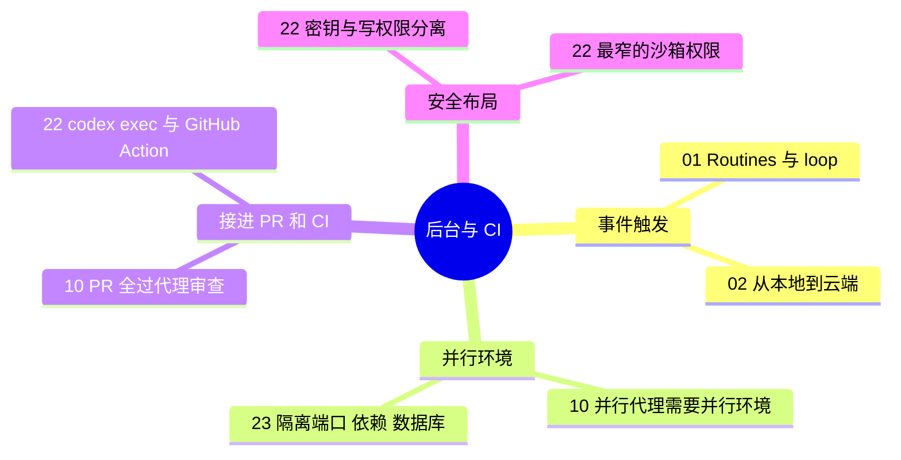

# 5 自动化 · 后台代理与 CI/CD

**这个阶段回答**：代理怎么脱离聊天框，被事件唤醒、在后台和 CI 里跑？收录 4 份资料：[[01]]、[[02]]、[[10]]、[[22]]。并行开发（[[23]]）放在 [3 去执行](/guide/execution)，本页只引用和自动化相关的部分。

::: tip 怎么用这页
每个问题下面列出“哪份资料的哪一节回答了它”。指南只做串联和对照，原话和细节请点进原文。
:::

## 1. 怎么让代理被事件唤醒，而不是等人开口？

- **Routines**：Claude Code 团队有人设 routine 监听某个功能的所有工单和 issue，代理主动提交修复 PR；另一个 routine 专找 5 小时内没人响应的 bug report（[[01§3.3]]）。
- **从“和代理说话”到“和 loop 说话”**（[[01§3.5]]）；把代理从笔记本搬到云端托管容器，合上电脑它也继续跑（[[02§3.4]]）。
- **在 Slack 里派活**：工作入口搬到 Slack 原生的 Claude Tag（[[02§3.1]]）。

## 2. 后台并行跑，环境怎么准备？

- **每个代理一个工作目录**：issue → worktree → PR 的完整流程见 [3 去执行](/guide/execution) 和 [[23§3.1]]。
- **并行代理需要并行环境**：每个代理能在自己的 worktree / checkout 里起 dev server 和 worker（[[10§3.2]]）。Cole 现场解决了三个真实问题：端口冲突（按目录名哈希分配端口）、依赖重复安装（预装）、数据库互相污染（每个 worktree 一个数据库分支）（[[23§3.5]]）。

## 3. 怎么把代理接进 PR 和 CI？

- **PR 先过代理审查**：OpenAI 100% 的 PR 都先过 Codex review，没过就不找同事审；审查有意做得“不吵”，标准可以写进 AGENTS.md（[[10§3.3]]）。
- **CI 失败自动修**：`codex exec` 是 Codex 的非交互模式，可以接管道、输出 JSONL、用 `--output-schema` 约束输出（[[22§3.1]]）；官方范例在 CI 失败后触发新工作流，由 Codex 生成补丁（[[22§3.3]]）。
- **把漏网问题回灌**：同类问题反复漏过 review，就编码进 review 规则或验证工具（[[10§3.4]]）。

## 4. 安全怎么做？

- **密钥和写权限分开**：旧版 cookbook 把 API key 设成整个 job 的环境变量，又给了写权限；构建脚本、测试、依赖钩子都能读到它。现在的推荐布局是：只读 job 拿密钥生成补丁 → artifact → 无密钥的 job 开 PR（[[22§3.2]]、[[22§3.3]]）。
- **权限开关**：Codex GitHub Action 的沙箱和权限选项，以及“只在受控环境里用 danger-full-access”（[[22§3.4]]）。
- **把不可信输入当攻击面**：PR 标题、issue 正文进入提示词前要清洗（[[22§5]]）。放开权限无人值守跑时的隔离做法，见 [[24§3.1]]。

## 5. 来源之间的分歧与互补

| 议题 | 观点 A | 观点 B | 怎么理解 |
|---|---|---|---|
| 并行隔离用什么 | Cole：git worktree + 自定义脚本处理端口、依赖、数据库（[[23§3.5]]） | Peter：不用 worktree，直接多份 checkout（[[11§3.2]]） | 都是“每个代理一个独立工作目录”。worktree 省磁盘、便于脚本化；多 checkout 最简单。真正的难点在端口、依赖、数据库这些共享资源。 |
| 谁来审代理开的 PR | OpenAI：代理 review 先过，再找同事（[[10§3.3]]） | Cole：全新会话 + 跨模型审查之后，合并前人仍然要自己审（[[23§3.3]]、[[23§4]]） | 不矛盾：代理审查是第一道关，人是最后一道关。 |

## 6. 推荐阅读顺序

1. [[01]]：先建立“事件触发 + 自己验证”的观念。
2. [[22]]：能抄进仓库的 CI 配置和安全布局。
3. [[10]]：团队级的 PR 审查与 CI 看护。
4. [[02]]：Claude Code 团队自己的工作流。

::: info 上一阶段 / 下一阶段
← [4 做验证](/guide/verification)：放大自动化之前，先补验证体系 ｜ 想知道这些机制背后怎么实现，见 [6 看原理](/guide/harness) →
:::
