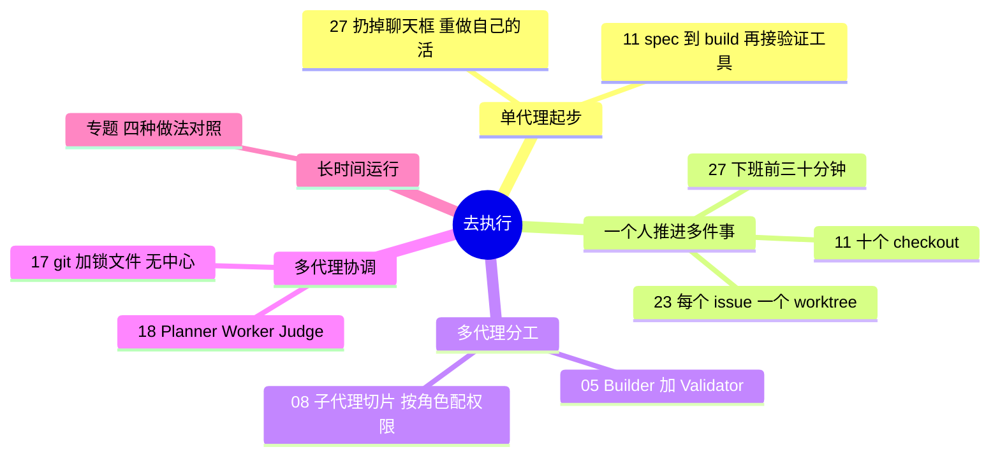

# 去执行 · 从单代理到多代理

**这个阶段回答**：计划定好后，怎么让代理把活干完？一个人怎么用好一个代理，什么时候需要多个代理，多个代理又怎么分工、协调、长时间运行？收录 7 份资料：[[27]]、[[11]]、[[05]]、[[08]]、[[23]]、[[17]]、[[18]]，另有[长时自主任务专题](/guide/long-running)。

::: tip 怎么用这页
本页从“一个人 + 一个代理”讲到“几百个代理”。每个问题下面列出“哪份资料的哪一节回答了它”，点链接直接跳到原文小节。
:::

## 1. 刚开始用代理，怎么才不会“越用越觉得没用”？

- **先换形态，再谈效率**。Mitchell Hashimoto 的第一步是扔掉聊天框，改用能读文件、跑命令的代理（[[27§3.1]]）；第二步是把自己刚手动做完的活让代理重做一遍，建立“它稳赢什么、必败什么”的直觉（[[27§3.2]]）。
- **先让它能验证自己**。Peter Steinberger 的“开窍”时刻是 spec → build → 再给代理接上验证工具（[[11§3.1]]）。
- **少折腾工具链**。Peter 把过度复杂的配置叫作 “agentic trap”，自己刻意保持简单（[[11§3.2]]）。

## 2. 一个人怎么同时推进多件事？

- **多份工作目录并行**：Peter 不用 worktree，直接开 checkout 1 到 10（[[11§3.2]]）；Cole Medin 把每个 GitHub issue 当作规格，每个 issue 一个 worktree，各自规划、实现、开 PR（[[23§3.1]]、[[23§3.2]]）。
- **并行时的真实难题**：端口冲突、依赖重复安装、数据库互相污染，Cole 现场给了三种解法（[[23§3.5]]）。
- **利用人不在的时间**：Mitchell 下班前 30 分钟启动代理做调研和分诊，第二天把“稳赢”的任务交给后台代理（[[27§3.3]]、[[27§3.4]]）。

## 3. 什么时候该用多个代理？

- **单个上下文装不下时**：一个代理审 45 个文件，上下文会被塞满；切成 20 个审查切片交给子代理，每个都在干净的上下文里工作（[[08§3.4]]）。#15 的做法相同：57 个文件，每个文件一个子代理（[[15§3.2]]）。
- **任务能拆成独立小块时**：C 编译器实验用 GCC 当 Oracle，把“编译 Linux 内核”这个大任务拆成很多可以并行修的小任务（[[17§3.5]]）。

## 4. 多个代理怎么分工？

- **最小团队：一个写、一个查**。IndyDevDan 的 builder 只执行一个任务、不派生其他代理；validator 物理上不能写文件（[[05§3.3]]）。
- **按角色配模型、权限和工具**：审查角色几乎总该只读；写文档、写 bug report 的角色才给写权限（[[08§3.5]]）。Cursor 也按角色选模型（[[18§3.3]]）。
- **专业角色**：Carlini 在主线开发之外，派代理专门合并重复代码、优化性能、做架构评审（[[17§3.6]]）。

## 5. 多个代理怎么协调？

- **扁平 + 锁**：C 编译器实验没有编排者，16 个代理靠共享 git 仓库和 `current_tasks/` 锁文件认领任务（[[17§3.2]]）。
- **扁平在规模大时失败**：Cursor 的第一版也是平等协作 + 锁，二十个代理只剩两三个的有效吞吐；改乐观并发后，代理又变得规避风险、只做小而安全的改动（[[18§3.1]]）。
- **分层**：第二版改成 Planner / Worker / Judge（[[18§3.2]]）。结构要适中，专门的 integrator 角色制造的瓶颈比解决的还多（[[18§3.4]]）。

## 6. 让代理连续跑几小时到几周

Ralph 循环、C 编译器、Cursor 数百代理和 Anthropic 的 Planner / Generator / Evaluator 在上下文策略、协调方式、停止条件和验收上各不相同，对照表见 **[长时自主任务专题](/guide/long-running)**。其中 Ralph 和 Planner / Generator / Evaluator 的设计原理放在 [看原理](/guide/harness)。

## 7. 来源之间的分歧

| 议题 | 观点 A | 观点 B | 怎么理解 |
|---|---|---|---|
| 并行多少 | Peter：10 个 checkout 同时跑（[[11§3.2]]） | Mitchell：只跑一个后台代理，关掉通知，自己决定何时查看（[[27§3.6]]） | 并行数量受人的审查能力限制，不受代理数量限制。 |
| 并行隔离用什么 | Cole：git worktree + 脚本处理端口、依赖、数据库（[[23§3.5]]） | Peter：不用 worktree，直接多份 checkout（[[11§3.2]]） | 都是“每个代理一个独立工作目录”。真正的难点在端口、依赖、数据库这些共享资源。 |
| 扁平协作还是分层 | C 编译器：16 个代理、锁文件、无中心调度，能跑通（[[17§3.2]]） | Cursor：锁和扁平结构在数百代理时失败，改为分层（[[18§3.1]]、[[18§3.2]]） | 规模不同。十几个代理、任务边界清楚时扁平够用；几百个代理、任务需要持续拆分时需要分层。 |
| 要不要专门的协调角色 | C 编译器：给代理分专业角色有帮助（[[17§3.6]]） | Cursor：专门的 integrator 反而成了瓶颈（[[18§3.4]]） | “专业分工”可以加，“所有改动都过一个人”的关卡要慎加。 |

## 8. 推荐阅读顺序

1. [[27]]：心态与节奏，最适合刚起步。
2. [[11]]：一个人维护大型开源项目的真实做法。
3. [[23]]：完整的并行开发演示。
4. [[05]] → [[08]]：最小代理团队，再到按角色配置的子代理。
5. [[17]] → [[18]]：从十几个代理到几百个代理，协调方式怎么变。

::: info 上一阶段 / 下一阶段
← [做规划](/guide/planning) ｜ 代理说“做完了”之后，进入 [做验证](/guide/verification) →
:::
