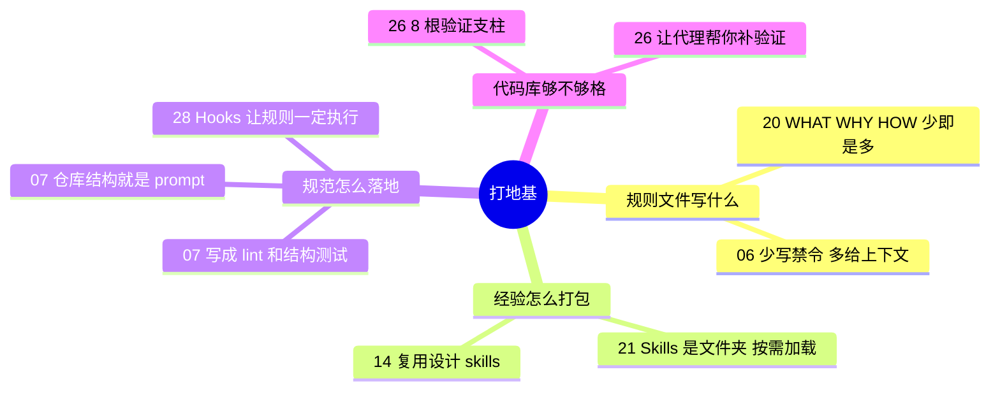

# 打地基 · 上下文与规范

**这个阶段回答**：代理每次开工前，应该已经知道什么？规则文件写什么、Skills 怎么组织、代码库要准备到什么程度？收录 6 份资料：[[20]]、[[21]]、[[14]]、[[26]]、[[07]]、[[28]]。

::: tip 怎么用这页
每个问题下面列出“哪份资料的哪一节回答了它”，点链接直接跳到原文小节。指南只做串联和对照，原话和细节请点进原文。
:::

## 1. 规则文件（CLAUDE.md / AGENTS.md）该写什么？

- **只写每次都用得上的**。模型是无状态的，规则文件是唯一默认每次进入上下文的项目知识，所以杠杆最大（[[20§3.1]]）。内容按 WHAT / WHY / HOW 组织，“怎么验证改动”属于 HOW（[[20§3.2]]）。
- **写多了会被无视**。HumanLayer 抓包发现 Claude Code 注入 CLAUDE.md 时附带“这段上下文可能与任务无关”的系统提醒（[[20§3.3]]），而指令数量是有“预算”的（[[20§3.4]]）。
- **少写禁令，多给上下文**。Claude Code 团队删掉了 80% 的系统提示词，尽量避免写“不要做这个”（[[06§3.2]]）；OpenAI 的经验是，规则之间互相矛盾比内容多少更危险（[[10§4]]）。

## 2. 只对某类任务有用的经验，放在哪？

- **渐进披露**：根规则文件只放目录和一句话简介，细节拆到 `agent_docs/`（[[20§3.5]]）。
- **Skills**：一个 skill 就是一个文件夹，平时只露出名字和简介，需要时才读 SKILL.md，再按需读附属文件或运行脚本（[[21§3.3]]）。MCP 负责“能连到什么”，Skills 负责“知道怎么做”（[[21§3.5]]）。
- **实例**：OrcDev 复用项目里已有的设计 skills，再写一份计划式长 prompt，一次生成风格一致的页面（[[14§3.1]]、[[14§3.2]]）。

## 3. 团队规范怎么让代理真的遵守？

- **写成会自动回到上下文里的东西**：OpenAI Frontier 团队把非功能性需求写成 CI 审查代理、仓库专属 lint 和结构测试，因为只靠 AGENTS.md，早期指令会被自动压缩挤掉（[[07§3.2]]）。
- **先探索，后约束**：让代理自由探索，到 lint / test 阶段再施加约束（[[07§3.3]]）；代码风格交给 formatter / linter，而不是写进规则文件（[[20§3.6]]）。
- **仓库结构就是 prompt**：一致的目录和写法，本身就在告诉代理该怎么写（[[07§3.5]]）。
- **能写成脚本的规则，交给 hook**：规则文件是“建议”，hook 是在固定时刻一定会执行的命令。Claude Code 官方给出了改完自动格式化（[[28§3.2]]）、用退出码 2 拦住对 `.env` 的修改（[[28§3.3]]）、压缩后重新注入约定（[[28§3.4]]）、收工前让模型检查任务和测试（[[28§3.5]]）的现成配置；Gemini CLI 和 Grok Build 的 hooks 结构几乎相同（[[28§3.6]]、[[34§3.2]]）。
- **怎么分工**：每次会话都要知道的背景写进规则文件；必须每次执行、能用脚本判断的写成 command hook；需要判断的条件用 prompt / agent hook（[[28§4]]）。

## 4. 代码库要准备到什么程度？

- **能被自动验证**：Factory 认为限制代理的是代码库的自动化验证，并把可验证性分成 8 根支柱打分（[[26§3.1]]、[[26§3.2]]）。
- **让代理帮你补地基**：问代理“我们的 linter 哪里约束不够”，让它补测试（[[26§3.5]]）。
- 地基打好后，下一步的“验证”怎么做，见 [做验证](/guide/verification)。

## 5. 来源之间的分歧

| 议题 | 观点 A | 观点 B | 怎么理解 |
|---|---|---|---|
| 规则文件写多少 | HumanLayer：少即是多，控制在几十行，细节用指针（[[20§3.4]]、[[20§5]]） | Mitchell：每犯一个错就往 AGENTS.md 加一行（[[27§3.5]]）；Cole：每个 bug 都改规则、技能或流程（[[23§3.4]]） | 两者控制的东西不同：HumanLayer 控制**总量**，Mitchell / Cole 说的是**增量**从哪来。#20 的注意事项里也写了：新增的那一行要普遍适用，特定任务的经验应放进 `agent_docs/` 或 skill（[[20§4]]）。 |
| 上下文给多少 | Claude Code 团队：上下文极简，给多了像在“微操”模型（[[01§3.7]]） | OpenAI Frontier 团队：只靠 AGENTS.md 不够，要持续“刷新上下文”（[[07§3.2]]） | 不矛盾：07 不是在开头塞更多规则，而是在 lint、测试、审查这些环节**按需**把约束送回给代理，开头的上下文仍然可以很少。 |

## 6. 推荐阅读顺序

1. [[20]]：规则文件怎么写，最短最实用。
2. [[21]]：Skills 为什么是文件夹、怎么渐进加载。
3. [[14]]：看 Skills 在真实页面开发里怎么用。
4. [[26]]：给自己的代码库打分。
5. [[28]]：把最重要的几条规则写成 hook，配置可以直接抄。
6. [[07]]：团队规模的做法，适合最后读。

::: info 下一阶段
地基打好后，进入 [做规划](/guide/planning)：动手前把需求问清楚、把任务拆好。
:::
