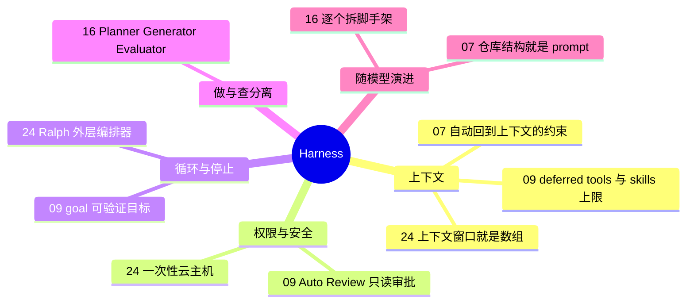

# 6 看原理 · Harness 与内部机制

**这个阶段回答**：前面五个阶段用到的做法，背后的机制是什么？模型外面那层“驾驭工具”（harness）怎么设计，上下文、权限、循环、验证分别交给谁？收录 3 份资料：[[09]]、[[24]]、[[16]]。

::: tip 怎么用这页
每个问题下面列出“哪份资料的哪一节回答了它”。指南只做串联和对照，原话和细节请点进原文。
:::

## 1. Harness 到底包括什么？

- **一份产品级 harness 的全貌**：Codex 团队拆解了协议、上下文构建、动作（子代理 / 后台终端 / 浏览器）、自动审批、速度、`/goal`、压缩（[[09§3.1]] 到 [[09§3.7]]）。
- **团队级 harness**（属于 [1 打地基](/guide/foundation)）：OpenAI Frontier 团队把非功能性需求写成 CI 审查代理、仓库专属 lint、结构测试，让约束“自动回到上下文里”（[[07§3.2]]）；仓库结构本身也是 prompt（[[07§3.5]]）。
- **个人级 harness**：Mitchell 的定义很朴素：每犯一个错，就改一次环境，让它不再犯（[[27§3.5]]）。

## 2. 上下文怎么分配？

- **心智模型：上下文窗口就是一个数组**。服务端没有记忆，数组就是记忆；模型需要“滑动”的范围越小越好。因此每轮开头固定放入规格索引（有意分配），一轮只做一件事（[[24§3.2]]、[[24§3.3]]）。
- **控制体积**：Codex 把部分工具延后到搜索时再加载，skills 列表上限设为上下文窗口的 2%（[[09§3.2]]）。
- **Just-in-time 约束**：先让代理自由探索，到 lint / test 阶段再施加约束（[[07§3.3]]）。

## 3. 权限怎么放？

- **放开权限前先隔离**：Ralph 要无人值守地跑，必须放在隔离环境里；Dex 用没有公网 IP 的专用虚拟机，机器上只放模型 API key 和 deploy key（[[24§3.1]]）。
- **用一个只读子代理替你审批**：Codex Auto Review 分别判断“用户是否授权”和“影响多大”（[[09§3.4]]）。

## 4. 代理什么时候停？

- **可验证目标**：`/goal` 下，模型调用 `update_goal` 才结束循环，所以目标要写成可检查的条件（[[09§3.6]]）。
- **外层循环**：Ralph 的本质是外层编排器，不在会话内部循环；commit、push、是否回滚这类确定性步骤交给外层脚本（[[24§3.5]]）。官方插件则用 Stop hook 在同一会话里续跑（[[24§3.4]]）。
- **单独的评估者**：Anthropic 的长任务 harness 由 Evaluator 用 Playwright 实际操作应用来判定 sprint 是否完成（[[16§3.2]]、[[16§3.3]]）。

## 5. Harness 要随模型变化而调整

- **逐个拆脚手架**：每个 harness 组件都编码了一条“模型自己做不到”的假设；模型升级后要一次删一个组件，看结果变化（[[16§3.5]]）。
- **同样的思路**：Claude Code 团队删掉 80% 的系统提示词（[[06§3.2]]）；模型变强后删掉为旧模型打的补丁（[[02§3.2]]），并让 harness 更精简（[[01§3.7]]）。

## 6. 来源之间的分歧

| 议题 | 观点 A | 观点 B | 怎么理解 |
|---|---|---|---|
| 长会话：压缩还是重开 | Anthropic：Opus 4.5 起去掉 context reset，用 SDK 自动压缩跑连续会话（[[16§3.5]]）；Codex 服务端自动压缩（[[09§3.7]]） | Huntley：压缩有损，每轮全新上下文（[[24§3.4]]） | 和模型能力相关：Anthropic 的变化正是模型升级带来的。全新上下文的代价是每轮要重新读规格，好处是可预测。详见[长时自主任务专题](/guide/long-running)。 |
| 循环放在哪 | Ralph：外层 bash，会话外（[[24§3.5]]） | `/goal`、官方 Ralph 插件：harness 内部（[[09§3.6]]、[[24§3.4]]） | 外层更可控、可插入确定性步骤；内部更省事。 |

## 7. 推荐阅读顺序

1. [[24]]：先建立“上下文是数组”的心智模型。
2. [[09]]：看一份产品级 harness 的完整拆解。
3. [[16]]：做与查分离，以及随模型升级拆脚手架。

团队规模的 harness 与仓库组织（[[07]]）放在 [1 打地基](/guide/foundation)。

::: info 上一阶段
← [5 自动化](/guide/automation) ｜ 四种长时任务做法的对照表见[长时自主任务专题](/guide/long-running)（属于 [3 去执行](/guide/execution)）。
:::
