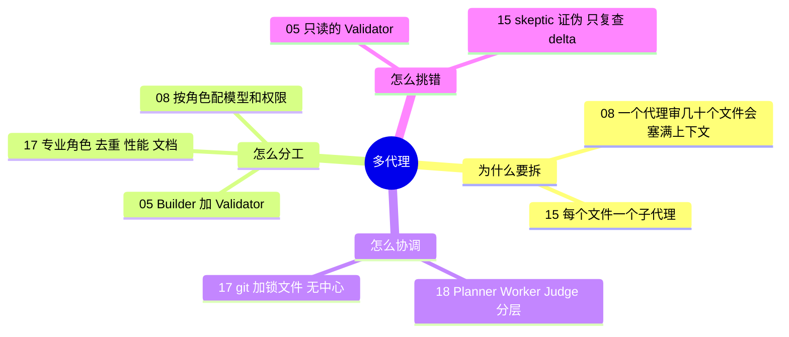

# 🤝 主题指南：多代理协作与对抗式验证

**这个主题回答**：多个代理怎么分工、怎么协调，又怎么互相挑错？收录 5 份资料：[[05]]、[[08]]、[[15]]、[[17]]、[[18]]。

::: tip 怎么用这页
每个问题下面列出“哪份资料的哪一节回答了它”。指南只做串联和对照，原话和细节请点进原文。
:::

## 1. 什么时候该用多个代理？

- **单个上下文装不下时**：一个代理审 45 个文件，上下文会被塞满；切成 20 个审查切片交给子代理，每个都在干净的上下文里工作（[[08§3.4]]）。#15 的做法相同：57 个文件，每个文件一个子代理，分批派生（[[15§3.2]]）。
- **任务能被拆成独立小块时**：C 编译器实验的关键一步，是用 GCC 当 Oracle，把“编译 Linux 内核”这个大任务拆成很多可以并行修的小任务（[[17§3.5]]）。

## 2. 怎么分工？

- **最小团队：一个写、一个查**。IndyDevDan 的 builder 只执行一个任务、不派生其他代理；validator 物理上不能写文件（[[05§3.3]]）。
- **按角色配模型、权限和工具**：审查角色几乎总该只读；写文档、写 bug report 的角色才给写权限（[[08§3.5]]）。Cursor 也按角色选模型（[[18§3.3]]）。
- **专业角色**：Carlini 在主线开发之外，派代理专门合并重复代码、优化编译器性能、做架构评审（[[17§3.6]]）。

## 3. 多个代理怎么协调？

- **扁平 + 锁**：C 编译器实验没有编排者，16 个代理靠共享 git 仓库和 `current_tasks/` 锁文件认领任务，跑通了（[[17§3.2]]）。
- **扁平在规模大时失败**：Cursor 的第一版也是平等协作 + 锁，结果代理持锁太久、二十个代理只剩两三个的有效吞吐；改乐观并发后，代理又变得规避风险、只做小而安全的改动（[[18§3.1]]）。
- **分层**：第二版改成 Planner / Worker / Judge，Planner 可派生子 Planner，Worker 只管自己的任务，Judge 决定是否开下一轮（[[18§3.2]]）。
- **结构要适中**：Cursor 的 integrator 角色制造的瓶颈比解决的还多（[[18§3.4]]）。

## 4. 代理之间怎么挑错？

- **做与查分离**：validator 只读（[[05§3.3]]）；Codex 的只读审查 persona（[[08§3.5]]）。
- **对抗式验证“完成”**：`/goal` 声称完成后，skeptic 代理被要求证伪“目标已达成”，发现真实问题后只复查 delta（[[15§3.3]]）。
- **同一思路在其他主题里**：扇出找 bug + 对抗式复核（[[02§3.5]]）、全新上下文 + 跨模型审查（[[23§3.3]]）、单独调教的 Evaluator（[[16§3.4]]）。完整对照见[评测、测试与验证](/guide/verification)。

## 5. 来源之间的分歧

| 议题 | 观点 A | 观点 B | 怎么理解 |
|---|---|---|---|
| 扁平协作还是分层 | C 编译器：16 个代理、锁文件、无中心调度，能跑通（[[17§3.2]]） | Cursor：锁和扁平结构在数百代理时失败，改为分层（[[18§3.1]]、[[18§3.2]]） | 规模不同。十几个代理、任务边界清楚（有 Oracle 拆分）时扁平够用；几百个代理、任务需要持续拆分时需要分层。 |
| 要不要专门的协调 / 集成角色 | C 编译器：给代理分专业角色有帮助（[[17§3.6]]） | Cursor：专门的 integrator 反而成了瓶颈（[[18§3.4]]） | “专业分工”可以加，“所有改动都过一个人”的关卡要慎加。 |

## 6. 推荐阅读顺序

1. [[05]]：最小的两人团队。
2. [[08]]：子代理切片审查 + 按角色配置的实操。
3. [[15]]：大规模并行 + 对抗式验证。
4. [[17]] → [[18]]：从十几个代理到几百个代理，协调方式怎么变。

::: info 相关主题
长时间运行的多代理系统，见[长时自主任务专题](/guide/long-running)。
:::
