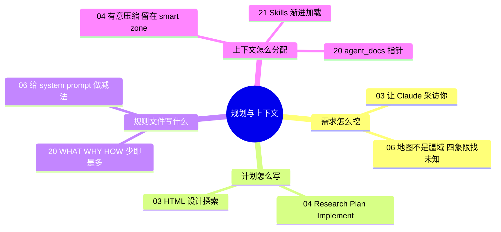

# 🧭 主题指南：需求澄清、规划与上下文管理

**这个主题回答**：动手前怎么和代理对齐需求？哪些信息该进上下文、什么时候进？收录 5 份资料：[[03]]、[[06]]、[[04]]、[[20]]、[[21]]。

::: tip 怎么用这页
每个问题下面列出“哪份资料的哪一节回答了它”。指南只做串联和对照，原话和细节请点进原文。
:::

## 1. 需求说不清楚，怎么办？

- **让代理反过来采访你**。Arno 的观点是：比起你自己把需求说清楚，Claude 更擅长从你身上把需求挖出来（[[03§Phase 1]]）。
- **找出“没写下来的东西”**。Thariq 用“地图不是疆域”和四象限描述代理会撞上的未知，并给了 blind spot pass、HTML 原型、访谈、参考实现、实现笔记五种挖掘手法（[[06§3.3]]）。
- **用可看的原型代替文字讨论**：Arno 用 HTML 而不是 Markdown 做设计探索（[[03§Phase 2]]）。

## 2. 计划要写到什么程度？

- **分阶段、每阶段产出文档**：RPI 把工作分成 Research → Plan → Implement，每个阶段结束时把成果写成文档，下一阶段从干净会话开始（[[04§3.4]]）。
- **人读计划，而不是读每一行代码**（[[04§3.6]]）；按难度选流程强度，小改动不必走全套（[[04§3.7]]）。

## 3. 规则文件（CLAUDE.md / AGENTS.md）该写什么？

- **只写每次都用得上的**。模型是无状态的，规则文件是唯一默认每次进入上下文的项目知识，所以杠杆最大（[[20§3.1]]）。内容按 WHAT / WHY / HOW 组织，“怎么验证改动”属于 HOW（[[20§3.2]]）。
- **写多了会被无视**。HumanLayer 抓包发现 Claude Code 注入 CLAUDE.md 时附带“这段上下文可能与任务无关”的系统提醒（[[20§3.3]]），而指令数量是有“预算”的（[[20§3.4]]）。
- **少写禁令，多给上下文**。Claude Code 团队删掉了 80% 的系统提示词，尽量避免写“不要做这个”（[[06§3.2]]）。

## 4. 信息什么时候进入上下文？

- **把上下文当稀缺资源**：上下文是唯一的杠杆（[[04§3.1]]）；用到约 40% 后效果递减（[[04§3.2]]）；子代理用来隔离搜索过程，而不是扮演角色（[[04§3.3]]）。
- **渐进披露**：根规则文件只放目录和一句话简介，细节拆到 `agent_docs/`（[[20§3.5]]）；Skills 平时只露出名字和简介，需要时才读 SKILL.md，再按需读附属文件（[[21§3.3]]）。
- **Skills 和 MCP 分工**：MCP 负责“能连到什么”，Skills 负责“知道怎么做”（[[21§3.5]]）；只对某类任务有用的长说明，适合从规则文件迁移成 skill（[[21§5]]）。

## 5. 来源之间的分歧

| 议题 | 观点 A | 观点 B | 怎么理解 |
|---|---|---|---|
| 规则文件写多少 | HumanLayer：少即是多，控制在几十行，细节用指针（[[20§3.4]]、[[20§5]]） | Mitchell：每犯一个错就往 AGENTS.md 加一行（[[27§3.5]]）；Cole：每个 bug 都改规则、技能或流程（[[23§3.4]]） | 两者控制的东西不同：HumanLayer 控制**总量**，Mitchell / Cole 说的是**增量**从哪来。#20 的注意事项里也写了：新增的那一行要普遍适用，特定任务的经验应放进 `agent_docs/` 或 skill（[[20§4]]）。 |
| 上下文满了怎么办 | RPI：频繁有意压缩，阶段之间写文档交接（[[04§3.4]]） | Ralph：每轮全新上下文，认为压缩有损（[[24§3.4]]）；Anthropic 长任务 harness 换到 Opus 4.5 后去掉了重置，改用自动压缩（[[16§3.5]]） | 详见[长时自主任务专题](/guide/long-running)。共同点是：**不要让一个会话无限变长**。 |

## 6. 推荐阅读顺序

1. [[20]]：规则文件怎么写，最短最实用。
2. [[04]]：上下文管理的方法论。
3. [[03]]：可以照着复现的需求访谈 + 设计探索流程。
4. [[06]]：找未知、给 harness 做减法。
5. [[21]]：Skills 为什么是文件夹、怎么渐进加载。

::: info 相关主题
上下文策略在长时间任务里会变得更关键，见 [🧠 Harness 工程与内部机制](/guide/harness) 和 [长时自主任务专题](/guide/long-running)。
:::
