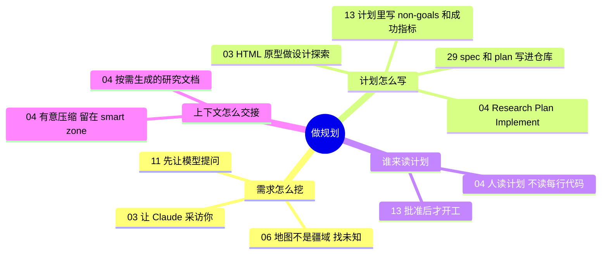

# 做规划 · 需求澄清与任务拆解

**这个阶段回答**：动手前怎么和代理对齐需求？计划要写到什么程度、谁来读？收录 5 份资料：[[03]]、[[06]]、[[04]]、[[13]]、[[29]]。

::: tip 怎么用这页
每个问题下面列出“哪份资料的哪一节回答了它”。指南只做串联和对照，原话和细节请点进原文。
:::

## 1. 需求说不清楚，怎么办？

- **让代理反过来采访你**。Arno 的观点是：比起你自己把需求说清楚，Claude 更擅长从你身上把需求挖出来（[[03§Phase 1]]）。Peter Steinberger 的关键提示也是先让模型提问（[[11§3.3]]）。
- **找出“没写下来的东西”**。Thariq 用“地图不是疆域”和四象限描述代理会撞上的未知，并给了五种挖掘手法，每种都有可照抄的 prompt（[[06§3.3]]）。
- **用可看的原型代替文字讨论**：Arno 用 HTML 而不是 Markdown 做设计探索（[[03§Phase 2]]）。

## 2. 计划要写到什么程度？

- **分阶段、每阶段产出文档**：RPI 把工作分成 Research → Plan → Implement，计划里写清文件名、代码片段和每步怎么测试（[[04§3.4]]）。
- **写明边界和完成标准**：Grok Build 的 plan mode 会自己探索目录、读说明文件，再弹出可交互的计划，里面有 non-goals 和成功指标（[[13§3.2]]）。
- **把“可验证”设计进计划**：Arno 让组件输出供代理和 CI 核验的契约，验证从设计阶段就开始（[[03§Phase 3]]）。
- **把计划存进仓库，代理按清单打勾**：Gemini CLI 的 Conductor 先用 setup 写下产品、技术栈和团队流程（[[29§3.1]]），每个需求生成 `spec.md` 和 `plan.md`（[[29§3.2]]），执行时逐项打勾，中途停下也能接着做（[[29§3.3]]）；团队纪律（TDD、覆盖率、技术栈变更流程）写进 `workflow.md` 模板（[[29§3.4]]）。
- **按难度选流程强度**：小改动不必走全套（[[04§3.7]]）。

## 3. 计划谁来读？

- **人读计划，而不是读每一行代码**：计划里的一处错误可能变成 100 行坏代码，调研里的一处错误会毁掉整件事（[[04§3.6]]）。
- **先审批再动手**：plan mode 可以批准、修改或放弃计划，批准后才自动开始实现（[[13§3.2]]）。
- **做完再对照计划审一遍**：Conductor 的自动审查会检查每个阶段是否完成、有没有漏掉 spec 里的核心需求（[[29§3.5]]）。
- **大任务的计划要拆到“一个代理一次做完”**：并行编排时，子任务要能放进一个提交、能快速验证、依赖清晰（[[30§3.4]]）。

## 4. 阶段之间怎么交接上下文？

- **把上下文当稀缺资源**：上下文是唯一的杠杆（[[04§3.1]]）；用到约 40% 后效果递减（[[04§3.2]]）；子代理用来隔离搜索过程，而不是扮演角色（[[04§3.3]]）。
- **有意压缩**：每个阶段结束时主动把成果写成文档，下一阶段从干净会话开始（[[04§3.4]]）。
- 规则文件和 Skills 这类“每次开工都要有”的上下文，见 [打地基](/guide/foundation)。

## 5. 来源之间的分歧

| 议题 | 观点 A | 观点 B | 怎么理解 |
|---|---|---|---|
| 项目知识要不要写成固定文档 | Dex Horthy：维护 onboarding 文档会越写越长、会过时，更推荐每次按需生成压缩的研究文档（[[04§3.5]]） | HumanLayer：把细节拆成 `agent_docs/` 里的固定文件，按需读取（[[20§3.5]]）；Conductor：产品、技术栈、流程各写一个文件，随新功能持续更新（[[29§3.1]]） | 两者都反对把一切塞进根规则文件。差别在于细节是“维护好放着”还是“用时现查”。变化快的部分更适合现查，稳定的构建、测试说明更适合写成文件。 |
| 上下文满了怎么办 | RPI：频繁有意压缩，阶段之间写文档交接（[[04§3.4]]） | Ralph：每轮全新上下文，认为压缩有损（[[24§3.4]]）；Anthropic 长任务 harness 换到 Opus 4.5 后去掉了重置，改用自动压缩（[[16§3.5]]） | 详见[长时自主任务专题](/guide/long-running)。共同点是：**不要让一个会话无限变长**。 |

## 6. 推荐阅读顺序

1. [[03]]：可以照着复现的需求访谈 + 设计探索流程。
2. [[04]]：上下文管理和分阶段推进的方法论。
3. [[06]]：找出未知的五种手法。
4. [[13]]：看 plan mode 在新工具里的完整流程。
5. [[29]]：把上下文和计划做成仓库里的文件，适合团队使用。

::: info 上一阶段 / 下一阶段
← [打地基](/guide/foundation) ｜ 计划定好后，进入 [去执行](/guide/execution) →
:::
