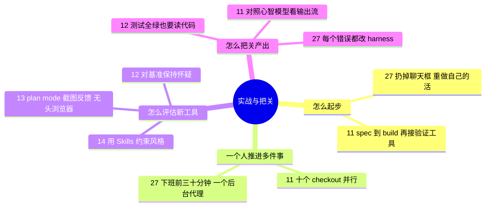

# 🛠️ 主题指南：真实项目实战与人工把关

**这个主题回答**：真人在真项目里怎么用编码代理？什么时候放手、什么时候必须自己看代码？收录 5 份资料：[[11]]、[[14]]、[[13]]、[[12]]、[[27]]。

::: tip 怎么用这页
每个问题下面列出“哪份资料的哪一节回答了它”，点链接直接跳到原文小节。指南只做串联和对照，细节、原话和截图都在原文章里。
:::

## 1. 刚开始用代理，怎么才不会“越用越觉得没用”？

- **先换形态，再谈效率**。Mitchell Hashimoto 的第一步是扔掉聊天框，改用能读文件、跑命令的代理（[[27§3.1]]）；第二步是把自己刚手动做完的活让代理重做一遍，对比差异，建立“它稳赢什么、必败什么”的直觉（[[27§3.2]]）。
- **先让它能验证自己**。Peter Steinberger 的“开窍”时刻是 spec → build → 再给代理接上验证工具（[[11§3.1]]）。
- **少折腾工具链**。Peter 把过度复杂的配置叫作 “agentic trap”，自己刻意保持简单（[[11§3.2]]）。

## 2. 一个人怎么同时推进多件事？

- **多份 checkout 并行**：Peter 不用 worktree，直接开 checkout 1 到 10，处理互不冲突的问题（[[11§3.2]]）。
- **利用人不在的时间**：Mitchell 下班前 30 分钟启动代理做调研和分诊，第二天早上挑出“稳赢”的任务交给后台代理，一次只跑一个（[[27§3.3]]、[[27§3.4]]、[[27§3.6]]）。
- **模型分工**：ForrestKnight 设想让擅长长时循环的模型做编排，把批量执行交给快模型（[[12§3.5]]）。

## 3. 新工具 / 新模型怎么评估？

- **用自己的项目和工作流测，不只看基准**：ForrestKnight 一开场就对基准保持怀疑，然后在自己的 Rust / TypeScript 项目上实测（[[12§3.1]]）。OrcDev 的结论是“工作流比模型更重要”（[[14§3.5]]）。
- **先给上下文再给任务**：OrcDev 复用项目已有的设计 skills，再写一份计划式长 prompt，一次生成风格一致的页面（[[14§3.1]]、[[14§3.2]]）。
- **看完整闭环**：Bijan Bowen 的实测覆盖 plan mode 审批、截图反馈、无头浏览器自测（[[13§3.2]]、[[13§3.3]]、[[13§3.4]]），也记录了越界修改等问题（[[13§4]]）。

## 4. AI 产出怎么把关？

- **测试全绿不等于正确**：24 个测试全过、Clippy 无警告，读代码仍发现按字符串比较版本号、重复造轮子（[[12§3.3]]）。
- **审意图，不只审代码**：Peter 把外部 PR 当作 “Prompt Request”，先让代理解释意图再决定方案（[[11§3.5]]）。
- **把错误变成环境改进**：Mitchell 的第五步是“改造 harness”：每个错误都对应 AGENTS.md 的一行或一个验证脚本（[[27§3.5]]）。

## 5. 来源之间的分歧

| 议题 | 一方 | 另一方 | 怎么理解 |
|---|---|---|---|
| 要不要读代码 | Peter：多数代码只是数据形状转换，看输出流、对照心智模型即可，有问题再集中处理（[[11§3.4]]） | ForrestKnight：测试全绿也要读，人读代码才能发现测试没覆盖的错误（[[12§3.3]]） | 取决于“出错代价”和“验证是否可靠”。验证体系越完善，越可以少读；见 [评测、测试与验证](/guide/verification)。 |
| 并行多少 | Peter：10 个 checkout 同时跑（[[11§3.2]]） | Mitchell：只跑一个后台代理，关掉通知，自己决定何时查看（[[27§3.6]]） | 并行数量受人的审查能力限制，不受代理数量限制。 |

## 6. 推荐阅读顺序

1. [[27]]：心态与节奏，最适合刚起步。
2. [[11]]：一个人维护大型开源项目的真实做法。
3. [[14]] → [[13]]：从短到长，看新工具的完整上手流程。
4. [[12]]：学会审查 AI 产出。

::: info 相关主题
想把“把关”系统化，接着读 [✅ 评测、测试与验证](/guide/verification)；想让代理在后台跑，读 [⚙️ 后台代理、自动化与 CI/CD](/guide/automation)。
:::
