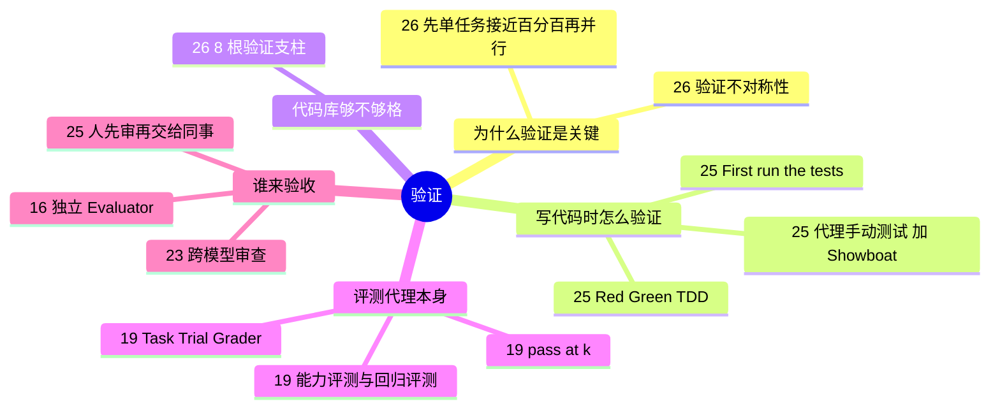

# ✅ 主题指南：评测、测试与验证

**这个主题回答**：怎么知道代理“真的做完了”？测试、评测和人工验收分别管什么？收录 3 份资料：[[19]]、[[25]]、[[26]]。很多相关做法散落在其他主题里，本页一并串起来。

::: tip 怎么用这页
每个问题下面列出“哪份资料的哪一节回答了它”。指南只做串联和对照，原话和细节请点进原文。
:::

## 1. 为什么说验证是用好代理的前提？

- **能验证的才能交给 AI**：Factory 引用“验证不对称性”：最适合 AI 的问题有客观真相、验证快（[[26§3.1]]）。
- **验证决定并行上限**：没有能自动判断 PR 是否基本可用的验证，就无法同时跑多个代理（[[26§3.4]]）。
- **同一观点在其他资料里**：Claude Code 团队把验证定义为“代理能不能把东西跑起来”（[[01§3.2]]）；OpenAI 团队说并行代理需要并行环境和测试（[[10§3.2]]）。

## 2. 写代码时，怎么让代理自己验证？

- **Red/Green TDD**：先写测试、确认失败，再实现到通过。一句 prompt 就能装进整套纪律（[[25§3.1]]）。
- **新会话先跑测试**：既让代理了解项目，也让它意识到“这里有测试，要维护”（[[25§3.2]]）。
- **测试通过 ≠ 能用**：让代理真的启动程序、像用户一样操作（[[25§3.3]]），并用 Showboat 这类工具留下可复查的记录（[[25§3.4]]）。Bijan 的实测里，代理也用无头浏览器自测（[[13§3.4]]）。
- **测试全绿也可能是错的**：ForrestKnight 的反例（[[12§3.3]]）。

## 3. 代码库本身够不够“好验证”？

- **8 根验证支柱**：Factory 把代码库的可验证性分成 8 个维度打分（[[26§3.2]]）。
- **让代理帮你补验证**：补测试、补 lint，形成正反馈循环（[[26§3.5]]）。OpenAI 团队的“仓库专属 lint + 结构测试”是同一类做法（[[07§3.2]]、[[07§3.3]]）。

## 4. 怎么评测“代理”本身？

- **零件**：Task、Trial、Grader、Transcript 与 Outcome；被测对象是 harness + 模型的组合（[[19§3.1]]）。
- **评分器怎么选**：能用确定性评分就用确定性评分，LLM 评分次之，人工评分审慎使用（[[19§3.2]]）；原文 YAML 示例见 [[19§3.3]]。
- **能力评测 vs 回归评测**（[[19§3.4]]）；**随机性**用 pass@k / pass^k 描述（[[19§3.5]]）；从 0 到 1 的路线图（[[19§3.6]]）。

## 5. 最后由谁验收？

| 做法 | 来源 |
|---|---|
| 单独调教的 Evaluator，用 Playwright 实际操作应用 | [[16§3.2]]、[[16§3.4]] |
| 全新上下文 + 跨模型（Codex）审查 | [[23§3.3]] |
| 只读的 validator / skeptic 证伪 | [[05§3.3]]、[[15§3.3]] |
| 人先确认能用，再交给同事审 | [[25§3.5]] |
| 确定性评分优先 | [[19§3.2]] |

## 6. 来源之间的分歧

| 议题 | 观点 A | 观点 B | 怎么理解 |
|---|---|---|---|
| 用模型验收模型可靠吗 | Anthropic 长任务 harness：可以，但开箱即用的 Claude 是很差的 QA 代理，要反复读日志调教（[[16§3.4]]） | Agent Evals 文章：能用确定性评分就别用 LLM 评分（[[19§3.2]]） | 能写成测试或状态检查的，用确定性评分；“设计好不好看”这类主观标准，才需要调教过的模型评委。 |
| 人还要不要审 | Peter：看输出流，多数代码不细读（[[11§3.4]]） | Simon Willison：没审过的代码丢给同事，就是把真正的工作委派给别人（[[25§3.5]]）；Cole：代理审完人还要审（[[23§4]]） | 个人项目与团队协作的标准不同。交给别人审之前，至少要有证据证明它能用。 |

## 7. 推荐阅读顺序

1. [[25]]：最容易马上用起来的几条 prompt 模式。
2. [[26]]：给自己的代码库打分。
3. [[19]]：想系统评测代理或 prompt 时再读。

::: info 本主题的归类说明
本次新增这个主题时，复查了 01–15：#12（审查 AI 产出）、#03（需求澄清）、#15（多代理对抗式验证）都涉及验证，但它们的主线分别是实战把关、规划和多代理协作，所以保留在原分组，本页通过链接引用。
:::
