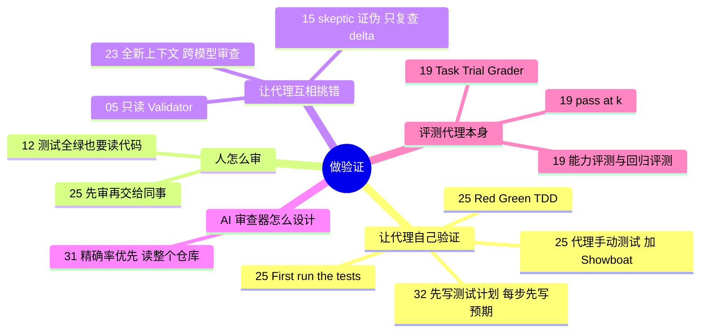

# 做验证 · 测试、评测与审查

**这个阶段回答**：代理说“做完了”，怎么确认它真的做完、做对了？测试、人工审查、对抗式审查和评测分别管什么？收录 6 份资料：[[25]]、[[12]]、[[15]]、[[19]]、[[31]]、[[32]]。很多相关做法散落在其他阶段，本页一并串起来。

::: tip 怎么用这页
每个问题下面列出“哪份资料的哪一节回答了它”。指南只做串联和对照，原话和细节请点进原文。
:::

## 1. 为什么说验证是用好代理的前提？

- **能验证的才能交给 AI**：Factory 引用“验证不对称性”：最适合 AI 的问题有客观真相、验证快（[[26§3.1]]）。没有能自动判断 PR 是否基本可用的验证，就无法同时跑多个代理（[[26§3.4]]）。
- **验证就是“代理能不能把东西跑起来”**：Claude Code 团队的定义（[[01§3.2]]）；OpenAI 团队说并行代理需要并行环境和测试（[[10§3.2]]）。
- **验证器要近乎完美**：Carlini 说任务验证器不够好，代理就会去解决一个错误的问题（[[17§3.3]]）。
- 让代码库“好验证”属于打地基，见 [打地基](/guide/foundation)。

## 2. 写代码时，怎么让代理自己验证？

- **Red/Green TDD**：先写测试、确认失败，再实现到通过。一句 prompt 就能装进整套纪律（[[25§3.1]]）。
- **新会话先跑测试**：既让代理了解项目，也让它意识到“这里有测试，要维护”（[[25§3.2]]）。
- **测试通过 ≠ 能用**：让代理真的启动程序、像用户一样操作（[[25§3.3]]），并用 Showboat 这类工具留下可复查的记录（[[25§3.4]]）。Bijan 的实测里，代理也用无头浏览器自测（[[13§3.4]]）。
- **让代理带着证据交付**：Devin 用 Computer Use 测自己的改动，先根据源码写测试计划（[[32§3.1]]），每一步操作前写下预期以免“自我说服”（[[32§3.2]]），登录等重复步骤固化成确定性脚本放进测试技能（[[32§3.3]]），最后交回带截图的报告和分章节录屏（[[32§3.5]]）。

## 3. 人怎么审代理的产出？

- **测试全绿也可能是错的**：24 个测试全过、Clippy 无警告，ForrestKnight 读代码仍发现按字符串比较版本号、重复造轮子（[[12§3.3]]）。
- **交给同事前自己先审**：没审过的代码丢给同事，就是把真正的工作委派给别人；PR 要小、要附证据，PR 描述也要自己审（[[25§3.5]]）。
- **审意图，不只审代码**：Peter 把外部 PR 当作 “Prompt Request”，先让代理解释意图（[[11§3.5]]）。

## 4. 怎么让代理互相挑错？

- **对抗式验证“完成”**：`/goal` 声称完成后，skeptic 代理被要求证伪“目标已达成”，发现真实问题后只复查 delta（[[15§3.3]]）。
- **做与查分离**：只读的 validator（[[05§3.3]]）；扇出找 bug + 对抗式复核（[[02§3.5]]）；`/clear` 后的新会话审查 + 跨模型审查（[[23§3.3]]）；单独调教的 Evaluator（[[16§3.4]]）。

## 5. AI 审查工具本身该怎么设计？

- **精确率优先**：误报多的审查器会被开发者绕开。OpenAI 用“发现真问题的收益 − 核实成本 − 误报代价”决定一条意见值不值得发，并允许用 AGENTS.md 调整松紧（[[31§3.1]]）。
- **给审查者整个仓库和执行能力**：只看 diff 会漏掉改动和依赖的交互（[[31§3.2]]）。
- **验证比生成便宜**：否定一个改动只需要有针对性地提出假设并检查，审查者用一小部分 token 预算就能抓到很多已知的严重问题（[[31§3.4]]）。
- **用结果指标迭代**：Cursor 用“解决率”（合并时被修掉的 bug 比例）衡量 Bugbot，再做爬山式实验（[[33§3.3]]、[[33§3.4]]）。

## 6. 怎么评测“代理”本身？

- **零件**：Task、Trial、Grader、Transcript 与 Outcome；被测对象是 harness + 模型的组合（[[19§3.1]]）。
- **评分器怎么选**：能用确定性评分就用确定性评分，LLM 评分次之，人工评分审慎使用（[[19§3.2]]）；原文 YAML 示例见 [[19§3.3]]。
- **能力评测 vs 回归评测**（[[19§3.4]]）；**随机性**用 pass@k / pass^k 描述（[[19§3.5]]）；从 0 到 1 的路线图（[[19§3.6]]）。

## 7. 最后由谁验收？

| 做法 | 来源 |
|---|---|
| 单独调教的 Evaluator，用 Playwright 实际操作应用 | [[16§3.2]]、[[16§3.4]] |
| 全新上下文 + 跨模型（Codex）审查 | [[23§3.3]] |
| 只读的 validator / skeptic 证伪 | [[05§3.3]]、[[15§3.3]] |
| 人先确认能用，再交给同事审 | [[25§3.5]] |
| 代理用 Computer Use 实测，交回报告和录屏 | [[32§3.5]] |
| 仓库级 AI 审查器，只发高把握的问题 | [[31§3.1]]、[[31§3.2]] |
| 确定性评分优先 | [[19§3.2]] |

## 8. 来源之间的分歧

| 议题 | 观点 A | 观点 B | 怎么理解 |
|---|---|---|---|
| 用模型验收模型可靠吗 | Anthropic 长任务 harness：可以，但开箱即用的 Claude 是很差的 QA 代理，要反复读日志调教（[[16§3.4]]） | Agent Evals 文章：能用确定性评分就别用 LLM 评分（[[19§3.2]]） | 能写成测试或状态检查的，用确定性评分；“设计好不好看”这类主观标准，才需要调教过的模型评委。 |
| 人还要不要读代码 | Peter：多数代码只是数据形状转换，看输出流、对照心智模型即可（[[11§3.4]]） | ForrestKnight：测试全绿也要读（[[12§3.3]]）；Simon Willison：没审过的代码别交给同事（[[25§3.5]]）；Cole：代理审完人还要审（[[23§4]]） | 取决于出错代价和验证是否可靠，也取决于是个人项目还是团队协作。交给别人之前，至少要有证据证明它能用。 |
| AI 审查该少报还是多报 | OpenAI：精确率优先，适度牺牲召回率换取信任（[[31§3.1]]） | Cursor Bugbot：改成代理式架构后模型太谨慎，改用激进提示词鼓励多报（[[33§3.5]]） | 不完全矛盾：Bugbot 的第一版同样靠投票和验证模型压低误报（[[33§3.1]]），激进提示词是针对代理式架构“太保守”的纠偏。两者最终都以开发者是否真的去改（采纳率 / 解决率）来校准（[[31§4]]、[[33§3.3]]）。 |
| 一次干净的审查能说明什么 | OpenAI：审查者是辅助工具，不能把干净的审查当成安全保证（[[31§4]]） | Cognition：代码审查干净往往还不够，工程师想看到端到端测试过（[[32§2]]） | 两者一致：审查只是一层防御，还需要测试和真实运行的证据。 |

## 9. 推荐阅读顺序

1. [[25]]：最容易马上用起来的几条 prompt 模式。
2. [[12]]：学会审查 AI 产出。
3. [[15]]：对抗式验证的完整演示。
4. [[32]]：让代理实际操作应用并交回证据。
5. [[31]]：理解 AI 审查器为什么要“宁缺毋滥”。
6. [[19]]：想系统评测代理或 prompt 时再读。

::: info 上一阶段 / 下一阶段
← [去执行](/guide/execution) ｜ 验证可靠之后，才适合交给后台：[自动化](/guide/automation) →
:::
