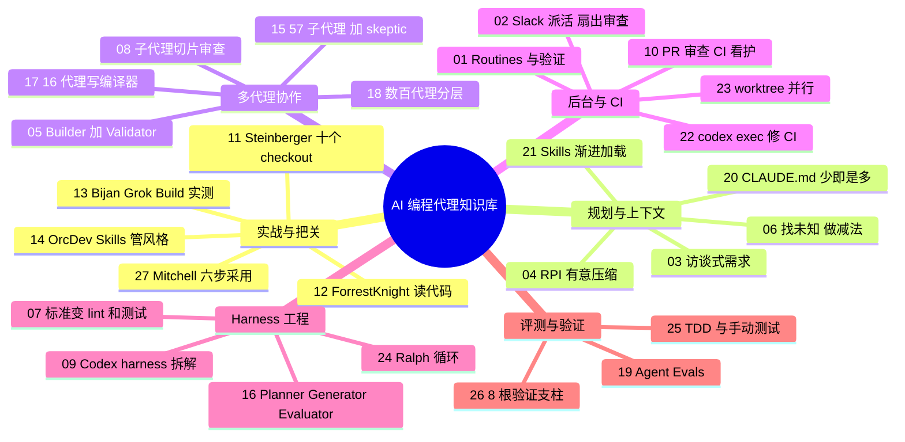

## 这是什么

一个持续更新的中文知识库，主题是**怎样用编码代理（coding agent）把软件做好**。内容分三层：

| 层次 | 是什么 | 从哪进 |
|---|---|---|
| 单篇资料 | 每份视频 / 文章一篇拆解，固定 5 节：基本信息、做了什么、怎么做的、结果如何、可借鉴之处 | [全部资料（27）](/all) |
| 主题指南 | 每个主题一页，把多份资料串起来回答几个核心问题，并标出来源之间的分歧 | 顶部导航“主题指南” |
| 横向页面 | [学习路径](/paths)、[模式库](/patterns)（20 个做法）、[配置模板库](/templates)（13 段原文配置）、[长时自主任务专题](/guide/long-running)、[总结](/00-summary)、[术语表](/glossary) | 顶部导航 |

整理开始于 2026-10-08，最近一次更新：2026-10-09（见[更新日志](/changelog)）。分类依据是**资料讲的内容**，不是用的工具；工具和资料类型用彩色小标签标出。

::: tip 阅读小功能
- **术语一点就懂**：文章里带品牌色点状下划线的词，鼠标悬停能看到一句话解释，点击跳到[术语表](/glossary)。
- **英文原话悬停看翻译**：原话、prompt 和配置保留英文原样，带灰色虚线下划线和“译”角标；悬停、键盘聚焦或手机点按会弹出中文翻译。
- **原始来源一键直达**：视频资料在“基本信息”最上方内嵌 YouTube 播放器；文章、官方文档和指南则放一张来源卡片（标题、作者、日期、链接）。
- **小节级引用**：指南和模式库里的 `#16 §3.5` 这类链接，会直接跳到原文对应小节。
:::

## 🆕 最近收录（2026-10-09，12 份）

| # | 资料 | 主题 | 类型 / 工具 |
|---|---|---|---|
| 16 | [Anthropic：Planner / Generator / Evaluator 长时任务 harness](/16-anthropic-harness-design-long-running-apps) | [🧠 Harness 工程](/guide/harness) | 文章 Claude Code |
| 17 | [Anthropic：16 个代理并行写 C 编译器](/17-anthropic-c-compiler-agent-teams) | [🤝 多代理协作](/guide/multi-agent) | 文章 Claude Code |
| 18 | [Cursor：数百代理的 Planner / Worker 实验](/18-cursor-scaling-long-running-agents) | [🤝 多代理协作](/guide/multi-agent) | 文章 Cursor |
| 19 | [Anthropic：Agent Evals 入门路线图](/19-anthropic-demystifying-agent-evals) | [✅ 评测与验证](/guide/verification) | 文章 通用（不限工具） |
| 20 | [HumanLayer：CLAUDE.md 少即是多](/20-humanlayer-writing-good-claude-md) | [🧭 规划与上下文](/guide/planning) | 文章 Claude Code |
| 21 | [Anthropic：别造代理，写 Skills](/21-anthropic-agent-skills-talk) | [🧭 规划与上下文](/guide/planning) | 视频 Claude Code |
| 22 | [OpenAI：codex exec + GitHub Action 自动修 CI](/22-openai-codex-ci-autofix) | [⚙️ 后台与 CI](/guide/automation) | 官方文档 Codex |
| 23 | [Cole Medin：5 个并行代理 + worktree](/23-cole-medin-parallel-worktrees) | [⚙️ 后台与 CI](/guide/automation) | 视频 Claude Code |
| 24 | [Huntley & Horthy：Ralph 循环 vs 官方插件](/24-huntley-horthy-ralph-loop) | [🧠 Harness 工程](/guide/harness) | 视频 Claude Code |
| 25 | [Simon Willison：测试与验收模式](/25-simonw-agentic-engineering-testing-patterns) | [✅ 评测与验证](/guide/verification) | 指南 通用（不限工具） |
| 26 | [Factory：让代码库为代理做好准备](/26-factory-agent-ready-codebases) | [✅ 评测与验证](/guide/verification) | 视频 通用（不限工具） |
| 27 | [Mitchell Hashimoto：六步 AI 采用路线](/27-mitchellh-ai-adoption-journey) | [🛠️ 实战与把关](/guide/practice) | 文章 通用（不限工具） |

## 知识库全景图

按“主题 → 资料”展示全部 27 份资料。每个主题指南里还有更细的“问题 → 资料”小图。

## 不知道从哪开始？

- **完全新手**：走[🌱 新手路径](/paths#beginner)，第一篇读 [#27 Mitchell Hashimoto 的六步路线](/27-mitchellh-ai-adoption-journey)。
- **想马上抄作业**：去[🧩 模式库](/patterns)和[🧾 配置模板库](/templates)。
- **想看全貌**：读[总结与最佳实践](/00-summary)，或打开[📚 全部资料](/all)按主题浏览。

::: info 资料来源与可信度
所有链接均已核实存在。视频以字幕 / 官方文字稿为主要依据，截图全部来自视频画面；文章和文档以原文全文为依据，抓取日期写在每篇的“信息来源”里。例外和局限都在对应文章中注明，覆盖情况与缺口见[全部资料页末尾](/all#coverage)。
:::
