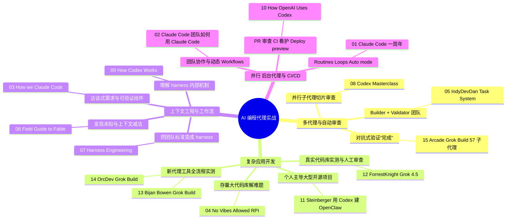

## 这个站点怎么读

整理日期：2026-10-08（2026-10-09 改版）｜共 15 个视频（Claude 6、Codex 5、Grok 4）｜每个视频一篇分析，另有[总结](./00-summary.md)和[术语表](./glossary.md)。

::: tip 三个阅读小功能
- **术语一点就懂**：文章里带虚线下划线的词，鼠标悬停能看到一句话解释，点击跳到[术语表](./glossary.md)。
- **英文原话有翻译**：讲者说的话、敲的 prompt 和配置，下面都有一块“译｜”中文翻译。
- **真实视频截图**：每篇配 2–4 张视频原画面，点截图说明里的时间戳，会直接跳到 YouTube 对应位置。
:::

::: info 资料来源与可信度
所有链接均经 YouTube 元数据核实存在；分析以字幕 / 官方文字稿为主要依据，截图全部来自视频本身的画面帧。两个例外已在文中注明：#05 整理时 YouTube 限制了字幕下载，只有部分原话再次核对过，标“转述”的不是逐字原话；#15 的自动字幕质量差（疑似机器翻译），因此结合简介、官方文档和画面上可读的文字分析。
:::

## 分类全景图

下图按“场景 → 目标 → 视频”展示全部 15 个视频，下面的清单顺序与之对应。

## 一、构建多代理 / 子代理团队，自动审查、测试自己的代码

### 目标 1：Builder + Validator 代理团队
- **[Claude Code Task System: ANTI-HYPE Agentic Coding (Advanced)](https://www.youtube.com/watch?v=4_2j5wgt_ds)**
  - 讲者 / 频道：IndyDevDan ｜ 发布：2026-02-02 ｜ 工具：Claude Code（Task 系统、Hooks、子代理）
  - 看点：用模板元提示词生成计划，再让 builder / validator 成对的子代理通过 Task 依赖协作、自检。
  - 👉 [阅读分析](./05-indydevdan-task-system.md)

### 目标 2：并行子代理切片审查 + 按角色配权限
- **[OpenAI Codex Masterclass — Vaibhav Srivastav & Katia Gil Guzman](https://www.youtube.com/watch?v=MhHEGMFCEB0)**
  - 讲者 / 频道：VB、Katia Gil Guzman（OpenAI）／ AI Engineer ｜ 发布：2026-04-29 ｜ 工具：Codex（subagents、Code Review、Plugins、Hooks）
  - 看点：现场让 20 个子代理分片审查 45 个 persona 文件；只读审查 persona、stop hook “再验证一轮”。
  - 👉 [阅读分析](./08-codex-masterclass.md)

### 目标 3：用对抗式验证代理确认“真的完成了”
- **[@space-xai Grok Build Spawned 57 Agents in 3 Minutes. Here's Why I Wasn't Worried.](https://www.youtube.com/watch?v=1NwO2dPzwRM)**
  - 讲者 / 频道：Thierry Damiba ／ Arcade ｜ 发布：2026-09-09 ｜ 工具：Grok Build + Grok 4.5（plan mode、subagents、`/goal`）
  - 看点：57 个并行子代理审查文件；`/goal` 声称完成后，skeptic 验证代理发现真实问题并只复查 delta。（字幕质量差，结合简介 + 官方文档分析）
  - 👉 [阅读分析](./15-arcade-grok-build-57-agents.md)

## 二、用 AI 代理开发复杂应用（大型项目、全栈、长时任务）

### 目标 1：在复杂存量代码库中解决难题
- **[No Vibes Allowed: Solving Hard Problems in Complex Codebases – Dex Horthy, HumanLayer](https://www.youtube.com/watch?v=rmvDxxNubIg)**
  - 讲者 / 频道：Dex Horthy（HumanLayer）／ AI Engineer ｜ 发布：2025-12-02 ｜ 工具：Claude Code（子代理、slash commands）
  - 看点：Research → Plan → Implement 与“频繁有意压缩”，把上下文控制在“smart zone”；附 HumanLayer 开源命令原文。
  - 👉 [阅读分析](./04-no-vibes-allowed-rpi.md)

### 目标 2：一个人主导大型开源项目
- **[Builders Unscripted: Ep. 1 - Peter Steinberger, Creator of OpenClaw](https://www.youtube.com/watch?v=9jgcT0Fqt7U)**
  - 讲者 / 频道：Peter Steinberger，主持 Romain Huet ／ OpenAI ｜ 发布：2026-02-24 ｜ 工具：Codex（早期 Claude Code）
  - 看点：“Do you have any questions?”、10 个 checkout 并行、外部 PR 先让代理解释意图再决定方案。
  - 👉 [阅读分析](./11-peter-steinberger-openclaw.md)

### 目标 3：在真实代码库里实测并人工审查 AI 产出
- **[Coding with Grok 4.5 is surprisingly good…](https://www.youtube.com/watch?v=5J6HCDEkg64)**
  - 讲者 / 频道：ForrestKnight ｜ 发布：2026-07-10 ｜ 工具：Cursor + Grok 4.5
  - 看点：24 个测试全绿、Clippy 无警告，逐行审查仍发现字符串比较版本号、重复造轮子；对比 Fable 5 / Opus 4.8。
  - 👉 [阅读分析](./12-forrestknight-grok-4-5.md)

### 目标 4：新代理工具的全流程实测
- **[Grok Build + Grok 4.3 FULL Test – xAI's Claude Code & Codex Competitor!](https://www.youtube.com/watch?v=X6SubdG4NuU)**
  - 讲者 / 频道：Bijan Bowen ｜ 发布：2026-05-15 ｜ 工具：Grok Build + Grok 4.3
  - 看点：plan mode 的可交互计划（含 non-goals 与成功指标）、截图反馈、无头浏览器自测，以及越界行为等问题。
  - 👉 [阅读分析](./13-bijan-bowen-grok-build.md)
- **[I Put Grok Build to the Test](https://www.youtube.com/watch?v=W8wECVc3z6E)**
  - 讲者 / 频道：OrcDev ｜ 发布：2026-05-19 ｜ 工具：Grok Build + Grok 4.3
  - 看点：复用项目已有的设计 skills，一份计划式 prompt 在 2 分 55 秒内生成风格一致的完整页面。
  - 👉 [阅读分析](./14-orcdev-grok-build-skills.md)

## 三、上下文工程与工作流：CLAUDE.md / AGENTS.md、MCP、Hooks、“规划 → 执行 → 验证”

### 目标 1：访谈式需求 + Agent 可验证的组件
- **[How we Claude Code](https://www.youtube.com/watch?v=IlqJqcl8ONE)**
  - 讲者 / 频道：Arno（Anthropic Applied AI）／ Claude ｜ 发布：2026-05-22 ｜ 工具：Claude Code（AskUserQuestion、Auto mode）、Playwright MCP
  - 看点：让 Claude 采访你写 spec → 四套 HTML 设计 → 组件输出 `data-verify-*` 契约供代理 / CI 运行时核验。
  - 👉 [阅读分析](./03-how-we-claude-code.md)

### 目标 2：找出需求盲区，给 harness 做减法
- **[Field Guide to Fable — Thariq Shihipar, Anthropic](https://www.youtube.com/watch?v=9fubhllmsBU)**
  - 讲者 / 频道：Thariq Shihipar（Anthropic）／ AI Engineer ｜ 发布：2026-07-06 ｜ 工具：Claude Code
  - 看点：Claude Code 删掉 80% system prompt；blind spot pass、HTML 原型、访谈、实现笔记、让模型 quiz 你。
  - 👉 [阅读分析](./06-field-guide-to-fable.md)

### 目标 3：把团队标准变成 lint / 测试 / reviewer agents
- **[Harness Engineering: How to Build Software When Humans Steer, Agents Execute — Ryan Lopopolo, OpenAI](https://www.youtube.com/watch?v=am_oeAoUhew)**
  - 讲者 / 频道：Ryan Lopopolo（OpenAI）／ AI Engineer ｜ 发布：2026-04-16 ｜ 工具：Codex
  - 看点：禁止团队碰编辑器；750 包仓库、文件行数测试、带修复指引的 lint、按 persona 的 CI reviewer、每周 Garbage Collection Day。
  - 👉 [阅读分析](./07-harness-engineering.md)

### 目标 4：理解编码代理 harness 的内部机制
- **[How Codex Works — Dominik Kundel, OpenAI](https://www.youtube.com/watch?v=shRR1e2HXMk)**
  - 讲者 / 频道：Dominik Kundel（OpenAI）／ AI Engineer ｜ 发布：2026-08-10 ｜ 工具：Codex harness（开源）、Responses API
  - 看点：deferred tools、skills 占 2% 上下文上限、只读 Auto Review 子代理、`/goal` continuation prompt、服务端 compaction。
  - 👉 [阅读分析](./09-how-codex-works.md)

## 四、并行代理、后台代理、与 CI/CD 集成

### 目标 1：Routines、Loop 与 Auto mode
- **[Reflecting on a year of Claude Code](https://www.youtube.com/watch?v=Hth_tLaC2j8)**
  - 讲者 / 频道：Boris Cherny、Cat Wu（Anthropic）／ Claude ｜ 发布：2026-06-08 ｜ 工具：Claude Code（Routines、Auto mode、`/loop`、Remote Control）
  - 看点：每次犯错就写进 CLAUDE.md / Skill；验证 = “can the agent run the thing?”；用 routine 自动修 bug、盯 PR。
  - 👉 [阅读分析](./01-claude-code-one-year.md)

### 目标 2：团队协作代理与动态 Workflows
- **[How the Claude Code team uses Claude Code](https://www.youtube.com/watch?v=S-sYlFiGFv8)**
  - 讲者 / 频道：Thariq Shihipar、Sid Bidasaria、Robert Boyce（Anthropic）／ Claude ｜ 发布：2026-09-02 ｜ 工具：Claude Code、Claude Tag
  - 看点：70–80% 工作经由 Slack 原生的 Claude Tag；给目标而非任务；扇出找 bug + 对抗式复审的 workflow。
  - 👉 [阅读分析](./02-claude-code-team-workflows.md)

### 目标 3：PR 审查、CI 看护、Deploy preview
- **[OpenAI @ Replay 2026 | How OpenAI Uses Codex to Change How We Build](https://www.youtube.com/watch?v=NjaX4qt-O1Y)**
  - 讲者 / 频道：Dominik Kundel（OpenAI）／ Temporal ｜ 发布：2026-05-28 ｜ 工具：Codex（GitHub Code Review、babysitting skill、`/goal`）
  - 看点：context → validation → verification 飞轮；100% PR 经 Codex review；PR 看护 skill 盯 CI；手机上完成“修复→预览→合并”。
  - 👉 [阅读分析](./10-how-openai-uses-codex.md)

## 覆盖情况与已知缺口（如实说明）

| 工具 | 数量 | 来源构成 | 说明 |
|---|---|---|---|
| Claude（Claude Code） | 6 | 官方频道 3、AI Engineer 2、独立开发者 1 | 内容最充足，官方团队直接讲内部用法 |
| Codex | 5 | OpenAI 官方 1、AI Engineer 3、Temporal 大会 1 | 官方工程师讲 harness 与内部流程，质量高；其中 #09、#10 为同一讲者的不同演讲 |
| Grok | 4 | 独立开发者 3、Arcade（工具厂商频道）1 | **缺口明显**，见下 |

**Grok 的缺口：**
- 未找到 xAI 官方频道或 AI Engineer 等大会上关于 Grok Build / Grok 编码代理的长篇工程演讲或实战讲解；Grok 官方频道只有 1–2 分钟的产品宣传片（如 “Introducing Grok 4.5”），不符合“内容实战”的标准，没有收录。
- 收录的 4 个 Grok 视频都是第三方实测：#12、#13、#14 有完整字幕；#15 内容最贴近“多代理 + 验证”主题，但自动字幕质量差，因此结合简介和官方文档分析。
- 讲架构设计和长期团队实践的 Grok 内容（类似 #07、#10 那样）目前没有找到。Grok 部分的结论主要是“工具能力 + 个人体验”，可信度低于 Claude / Codex 部分。
- 已排除：James Montemagno 的 *Grok Code Fast 1 in VS Code*（2025-08，超出 12 个月且仅 4 分钟）；若干标题党 / 新闻解读类 Grok 视频。

**其他说明：**
- 时效：除 #04（2025-12-02）外，其余均为 2026 年发布。
- 按要求排除了以漏洞挖掘 / 攻防安全为主题的视频，只保留软件开发工作流。
- 未收录但可作延伸阅读：Ryan Lopopolo 在 Latent Space 的长访谈 *Extreme Harness Engineering*（https://www.youtube.com/watch?v=CeOXx-XTYek，与 #07 同一讲者，含 Symphony 编排器）；Jason Liu 在 OpenAI DevDay 2026 的 *From Single Player to Multiplayer with Codex*（https://www.youtube.com/watch?v=aDTPTwnrRyA，偏知识工作协作）。
