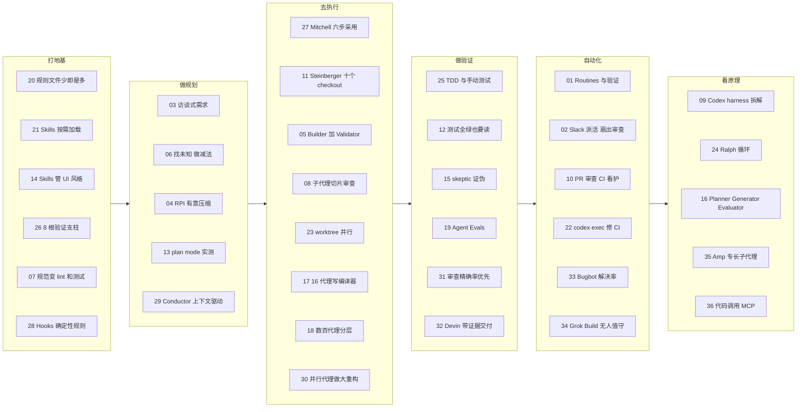

## 这是什么

**分类原则：按一个 AI 代理开发任务从开始到上线的顺序分组。** 六个阶段依次是：打地基（上下文与规范）→ 做规划 → 去执行 → 做验证 → 自动化，最后是看原理（Harness 与内部机制）。每份资料只放在它主要贡献所在的那个阶段。

一个持续更新的中文知识库，主题是**怎样用编码代理（coding agent）把软件做好**。内容分三层：

| 层次 | 是什么 | 从哪进 |
|---|---|---|
| 单篇资料 | 每份视频 / 文章一篇拆解，固定 5 节：基本信息、做了什么、怎么做的、结果如何、可借鉴之处 | 左侧边栏，或[全部资料](/all) |
| 阶段指南 | 每个阶段一页，把多份资料串起来回答几个核心问题，并标出来源之间的分歧 | 左侧边栏每组第一项 |
| 工具页面 | [学习路径](/paths)、[模式库](/patterns)（29 个做法）、[术语表](/glossary)、[更新日志](/changelog)；另有[总结](/00-summary) | 顶部导航 |

整理开始于 2026-10-08，最近一次更新：2026-10-09（见[更新日志](/changelog)）。工具和资料类型标在每篇文章的标题下方。

::: tip 阅读小功能
- **术语一点就懂**：文章里带品牌色点状下划线的词，鼠标悬停能看到一句话解释，点击跳到[术语表](/glossary)。
- **英文原话悬停看翻译**：原话、prompt 和配置保留英文原样，带灰色虚线下划线和“译”角标；悬停、键盘聚焦或手机点按会弹出中文翻译。
- **原始来源一键直达**：视频资料在“基本信息”最上方内嵌 YouTube 播放器；文章、官方文档和指南则放一张来源卡片（标题、作者、日期、链接）。
- **小节级引用**：阶段指南和模式库里的 `#16 §3.5` 这类链接，会直接跳到原文对应小节。
:::

## 🆕 最近收录（2026-10-09，21 份）

| # | 资料 | 阶段 | 类型 / 工具 | 综合评分 |
|---|---|---|---|---|
| 16 | [Planner / Generator / Evaluator 长时 harness](/16-anthropic-harness-design-long-running-apps) | [看原理 · Harness 与内部机制](/guide/harness) | 文章 Claude Code |  **5.0** |
| 17 | [16 个代理并行写 C 编译器](/17-anthropic-c-compiler-agent-teams) | [去执行 · 从单代理到多代理](/guide/execution) | 文章 Claude Code |  **5.0** |
| 18 | [数百个代理协作写浏览器](/18-cursor-scaling-long-running-agents) | [去执行 · 从单代理到多代理](/guide/execution) | 文章 Cursor |  **4.0** |
| 19 | [Agent Evals 入门](/19-anthropic-demystifying-agent-evals) | [做验证 · 测试、评测与审查](/guide/verification) | 文章 通用（不限工具） |  **4.5** |
| 20 | [CLAUDE.md 怎么写：少即是多](/20-humanlayer-writing-good-claude-md) | [打地基 · 上下文与规范](/guide/foundation) | 文章 Claude Code |  **4.5** |
| 21 | [别造代理，写 Skills](/21-anthropic-agent-skills-talk) | [打地基 · 上下文与规范](/guide/foundation) | 视频 Claude Code |  **4.0** |
| 22 | [CI 挂了让 Codex 自动修](/22-openai-codex-ci-autofix) | [自动化 · 后台代理与 CI/CD](/guide/automation) | 官方文档 Codex |  **4.5** |
| 23 | [5 个并行代理 + worktree](/23-cole-medin-parallel-worktrees) | [去执行 · 从单代理到多代理](/guide/execution) | 视频 Claude Code |  **3.5** |
| 24 | [Ralph 循环：为什么每轮重开](/24-huntley-horthy-ralph-loop) | [看原理 · Harness 与内部机制](/guide/harness) | 视频 Claude Code |  **3.5** |
| 25 | [测试驱动与代理手动测试](/25-simonw-agentic-engineering-testing-patterns) | [做验证 · 测试、评测与审查](/guide/verification) | 指南 通用（不限工具） |  **4.5** |
| 26 | [让代码库为代理做好准备](/26-factory-agent-ready-codebases) | [打地基 · 上下文与规范](/guide/foundation) | 视频 通用（不限工具） |  **3.5** |
| 27 | [从怀疑到离不开：六步采用 AI](/27-mitchellh-ai-adoption-journey) | [去执行 · 从单代理到多代理](/guide/execution) | 文章 通用（不限工具） |  **4.0** |
| 28 | [Hooks：让规则一定会执行](/28-claude-code-hooks-guide) | [打地基 · 上下文与规范](/guide/foundation) | 官方文档 Claude Code |  **4.5** |
| 29 | [Conductor：把计划写进仓库](/29-gemini-cli-conductor) | [做规划 · 需求澄清与任务拆解](/guide/planning) | 文章 Gemini CLI |  **3.5** |
| 30 | [大型重构拆给并行代理](/30-openhands-parallel-refactors) | [去执行 · 从单代理到多代理](/guide/execution) | 视频 OpenHands |  **3.5** |
| 31 | [AI 代码审查：精确率优先](/31-openai-verifying-code-at-scale) | [做验证 · 测试、评测与审查](/guide/verification) | 文章 Codex |  **4.0** |
| 32 | [Devin 用 Computer Use 自测](/32-cognition-verifying-agentic-development) | [做验证 · 测试、评测与审查](/guide/verification) | 文章 Devin |  **3.0** |
| 33 | [Bugbot：用解决率迭代审查机器人](/33-cursor-building-bugbot) | [自动化 · 后台代理与 CI/CD](/guide/automation) | 文章 Cursor |  **4.0** |
| 34 | [Grok Build 跑进脚本和 CI](/34-grok-build-headless-hooks) | [自动化 · 后台代理与 CI/CD](/guide/automation) | 官方文档 Grok Build |  **3.5** |
| 35 | [Amp 的专长子代理架构](/35-amp-next-generation-ai-coding) | [看原理 · Harness 与内部机制](/guide/harness) | 视频 Amp |  **3.5** |
| 36 | [用代码调用 MCP 省上下文](/36-anthropic-code-execution-with-mcp) | [看原理 · Harness 与内部机制](/guide/harness) | 文章 通用（不限工具） |  **4.0** |

综合评分（1–5）兼顾内容质量和来源可信度；每篇的实用性、深度评分和理由见文章顶部，[全部资料页](/all#scores)可以按评分排序。

## 知识库全景图

按“阶段 → 资料”展示全部 36 份资料，从左到右就是一个任务从开始到上线的顺序。每个阶段指南里还有更细的“问题 → 资料”小图。

- **[打地基 · 上下文与规范](/guide/foundation)**：让代理每次开工都拿到对的上下文：规则文件、Skills、团队规范，以及能被自动验证的代码库。
- **[做规划 · 需求澄清与任务拆解](/guide/planning)**：动手前把需求问清楚、把任务拆好：让代理采访你、找出未知、研究→计划→实施、plan mode。
- **[去执行 · 从单代理到多代理](/guide/execution)**：让代理把活干完：真实项目里的单代理用法，到子代理、并行 worktree、代理团队和长时自主任务。
- **[做验证 · 测试、评测与审查](/guide/verification)**：确认代理真的做完、做对：测试驱动、代理手动测试、人工与对抗式审查、系统评测。
- **[自动化 · 后台代理与 CI/CD](/guide/automation)**：让代理脱离聊天框：事件触发、后台运行、PR 审查和 CI 自动修复。
- **[看原理 · Harness 与内部机制](/guide/harness)**：理解代理外壳怎么工作：上下文、权限、循环和“做与查分离”背后的设计。

## 不知道从哪开始？

- **完全新手**：走[🌱 新手路径](/paths#beginner)，第一篇读 [#27 Mitchell Hashimoto 的六步路线](/27-mitchellh-ai-adoption-journey)。
- **想马上抄作业**：去[🧩 模式库](/patterns)，每个做法都链接到原文小节，配置和提示词原文就在文章里。
- **想看全貌**：读[总结与最佳实践](/00-summary)，或打开[📚 全部资料](/all)按阶段浏览。

::: info 资料来源与可信度
所有链接均已核实存在。视频以字幕 / 官方文字稿为主要依据，截图全部来自视频画面；文章和文档以原文全文为依据，抓取日期写在每篇的“信息来源”里。例外和局限都在对应文章中注明，覆盖情况与缺口见[全部资料页末尾](/all#coverage)。
:::
